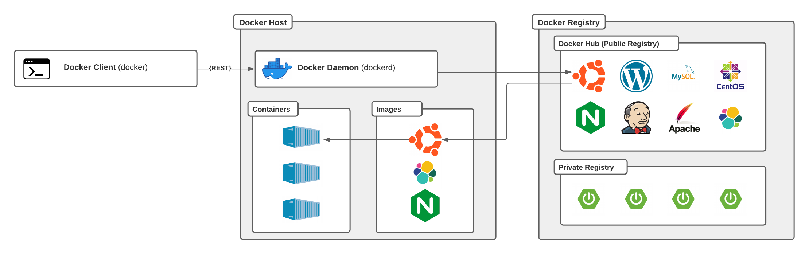
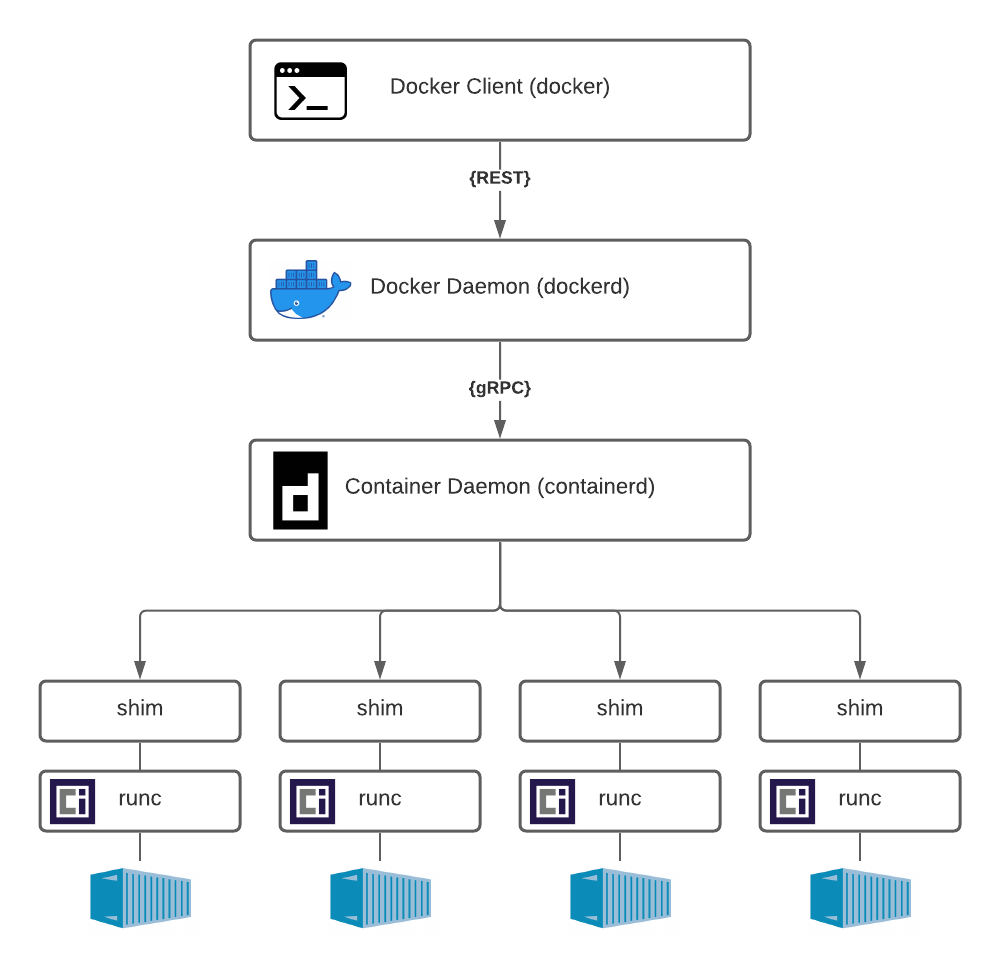

[comment]: <> ()

# Docker Cheat Sheet
 

## Table of Contents

[comment]: <> ()

* [Overview](#overview)
* [Docker Architecture](#docker-architecture)
* [Running Docker Containers](#running-docker-containers)
* [Installation](#installation)
* [Command-line Reference](#command-line-reference)

## Overview 
Docker uses a client-server architecture since the docker client and docker daemon is separate binaries. The client communicates with the daemon via a REST API (Network Interface, Unix Sockets). The docker client can connect to several docker daemons.
* The docker client (`docker`) is used by the user to interact with docker and sends the commands to the docker daemon.
* The docker daemon (`dockerd`) is the persistent process that manages docker objects like containers, images, volumes, networks, etc...
* The docker registry stores docker images. The docker hub is a public registry and is used by docker by default to look for images.

**Docker Objects**
* A *docker image* is a read-only template with instructions for creating a docker container. An image can be based on another image. Use a Dockerfile to build your own image. Each instruction in a Dockerfile creates a layer in the image.
* A *docker container* is a runnable instance of an image. You can create, start, stop, move, or delete a container via the docker client (cli) or docker API; connect a container to network; attach storage; create a new image from the container.
* A *docker service* scale containers across multiple docker daemons (master & workers). Each member of the swarm is a docker daemon. A service defines the desired state eg. number of replicas. The service is load-balanced across all worker nodes.

For more details, please read the official [Docker Documentation](https://docs.docker.com/get-started/overview/).

## Docker Architecture

[comment]: <> ( (  src="images/docker-architecture.png")

[comment]: <> (  width="400")

[comment]: <> (  align="right")

[comment]: <> (/>)

The Docker Engine acts as a client-server application with:

* Client: The docker client (`docker`) is used by the user to interact with docker and sends the commands to the docker daemon.
* API: The docker API allows clients to interact with the docker daemon in a stadardised manner.
* Server: The docker server has a long-running daemon process called `dockerd` (docker daemon). It relies on a OCI compliant runtime (invoked via the `containerd` daemon) as its interface to the Linux kernel namespaces, cgroups, and SELinux.

External components:
* `containerd` is the container daemon and was originally built as an integration point for OCI runtimes like runc. The container lifecycle management functionality was moved out of the docker daemon into the container daemon.  ([Reference](https://containerd.io/))
* `runc` is the implementation for the OCI container runtime specification. It is a CLI tool for spawning and running containers according to the OCI specification. ([Reference](https://github.com/opencontainers/runc))
* `shim` is used to decouple the daemons from the containers. `containerd` forks an instance  of `runc` for each container. The `shim` process becomes the new container parent after the container is created and the `runc` process exits.

**Open Container Initiative**

The Open Container Initiative (OCI) is an open governance structure for the express purpose of creating open industry standards around container formats and runtimes. The container related specifications are:
* *Image Specification*: The OCI Image Specification specification is to enable the creation of interoperable tools for building, transporting, and preparing a container image to run. ([Reference](https://github.com/opencontainers/image-spec/blob/master/spec.md))
* *Container Runtime Specification*: The OCI Runtime Specification aims to specify the configuration, execution environment, and lifecycle of a container. ([Reference](https://github.com/opencontainers/runtime-spec/blob/master/spec.md))

For more details on the *Open Container Specification*, please visit the sites:[Website](https://opencontainers.org/) & [Github](https://github.com/opencontainers).

## Running Docker Containers
To run a docker container, you should use the following command:

```shell
# A template for running a docker container.
$ docker container run -it --name <Name> <IMAGE>:<TAG>

# Start bash in a ubuntu within a docker container
$ docker container run -it --name my-ubuntu ubuntu:latest bash
```

Docker takes the following steps after the command listed above is executed:
1. The above command forms part of the Docker CLI.
2. The docker client creates the appropriate API paylod based on the docker command, options and arguments.
3. The docker client invokes the REST endpoint (POST) together with the payload.
4. The docker daemon recieves the payload and performs the instructions.
5. The docker daemon pulled the "Ubuntu" image from the Docker Hub (public registry)
6. The docker daemon creates a new container from that image by performing the next steps:
7. The docker daemon calls `containerd` to start a new container.
8. The docker daemon uses `gRPC` to communicate with the `containerd`. (CRUD Style API) 
9. `containerd` creates an OCI bundle from the Docker image. 
10. `containerd` instructs `runc` to create a container using the OCI bundle.
11. `runc` interfaces with the OS kernel to get the constructs needed to create a container. (namespaces, cgroups, etc...)
12. `runc` starts the container as a child process. Once the container comes online, `runc` will exit.
13. `shim` becomes the new parent process.
14. The process is complete and the container is up and running.
15. The newly created container may produce output.
16. The Docker daemon streamed that output to the Docker client, and its displayed in the terminal.


## Installation
The following links contain guides on how to install docker on your machine:
* [Java Nibble: How to Install Docker on macOS using Homebrew](https://www.javanibble.com/how-to-install-docker-on-macos-using-homebrew/)

## Command-line Reference
The following is a list of the Docker Management commands:
* [`docker checkpoint`]() - Manage checkpoints ([Reference](https://docs.docker.com/engine/reference/commandline/checkpoint/))
* [`docker container`]() - Manage containers ([Reference](https://docs.docker.com/engine/reference/commandline/container/))
* [`docker image`](#docker-image) - Manage images ([Reference](https://docs.docker.com/engine/reference/commandline/image/))
* [`docker network`]() - Manage networks ([Reference](https://docs.docker.com/engine/reference/commandline/network/))
* [`docker node`]() - Manage swarm nodes ([Reference](https://docs.docker.com/engine/reference/commandline/node/))
* [`docker plugin`]() - Manage plugins ([Reference](https://docs.docker.com/engine/reference/commandline/plugin/))
* [`docker secret`]() - Manage secrets ([Reference](https://docs.docker.com/engine/reference/commandline/secret/))
* [`docker service`]() - Manage services ([Reference](https://docs.docker.com/engine/reference/commandline/service/))
* [`docker stack`]() - Manage stacks ([Reference](https://docs.docker.com/engine/reference/commandline/stack/))
* [`docker swarm`]() - Manage swarms ([Reference](https://docs.docker.com/engine/reference/commandline/swarm/))
* [`docker system`]() - Manage systems ([Reference](https://docs.docker.com/engine/reference/commandline/system/))
* [`docker volume`]() - Manage volume ([Reference](#))

### Docker Image
The `docker image` command is a management command that manage docker images. 

**Help**
* [`docker image --help`](#) list all the docker image commands. [Reference](https://docs.docker.com/engine/reference/commandline/image/)
* [`docker image COMMAND --help`](#) list the explanation, usage, aliases and options for a docker image command.

#### Lifecycle
* [`docker image build`](#) build an image from a Dockerfile. [Reference](https://docs.docker.com/engine/reference/commandline/image_build/)
* [`docker image import`](#) import the contents from a tarball to create a filesystem image. [Reference](https://docs.docker.com/engine/reference/commandline/image_import/)
* [`docker image load`](#) load an image from a tar archive or STDIN. [Reference](https://docs.docker.com/engine/reference/commandline/image_load/)
* [`docker image pull`](#) pull an image or a repository from a registry. [Reference](https://docs.docker.com/engine/reference/commandline/image_pull/)
* [`docker image push`](#) push an image or a repository to a registry. [Reference](https://docs.docker.com/engine/reference/commandline/image_push/)
* [`docker image save`](#) Save one or more images to a tar archive (streamed to STDOUT by default). [Reference](https://docs.docker.com/engine/reference/commandline/image_save/)
* [`docker image tag`](#) Create a tag TARGET_IMAGE that refers to SOURCE_IMAGE. [Reference](https://docs.docker.com/engine/reference/commandline/image_tag/)

#### Info
* [`docker image history`](#) show the history of an image. [Reference](https://docs.docker.com/engine/reference/commandline/image_history/)
* [`docker image inspect`](#) display detailed information on one or more images. [Reference](https://docs.docker.com/engine/reference/commandline/image_inspect/)
* [`docker image ls`](#) list images. [Reference](https://docs.docker.com/engine/reference/commandline/image_ls/)

#### Cleaning up
* [`docker image prune`](#) remove unused images. [Reference](https://docs.docker.com/engine/reference/commandline/image_prune/)
* [`docker image rm`](#) remove one or more images. [Reference](https://docs.docker.com/engine/reference/commandline/image_rm/)