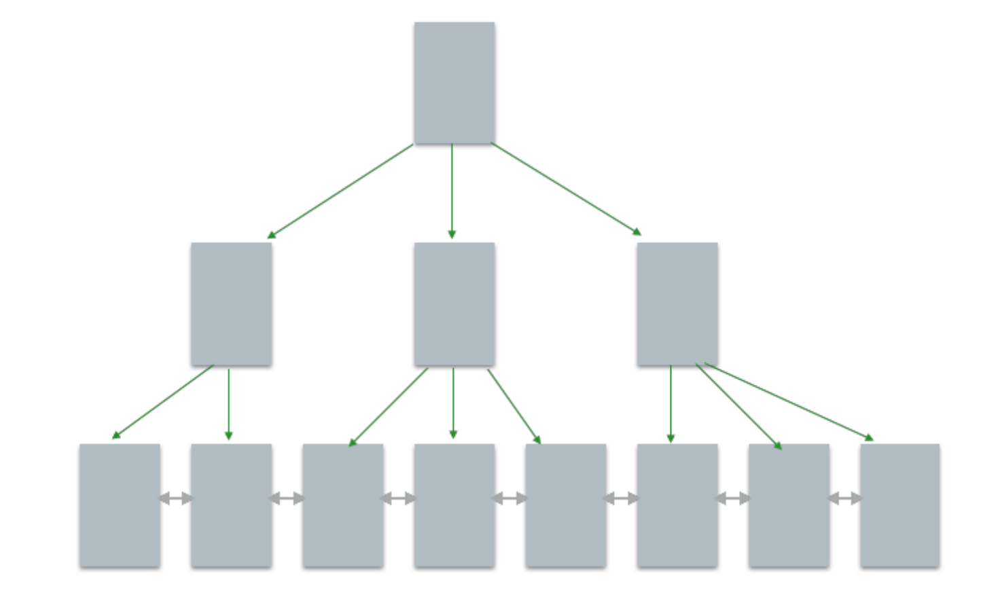

# 1. JVM

# 2. JAVA基础

# 3. JAVA集合

# 4. JAVA多线程

# 5. Spring

# 6. Netty

# 7. Redis

# 8. Mysql

## 8.1. 存储引擎

### 8.1.1. InnoDB(B+Tree)

InnoDB 底层存储结构为 B+树， B 树的每个节点对应 innodb 的一个 page，page 大小是固定的，

一般设为 16k。其中非叶子节点只有键值，叶子节点包含完成数据。

适用场景: 

1)经常更新的表，适合处理多重并发的更新请求。 

2)支持事务。

3)可以从灾难中恢复(通过 bin-log 日志等)。 

4)外键约束。只有他支持外键。 

5)支持自动增加列属性 auto_increment。

### 8.1.2. MyISAM(B+Tree)

MyISAM没有提供对数据库事务的支持，也不支持行级锁和外键， 因此当 INSERT(插入)或 UPDATE(更新)数据时即写操作需要锁定整个表，效率便会低一些。

ISAM 执行读取操作的速度很快，而且不占用大量的内存和存储资源。在设计之初就预想数据组织 成有固定长度的记录，按顺序存储的。---ISAM 是一种静态索引结构。

缺点是它不 支持事务处理。

## 8.2. 设计范式

## 8.3. 索引

## 8.4. 事务

## 8.5. 存储过程

## 8.6. 触发器

## 8.7. 锁

## 8.8. 性能调优

- https://yq.aliyun.com/articles/494086
- https://database.51cto.com/art/201901/590564.htm
- https://juejin.im/post/5d14b86d5188255b7059a5b9
- https://coolshell.cn/articles/1846.html

# 9. Zookeeper

# 10. Kafka

# 11. 设计模式

# 12. 数据结构

## 12.1. 数组

## 12.2. 链表

## 12.3. 堆

## 12.4. 栈

## 12.5. 队列

## 12.6. 树

## 12.7. 位图

# 13. 算法

# 1. 分布式

## 14.1 分布式锁

## 14.2 分布式事务

## 1.3. 分布式存储

