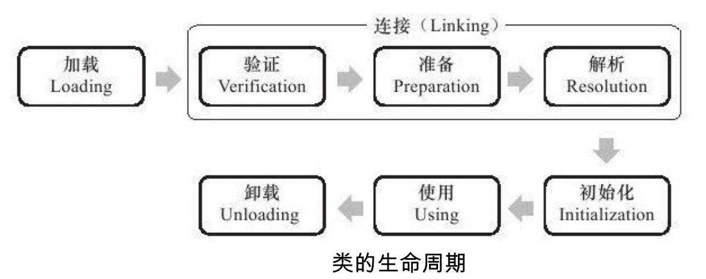

# JVM类加载

## Class文件

我们写的Java代码，经过编译器编译之后，就成为了`.class`文件，从本地机器码变成了字节码。Class文件是一组以8位字节为基础单位的二进制流，各个数据项目严格按照顺序紧凑地排列在Class文件之中，中间没有添加任何分隔符，这使得整个Class文件中存储的内容几乎全部是程序运行的必要数据，没有空隙存在。Class文件中只有2种数据结构：无符号数和表。

每个Class文件的头4个字节称为魔数（Magic Number），值为`0xCAFEBABE`。紧接着4个字节是Class文件的版本号。再往后，就是类的具体信息了，比如常量池、类索引、父类索引、接口索引、字段、方法等信息了。

所谓类的加载，就是把Class文件读到内存中。

## 类的生命周期

类从被加载到虚拟机内存中开始，到卸载出内存为止，它的整个生命周期包括：加载（Loading）、验证（Verification）、准备（Preparation）、解析（Resolution）、初始化（Initialization）、使用（Using）和卸载（Unloading）7个阶段。其中验证、准备、解析3个部分统称为连接（Linking）。

加载、验证、准备、初始化和卸载这5个阶段的顺序是确定的，类的加载过程必须按照这种顺序按部就班地开始，而解析阶段则不一定：它在某些情况下可以在初始化阶段之后再开始，这是为了支持Java语言的运行时绑定（也称为动态绑定或晚期绑定）。注意，是按部就班地“开始”，而不是按部就班地“进行”或“完成”，强调这点是因为这些阶段通常都是互相交叉地混合式进行的，通常会在一个阶段执行的过程中调用、激活另外一个阶段。

### 加载

在加载阶段，虚拟机做3件事：

1. 通过一个类的全限定名来获取定义此类的二进制字节流。
2. 将这个字节流所代表的静态存储结构转化为方法区的运行时数据结构。
3. 在内存中生成一个代表这个类的`java.lang.Class`对象，作为方法区这个类的各种数据的访问入口。

### 验证

验证是连接阶段的第一步，这一阶段的目的是为了确保Class文件的字节流中包含的信息符合当前虚拟机的要求，并且不会危害虚拟机自身的安全。

验证阶段大致上会完成4个阶段的检验动作

1. 文件格式验证：验证字节流是否符合Class文件格式的规范，并且能被当前版本的虚拟机处理。比如是否以魔数`0xCAFEBABE`开头，主、次版本号是否能被当前虚拟机处理，常量类型，指向常量的索引是否符合要求等。这阶段的验证是基于二进制字节流进行的，只有通过了这个阶段的验证后，字节流才会进入内存的方法区中进行存储，所以后面的3个验证阶段全部是基于方法区的存储结构进行的，不会再直接操作字节流。
2. 元数据验证：对字节码描述的信息进行语义分析，以保证其描述的信息符合Java语言规范的要求。比如继承关系。
3. 字节码验证：对类的方法体进行校验分析，保证被校验类的方法在运行时不会做出危害虚拟机安全的事件。通过数据流和控制流分析，确定程序语义是合法的、符合逻辑的。
4. 符号引用验证：对类自身以外（常量池中的各种符号引用）的信息进行匹配性校验，确保解析动作能正常执行。它发生在虚拟机将符号引用转化为直接引用的时候，这个转化动作将在连接的第三阶段——解析阶段中发生。

验证阶段是非常重要的，但不是必须的。它对程序运行期没有影响，如果所引用的类经过反复验证，那么可以考虑采用`-Xverify:none`参数来关闭大部分的类验证措施，以缩短虚拟机类加载的时间。

### 准备

准备阶段是正式为类变量分配内存并设置类变量初始值的阶段，这些变量所使用的内存都将在方法区中进行分配。这个阶段中有两个容易产生混淆的概念需要强调一下，首先，这时候进行内存分配的仅包括类变量（被static修饰的变量），而不包括实例变量，实例变量将会在对象实例化时随着对象一起分配在Java堆中。其次，这里所说的初始值“通常情况”下是数据类型的零值。

> 假设一个类变量的定义为：public static int value = 123;

> 那变量value在准备阶段过后的初始值为0而不是123，因为这时候尚未开始执行任何Java 方法，而把value赋值为123的putstatic指令是程序被编译后，存放于类构造器＜clinit＞()方 法之中，所以把value赋值为123的动作将在初始化阶段才会执行。

当然也有特殊情况：如果类字段的字段属性表中存在ConstantValue属性，那在准备阶段变量value就会被初始化为ConstantValue属性所指定的值。

> 假设上面类变量value的定义变为：public static final int value = 123;

> 编译时Javac将会为value生成ConstantValue属性，在准备阶段虚拟机就会根据ConstantValue的设置将value赋值为123。

### 解析

解析阶段是虚拟机将常量池内的符号引用替换为直接引用的过程。解析动作主要针对类或接口、字段、类方法、接口方法、方法类型、方法句柄和调用点限定符7类符号引用进行。

- 符号引用（Symbolic References）：符号引用以一组符号来描述所引用的目标，符号可 以是任何形式的字面量，只要使用时能无歧义地定位到目标即可。符号引用与虚拟机实现的 内存布局无关，引用的目标并不一定已经加载到内存中。各种虚拟机实现的内存布局可以各 不相同，但是它们能接受的符号引用必须都是一致的，因为符号引用的字面量形式明确定义 在Java虚拟机规范的Class文件格式中。
- 直接引用（Direct References）：直接引用可以是直接指向目标的指针、相对偏移量或是 一个能间接定位到目标的句柄。直接引用是和虚拟机实现的内存布局相关的，同一个符号引 用在不同虚拟机实例上翻译出来的直接引用一般不会相同。如果有了直接引用，那引用的目 标必定已经在内存中存在。

### 初始化

这一步开始执行类中定义的Java程序代码（或者说是字节码）。虚拟机会保证一个类的初始化方法在多线程环境中被正确地加锁、同步，如果多个线程同时去初始化一个类，那么只会有一个线程去执行这个类的初始化方法，其他线程都需要阻塞等待，直到活动线程执行完毕。

#### JVM初始化步骤

1. 假如这个类还没有被加载和连接，则程序先加载并连接该类
2. 假如该类的直接父类还没有被初始化，则先初始化其直接父类
3. 假如类中有初始化语句，则系统依次执行这些初始化语句

#### 类初始化时机

只有当主动使用一个类的时候才会触发这个类的初始化，类的主动使用包括以下六种：

- 创建类的实例，也就是new的方式
- 访问某个类或接口的静态变量，或者对该静态变量赋值
- 调用类的静态方法
- 反射，比如`Class.forName("com.mysql.jdbc.Driver")`
- 初始化某个类的子类，则其父类也会被初始化
- Java虚拟机启动时被标明为启动类的类（Java Test），直接使用java.exe命令来运行某个主类

## 参考

- https://juejin.im/post/5b2b4c74f265da59951fe46b
- https://zhuanlan.zhihu.com/p/72204378
- http://www.ityouknow.com/jvm/2017/08/19/class-loading-principle.html
- https://segmentfault.com/a/1190000005608960
- [https://javaguide.cn/2019/08/25/java/jvm/%E7%B1%BB%E5%8A%A0%E8%BD%BD%E8%BF%87%E7%A8%8B/](https://javaguide.cn/2019/08/25/java/jvm/类加载过程/)

