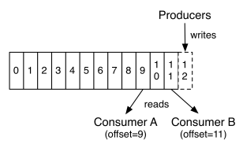
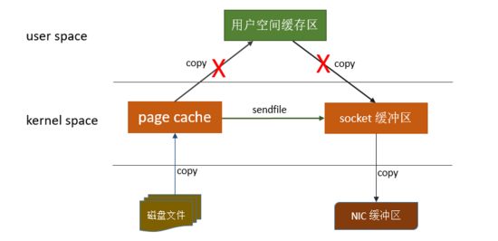

#  kafka简介

## kafka基本概念
- topic: 逻辑分组
- broke: kafka节点
- partition: 每一个Partition其实都是一个文件

## kafka使用场景

首先需要说的就是MQ的应用场景：解耦、异步、削峰

## Kafka中的ISR、AR又代表什么？ISR的伸缩又指什么

ISR:In-Sync Replicas 副本同步队列

AR:Assigned Replicas 所有副本

ISR是由leader维护，follower从leader同步数据有一些延迟
（包括延迟时间replica.lag.time.max.ms和延迟条数replica.lag.max.messages两个维度, 当前最新的版本0.10.x中只支持replica.lag.time.max.ms这个维度），
任意一个超过阈值都会把follower剔除出ISR, 存入OSR（Outof-Sync Replicas）列表，新加入的follower也会先存放在OSR中。AR=ISR+OSR。

## Kafka中是怎么体现消息顺序性的？

kafka每个partition中的消息在写入时都是有序的，消费时，每个partition只能被每一个group中的一个消费者消费，保证了消费时也是有序的。
整个topic不保证有序。如果为了保证topic整个有序，那么将partition调整为1.

## kafka为什么吞吐量大

**1. 顺序读写**

众所周知Kafka是将消息记录持久化到本地磁盘中的，一般人会认为磁盘读写性能差，可能会对Kafka性能如何保证提出质疑。
实际上不管是内存还是磁盘，快或慢关键在于寻址的方式，磁盘分为顺序读写与随机读写，内存也一样分为顺序读写与随机读写。
基于磁盘的随机读写确实很慢，但磁盘的顺序读写性能却很高，一般而言要高出磁盘随机读写三个数量级，一些情况下磁盘顺序读写性能甚至要高于内存随机读写。

磁盘的顺序读写是磁盘使用模式中最有规律的，并且操作系统也对这种模式做了大量优化，Kafka就是使用了磁盘顺序读写来提升的性能。
Kafka的message是不断追加到本地磁盘文件末尾的，而不是随机的写入，这使得Kafka写入吞吐量得到了显著提升 。

**顺序读写**有一个缺陷—— 没有办法删除数据 ，所以Kafka是不会删除数据的，它会把所有的数据都保留下来，每个消费者（Consumer）对每个Topic都有一个offset用来表示 读取到了第几条数据 。

如果不删除硬盘肯定会被撑满，所以Kakfa提供了两种策略来删除数据。一是基于时间，二是基于partition文件大小。具体配置可以参看它的配置文档。

**2. Page Cache**

为了优化读写性能，Kafka利用了操作系统本身的Page Cache，就是利用操作系统自身的内存而不是JVM空间内存。这样做的好处有：

1. 避免Object消耗：如果是使用 Java 堆，Java对象的内存消耗比较大，通常是所存储数据的两倍甚至更多。

2. 避免GC问题：随着JVM中数据不断增多，垃圾回收将会变得复杂与缓慢，使用系统缓存就不会存在GC问题

相比于使用JVM或in-memory cache等数据结构，利用操作系统的Page Cache更加简单可靠。
首先，操作系统层面的缓存利用率会更高，因为存储的都是紧凑的字节结构而不是独立的对象。
其次，操作系统本身也对于Page Cache做了大量优化，提供了 write-behind、read-ahead以及flush等多种机制。
再者，即使服务进程重启，系统缓存依然不会消失，避免了in-process cache重建缓存的过程。

通过操作系统的Page Cache，Kafka的读写操作基本上是基于内存的，读写速度得到了极大的提升。

**3. 零拷贝**

 linux操作系统 “零拷贝” 机制使用了sendfile方法， 允许操作系统将数据从Page Cache 直接发送到网络，只需要最后一步的copy操作将数据复制到 NIC 缓冲区， 这样避免重新复制数据 。示意图如下：

通过这种 “零拷贝” 的机制，Page Cache 结合 sendfile 方法，Kafka消费端的性能也大幅提升。这也是为什么有时候消费端在不断消费数据时，我们并没有看到磁盘io比较高，此刻正是操作系统缓存在提供数据。

**4. 分区分段+索引**

kafka中的topic中的内容可以被分为多分partition存在,每个partition又分为多个段segment,所以每次操作都是针对一小部分做操作，很轻便，并且增加并行操作的能力

**5. 批量读写**

kafka允许进行批量发送消息，producter发送消息的时候，可以将消息缓存在本地,等到了固定条件发送到kafka

1. 等消息条数到固定条数
2. 一段时间发送一次

**6. 批量压缩**

Kafka还支持对消息集合进行压缩，Producer可以通过GZIP或Snappy格式对消息集合进行压缩 压缩的好处就是减少传输的数据量，减轻对网络传输的压力

批量发送和数据压缩一起使用,单条做数据压缩的话，效果不明显

# kafka如何保证消息不丢失

- 给 topic 设置 `replication.factor` 参数：这个值必须大于 1，要求每个 partition 必须有至少 2 个副本。
- 在 Kafka 服务端设置 `min.insync.replicas` 参数：这个值必须大于 1，这个是要求一个 leader 至少感知到有至少一个 follower 还跟自己保持联系，没掉队，这样才能确保 leader 挂了还有一个 follower 吧。
- 在 producer 端设置 `acks=all`：这个是要求每条数据，必须是**写入所有 replica 之后，才能认为是写成功了**。
- 在 producer 端设置 `retries=MAX`（很大很大很大的一个值，无限次重试的意思）：这个是**要求一旦写入失败，就无限重试**，卡在这里了。

# kafka如何保证消息不被重复消费

- 比如你拿个数据要写库，你先根据主键查一下，如果这数据都有了，你就别插入了，update 一下好吧。
- 比如你是写 Redis，那没问题了，反正每次都是 set，天然幂等性。
- 比如你不是上面两个场景，那做的稍微复杂一点，你需要让生产者发送每条数据的时候，里面加一个全局唯一的 id，类似订单 id 之类的东西，然后你这里消费到了之后，先根据这个 id 去比如 Redis 里查一下，之前消费过吗？如果没有消费过，你就处理，然后这个 id 写 Redis。如果消费过了，那你就别处理了，保证别重复处理相同的消息即可。
- 比如基于数据库的唯一键来保证重复数据不会重复插入多条。因为有唯一键约束了，重复数据插入只会报错，不会导致数据库中出现脏数据。

# kafka顺序消费

