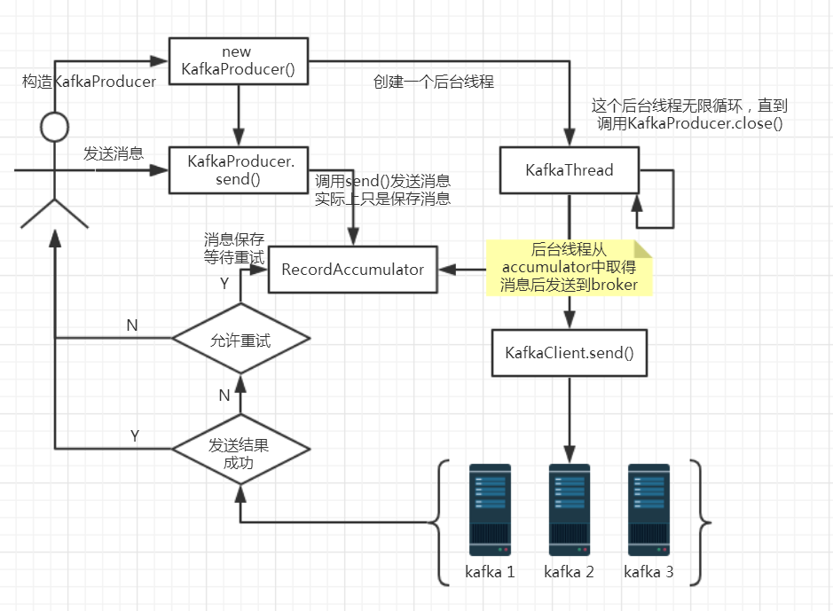
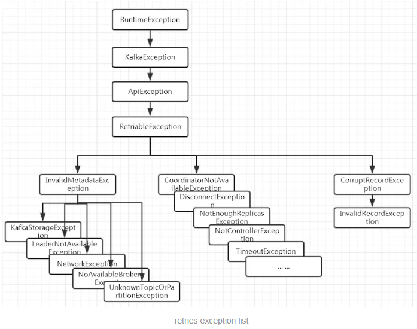

# Kafka消息重复及丢失

消息重复和丢失是kafka中很常见的问题，主要发生在以下三个阶段：

1. 生产者阶段
2. broke阶段
3. 消费者阶段

## 一、生产者阶段重复场景

### 1、根本原因

生产发送的消息没有收到正确的broke响应，导致producer重试。

producer发出一条消息，broke落盘以后因为网络等种种原因发送端得到一个发送失败的响应或者网络中断，然后producer收到一个可恢复的Exception重试消息导致消息重复。 

### 2、重试过程

说明：
\1. new KafkaProducer()后创建一个后台线程KafkaThread扫描RecordAccumulator中是否有消息；
\2. 调用KafkaProducer.send()发送消息，实际上只是把消息保存到RecordAccumulator中；
\3. 后台线程KafkaThread扫描到RecordAccumulator中有消息后，将消息发送到kafka集群；
\4. 如果发送成功，那么返回成功；
\5. 如果发送失败，那么判断是否允许重试。如果不允许重试，那么返回失败的结果；如果允许重试，把消息再保存到RecordAccumulator中，等待后台线程KafkaThread扫描再次发送；

### 3、可恢复异常说明

异常是RetriableException类型或者TransactionManager允许重试；RetriableException类继承关系如下：

#### 4、记录顺序问题

　　如果设置max.in.flight.requests.per.connection大于1（默认5，单个连接上发送的未确认请求的最大数量，表示上一个发出的请求没有确认下一个请求又发出了）。大于1可能会改变记录的顺序，因为如果将两个batch发送到单个分区，第一个batch处理失败并重试，但是第二个batch处理成功，那么第二个batch处理中的记录可能先出现被消费。

　　设置max.in.flight.requests.per.connection为1，可能会影响吞吐量，可以解决单台producer发送顺序问题。如果多个producer，producer1先发送一个请求，producer2后发送请求，这是producer1返回可恢复异常，重试一定次数成功了。虽然时producer1先发送消息，但是producer2发送的消息会被先消费。

## 二、生产者发送重复解决方案

### 1、启动kafka的幂等性

　　要启动kafka的幂等性，无需修改代码，默认为关闭，需要修改配置文件:enable.idempotence=true 同时要求 ack=all 且 retries>1。

　　幂等原理：

　　每个producer有一个producer id，服务端会通过这个id关联记录每个producer的状态，每个producer的每条消息会带上一个递增的sequence，服务端会记录每个producer对应的当前最大sequence，producerId + sequence ，如果新的消息带上的sequence不大于当前的最大sequence就拒绝这条消息，如果消息落盘会同时更新最大sequence，这个时候重发的消息会被服务端拒掉从而避免消息重复。该配置同样应用于kafka事务中。

### 2、ack=0，不重试。

　　可能会丢消息，适用于吞吐量指标重要性高于数据丢失，例如：日志收集。

## 三、生产者和broke阶段消息丢失场景

### 1、ack=0，不重试

producer发送消息完，不管结果了，如果发送失败也就丢失了。

### 2、ack=1，leader crash

producer发送消息完，只等待lead写入成功就返回了，leader crash了，这时follower没来及同步，消息丢失。

### 3、unclean.leader.election.enable 配置true

允许选举ISR以外的副本作为leader,会导致数据丢失，默认为false。producer发送异步消息完，只等待lead写入成功就返回了，leader crash了，这时ISR中没有follower，leader从OSR中选举，因为OSR中本来落后于Leader造成消息丢失。

## 四、生产者和broke阶段消息丢失解决方案

### 1、配置：ack=all / -1,tries > 1,unclean.leader.election.enable : false

producer发送消息完，等待ollower同步完再返回，如果异常则重试。这是副本的数量可能影响吞吐量，最大不超过5个，一般三个足够了。

不允许选举ISR以外的副本作为leader。

### 2、配置：min.insync.replicas > 1

当producer将acks设置为“all”(或“-1”)时，min.insync。副本指定必须确认写操作成功的最小副本数量。如果不能满足这个最小值，则生产者将引发一个异常(要么是NotEnoughReplicas，要么是NotEnoughReplicasAfterAppend)。

当一起使用时，min.insync.replicas和ack允许执行更大的持久性保证。一个典型的场景是创建一个复制因子为3的主题，设置min.insync复制到2个，用“all”配置发送。将确保如果大多数副本没有收到写操作，则生产者将引发异常。

### 3、失败的offset单独记录

producer发送消息，会自动重试，遇到不可恢复异常会抛出，这时可以捕获异常记录到数据库或缓存，进行单独处理。

## 五、消费者数据重复场景及解决方案

### 1、根本原因

数据消费完没有及时提交offset到broke。

### 2、场景

消息消费端在消费过程中挂掉没有及时提交offset到broke，另一个消费端启动拿之前记录的offset开始消费，由于offset的滞后性可能会导致新启动的客户端有少量重复消费。

### 3、解决方案

#### 1、取消自动自动提交

每次消费完或者程序退出时手动提交。这可能也没法保证一条重复。

#### 2、下游做幂等

一般的解决方案是让下游做幂等或者尽量每消费一条消息都记录offset，对于少数严格的场景可能需要把offset或唯一ID,例如订单ID和下游状态更新放在同一个数据库里面做事务来保证精确的一次更新或者在下游数据表里面同时记录消费offset，然后更新下游数据的时候用消费位点做乐观锁拒绝掉旧位点的数据更新。