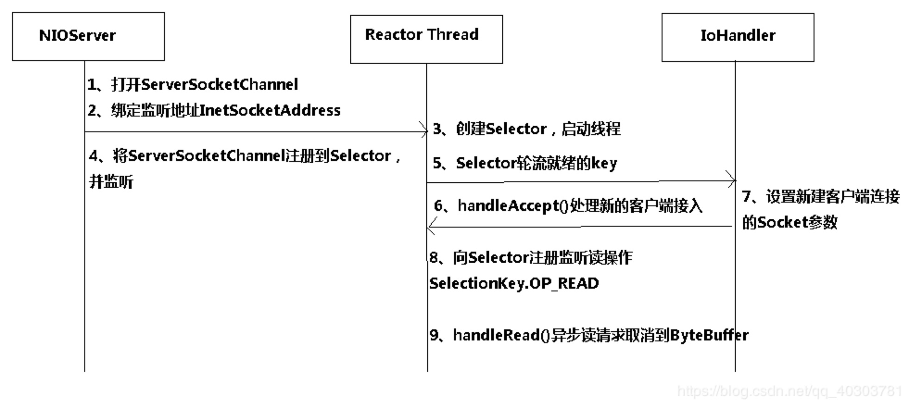
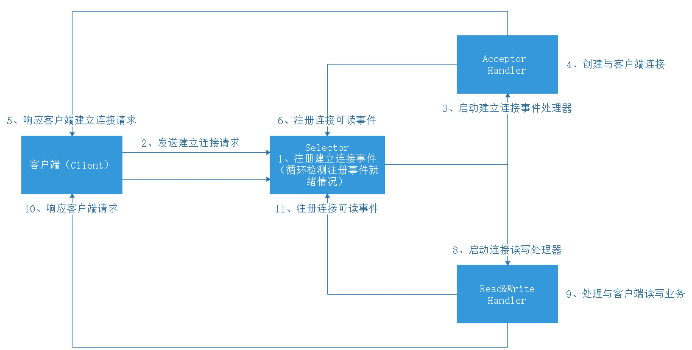

## 连接是什么?

这个问题困扰了我很久，什么叫socket连接，为什么BIO中应用线程池并发量依旧受限，NIO是如何做到的呢？
Socket编程基本就是listen，accept以及send，write等几个基本的操作。是的，就跟常见的文件操作一样(文件描述符了解以下)。

socket编程中，一个程序创建了一个socket，并让其监听80端口，其实是向TCP/IP协议栈声明了其对80端口的占有。
以后，所有目标是80端口的TCP数据包都会转发给该程序（这里的程序，因为使用的是Socket编程接口，所以首先由Socket层来处理）。
所谓accept函数，其实抽象的是TCP的连接建立过程。
accept函数返回的新socket其实指代的是本次创建的连接，而一个连接是包括两部分信息的，一个是源IP和源端口，另一个是宿IP和宿端口。
所以，accept可以产生多个不同的socket，而这些socket里包含的宿IP和宿端口是不变的，变化的只是源IP和源端口。
这样的话，这些socket宿端口就可以都是80，而Socket层还是能根据源/宿对来准确地分辨出IP包和socket的归属关系，从而完成对TCP/IP协议的操作封装！

## 概念

- 同步: 同步体现在, 在等待一件事情的处理结果时, 对方是否提供通知服务, 如果对方不提供通知服务, 则为同步;
  同步一般通过loop轮询来获得结果

- 异步: 异步体现在, 在等待一件事情的处理结果时, 对方是否提供通知服务, 如果对方提供通知服务, 则为异步;
  异步一般通过回调来获取结果
  
- 阻塞: 是指调用线程或者进程被操作系统挂起。

- 非阻塞: 是指调用线程或者进程不会被操作系统挂起。

## BIO 同步阻塞IO模型

我们先来回顾下经典BIO编程模型
```java
{
     ExecutorService executor = Excutors.newFixedThreadPollExecutor(100);//线程池
    
     ServerSocket serverSocket = new ServerSocket();
     serverSocket.bind(8088);
     while(!Thread.currentThread.isInturrupted()){//主线程死循环等待新连接到来
     Socket socket = serverSocket.accept();
     executor.submit(new ConnectIOnHandler(socket));//为新的连接创建新的线程
}

class ConnectIOnHandler extends Thread{
    private Socket socket;
    public ConnectIOnHandler(Socket socket){
       this.socket = socket;
    }
    public void run(){
      while(!Thread.currentThread.isInturrupted()&&!socket.isClosed()){死循环处理读写事件
          String someThing = socket.read()....//读取数据
          if(someThing!=null){
             ......//处理数据
             socket.write()....//写数据
          }

      }
    }
}
```

这是一个经典的每连接每线程的模型，之所以使用多线程，主要原因在于socket.accept()、socket.read()、socket.write()三个主要函数都是同步阻塞的，当一个连接在处理I/O的时候，系统是阻塞的，如果是单线程的话必然就挂死在那里；但CPU是被释放出来的，开启多线程，就可以让CPU去处理更多的事情。其实这也是所有使用多线程的本质： 1. 利用多核。 2. 当I/O阻塞系统，但CPU空闲的时候，可以利用多线程使用CPU资源。

现在的多线程一般都使用线程池，可以让线程的创建和回收成本相对较低。在活动连接数不是特别高（小于单机1000）的情况下，这种模型是比较不错的，可以让每一个连接专注于自己的I/O并且编程模型简单，也不用过多考虑系统的过载、限流等问题。线程池本身就是一个天然的漏斗，可以缓冲一些系统处理不了的连接或请求。


## NIO 同步非阻塞IO模型

所有的系统I/O都分为两个阶段：等待就绪和操作。举例来说，读函数，分为等待系统可读和真正的读；同理，写函数分为等待网卡可以写和真正的写。

以socket.read()为例子：

传统的BIO里面socket.read()，如果TCP RecvBuffer里没有数据，函数会一直阻塞，直到收到数据，返回读到的数据。

对于NIO，如果TCP RecvBuffer有数据，就把数据从网卡读到内存，并且返回给用户；反之则直接返回0，永远不会阻塞。

**NIO一个重要的特点是：socket主要的读、写、注册和接收函数，在等待就绪阶段都是非阻塞的，真正的I/O操作是同步阻塞的（消耗CPU但性能非常高）。**


nio程序大概如下：
```java
 interface ChannelHandler{
      void channelReadable(Channel channel);
      void channelWritable(Channel channel);
   }
   class Channel{
     Socket socket;
     Event event;//读，写或者连接
   }

   //IO线程主循环:
   class IoThread extends Thread{
   public void run(){
   Channel channel;
   while(channel=Selector.select()){//选择就绪的事件和对应的连接
      if(channel.event==accept){
         registerNewChannelHandler(channel);//如果是新连接，则注册一个新的读写处理器
      }
      if(channel.event==write){
         getChannelHandler(channel).channelWritable(channel);//如果可以写，则执行写事件
      }
      if(channel.event==read){
          getChannelHandler(channel).channelReadable(channel);//如果可以读，则执行读事件
      }
    }
   }
   Map<Channel,ChannelHandler> handlerMap;//所有channel的对应事件处理器
  }
```

NIO时序模型:



NIO连接模型：



**NIO编程实现步骤**

服务端步骤

- 第一步：创建Selector
- 第二步：创建ServerSocketChannel,并绑定监听端口
- 第三步：将Channel设置为非阻塞模式
- 第四步：将Channel注册到Selector上，监听连接事件
- 第五步：循环调用Selector的select方法，检测就绪情况
- 第六步：调用SelectedKeys方法获取就绪channel集合
- 第七步： 判断就绪事件种类，调用业务处理方法
- 第八步：根据业务需要决定是否再次注册监听事件，重复执行第三步操作

客户端步骤

- 连接服务器端
- 向服务器端发送数据
- 接收服务器端的响应

