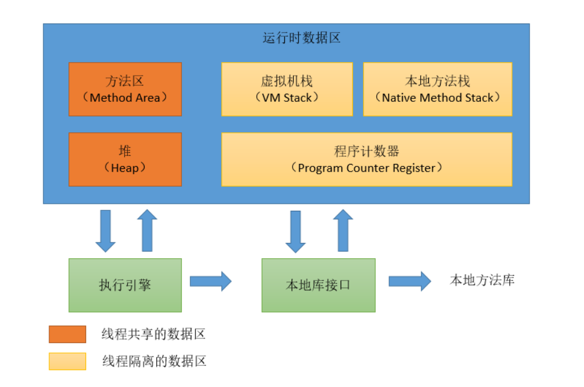
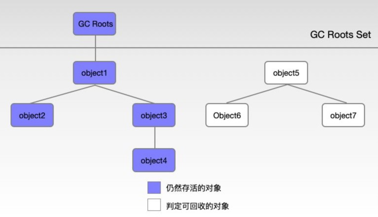
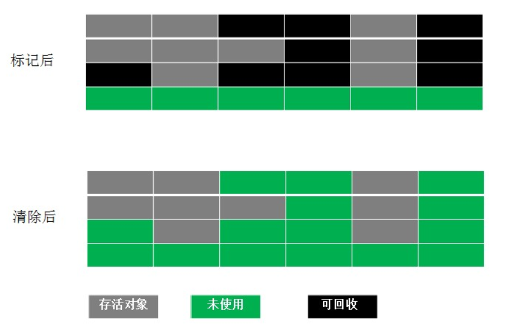
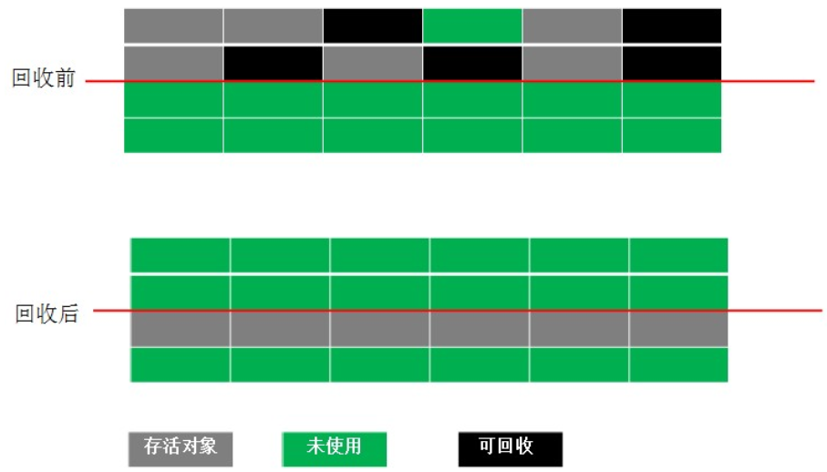
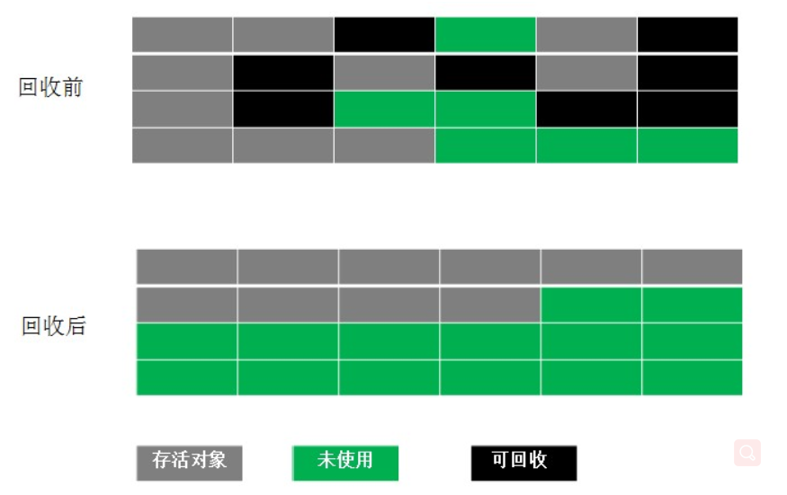

# 聊聊Java的GC机制

本文目录

- 什么是GC
- JVM内存结构简单介绍
- 可达性分析与GC Roots
- 常见的垃圾收集算法

#### 1. 什么是GC

GC：垃圾回收（Garbage Collection），在计算机领域就是指当一个计算机上的动态存储器（内存空间）不再需要时，就应该予以释放，以让出存储器，便于他用。这种存储器的资源管理，称为垃圾回收。

> 有一些语言是没有垃圾回收机制的，像`C`、`C++`，如果需要释放无用变量内存空间就由自己来处理。
>
> 而其他的一些语言如`Java`、`C#`都支持垃圾回收器，Java虚拟机（JVM）或.NET CLR发现内存资源紧张的时候，就会自动地去清理无用对象（没有被引用到的对象）所占用的内存空间。
>
> 而我们今天主要讲Java中的GC。

------

上面说到`JVM`会自动清理无用的对象，那么我们就有了疑问：

- `JVM`清理的是哪一块的对象？
- 哪些对象会被清理，为什么清理A而不清理B？
- `JVM`又是如何清理的？

这三个问题将分别对应接下来的3节一一解答。

#### 2. JVM内存结构简单介绍

我们都知道，Java代码是要运行在虚拟机上的，而虚拟机在执行Java程序的过程中会把所管理的内存划分为若干个不同的数据区域，这些区域都有各自的用途。 在[《Java虚拟机规范（Java SE 8）》](https://docs.oracle.com/javase/specs/jvms/se8/html/jvms-2.html#jvms-2.5.4)中描述了JVM运行时内存区域结构如下：




> 以上是Java虚拟机规范，不同的虚拟机实现可能会各有不同，但是一般会遵守规范

- 方法区：存储已被虚拟机加载的类信息、常量、静态变量等
- 堆：堆是Java 虚拟机所管理的内存中最大的一块。唯一目的就是存放对象实例。在虚拟机栈中存放的只是引用，而引用指向的是堆中的对象。**GC主要作用的区域**。
- 虚拟机栈：局部变量表、操作数栈等。虚拟机栈描述的是Java 方法执行的内存模型：每个方法被执行的时候都会同时创建一个栈帧（Stack Frame）用于存储局部变量表、操作栈、动态链接、方法返回地址等信息。
- 本地方法栈：与虚拟机栈类似，是为native方法提供服务的。
- 程序计数器：记录当前线程执行的方法执行到了第几行。如果线程正在执行的是一个Java 方法，这个计数器记录的是正在执行的虚拟机字节码指令的地址。如果正在执行的是Natvie 方法，这个计数器值则为空（Undefined）。

#### 3.可达性分析与GC Roots

##### 3.1 可达性分析

Java中通过可达性分析法来确定某个对象是不是“垃圾”。

该方法的基本思想是通过一系列的“GC Roots”对象作为起点进行搜索，如果在“GC Roots”和一个对象之间没有可达路径，则称该对象是不可达的，不过要注意的是**被判定为不可达的对象不一定就会成为可回收对象**。被判定为不可达的对象要成为可回收对象必须**至少经历两次标记过程**，如果在这两次标记过程中仍然没有逃脱成为可回收对象的可能性，则基本上就真的成为可回收对象了。

> 注意其本质是通过找出所有活对象来把其余空间认定为“无用”，而不是找出所有死掉的对象并回收它们占用的空间.

如下图，当object5、6、7不存在到GC Roots的引用时，即不可到达GC Roots，则判定他们是不可达的。




##### 3.2 GC Roots

> 对于哪些对象可以被当成GC Roots网上有很多种说法，有的不够权威、有的不够全面。 最终找到了一份eclipse的官方文档，里面有如下的介绍： [Garbage Collection Roots](https://help.eclipse.org/2019-09/index.jsp?topic=%2Forg.eclipse.mat.ui.help%2Fconcepts%2Fgcroots.html&resultof="garbage" "garbag" )  （自己翻译了一下，如有不准确的地方，请指出）

A garbage collection root is an object that is accessible from outside the heap. The following reasons make an object a GC root:

```
1. System Class （被boostrap 或者系统类加载器加载的系统类）
    Class loaded by bootstrap/system class loader. For example, everything from the rt.jar like java.util.* .
   
2. JNI Local（ 一些用户定义jni 代码或者jvm的内部代码局部变量）
    Local variable in native code, such as user defined JNI code or JVM internal code.
    
3. JNI Global（ jni 代码中的全局变量）
    Global variable in native code, such as user defined JNI code or JVM internal code.
    
5. Thread Block（被阻塞的线程引用的对象）
    Object referred to from a currently active thread block.

6. Thread （正在运行的线程）
    A started, but not stopped, thread.
    
7. Busy Monitor（正在等待的线程）
    Everything that has called wait() or notify() or that is synchronized.
    For example, by calling synchronized(Object) or by entering a synchronized method. 
    Static method means class, non-static method means object.
    
8. Java Local（仍然在线程的栈中的方法的传入参数或方法内部创建的对象）
    Local variable.
    For example, input parameters or locally created objects of methods that are still in the stack of a thread.

9.Native Stack（本地方法栈中输入或输出参数，例如，用于文件/网络I/O的方法或反射的参数。）
    In or out parameters in native code, such as user defined JNI code or JVM internal code. 
    This is often the case as many methods have native parts and the objects handled as method parameters become GC roots.
    For example, parameters used for file/network I/O methods or reflection.
    
10.Finalizable（在回收队列中的对象）
    An object which is in a queue awaiting its finalizer to be run.
    
11. Unfinalized（覆盖了finalize方法但是还没有被放入回收队列中的对象）
    An object which has a finalize method, but has not been finalized and is not yet on the finalizer queue.

12.Unreachable(一个从任何其他根无法访问的对象，但由Memory Analyzer Tool 标记为根，以便该对象可以包含在分析中)
    An object which is unreachable from any other root, 
    but has been marked as a root by MAT to retain objects which otherwise would not be included in the analysis.

13. Java Stack Frame
    A Java stack frame, holding local variables.
    Only generated when the dump is parsed with the preference set to treat Java stack frames as objects.
    
14. Unknown
  An object of unknown root type. Some dumps, such as IBM Portable Heap Dump files, do not have root information. 
  For these dumps the MAT parser marks objects 
  which are have no inbound references or are unreachable from any other root as roots of this type. 
  This ensures that MAT retains all the objects in the dump.
复制代码
```

简单总结下就是：

- 由系统类加载器(system class loader)加载的对象
- 活着的线程，包含处于等待或阻塞的线程
- 当前被调用的方法（Java方法、native方法）的一些参数/局部变量
- 方法区中静态变量、常量引用的对象
- Held by JVM - JVM由于特殊目的为GC保留的对象，但实际上这个与JVM的实现是有关的。可能已知的一些类型是：系统类加载器、一些JVM知道的重要的异常类、一些用于处理异常的预分配对象以及一些自定义的类加载器等。

#### 4. 常见的垃圾回收算法

##### 4.1 Mark-Sweep（标记-清除）算法

这是最基础的垃圾回收算法，之所以说它是最基础的是因为它最容易实现，思想也是最简单的。标记-清除算法分为两个阶段：标记阶段和清除阶段。**标记阶段的任务是标记出所有需要被回收的对象，清除阶段就是回收被标记的对象所占用的空间**。具体过程如下图所示：




优缺点：


- 从图中可以很容易看出标记-清除算法实现起来比较容易
- 但是有一个比较严重的问题就是容易产生内存碎片，碎片太多可能会导致后续过程中需要为大对象分配空间时无法找到足够的空间而提前触发新的一次垃圾收集动作。

##### 4.2 Copying（复制）算法

为了解决Mark-Sweep算法的缺陷，Copying算法就被提了出来。它将**可用内存按容量划分为大小相等的两块**，每次只使用其中的一块。当这一块的内存用完了，就**将还存活着的对象复制到另外一块上面**，然后再把已使用的内存空间一次清理掉，这样一来就不容易出现内存碎片的问题。具体过程如下图所示：



优缺点：


- 这种算法实现简单，运行高效且不容易产生内存碎片
- 但是却对内存空间的使用做出了高昂的代价，因为能够使用的内存缩减到原来的一半。

##### 4.3 Mark-Compact（标记-整理）算法

该算法标记阶段和Mark-Sweep一样，但是在完成标记之后，它不是直接清理可回收对象，而是**将存活对象都向一端移动**，然后清理掉端边界以外的内存。具体过程如下图所示：




优缺点：


- 标记-整理算法是在标记-清除算法的基础上，又进行了对象的移动，因此成本更高
- 但是却解决了内存碎片的问题。

##### 4.4 Generational Collection（分代收集）算法

分代收集算法是目前大部分JVM的垃圾收集器采用的算法。它的核心思想是**根据对象存活的生命周期将内存划分为若干个不同的区域**。 一般情况下**将堆区划分为老年代（Tenured Generation）和新生代（Young Generation）**，在HotSpot中，设计者**将方法区纳入也纳入了GC分代收集**，并为其起了一个名字，**永久代（PerGen space）**。

- 老年代：特点是每次垃圾收集时只有少量对象需要被回收，一般使用的是`标记-整理（Mark-Compact）`、`标记-清除（Mark-Sweep）`算法。
- 新生代：特点是每次垃圾回收时都有大量的对象需要被回收，对于新生代都采`取复制（Copying）`算法。

> 因为新生代中每次垃圾回收都要回收大部分对象，也就是说需要复制的操作次数较少，但是实际中并不是按照1：1的比例来划分新生代的空间的，一般来说是将新生代划分为**一块较大的Eden空间**（伊甸园，亚当和夏娃偷吃禁果生娃娃的地方，用来表示内存首次分配的区域，再贴切不过）和**两块较小的Survivor空间**，每次使用Eden空间和其中的一块Survivor空间，当进行回收时，将Eden和Survivor中还存活的对象复制到另一块Survivor空间中，然后清理掉Eden和刚才使用过的Survivor空间。一般来说分配比例为eden 80%、survivor1 10%、survivor2 10%。

- 永久代： 方法区和永久代的关系很像Java中接口和类的关系，类实现了接口，而永久代就是HotSpot虚拟机对虚拟机规范中方法区的一种实现方式。

> 在方法区进行垃圾回收一般”性价比”较低, 因为在方法区主要回收两部分内容: **废弃常量和无用的类**。 回收废弃常量与回收其他年代中的对象类似, 但要判断一个类是否无用需要以下条件:
>
> 1. 该类所有的实例都已经被回收, Java堆中不存在该类的`任何实例`;
> 2. 该类对应的`Class对象`没有在任何地方被引用(也就是在任何地方都无法通过反射访问该类的方法);
> 3. 加载该类的`ClassLoader`已经被回收。
>
> 但即使满足以上条件也未必一定会回收, Hotspot VM还提供了`-Xnoclassgc`参数控制(关闭CLASS的垃圾回收功能).
>
> 参考：[cloud.tencent.com/developer/a…](https://cloud.tencent.com/developer/article/1390547)

> 附：HotSpot虚拟机在1.8之后已经取消了永久代，改为元空间，类的元信息被存储在元空间中，元空间这里不过多介绍，有兴趣的同学可以自己了解下。

#### 5. 结语

到此关于Java GC的基本概念、JVM的内存结构、GC回收基本机制都已经介绍的差不多了。有疑问或者发现文章中有错误的可以在下方留言交流。像Java垃圾收集器、元空间这里并没有详细的说明，之后有时间的话会单独拿出来聊聊。


## 参考

- https://crowhawk.github.io/2017/08/15/jvm_3/


