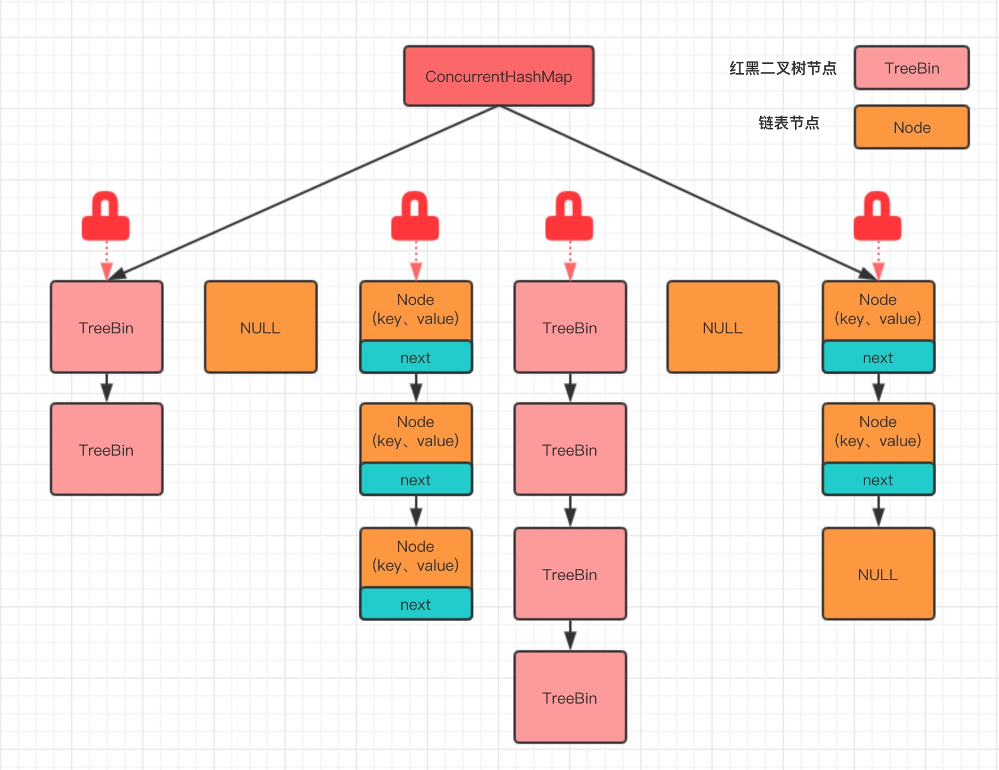

# ConcurrentHashMap原理解析


## 1. JDK1.7版本

ConcurrentHashMap JDK1.7之前通过数组+链表实现。每一个Segment元素存储的是HashEntry数组+链表

于ConcurrentHashMap的数据插入，这里要进行两次Hash去定位数据的存储位置

```text
static class Segment<K,V> extends ReentrantLock implements Serializable 
```

从上Segment的继承体系可以看出，Segment实现了**ReentrantLock**,也就带有锁的功能，
当执行put操作时，会进行第一次key的hash来定位Segment的位置，如果该Segment还没有初始化，
即通过CAS操作进行赋值，然后进行第二次hash操作，找到相应的HashEntry的位置，这里会利用继承过来的锁的特性，
在将数据插入指定的HashEntry位置时（链表的尾端），会通过继承ReentrantLock的tryLock（）方法尝试去获取锁，
如果获取成功就直接插入相应的位置，如果已经有线程获取该Segment的锁，
那当前线程会以自旋的方式去继续的调用tryLock（）方法去获取锁，超过指定次数就挂起，等待唤醒。


## 2. JDK1.8版本

JDK1.8 直接用**Node数组+链表+红黑树**的数据结构来实现，
并发控制使用Synchronized和CAS来操作，整个看起来就像是优化过且线程安全的HashMap

put操作在上面的例子中我们新增个人信息会调用put方法，我们来看下。

- 如果没有初始化就先调用initTable（）方法来进行初始化过程
- 如果没有hash冲突就直接CAS插入
- 如果还在进行扩容操作就先进行扩容
- 如果存在hash冲突，就加锁来保证线程安全，这里有两种情况，一种是链表形式就直接遍历到尾端插入，一种是红黑树就按照红黑树结构插入，
- 最后一个如果该链表的数量大于阈值8，就要先转换成黑红树的结构，break再一次进入循环
- 如果添加成功就调用addCount（）方法统计size，并且检查是否需要扩容

