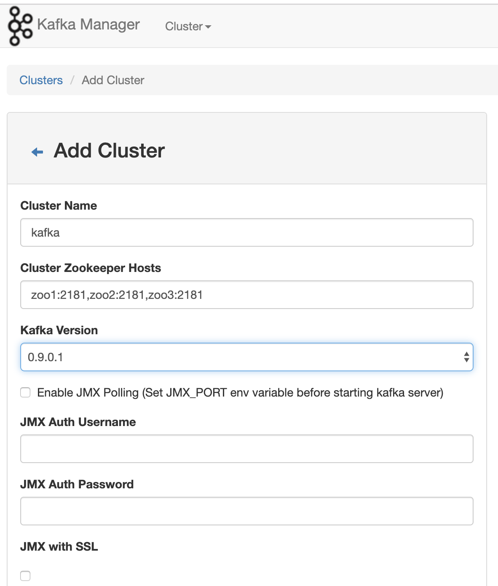
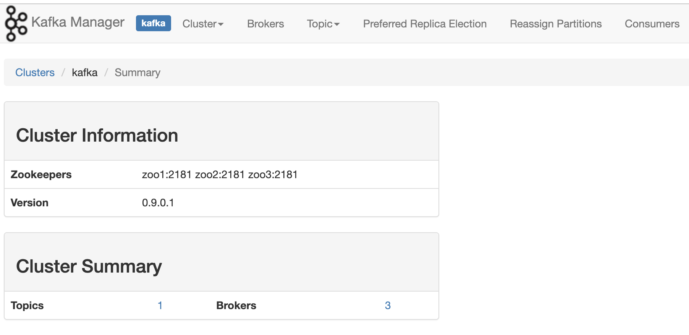

# Docker之Kafka集群搭建

## 1. 集群搭建

Docker-compose-kafka.yml

```yaml
version: '3.7'

networks:
  docker_net:
    external: true
  net:
    driver: bridge

services:

  kafka1:
    image: wurstmeister/kafka
    restart: unless-stopped
    container_name: kafka1
    ports:
      - "9093:9092"
    external_links:
      - zoo1
      - zoo2
      - zoo3
    environment:
      KAFKA_BROKER_ID: 1
      KAFKA_ADVERTISED_HOST_NAME: 192.168.124.5                   ## 修改:宿主机IP
      KAFKA_ADVERTISED_PORT: 9093                                 ## 修改:宿主机映射port
      KAFKA_ADVERTISED_LISTENERS: PLAINTEXT://192.168.124.5:9093    ## 绑定发布订阅的端口。修改:宿主机IP
      KAFKA_ZOOKEEPER_CONNECT: "zoo1:2181,zoo2:2181,zoo3:2181"
    volumes:
      - "./kafka/kafka1/docker.sock:/var/run/docker.sock"
      - "./kafka/kafka1/data/:/kafka"
    networks:
      - net


  kafka2:
    image: wurstmeister/kafka
    restart: unless-stopped
    container_name: kafka2
    ports:
      - "9094:9092"
    external_links:
      - zoo1
      - zoo2
      - zoo3
    environment:
      KAFKA_BROKER_ID: 2
      KAFKA_ADVERTISED_HOST_NAME: 192.168.124.5                 ## 修改:宿主机IP
      KAFKA_ADVERTISED_PORT: 9094                               ## 修改:宿主机映射port
      KAFKA_ADVERTISED_LISTENERS: PLAINTEXT://192.168.124.5:9094   ## 修改:宿主机IP
      KAFKA_ZOOKEEPER_CONNECT: "zoo1:2181,zoo2:2181,zoo3:2181"
    volumes:
      - "./kafka/kafka2/docker.sock:/var/run/docker.sock"
      - "./kafka/kafka2/data/:/kafka"
    networks:
      - net

  kafka3:
    image: wurstmeister/kafka
    restart: unless-stopped
    container_name: kafka3
    ports:
      - "9095:9092"
    external_links:
      - zoo1
      - zoo2
      - zoo3
    environment:
      KAFKA_BROKER_ID: 3
      KAFKA_ADVERTISED_HOST_NAME: 192.168.124.5                 ## 修改:宿主机IP
      KAFKA_ADVERTISED_PORT: 9095                              ## 修改:宿主机映射port
      KAFKA_ADVERTISED_LISTENERS: PLAINTEXT://192.168.124.5:9095   ## 修改:宿主机IP
      KAFKA_ZOOKEEPER_CONNECT: "zoo1:2181,zoo2:2181,zoo3:2181"
    volumes:
      - "./kafka/kafka3/docker.sock:/var/run/docker.sock"
      - "./kafka/kafka3/data/:/kafka"
    networks:
      - net

  kafka-manager:
    image: sheepkiller/kafka-manager:latest
    restart: unless-stopped
    container_name: kafka-manager
    hostname: kafka-manager
    ports:
      - "9000:9000"
    links:            # 连接本compose文件创建的container
      - kafka1
      - kafka2
      - kafka3
    external_links:   # 连接本compose文件以外的container
      - zoo1
      - zoo2
      - zoo3
    environment:
      ZK_HOSTS: zoo1:2181,zoo2:2181,zoo3:2181                 ## 修改:宿主机IP
      TZ: CST-8
    networks:
      - net

```


启动集群**

```
docker-compose -f docker-compose-kafka.yml up -d
```

**kafka-manager管理**

配置如下图




访问 http://localhost:9000/clusters/kafka 即可看到集群状态



## 2. 分析原理

**Zookeeper状态**

kafka基于zookeeper，kafka启动会将元数据保存在zookeeper中。查看zookeeper节点目录，会发现多了很多和kafka相关的目录。结果如下:

```
➜  docker zkCli -server 127.0.0.1:2183
Connecting to 127.0.0.1:2183
Welcome to ZooKeeper!
JLine support is enabled

WATCHER::

WatchedEvent state:SyncConnected type:None path:null
[zk: 127.0.0.1:2183(CONNECTED) 0] ls /
[cluster, controller, brokers, zookeeper, admin, isr_change_notification, log_dir_event_notification, controller_epoch, zk-test0000000000, kafka-manager, consumers, latest_producer_id_block, config]
```


**kafka日志**

kafka中的数据会持久化到磁盘日志文件，因为前边配置了docker映射，所以我们现在查看下相关目录

```
➜  data pwd
/Users/cuishiying/Desktop/docker/kafka/kafka1/data
➜  kafka-logs-7253a8da1fa3 tree
.
├── __consumer_offsets-1
│   ├── 00000000000000000000.index
│   ├── 00000000000000000000.log
│   ├── 00000000000000000000.timeindex
│   └── leader-epoch-checkpoint
├── __consumer_offsets-10
│   ├── 00000000000000000000.index
│   ├── 00000000000000000000.log
│   ├── 00000000000000000000.timeindex
│   └── leader-epoch-checkpoint
├── __consumer_offsets-13
│   ├── 00000000000000000000.index
│   ├── 00000000000000000000.log
│   ├── 00000000000000000000.timeindex
│   └── leader-epoch-checkpoint
├── __consumer_offsets-16
│   ├── 00000000000000000000.index
│   ├── 00000000000000000000.log
│   ├── 00000000000000000000.timeindex
│   └── leader-epoch-checkpoint
├── __consumer_offsets-19
│   ├── 00000000000000000000.index
│   ├── 00000000000000000000.log
│   ├── 00000000000000000000.timeindex
│   └── leader-epoch-checkpoint
├── __consumer_offsets-22
│   ├── 00000000000000000000.index
│   ├── 00000000000000000000.log
│   ├── 00000000000000000000.timeindex
│   └── leader-epoch-checkpoint
├── __consumer_offsets-25
│   ├── 00000000000000000000.index
│   ├── 00000000000000000000.log
│   ├── 00000000000000000000.timeindex
│   └── leader-epoch-checkpoint
├── __consumer_offsets-28
│   ├── 00000000000000000000.index
│   ├── 00000000000000000000.log
│   ├── 00000000000000000000.timeindex
│   └── leader-epoch-checkpoint
├── __consumer_offsets-31
│   ├── 00000000000000000000.index
│   ├── 00000000000000000000.log
│   ├── 00000000000000000000.timeindex
│   └── leader-epoch-checkpoint
├── __consumer_offsets-34
│   ├── 00000000000000000000.index
│   ├── 00000000000000000000.log
│   ├── 00000000000000000000.timeindex
│   └── leader-epoch-checkpoint
├── __consumer_offsets-37
│   ├── 00000000000000000000.index
│   ├── 00000000000000000000.log
│   ├── 00000000000000000000.timeindex
│   └── leader-epoch-checkpoint
├── __consumer_offsets-4
│   ├── 00000000000000000000.index
│   ├── 00000000000000000000.log
│   ├── 00000000000000000000.timeindex
│   └── leader-epoch-checkpoint
├── __consumer_offsets-40
│   ├── 00000000000000000000.index
│   ├── 00000000000000000000.log
│   ├── 00000000000000000000.timeindex
│   └── leader-epoch-checkpoint
├── __consumer_offsets-43
│   ├── 00000000000000000000.index
│   ├── 00000000000000000000.log
│   ├── 00000000000000000000.timeindex
│   └── leader-epoch-checkpoint
├── __consumer_offsets-46
│   ├── 00000000000000000000.index
│   ├── 00000000000000000000.log
│   ├── 00000000000000000000.timeindex
│   └── leader-epoch-checkpoint
├── __consumer_offsets-49
│   ├── 00000000000000000000.index
│   ├── 00000000000000000000.log
│   ├── 00000000000000000000.timeindex
│   └── leader-epoch-checkpoint
├── __consumer_offsets-7
│   ├── 00000000000000000000.index
│   ├── 00000000000000000000.log
│   ├── 00000000000000000000.timeindex
│   └── leader-epoch-checkpoint
├── cleaner-offset-checkpoint
├── log-start-offset-checkpoint
├── meta.properties
├── recovery-point-offset-checkpoint
├── replication-offset-checkpoint
├── test-0
│   ├── 00000000000000000000.index
│   ├── 00000000000000000000.log
│   ├── 00000000000000000000.timeindex
│   └── leader-epoch-checkpoint
├── test-1
│   ├── 00000000000000000000.index
│   ├── 00000000000000000000.log
│   ├── 00000000000000000000.timeindex
│   └── leader-epoch-checkpoint
└── test-2
    ├── 00000000000000000000.index
    ├── 00000000000000000000.log
    ├── 00000000000000000000.timeindex
    └── leader-epoch-checkpoint

20 directories, 85 files
```

由结果可知，kafka集群默认会将消费offset分别记录在50个topic中。由于我们测试节点3个broke，所以__consumer_offsets会均匀的分布在3个节点下。下文手动为主题test的创建了3个partition,所以test有3个文件夹。


其中 __consumer_offsets中存储consumer的消费offset。test-0,test-1,test-2存储主题test的消息内容，消息在3个partition均匀分步。每个partition一个文件夹，每个文件夹下多个segment，每个segment为一个文件。


每个partition中的消息都由offset=0开始记录消息，offset在partition中的编号唯一


## 3. 生产消费

```
# 进入kafka容器
docker exec -it kafka1 /bin/bash

# 进入安装目录
cd /opt/kafka/

# 查看topic列表
./bin/kafka-topics.sh --list --zookeeper zoo1:2181

# 创建主题。--replication-factor副本数 --partitions分区数。消费者数<=partitions分区数，replication<=broker数
./bin/kafka-topics.sh --create --zookeeper zoo1:2181 --replication-factor 3 --partitions 3 --topic test

# 生产消息
./bin/kafka-console-producer.sh --broker-list kafka1:9092 --topic test

# 消费消息
./bin/kafka-console-consumer.sh --bootstrap-server kafka1:9092,kafka2:9092,kafka3:9092 --topic test --from-beginning

# 查看偏移量
./kafka-consumer-groups.sh --bootstrap-server kafka1:9092,kafka2:9092,kafka3:9092 --describe --group group_id1

# 查看topic详情
./bin/kafka-topics.sh --zookeeper zoo1:2181,zoo2:2181,zoo3:2181 --describe --topic test

# 查看消费者组
./bin/kafka-consumer-groups.sh --bootstrap-server kafka1:9092,kafka2:9092,kafka3:9092 --list

# 查看kafka存储log文件,该log文件中存储的是
./bin/kafka-run-class.sh kafka.tools.DumpLogSegments --files /kafka/kafka-logs-7253a8da1fa3/test-0/00000000000000000000.log  --print-data-log

# 00000000000000000000.log文件内容查看结果
Dumping /kafka/kafka-logs-7253a8da1fa3/test-0/00000000000000000000.log
Starting offset: 0
baseOffset: 0 lastOffset: 0 count: 1 baseSequence: -1 lastSequence: -1 producerId: -1 producerEpoch: -1 partitionLeaderEpoch: 0 isTransactional: false isControl: false position: 0 CreateTime: 1577899746099 size: 72 magic: 2 compresscodec: NONE crc: 3439897502 isvalid: true
| offset: 0 CreateTime: 1577899746099 keysize: -1 valuesize: 4 sequence: -1 headerKeys: [] payload: msg3
baseOffset: 1 lastOffset: 1 count: 1 baseSequence: -1 lastSequence: -1 producerId: -1 producerEpoch: -1 partitionLeaderEpoch: 0 isTransactional: false isControl: false position: 72 CreateTime: 1577899750460 size: 72 magic: 2 compresscodec: NONE crc: 2725457413 isvalid: true
| offset: 1 CreateTime: 1577899750460 keysize: -1 valuesize: 4 sequence: -1 headerKeys: [] payload: msg5

# 其他日志查看(index:索引)
kafka-run-class kafka.tools.DumpLogSegments --files /kafka/kafka-logs-7253a8da1fa3/test-0/00000000000000000000.index

kafka-run-class kafka.tools.DumpLogSegments --files /kafka/kafka-logs-7253a8da1fa3/test-0/00000000000000000000.timeindex  --verify-index-only
```

上述结果也可以在kafaka-manage中观察到。同时，kafka节点上下线的rebalance等都可以在kafka-mange中进行配置。

