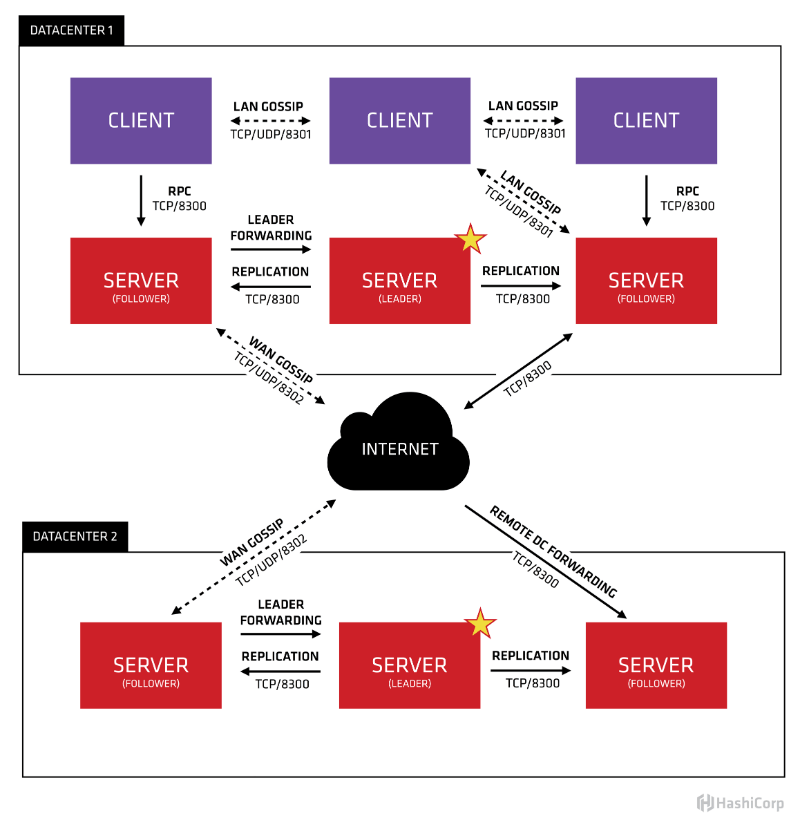

# Docker之consul集群

## 简介

**consul 关键特性**

- 服务发现：支持服务发现。你可以通过 DNS 或 HTTP 的方式获取服务信息。
- 健康检查：支持健康检查。可以提供与给定服务相关联的任何数量的健康检查（如 web 状态码或 cpu 使用率）。
- K/V 存储：键/值对存储。你可用通过 consul 存储如动态配置之类的相关信息。
- 多数据中心：支持多数据中心，开箱即用。
- WEB UI：支持 WEB UI。点点点，你就能够了解你的服务现在的运行情况，一目了然，对开发运维是非常友好的。

## consul 架构

consul 的架构是什么，官方给出了一个很直观的图片：



我们只看数据中心1，可以看出consul的集群是由N个SERVER，加上M个CLIENT组成的。而不管是SERVER还是CLIENT，都是consul的一个**节点**，所有的服务都可以注册到这些节点上，正是通过这些节点实现服务注册信息的共享。除了这两个，还有一些小细节，一一简单介绍。

- CLIENT

CLIENT表示consul的client模式，就是客户端模式。是consul节点的一种模式，这种模式下，所有注册到当前节点的服务会被转发到SERVER，本身是**不持久化**这些信息。

- SERVER

SERVER表示consul的server模式，表明这个consul是个server，这种模式下，功能和CLIENT都一样，唯一不同的是，它会把所有的信息持久化的本地，这样遇到故障，信息是可以被保留的。

- SERVER-LEADER

中间那个SERVER下面有LEADER的字眼，表明这个SERVER是它们的老大，它和其它SERVER不一样的一点是，它需要负责同步注册的信息给其它的SERVER，同时也要负责各个节点的健康监测。


## docker

docker-compose-consul.yml

```yml
version: '3'
services:
  consul-server1:
    image: consul:latest
    hostname: "consul-server1"
    ports:
      - "8500:8500"
      - "53"
    volumes:
      - ./consul/data1:/consul/data
    command: "agent -server -bootstrap-expect 3 -ui -disable-host-node-id -client 0.0.0.0"
  consul-server2:
    image: consul:latest
    hostname: "consul-server2"
    ports:
      - "8501:8500"
      - "53"
    volumes:
      - ./consul/data2:/consul/data
    command: "agent -server -ui -join consul-server1 -disable-host-node-id -client 0.0.0.0"
    depends_on:
      - consul-server1
  consul-server3:
    image: consul:latest
    hostname: "consul-server3"
    ports:
      - "8502:8500"
      - "53"
    volumes:
      - ./consul/data3:/consul/data
    command: "agent -server -ui -join consul-server1 -disable-host-node-id -client 0.0.0.0"
    depends_on:
      - consul-server1
  consul-node1:
    image: consul:latest
    hostname: "consul-node1"
    command: "agent -join consul-server1 -disable-host-node-id"
    depends_on:
      - consul-server1
  consul-node2:
    image: consul:latest
    hostname: "consul-node2"
    command: "agent -join consul-server1 -disable-host-node-id"
    depends_on:
      - consul-server1
```