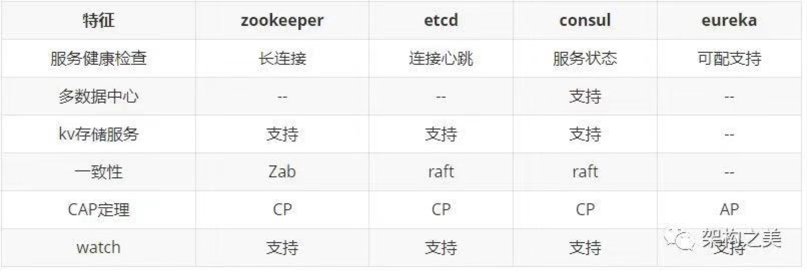
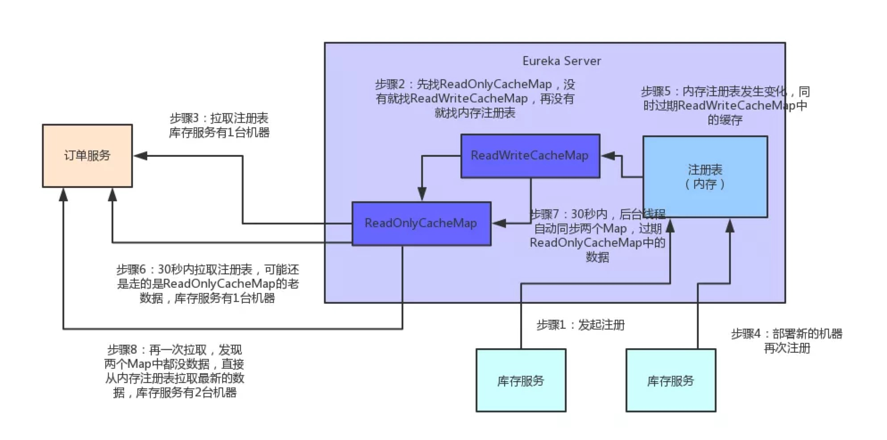

# Eureka实现原理

## 1. CAP理论

一致性（Consistency）

可用性（Availability）

分区容错性（Partition tolerance）

## 2. 微服务架构中心的设计思考

发生网络分区时注册中心保证A还是C，对于服务消费方来说，拿到不正确的服务节点信息好过无法获取服务节点而不去消费。所以对于服务发现而言，AP胜过CP。

## 3. Eureka实现原理

