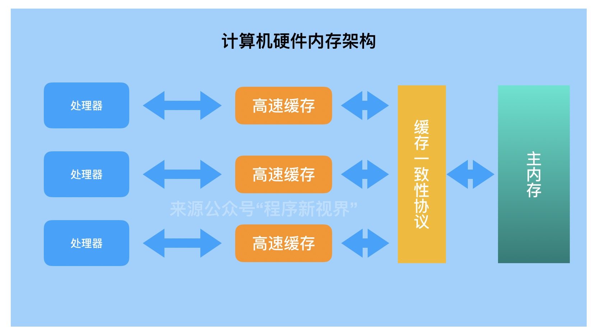
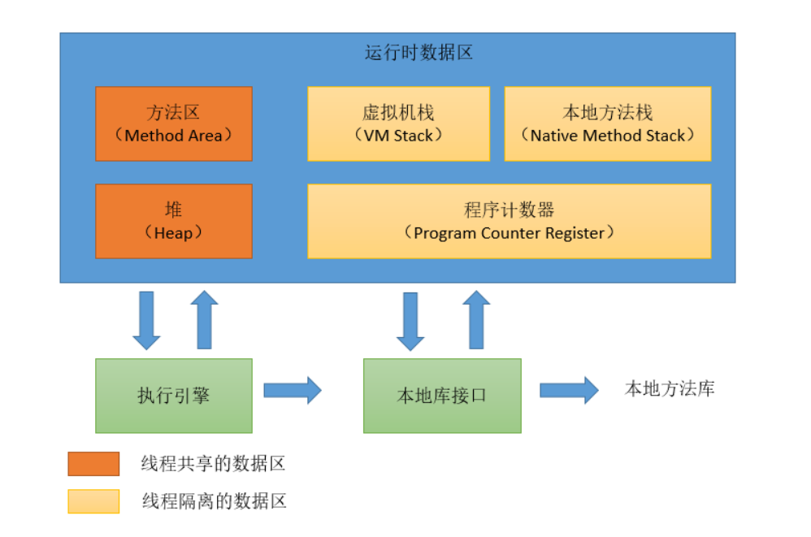
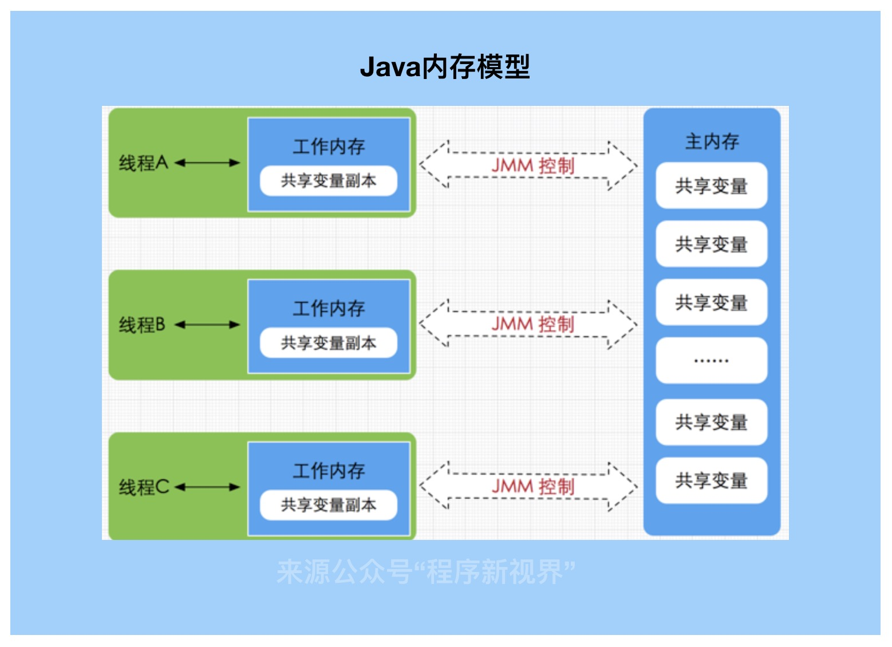
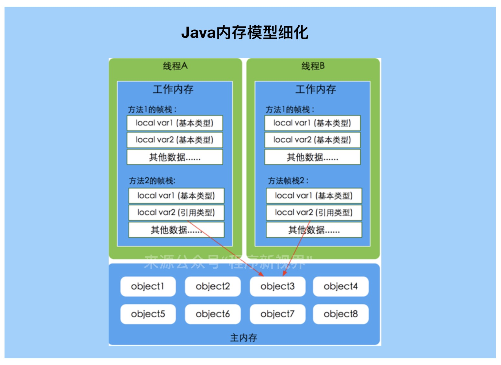
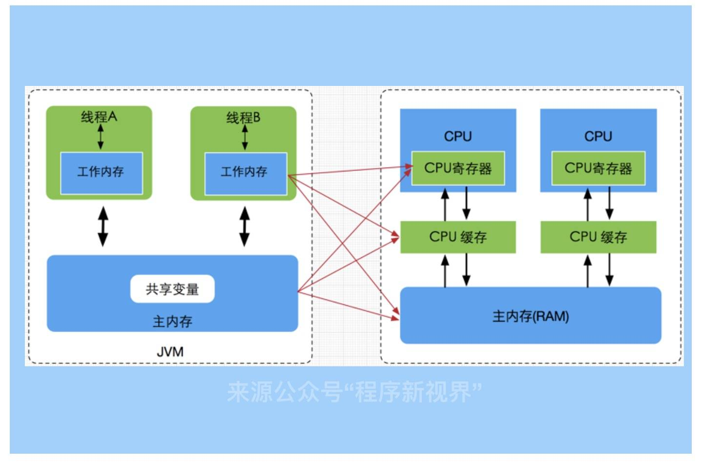
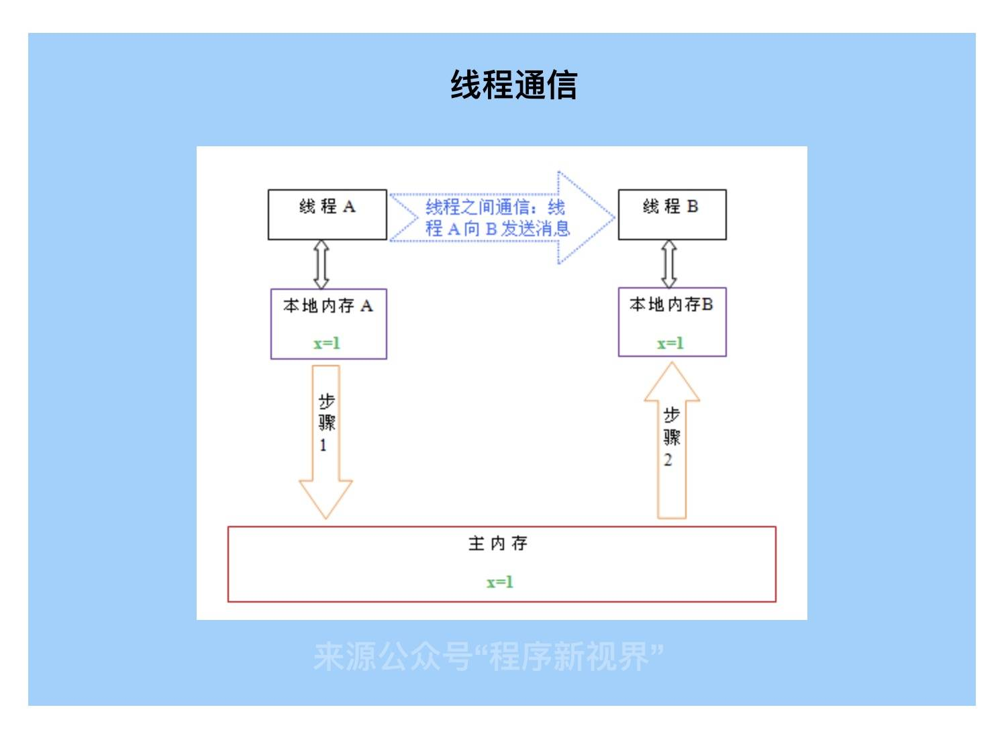

# Java内存模型

在Java JVM系列文章中有朋友问为什么要JVM，Java虚拟机不是已经帮我们处理好了么？同样，学习Java内存模型也有同样的问题，为什么要学习Java内存模型。它们的答案是一致的：能够让我们更好的理解底层原理，写出更高效的代码。

就Java内存模型而言，它是深入了解Java并发编程的先决条件。对于后续多线程中的线程安全、同步异步处理等更是大有裨益。

## 硬件内存架构

在学习Java内存模型之前，先了解一下计算机硬件内存模型。我们多知道处理器与计算机存储设备运算速度有几个数量级的差别。总不能让处理器总是等待计算机存储设备，这样就没办法显现出处理器的优势。

因此，为了“压榨”处理的性能，达到“高并发”的效果，在处理器和存储设备之间加入了高速缓存（cache）来作为缓冲。

将运算需要使用到的数据复制到缓存中，让运算能够快速进行。当运算完成之后，再将缓存中的结果写入主内存，这样运算器就不用等待主内存的读写操作了。

每个处理器都有自己的高速缓存，同时又共同操作同一块主内存，当多个处理器同时操作主内存时，可能导致数据不一致，因此需要“缓存一致性协议”来保障。比如，MSI、MESI等。

## JVM内存结构简单介绍

我们都知道，Java代码是要运行在虚拟机上的，而虚拟机在执行Java程序的过程中会把所管理的内存划分为若干个不同的数据区域，这些区域都有各自的用途。 在[《Java虚拟机规范（Java SE 8）》](https://docs.oracle.com/javase/specs/jvms/se8/html/jvms-2.html#jvms-2.5.4)中描述了JVM运行时内存区域结构如下：

## Java内存模型

Java内存模型即Java Memory Model，简称JMM。用来屏蔽掉各种硬件和操作系统的内存访问差异，以实现让Java程序在各平台下都能够达到一致的内存访问效果。

JMM定义了线程和主内存之间的抽象关系：线程之间的共享变量存储在主内存（main memory）中，每个线程都有一个私有的本地内存（local memory），本地内存中存储了该线程以读/写共享变量的副本。本地内存是JMM的一个抽象概念，并不真实存在。它涵盖了缓存，写缓冲区，寄存器以及其他的硬件和编译器优化。

JMM与Java内存结构并不是同一个层次的内存划分，两者基本没有关系。如果一定要勉强对应，那从变量、主内存、工作内存的定义看，主内存主要对应Java堆中的对象实例数据部分，工作内存则对应虚拟机栈的部分区域。

主内存：主要存储的是Java实例对象，所有线程创建的实例对象都存放在主内存中，不管该实例对象是成员变量还是方法中的本地变量(也称局部变量)，当然也包括了共享的类信息、常量、静态变量。共享数据区域，多条线程对同一个变量进行访问可能会发现线程安全问题。

工作内存：主要存储当前方法的所有本地变量信息(工作内存中存储着主内存中的变量副本拷贝)，每个线程只能访问自己的工作内存，即线程中的本地变量对其它线程是不可见的，就算是两个线程执行的是同一段代码，它们也会各自在自己的工作内存中创建属于当前线程的本地变量，当然也包括了字节码行号指示器、相关Native方法的信息。由于工作内存是每个线程的私有数据，线程间无法相互访问工作内存，因此存储在工作内存的数据不存在线程安全问题。

JMM模型与硬件模型直接的对照关系可简化为下图：

 

## 内存之间的交互操作

线程的工作内存中保存了被该线程使用到的变量的主内存副本拷贝，线程对变量的所有操作都必须在工作内存中进行，而不能直接读写主内存中的变量。不同的线程之间也无法直接访问对方工作内存中的变量，线程间变量值的传递均需要通过主内存来完成。

如上图，本地内存A和B有主内存中共享变量x的副本，初始值都为0。线程A执行之后把x更新为1，存放在本地内存A中。当线程A和线程B需要通信时，线程A首先会把本地内存中x=1值刷新到主内存中，主内存中的x值变为1。随后，线程B到主内存中去读取更新后的x值，线程B的本地内存的x值也变为了1。

在此交互过程中，Java内存模型定义了8种操作来完成，虚拟机实现必须保证每一种操作都是原子的、不可再拆分的（double和long类型例外）。

- lock（锁定）：作用于主内存的变量，它把一个变量标识为一条线程独占的状态。
- unlock（解锁）：作用于主内存的变量，它把一个处于锁定状态的变量释放出来，释放后的变量才可以被其他线程锁定。
- read（读取）：作用于主内存的变量，它把一个变量的值从主内存传输到线程的工作内存中，以便随后的load动作使用。
- load（载入）：作用于工作内存的变量，它把read操作从主内存中得到的变量值放入工作内存的变量副本中。
- use（使用）：作用于工作内存的变量，它把工作内存中一个变量的值传递给执行引擎，每当虚拟机遇到一个需要使用到变量的值的字节码指令时将会执行这个操作。
- assign（赋值）：作用于工作内存的变量，它把一个从执行引擎接收到的值赋给工作内存的变量，每当虚拟机遇到一个给变量赋值的字节码指令时执行这个操作。
- store（存储）：作用于工作内存的变量，它把工作内存中一个变量的值传送到主内存中，以便随后的write操作使用。
- write（写入）：作用于主内存的变量，它把store操作从工作内存中得到的变量的值放入主内存的变量中。

如果需要把一个变量从主内存复制到工作内存，那就要顺序地执行read和load操作，如果要把变量从工作内存同步回主内存，就要顺序地执行store和write操作。注意，Java内存模型只要求上述两个操作必须按顺序执行，而没有保证是连续执行。也就是说read与load之间、store与write之间是可插入其他指令的，如对主内存中的变量a、b进行访问时，一种可能出现顺序是read a、read b、load b、load a。除此之外，Java内存模型还规定了在执行上述8中基本操作时必须满足如下规则。

- 不允许read和load、store和write操作之一单独出现，即不允许一个变量从主内存读取了但工作内存不接受，或者从工作内存发起回写了但主内存不接受的情况出现。
- 不允许一个线程丢弃它的最近的assign操作，即变量在工作内存中改变了之后必须把该变化同步回主内存。
- 不允许一个线程无原因地（没有发生过任何assign操作）把数据从线程的工作内存同步回主内存。
- 一个新的变量只能在主内存中“诞生”，不允许在工作内存中直接使用一个未被初始化（load或assign）的变量，换句话说，就是对一个变量实施use、store操作之前，必须先执行过了assign和load操作。
- 一个变量在同一时刻只允许一条线程对其进行lock操作，但lock操作可以被同一条线程重复执行多次，多次执行lock后，只有执行相同次数的unlock操作，变量才会被解锁。
- 如果对一个变量执行lock操作，那将会清空工作内存中此变量的值，在执行引擎使用这个变量前，需要重新执行load或assign操作初始化变量的值。
- 如果一个变量事先没有被lock操作锁定，那就不允许对它执行unlock操作，也不允许去unlock一个被其他线程锁定住的变量。
- 对一个变量执行unlock操作之前，必须先把此变量同步回主内存中（执行store、write操作）。

## long和double型变量的特殊规则

Java内存模型要求lock，unlock，read，load，assign，use，store，write这8个操作都具有原子性，但对于64位的数据类型（long或double），在模型中定义了一条相对宽松的规定，允许虚拟机将没有被volatile修饰的64位数据的读写操作划分为两次32位的操作来进行，即允许虚拟机实现选择可以不保证64位数据类型的load，store，read，write这4个操作的原子性，即long和double的非原子性协定。

如果多线程的情况下double或long类型并未声明为volatile，可能会出现“半个变量”的数值，也就是既非原值，也非修改后的值。

虽然Java规范允许上面的实现，但商用虚拟机中基本都采用了原子性的操作，因此在日常使用中几乎不会出现读取到“半个变量”的情况。

## 小结

本节课重点介绍了Java内存模型以及内存交互的步骤和操作。下篇文章将重点介绍Java内存模型涉及的几个特征和原则。欢迎关注微信公众号“程序新视界”，第一时间获得最新文章的更新。

本文部分内容引自周志明《深入理解java虚拟机》。

## 参考

- https://juejin.im/post/5dbfa0aa51882538ce1a4ebc
- https://zhuanlan.zhihu.com/p/29881777

