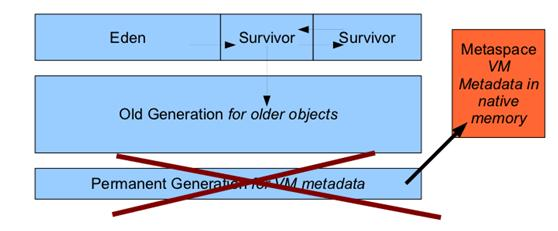

# JVM内存结构

## 1. 前言

以下是阅读《深入理解java虚拟机》一书的笔记，仅供参考

JVM = 类加载器 classloader + 执行引擎 execution engine + 运行时数据区域 runtime data area
classloader 把硬盘上的class 文件加载到JVM中的运行时数据区域, 但是它不负责这个类文件能否执行，而这个是 执行引擎 负责的。

**上下文切换**

CPU通过时间片分配算法来循环执行任务，当前任务执行一个时间片后会切换到下一个任务。
但是，在切换前会保存上一个任务的状态，以便下次切换回这个任务时，可以再次加载这个任务的状态，从任务保存到再加载的过程就是一次上下文切换。

**切换诱因**

1. 在操作系统中，上下文切换的类型可以分为进程间的上下文切换和线程间的上下文切换

2. 线程状态：NEW、RUNNABLE、RUNNING、BLOCKED、DEAD
   Java线程状态：NEW、RUNNABLE、BLOCKED、WAITING、TIMED_WAITING、TERMINATED

3. 线程上下文切换：RUNNING -> BLOCKED -> RUNNABLE -> 被调度器选中执行

一个线程从RUNNING状态转为BLOCKED状态，称为一个线程的暂停
线程暂停被切出后，操作系统会**保存相应的上下文**

以便该线程再次进入RUNNABLE状态时能够在之前执行进度的基础上继续执行
一个线程从BLOCKED状态进入RUNNABLE状态，称为一个线程的唤醒
此时线程将获取上次保存的上下文继续执行

4. 诱因：程序本身触发的自发性上下文切换、系统或虚拟机触发的非自发性上下文切换
   自发性上下文切换
   sleep、wait、yield、join、park、synchronized、lock
   非自发性上下文切换
   线程被分配的时间片用完、JVM垃圾回收（STW、线程暂停）、线程执行优先级

**切换的系统开销**

* 操作系统保存和恢复上下文
* 调度器进行线程调度
* 处理器高速缓存重新加载
* 可能导致整个高速缓存区被冲刷，从而带来时间开销

**锁竞争才是性能开销的根源**

所以，优化方向有： 减少锁粒度、非阻塞锁代替竞争锁等(比如自旋锁，本身没有阻塞，不需要保存上下文信息)

## 2. 运行时数据区

### 1. 程序计数器

程序计数器是一块较小的内存空间，可以看作是当前线程所执行的字节码的行号指示器。字节码解释器工作时通过改变这个计数器的值来选取下一条需要执行的字节码指令，分支、循环、跳转、异常处理、线程恢复等功能都需要依赖这个计数器来完成。

另外，为了线程切换后能恢复到正确的执行位置，每条线程都需要有一个独立的程序计数器，各线程之间计数器互不影响，独立存储，我们称这类内存区域为“线程私有”的内存。

从上面的介绍中我们知道程序计数器主要有两个作用：

字节码解释器通过改变程序计数器来依次读取指令，从而实现代码的流程控制，如：顺序执行、选择、循环、异常处理。
在多线程的情况下，程序计数器用于记录当前线程执行的位置，从而当线程被切换回来的时候能够知道该线程上次运行到哪儿了。
注意：程序计数器是唯一一个不会出现 OutOfMemoryError 的内存区域，它的生命周期随着线程的创建而创建，随着线程的结束而死亡。

### 2. 虚拟机栈

与程序计数器一样，Java 虚拟机栈也是线程私有的，它的生命周期和线程相同，描述的是 Java 方法执行的内存模型，每次方法调用的数据都是通过栈传递的。

Java 内存可以粗糙的区分为堆内存（Heap）和栈内存 (Stack),其中栈就是现在说的虚拟机栈，或者说是虚拟机栈中局部变量表部分。 （实际上，Java 虚拟机栈是由一个个栈帧组成，而每个栈帧中都拥有：局部变量表、操作数栈、动态链接、方法出口信息。）

局部变量表主要存放了编译器可知的各种数据类型（boolean、byte、char、short、int、float、long、double）、对象引用（reference 类型，它不同于对象本身，可能是一个指向对象起始地址的引用指针，也可能是指向一个代表对象的句柄或其他与此对象相关的位置）。

Java 虚拟机栈会出现两种异常：StackOverFlowError 和 OutOfMemoryError。

StackOverFlowError： 若 Java 虚拟机栈的内存大小不允许动态扩展，那么当线程请求栈的深度超过当前 Java 虚拟机栈的最大深度的时候，就抛出 StackOverFlowError 异常。
OutOfMemoryError： 若 Java 虚拟机栈的内存大小允许动态扩展，且当线程请求栈时内存用完了，无法再动态扩展了，此时抛出 OutOfMemoryError 异常。
Java 虚拟机栈也是线程私有的，每个线程都有各自的 Java 虚拟机栈，而且随着线程的创建而创建，随着线程的死亡而死亡。

扩展：那么方法/函数如何调用？

Java 栈可用类比数据结构中栈，Java 栈中保存的主要内容是栈帧，每一次函数调用都会有一个对应的栈帧被压入 Java 栈，每一个函数调用结束后，都会有一个栈帧被弹出。

Java 方法有两种返回方式：

return 语句。
抛出异常。
不管哪种返回方式都会导致栈帧被弹出

### 3. 本地方法栈

和虚拟机栈所发挥的作用非常相似，区别是： 虚拟机栈为虚拟机执行 Java 方法 （也就是字节码）服务，而本地方法栈则为虚拟机使用到的 Native 方法服务。 在 HotSpot 虚拟机中和 Java 虚拟机栈合二为一。

本地方法被执行的时候，在本地方法栈也会创建一个栈帧，用于存放该本地方法的局部变量表、操作数栈、动态链接、出口信息。

方法执行完毕后相应的栈帧也会出栈并释放内存空间，也会出现 StackOverFlowError 和 OutOfMemoryError 两种异常。

### 4. 堆

Java 虚拟机所管理的内存中最大的一块，Java 堆是所有线程共享的一块内存区域，在虚拟机启动时创建。此内存区域的唯一目的就是存放对象实例，几乎所有的对象实例以及数组都在这里分配内存。

Java 堆是垃圾收集器管理的主要区域，因此也被称作GC 堆（Garbage Collected Heap）.从垃圾回收的角度，由于现在收集器基本都采用分代垃圾收集算法，所以 Java 堆还可以细分为：新生代和老年代：再细致一点有：Eden 空间、From Survivor、To Survivor 空间等。进一步划分的目的是更好地回收内存，或者更快地分配内存。

在 JDK 7 版本及JDK 7 版本之前，堆内存被通常被分为下面三部分：

新生代内存(Young Ceneration)
老生代(Old Generation)
永生代(Permanent Generation)

JDK 8 版本之后方法区（HotSpot 的永久代）被彻底移除了（JDK1.7 就已经开始了），取而代之是元空间，元空间使用的是直接内存。

上图所示的 Eden 区、两个 Survivor 区都属于新生代（为了区分，这两个 Survivor 区域按照顺序被命名为 from 和 to），中间一层属于老年代。

大部分情况，对象都会首先在 Eden 区域分配，在一次新生代垃圾回收后，如果对象还存活，则会进入 s0 或者 s1，并且对象的年龄还会加 1(Eden 区->Survivor 区后对象的初始年龄变为 1)，当它的年龄增加到一定程度（默认为 15 岁），就会被晋升到老年代中。对象晋升到老年代的年龄阈值，可以通过参数 -XX:MaxTenuringThreshold 来设置。

**动态年龄**

> “Hotspot遍历所有对象时，按照年龄从小到大对其所占用的大小进行累积，当累积的某个年龄大小超过了survivor区的一半时，取这个年龄和MaxTenuringThreshold中更小的一个值，作为新的晋升年龄阈值”。

堆这里最容易出现的就是 OutOfMemoryError 异常，并且出现这种异常之后的表现形式还会有几种，比如：

1. OutOfMemoryError: GC Overhead Limit Exceeded ： 当JVM花太多时间执行垃圾回收并且只能回收很少的堆空间时，就会发生此错误。
2. java.lang.OutOfMemoryError: Java heap space :假如在创建新的对象时, 堆内存中的空间不足以存放新创建的对象, 就会引发java.lang.OutOfMemoryError: Java heap space 错误。(和本机物理内存无关，和你配置的对内存大小有关！)

2. ......

### 5. 方法区

方法区与 Java 堆一样，是各个线程共享的内存区域，它用于存储已被虚拟机加载的类信息、常量、静态变量、即时编译器编译后的代码等数据。虽然 Java 虚拟机规范把方法区描述为堆的一个逻辑部分，但是它却有一个别名叫做 Non-Heap（非堆），目的应该是与 Java 堆区分开来。

方法区也被称为永久代。很多人都会分不清方法区和永久代的关系，为此我也查阅了文献。

**方法区和永久代的关系**

> 《Java 虚拟机规范》只是规定了有方法区这么个概念和它的作用，并没有规定如何去实现它。那么，在不同的 JVM 上方法区的实现肯定是不同的了。 **方法区和永久代的关系很像 Java 中接口和类的关系，类实现了接口，而永久代就是 HotSpot 虚拟机对虚拟机规范中方法区的一种实现方式。** 也就是说，永久代是 HotSpot 的概念，方法区是 Java 虚拟机规范中的定义，是一种规范，而永久代是一种实现，一个是标准一个是实现，其他的虚拟机实现并没有永久代这一说法。

### 6. 运行时常量池

运行时常量池是方法区的一部分。Class 文件中除了有类的版本、字段、方法、接口等描述信息外，还有常量池信息（用于存放编译期生成的各种字面量和符号引用）

既然运行时常量池是方法区的一部分，自然受到方法区内存的限制，当常量池无法再申请到内存时会抛出 OutOfMemoryError 异常。

**JDK1.7 及之后版本的 JVM 已经将运行时常量池从方法区中移了出来，在 Java 堆（Heap）中开辟了一块区域存放运行时常量池**

