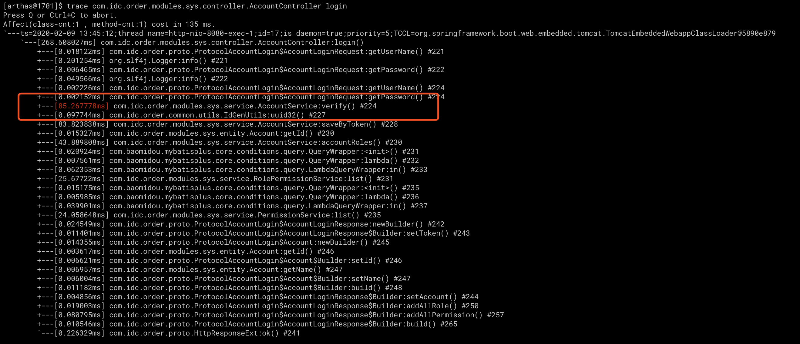

# JVM线上调优


## 1. 调优原则

1. 必须有监控；
2. 调优目标: 
   	- 最短停顿时间? 	CMS
      	- 最大吞吐量(吞吐量 = 运行用户代码时间 /（运行用户代码时间 + 垃圾收集时间))？ Parallel Scavenge
3. 调优手段


### 官方推荐调优流程


### 1.2. Hotspot虚拟机优化大纲


## 

## 2. 线上问题

- 内存泄露；
- 某个进程突然 `CPU` 飙升；
- 线程死锁；
- 响应变慢(长时间卡顿)。
- FGC频繁


## 3. 调优方向

- 内存调优
- 垃圾回收策略调优


## 4. Arthas线上监控

1. 线上启动arthas后attach到我们需要监控的进程；
2. 帮助文档

```shell
[arthas@1701]$ help
 NAME         DESCRIPTION
 help         Display Arthas Help
 keymap       Display all the available keymap for the specified connection.
 sc           Search all the classes loaded by JVM
 sm           Search the method of classes loaded by JVM
 classloader  Show classloader info
 jad          Decompile class
 getstatic    Show the static field of a class
 monitor      Monitor method execution statistics, e.g. total/success/failure count, average rt, fail rate, etc.
 stack        Display the stack trace for the specified class and method
 thread       Display thread info, thread stack
 trace        Trace the execution time of specified method invocation.
 watch        Display the input/output parameter, return object, and thrown exception of specified method invocation
 tt           Time Tunnel
 jvm          Display the target JVM information
 ognl         Execute ognl expression.
 mc           Memory compiler, compiles java files into bytecode and class files in memory.
 redefine     Redefine classes. @see Instrumentation#redefineClasses(ClassDefinition...)
 dashboard    Overview of target jvm's thread, memory, gc, vm, tomcat info.
 dump         Dump class byte array from JVM
 heapdump     Heap dump
 options      View and change various Arthas options
 cls          Clear the screen
 reset        Reset all the enhanced classes
 version      Display Arthas version
 shutdown     Shutdown Arthas server and exit the console
 stop         Stop/Shutdown Arthas server and exit the console. Alias for shutdown.
 session      Display current session information
 sysprop      Display, and change the system properties.
 sysenv       Display the system env.
 vmoption     Display, and update the vm diagnostic options.
 logger       Print logger info, and update the logger level
 history      Display command history
 cat          Concatenate and print files
 pwd          Return working directory name
 mbean        Display the mbean information
 grep         grep command for pipes.
 profiler     Async Profiler. https://github.com/jvm-profiling-tools/async-profiler
```


### 1、dashboard

在arthas的命令行界面，输入dashboard，会实时展示当前tomcat的多线程状态、Jvm各区域、GC情况等信息


### 2、查看线程监控

常用参数

输入thread会显示所有线程的状态信息

输入thread -n 3会显示当前最忙的3个线程，可以用来排查线程CPU消耗

输入thread -b 会显示当前处于BLOCKED状态的线程，可以排查线程锁的问题


### 3、jvm监控

输入jvm，查看jvm详细的性能数据


### 4、函数耗时监控

通常说一个接口性能不好，其实就是接口响应时间比较长造成的，具体代码中哪个函数耗时比较长呢？可以使用trace功能来监控一下

```
trace com.idc.order.modules.sys.controller.AccountController login
```

解释：

-j参数可以过滤掉jdk自身的函数

om.idc.order.modules.sys.controller.AccountController是接口所在的类

Login是接口的入口函数



通过圈起来的部分可以看到，接口的入口函数login总耗时268ms

其中verify函数耗时85ms

很明显，最慢的函数已经找到了，接下里就要去对代码进行进一步分析，然后再进行优化


## 5. 模拟堆栈溢出

###  堆溢出模拟
```java
/**
 * 堆溢出: java对象在堆中分配内存
 *
 * VM options: -Xms20m -Xmx20m -XX:+HeapDumpOnOutOfMemoryError
 *
 * 执行结果:
 *
 * 分配次数：1
 * 分配次数：2
 * 分配次数：3
 * java.lang.OutOfMemoryError: Java heap space
 * Dumping heap to java_pid17426.hprof ...
 * Heap dump file created [17431809 bytes in 0.026 secs]
 * Exception in thread "main" java.lang.OutOfMemoryError: Java heap space
 *     at com.example.demojava.demo.HeapOOm.main(HeapOOm.java:15)
 */
public class HeapOOm {

    public static void main(String[] args) {
        List<byte[]> list = new ArrayList<>();
        int i=0;
        while(true){
            list.add(new byte[5*1024*1024]);
            System.out.println("分配次数："+(++i));
        }
    }
}
```

> *附：dump文件会在项目的根目录下生成*
>
> 从上面的例子我们可以看出，在进行第4次内存分配时，发生了内存溢出。


### 栈溢出模拟

栈空间不足时，需要分下面两种情况处理：

- 线程请求的栈深度大于虚拟机所允许的最大深度，将抛出StackOverflowError
- 虚拟机在扩展栈深度时无法申请到足够的内存空间，将抛出OutOfMemberError

附：当前大部分的虚拟机栈都是可动态扩展的。

1、栈空间不足——StackOverflowError实例

```java
/**
 * 栈空间不足溢出
 *
 * 执行结果：
 *
 * 递归次数：18117
 * Exception in thread "main" java.lang.StackOverflowError
 *     at com.example.demojava.demo.StackOverflowErrorDemo.sofMethod(StackOverflowErrorDemo.java:13)
 */
public class StackOverflowErrorDemo {

    int depth = 0;

    public void sofMethod(){
        depth ++ ;
        sofMethod();
    }

    public static void main(String[] args) {
        StackOverflowErrorDemo test = null;
        try {
            test = new StackOverflowErrorDemo();
            test.sofMethod();
        } finally {
            System.out.println("递归次数："+test.depth);
        }
    }
}
```

我们可以看到，sofMethod()方法递归调用了982次后，出现了StackOverflowError。


### 永久代溢出模拟

永久代溢出可以分为两种情况，第一种是常量池溢出，第二种是方法区溢出。

**1、永久代溢出——常量池溢出**

**2、永久代溢出——方法区溢出**

```java
/**
 * java7 方法区溢出
 * -XX:PermSize=10m -XX:MaxPermSize=10m
 */
public class MethodAreaOOMTest {

    public static void main(String[] args) {
        int i=0;
        try {
            while(true){
                Enhancer enhancer = new Enhancer();
                enhancer.setSuperclass(OOMObject.class);
                enhancer.setUseCache(false);
                enhancer.setCallback(new MethodInterceptor() {
                    @Override
                    public Object intercept(Object obj, Method method, Object[] args, MethodProxy proxy) throws Throwable {
                        return proxy.invokeSuper(obj, args);
                    }
                });
                enhancer.create();
                i++;
            }
        } finally{
            System.out.println("运行次数："+i);
        }
    }

    static class OOMObject{

    }
}
```

从上面的例子我们可以看出，在进行第4次内存分配时，发生了内存溢出。

### 元空间溢出模拟

```java
/**
 * -Xms20m -Xmx20m -XX：MaxDirectMemorySize=10m
 */
public class DirectMemoryOOMTest {

    public static void main(String[] args) {
        int i=0;
        try {
            Field field = Unsafe.class.getDeclaredFields()[0];
            field.setAccessible(true);
            Unsafe unsafe = (Unsafe) field.get(null);
            while(true){
                unsafe.allocateMemory(1024*1024);
                i++;
            }
        } catch (Exception e) {
            e.printStackTrace();
        }finally {
            System.out.println("分配次数："+i);
        }
    }
}
```


## 6. Btrace线上调优

https://hacpai.com/article/1480092912242


## 7. 线上内存溢出排查流程

```undefined
>jps
```

- 2、查看线程信息


```undefined
>jstack 19645
```

- 3、存储进程信息


```cpp
>jstack 19645 >t.log
```

- 4、查看内存信息


```undefined
>jmap -histo 19645
```

- 5、dump内存信息到heap.bin文件


```swift
>jmap -dump:format=b,file=heap.bin 19645
```

- 6、jstat 监视垃圾回收（GC）时间，次数


```undefined
>jstat -gc 19645
```

- 7、使用mat工具或者VisualVM工具导入heap.bin文件分析内存信息


```undefined
>
```


## 参考

- https://juejin.im/post/5dd0c0b95188253d73575ca1
- https://tech.meituan.com/2017/12/29/jvm-optimize.html
- https://juejin.im/post/59e6c1f26fb9a0451c397a8c