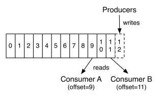

# kafka为什么吞吐量大

**1. 顺序读写**

众所周知Kafka是将消息记录持久化到本地磁盘中的，一般人会认为磁盘读写性能差，可能会对Kafka性能如何保证提出质疑。
实际上不管是内存还是磁盘，快或慢关键在于寻址的方式，磁盘分为顺序读写与随机读写，内存也一样分为顺序读写与随机读写。
基于磁盘的随机读写确实很慢，但磁盘的顺序读写性能却很高，一般而言要高出磁盘随机读写三个数量级，一些情况下磁盘顺序读写性能甚至要高于内存随机读写。

磁盘的顺序读写是磁盘使用模式中最有规律的，并且操作系统也对这种模式做了大量优化，Kafka就是使用了磁盘顺序读写来提升的性能。
Kafka的message是不断追加到本地磁盘文件末尾的，而不是随机的写入，这使得Kafka写入吞吐量得到了显著提升 。

**顺序读写**有一个缺陷—— 没有办法删除数据 ，所以Kafka是不会删除数据的，它会把所有的数据都保留下来，每个消费者（Consumer）对每个Topic都有一个offset用来表示 读取到了第几条数据 。

如果不删除硬盘肯定会被撑满，所以Kakfa提供了两种策略来删除数据。一是基于时间，二是基于partition文件大小。具体配置可以参看它的配置文档。

**2. Page Cache**

为了优化读写性能，Kafka利用了操作系统本身的Page Cache，就是利用操作系统自身的内存而不是JVM空间内存。这样做的好处有：

1. 避免Object消耗：如果是使用 Java 堆，Java对象的内存消耗比较大，通常是所存储数据的两倍甚至更多。

2. 避免GC问题：随着JVM中数据不断增多，垃圾回收将会变得复杂与缓慢，使用系统缓存就不会存在GC问题

相比于使用JVM或in-memory cache等数据结构，利用操作系统的Page Cache更加简单可靠。
首先，操作系统层面的缓存利用率会更高，因为存储的都是紧凑的字节结构而不是独立的对象。
其次，操作系统本身也对于Page Cache做了大量优化，提供了 write-behind、read-ahead以及flush等多种机制。
再者，即使服务进程重启，系统缓存依然不会消失，避免了in-process cache重建缓存的过程。

通过操作系统的Page Cache，Kafka的读写操作基本上是基于内存的，读写速度得到了极大的提升。

**3. 零拷贝**

 linux操作系统 “零拷贝” 机制使用了sendfile方法， 允许操作系统将数据从Page Cache 直接发送到网络，只需要最后一步的copy操作将数据复制到 NIC 缓冲区， 这样避免重新复制数据 。示意图如下：

通过这种 “零拷贝” 的机制，Page Cache 结合 sendfile 方法，Kafka消费端的性能也大幅提升。这也是为什么有时候消费端在不断消费数据时，我们并没有看到磁盘io比较高，此刻正是操作系统缓存在提供数据。

**4. 分区分段+索引**

kafka中的topic中的内容可以被分为多分partition存在,每个partition又分为多个段segment,所以每次操作都是针对一小部分做操作，很轻便，并且增加并行操作的能力

**5. 批量读写**

kafka允许进行批量发送消息，producter发送消息的时候，可以将消息缓存在本地,等到了固定条件发送到kafka

1. 等消息条数到固定条数
2. 一段时间发送一次

**6. 批量压缩**

Kafka还支持对消息集合进行压缩，Producer可以通过GZIP或Snappy格式对消息集合进行压缩 压缩的好处就是减少传输的数据量，减轻对网络传输的压力

批量发送和数据压缩一起使用,单条做数据压缩的话，效果不明显
