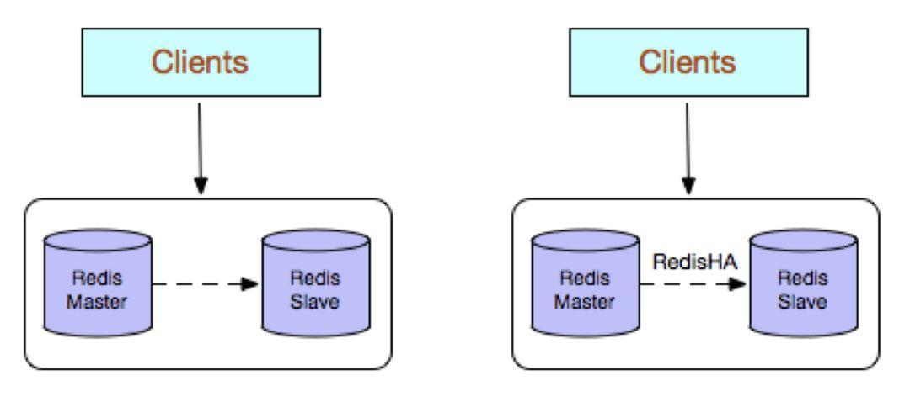
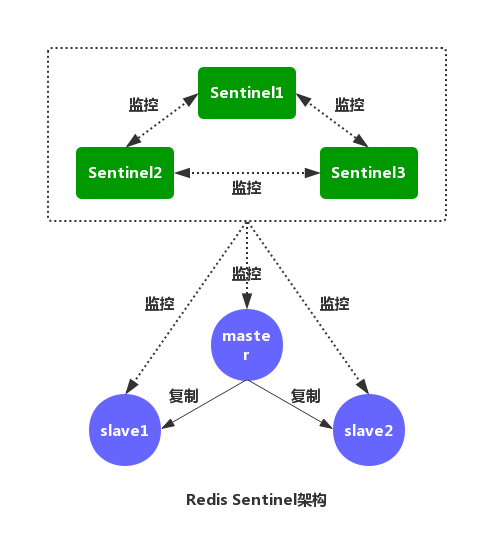
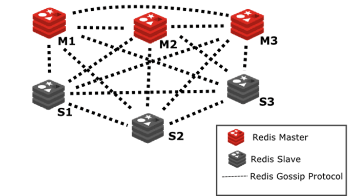
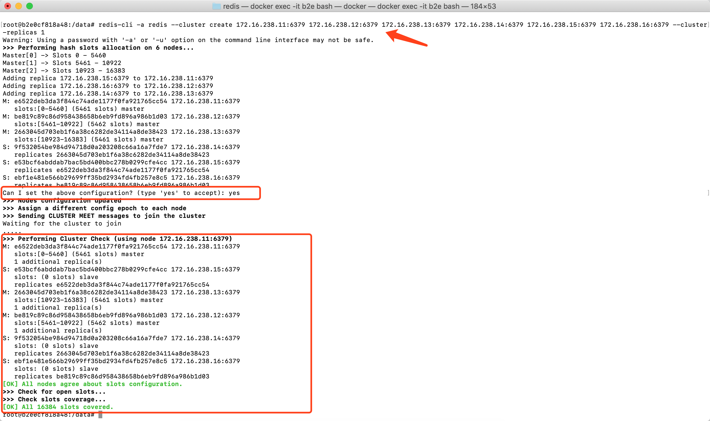

## 持久化

## 集群方案

### 1、Redis多副本(主从)



Redis 多副本，采用主从（replication）部署结构，相较于单副本而言最大的特点就是主从实例间数据实时同步，并且提供数据持久化和备份策略

优点:

1. 高可靠性，一方面，采用双机主备架构，能够在主库出现故障时自动进行主备切换，从库提升为主库提供服务，保证服务平稳运行。另一方面，开启数据持久化功能和配置合理的备份策略，能有效的解决数据误操作和数据异常丢失的问题。

2. 读写分离策略，从节点可以扩展主库节点的读能力，有效应对大并发量的读操作。

缺点:

1. 故障恢复复杂，如果没有RedisHA系统（需要开发），当主库节点出现故障时，需要手动将一个从节点晋升为主节点，同时需要通知业务方变更配置，并且需要让其他从库节点去复制新主库节点，整个过程需要人为干预，比较繁琐。

2. 主库的写能力受到单机的限制，可以考虑分片

3. 主库的存储能力受到单机的限制，可以考虑Pika

4. 原生复制的弊端在早期的版本也会比较突出，如：Redis复制中断后，Slave会发起psync，此时如果同步不成功，则会进行全量同步，主库执行全量备份的同时可能会造成毫秒或秒级的卡顿；又由于COW机制，导致极端情况下的主库内存溢出，程序异常退出或宕机；主库节点生成备份文件导致服务器磁盘IO和CPU（压缩）资源消耗；发送数GB大小的备份文件导致服务器出口带宽暴增，阻塞请求。建议升级到最新版本。


### 2、集群-哨兵模式

Redis Sentinel的架构



优点：

1、Redis Sentinel集群部署简单

2、能够解决Redis主从模式下的高可用切换问题

3、很方便实现Redis数据节点的线形扩展，轻松突破Redis自身单线程瓶颈，可极大满足对Redis大容量或高性能的业务需求。

4、可以实现一套Sentinel监控一组Redis数据节点或多组数据节点


缺点：

1、部署相对Redis 主从模式要复杂一些，原理理解更繁琐

2、资源浪费，Redis数据节点中slave节点作为备份节点不提供服务

3、Redis Sentinel主要是针对Redis数据节点中的主节点的高可用切换，对Redis的数据节点做失败判定分为主观下线和客观下线两种，对于Redis的从节点有对节点做主观下线操作，并不执行故障转移。

4、不能解决读写分离问题，实现起来相对复杂

### 3.redis-cluster集群高可用架构

即使使用哨兵，redis每个实例也是全量存储，每个redis存储的内容都是完整的数据，浪费内存且有木桶效应。为了最大化利用内存，可以采用cluster群集，就是分布式存储。即每台redis存储不同的内容。
采用redis-cluster架构正是满足这种分布式存储要求的集群的一种体现。redis-cluster架构中，被设计成共有16384个hash slot。
每个master分得一部分slot，其算法为：hash_slot = crc16(key) mod 16384 ，这就找到对应slot。
采用hash slot的算法，实际上是解决了redis-cluster架构下，有多个master节点的时候，数据如何分布到这些节点上去。key是可用key，如果有{}则取{}内的作为可用key，否则整个可以是可用key。
**群集至少需要3主3从**，且每个实例使用不同的配置文件



在redis-cluster架构中，**redis-master节点一般用于接收读写，而redis-slave节点则一般只用于备份**，
其与对应的master拥有相同的slot集合，若某个redis-master意外失效，则再将其对应的slave进行升级为临时redis-master。
在redis的官方文档中，对redis-cluster架构上，有这样的说明：在cluster架构下，默认的，一般redis-master用于接收读写，而redis-slave则用于备份，
**当有请求是在向slave发起时，会直接重定向到对应key所在的master来处理**。
但如果不介意读取的是redis-cluster中有可能过期的数据并且对写请求不感兴趣时，则亦**可通过readonly命令，将slave设置成可读**，然后通过slave获取相关的key，达到读写分离。具体可以参阅redis官方文档[https://redis.io/commands/readonly](https://redis.io/commands/readonly)等相关内容

redis cluster的核心的理念，主要是用slave做高可用的，每个master挂一两个slave，主要是做数据的热备，当master故障时的作为主备切换，实现高可用的。

可以使用自带客户端连接：使用redis-cli -c -p cluster中任意一个端口，进行数据获取测试。SpringBoot2.x使用Lettuce读写redis-cluster数据。

---

### docker环境搭建

#### 1. 规划网络配置
首先创建redis集群的网络

docker network create --subnet=192.168.124.0/24 cluster-net

|ip|port|
|----|----|
|192.168.124.11|7001|
|192.168.124.12|7002|
|192.168.124.13|7003|
|192.168.124.14|7004|
|192.168.124.15|7005|
|192.168.124.16|7006|

#### 2. 采用docker-compose运行集群

- redis.conf见官方配置文件(注意版本)
<a href="../assets/redis.conf" target="_blank">附件</a>

.env配置

```text
# 节点1端口配置
redis1_host=192.168.124.11
redis1_port=7001
redis1_ports=7001:6379
redis1_cluster=17001:16379

# 节点2端口配置
redis2_host=192.168.124.12
redis2_port=7002
redis2_ports=7002:6379
redis2_cluster=17002:16379

# 节点3端口配置
redis3_host=192.168.124.13
redis3_port=7003
redis3_ports=7003:6379
redis3_cluster=17003:16379

# 节点4端口配置
redis4_host=192.168.124.14
redis4_port=7004
redis4_ports=7004:6379
redis4_cluster=17004:16379

# 节点5端口配置
redis5_host=192.168.124.15
redis5_port=7005
redis5_ports=7005:6379
redis5_cluster=17005:16379

# 节点6端口配置
redis6_host=192.168.124.16
redis6_port=7006
redis6_ports=7006:6379
redis6_cluster=17006:16379
```

docker-compose-redis.yml配置

```dockerfile
version: '3.3'

services:
  redis7001:
    image: 'redis:5.0.4'
    container_name: redis7001
    command:
      ["redis-server", "/usr/local/etc/redis/redis.conf"]
    networks:
      cluster-net:
        ipv4_address: ${redis1_host}
    volumes:
      - ./${redis1_port}/redis.conf:/usr/local/etc/redis/redis.conf
      - ./${redis1_port}/data:/data
    ports:
      - ${redis1_ports}
      - ${redis1_cluster}
    environment:
      # 设置时区为上海，否则时间会有问题
      - TZ=Asia/Shanghai
  redis7002:
    image: redis:5.0.4
    container_name: redis7002
    command:
      ["redis-server", "/usr/local/etc/redis/redis.conf"]
    networks:
      cluster-net:
        ipv4_address: ${redis2_host}
    volumes:
      - ./${redis2_port}/redis.conf:/usr/local/etc/redis/redis.conf
      - ./${redis2_port}/data:/data
    ports:
      - ${redis2_ports}
      - ${redis2_cluster}
    environment:
      # 设置时区为上海，否则时间会有问题
      - TZ=Asia/Shanghai
  redis7003:
    image: redis:5.0.4
    container_name: redis7003
    command:
      ["redis-server", "/usr/local/etc/redis/redis.conf"]
    networks:
      cluster-net:
        ipv4_address: ${redis3_host}
    volumes:
      - ./${redis3_port}/redis.conf:/usr/local/etc/redis/redis.conf
      - ./${redis3_port}/data:/data
    ports:
      - ${redis3_ports}
      - ${redis3_cluster}
    environment:
      # 设置时区为上海，否则时间会有问题
      - TZ=Asia/Shanghai
  redis7004:
      image: redis:5.0.4
      container_name: redis7004
      command:
        ["redis-server", "/usr/local/etc/redis/redis.conf"]
      networks:
        cluster-net:
            ipv4_address: ${redis4_host}
      volumes:
          - ./${redis4_port}/redis.conf:/usr/local/etc/redis/redis.conf
          - ./${redis4_port}/data:/data
      ports:
          - ${redis4_ports}
          - ${redis4_cluster}
      environment:
        # 设置时区为上海，否则时间会有问题
        - TZ=Asia/Shanghai
  redis7005:
      image: redis:5.0.4
      container_name: redis7005
      command:
        ["redis-server", "/usr/local/etc/redis/redis.conf"]
      networks:
        cluster-net:
            ipv4_address: ${redis5_host}
      volumes:
          - ./${redis5_port}/redis.conf:/usr/local/etc/redis/redis.conf
          - ./${redis5_port}/data:/data
      ports:
          - ${redis5_ports}
          - ${redis5_cluster}
      environment:
        # 设置时区为上海，否则时间会有问题
        - TZ=Asia/Shanghai
  redis7006:
      image: redis:5.0.4
      container_name: redis7006
      command:
        ["redis-server", "/usr/local/etc/redis/redis.conf"]
      networks:
        cluster-net:
            ipv4_address: ${redis6_host}
      volumes:
          - ./${redis6_port}/redis.conf:/usr/local/etc/redis/redis.conf
          - ./${redis6_port}/data:/data
      ports:
          - ${redis6_ports}
          - ${redis6_cluster}
      environment:
        # 设置时区为上海，否则时间会有问题
        - TZ=Asia/Shanghai
networks:
  # 创建集群网络，在容器之间通信
  cluster-net:
#    external: true
    ipam:
      driver: default
      config:
        - subnet: 192.168.124.0/24  
```

启动docker镜像

```bash
docker-compose -f src/main/java/com/idcmind/redis/docker-compose-redis.yml up -d

```

#### 3. 建立集群(不同版本详见[官方文档](https://redis.io/topics/cluster-tutorial))

**进入redis容器**

```bash
docker exec -it eba98a967ec2 /bin/bash
```

**4.x版本(使用redis.trib)**

```bash
./redis-trib.rb create --replicas 1 192.168.124.11:6379 192.168.124.12:6379 192.168.124.13:6379 192.168.124.14:6379 192.168.124.15:6379 192.168.124.16:6379
```

**5.x版本(使用redis-cli)**

```bash
redis-cli -a redis --cluster create 192.168.124.11:6379 192.168.124.12:6379 192.168.124.13:6379 192.168.124.14:6379 192.168.124.15:6379 192.168.124.16:6379 --cluster-replicas 1
```
结果如下图



**查看网络配置**

```bash
docker network inspect redis_cluster-net 
```
**ping测试**

```bash
redis-cli -a redis -h 192.168.124.11 ping
```

**client操作**

宿主机测试(192.168.124.6宿主机ip，默认密码redis)

```bash
redis-cli -h 192.168.124.6 -p 7002 -a redis
```

## QPS压测

    -c 用户量
    -n 请求数
    -d 数据大小
    redis-benchmark -h 127.0.0.1 -p 7001 -c 100 -n 50000 -d 20

在docker配置2核4G内存测试结果如下:

```text
====== GET ======
  50000 requests completed in 4.05 seconds
  100 parallel clients
  20 bytes payload
  keep alive: 1
```

## 容灾演练

## 参考

- http://www.saily.top/2018/02/15/cache03/


