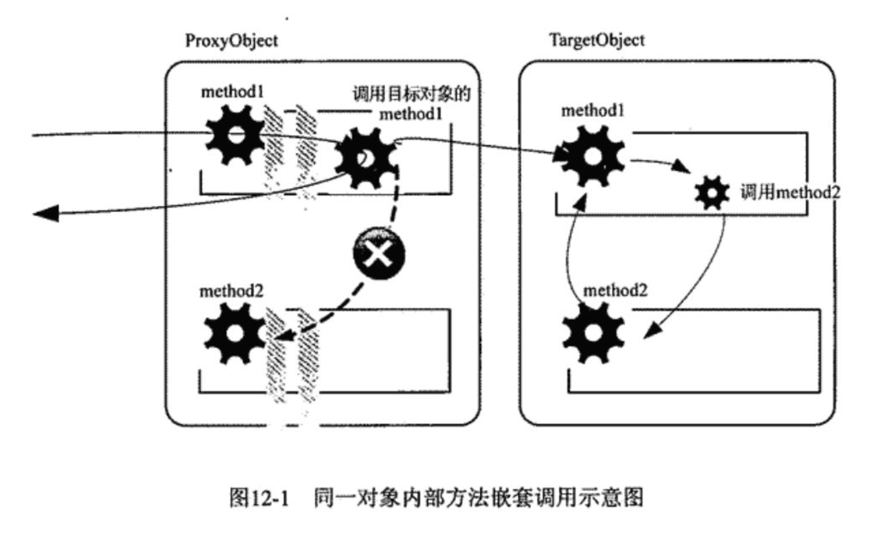

# Spring-AOP失效问题


## 1. 前言

有些时候我们会发现事务失效。其实事务也是基于AOP实现的，现在我们复现问题并解决。


## 2. AOP示例

原始的登录逻辑。逻辑很简单，当用户是admin时正常登录，如果非admin则非法登录。

```java
@Service
public class LoginService {

    public void login(String userName) {
        if (isAdmin(userName)) {
            System.out.println(userName + "正常登录");
            return;
        }
        System.out.println(userName + "非法登录");
    }

    protected boolean isAdmin(String userName) {
        return "admin".equalsIgnoreCase(userName);
    }
}
```

由于我们要在登录逻辑前后加入日志功能，所以我们需要编写一个环绕通知：

```java
@Aspect
@Component
public class LoginAspect {

    @Around(value = "execution(* com.example.demojava.aop2.LoginService.login(..))")
    public Object loginAspect(ProceedingJoinPoint joinPoint) throws Throwable {
        Object[] args = joinPoint.getArgs();
        String userName = (String) args[0];
        System.out.println("log:" + userName + "前置增强");
        Object proceed = joinPoint.proceed();
        System.out.println("log:" + userName + "后置增强");
        return proceed;
    }
}
```

接下来写个测试类看下效果

```java
@RunWith(SpringRunner.class)
@SpringBootTest
class LoginServiceTest {

    @Autowired
    LoginService loginService;

    @Test
    void loginAdmin() {
        loginService.login("admin");
    }

    @Test
    void loginTest() {
        loginService.login("test");
    }
}
```

结果输出如下

```
log:test前置增强
test非法登录
log:test后置增强
```


## 3. AOP失效情形

接下来假如我们又有了一个新需求，就是要对不合法用户做些特殊的处理，比如说统计下不合法用户调用登陆接口的次数。由于直接修改原有的登录逻辑有很多弊端，所以我们还是选择通过AOP来实现该功能。这可以通过编写一个返回增强来实现：

```java
    @AfterReturning(value = "execution(* com.example.demojava.aop2.LoginService.isAdmin(..))", returning = "result")
    public void isAdminAspect(JoinPoint joinPoint, Object result) {

        if (!(boolean)result) {
            Object[] args = joinPoint.getArgs();
            String userName = (String) args[0];
            System.out.println("非法用户" + userName + "增强逻辑");
        }
    }
```


接下来我们还是用上一节的测试类来测试一下，我们直接看结果：

```
log:test前置增强
test非法登录
log:test后置增强
```


## AOP为何会失效

之所以会出现上述AOP失效的现象，归根到底是由于AOP的实现机制导致的。Spring AOP采用代理的方式实现AOP，我们编写的横切逻辑被添加到动态生成的代理对象中，只要我们调用的是代理对象，则可以保证调用的是被增强的代理方法。而在代理对象中，不管你的横切逻辑是怎样的，也不管你增加了多少层的横切逻辑，有一点可以确定的是，你终归会调用目标对象的同一方法来调用原始的业务逻辑。

如果目标对象中的原始方法依赖于其他对象，那么Spring会注入所依赖对象的代理对象，从而保证依赖的对象的横切逻辑能够被正常织入。而一旦目标对象调用的是自身的其他方法时，问题就来了，这种情况下，目标对象调用的并不是代理对象的方法，故被调用的方法无法织入横切逻辑。



如上图所示，method1和method2方法是同个类中的方法，当外部通过代理对象调用method1时，最终会调用目标对象的method1方法，而在目标对象的method1方法中调用method2方法时，最终调用的是目标对象的method2方法，而不是代理对象的method2方法，故而针对method2的AOP增强失效了。


## 5. 如何避免AOP失效

### 方案一

要解决上述Spring AOP失效的问题，有两个方法，一个是将isAdmin方法跟login方法写在不同的类里，这样一来，当login方法调用isAdmin方法时，Spring会注入相应的代理对象，从而可以调用到isAdmin方法的代理逻辑。另一个方法是在调用isAdmin方法时先获取当前上下文的代理对象，再通过该代理对象调用被增强了的isAdmin方法，这样一来也能解决AOP失效的问题。实际上Spring AOP为我们提供了获取当前上下文代理对象的方法，使用起来非常方便，首先需要在AOP配置里暴露代理对象，在Spring Boot中可以通过注解@EnableAspectJAutoProxy(exposeProxy = true)进行配置：

```java
@EnableAspectJAutoProxy(exposeProxy = true)
@SpringBootApplication
public class DemoJavaApplication {

    public static void main(String[] args) {
        SpringApplication.run(DemoJavaApplication.class, args);
    }

}
```


然后修改login方法，通过AopContext获取当前上下文代理对象，再通过该代理对象调用isAdmin方法：

```java
@Service
public class LoginService {

    public void login(String userName) {
        LoginService currentProxy = (LoginService) AopContext.currentProxy();
        if (currentProxy.isAdmin(userName)) {
            System.out.println(userName + "正常登录");
            return;
        }
        System.out.println(userName + "非法登录");
    }

    protected boolean isAdmin(String userName) {
        return "admin".equalsIgnoreCase(userName);
    }
}

```

最后运行测试类看下效果

```
log:test前置增强
非法用户test增强逻辑
test非法登录
log:test后置增强
```

这样就解决了上述AOP失效的问题。

### 方案二

springboot通过实现ApplicationContext获取代理对象

```java
@Component
public class SpringContextUtil implements ApplicationContextAware {

    private static ApplicationContext applicationContext;

    @Override
    public void setApplicationContext(ApplicationContext applicationContext) throws BeansException {
        SpringContextUtil.applicationContext = applicationContext;
    }

    //获取applicationContext
    public static ApplicationContext getApplicationContext() {
        return applicationContext;
    }

    //通过name获取 Bean.
    public static Object getBean(String name) {
        return getApplicationContext().getBean(name);
    }

    //通过class获取Bean.
    public static <T> T getBean(Class<T> clazz) {
        return getApplicationContext().getBean(clazz);
    }

    //通过name,以及Clazz返回指定的Bean
    public static <T> T getBean(String name, Class<T> clazz) {
        return getApplicationContext().getBean(name, clazz);
    }

}
```

修改login方法

```java
@Service
public class LoginService {

    public void login(String userName) {
        LoginService loginService = SpringContextUtil.getBean(this.getClass());
        if (loginService.isAdmin(userName)) {
            System.out.println(userName + "正常登录");
            return;
        }
        System.out.println(userName + "非法登录");
    }

    protected boolean isAdmin(String userName) {
        return "admin".equalsIgnoreCase(userName);
    }
}
```

接下来我们再次测试以下

```
log:test前置增强
非法用户test增强逻辑
test非法登录
log:test后置增强
```

可以看到问题已经解决了。


## 6. 验证结果

以上我们猜想并解决了问题，下边来验证下对象的调用

```java
@Service
public class LoginService {

    public void login(String userName) {
        LoginService loginService = SpringContextUtil.getBean(this.getClass());

        System.out.println("当前对象为" + this.getClass().getName());
        System.out.println("代理对象为" + loginService.getClass().getName());

        if (loginService.isAdmin(userName)) {
            System.out.println(userName + "正常登录");
            return;
        }
        System.out.println(userName + "非法登录");
    }

    protected boolean isAdmin(String userName) {
        return "admin".equalsIgnoreCase(userName);
    }
}
```

结果输出

```
log:test前置增强
当前对象为com.example.demojava.aop2.LoginService
代理对象为com.example.demojava.aop2.LoginService$$EnhancerBySpringCGLIB$$97517af5
非法用户test增强逻辑
test非法登录
log:test后置增强
```

由日志可以看出失效调用时的this为target对象，而后边的调用为cglib生成的代理对象。