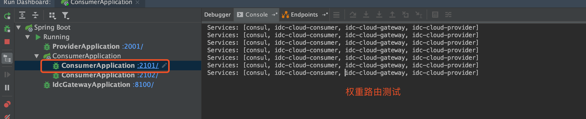

# SpringCloud-gateway权重路由

## 1. 什么是灰度发布


## 2. 实例测试

Application.yml

```yaml
server:
  port: 8100
spring:
  application:
    name: idc-cloud-gateway
  redis:
    host: localhost
    port: 6379
    timeout: 6000ms  # 连接超时时长（毫秒）
    jedis:
      pool:
        max-active: 1000  # 连接池最大连接数（使用负值表示没有限制）
        max-wait: -1ms      # 连接池最大阻塞等待时间（使用负值表示没有限制）
        max-idle: 10      # 连接池中的最大空闲连接
        min-idle: 5       # 连接池中的最小空闲连接
  cloud:
    consul:
      host: localhost
      port: 8500
    gateway:
      discovery:
        locator:
          enabled: true # gateway可以通过开启以下配置来打开根据服务的serviceId来匹配路由,默认是大写
      routes:
        - id: provider  # 路由 ID，保持唯一
          uri: lb://idc-cloud-provider # uri指目标服务地址，lb代表从注册中心获取服务
          predicates: # 路由条件。Predicate 接受一个输入参数，返回一个布尔值结果。该接口包含多种默认方法来将 Predicate 组合成其他复杂的逻辑（比如：与，或，非）
            - Path=/p/**
          filters:
            - StripPrefix=1 # 过滤器StripPrefix，作用是去掉请求路径的最前面n个部分截取掉。StripPrefix=1就代表截取路径的个数为1，比如前端过来请求/test/good/1/view，匹配成功后，路由到后端的请求路径就会变成http://localhost:8888/good/1/view

        - id: c1
          uri: http://localhost:2101  # 实例1
          predicates:
            - Path=/c/**
            - Weight=g1, 70 # 权重断言（第一个参数为group（组），第二个参数为weight（权重））（该路由权重为70%）
          filters:
            - StripPrefix=1

        - id: c2
          uri: http://localhost:2102  # 实例2
          predicates:
            - Path=/c/**
            - Weight=g1, 30
          filters:
            - StripPrefix=1


```

这里我们把consumer启动2个实例，端口分别为2101和2102。

访问: http://localhost:8100/c/consumer

通过日志观察，2101实例获得了70%的流量，2102实例获得了30%的流量，结果如下

