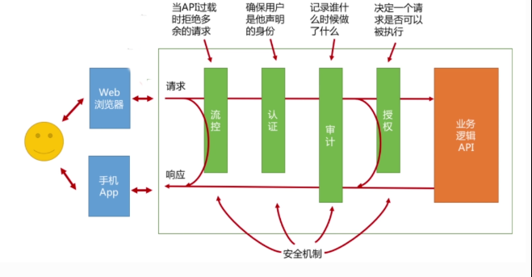

# SpringCloud-Gateway简介

网关应当具备以下功能：

- 性能：API高可用，负载均衡，容错机制。
- 安全：权限身份认证、脱敏，流量清洗，后端签名（保证全链路可信调用）,黑名单（非法调用的限制）。
- 日志：日志记录（spainid,traceid）一旦涉及分布式，全链路跟踪必不可少。
- 缓存：数据缓存。
- 监控：记录请求响应数据，api耗时分析，性能监控。
- 限流：流量控制，错峰流控，可以定义多种限流规则。
- 灰度：线上灰度部署，可以减小风险。
- 路由：动态路由规则。

