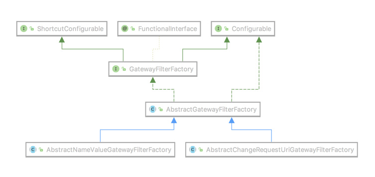

# SpringCloud-Gateway过滤器


## 自定义过滤器


现在假设我们要统计某个服务的响应时间，我们可以在代码中

```java
long beginTime = System.currentTimeMillis();
// do something...
long elapsed = System.currentTimeMillis() - beginTime;
log.info("elapsed: {}ms", elapsed);
```

每次都要这么写是不是很烦？Spring 告诉我们有个东西叫 AOP。但是我们是微服务啊，在每个服务里都写也很烦。这时候就该网关的过滤器登台表演了。

自定义过滤器需要实现 `GatewayFilter` 和 `Ordered`。其中 `GatewayFilter` 中的这个方法就是用来实现你的自定义的逻辑的

```
Mono<Void> filter(ServerWebExchange exchange, GatewayFilterChain chain);
```

而 `Ordered` 中的 `int getOrder()` 方法是来给过滤器设定优先级别的，值越大则优先级越低。


好了，让我们来撸代码吧

```java
/**
 * 此过滤器功能为计算请求完成时间
 */
public class ElapsedFilter implements GatewayFilter, Ordered {

    private static final String ELAPSED_TIME_BEGIN = "elapsedTimeBegin";

    @Override
    public Mono<Void> filter(ServerWebExchange exchange, GatewayFilterChain chain) {
        exchange.getAttributes().put(ELAPSED_TIME_BEGIN, System.currentTimeMillis());
        return chain.filter(exchange).then(
                Mono.fromRunnable(() -> {
                    Long startTime = exchange.getAttribute(ELAPSED_TIME_BEGIN);
                    if (startTime != null) {
                        System.out.println(exchange.getRequest().getURI().getRawPath() + ": " + (System.currentTimeMillis() - startTime) + "ms");
                    }
                })
        );
    }

    /*
     *过滤器存在优先级，order越大，优先级越低
     */
    @Override
    public int getOrder() {
        return Ordered.LOWEST_PRECEDENCE;
    }
}
```


我们在请求刚刚到达时，往 `ServerWebExchange` 中放入了一个属性 `elapsedTimeBegin`，属性值为当时的毫秒级时间戳。然后在请求执行结束后，又从中取出我们之前放进去的那个时间戳，与当前时间的差值即为该请求的耗时。因为这是与业务无关的日志所以将 `Ordered` 设为 `Integer.MAX_VALUE` 以降低优先级。

现在再来看我们之前的问题：怎么来区分是 “pre” 还是 “post” 呢？其实就是 `chain.filter(exchange)` 之前的就是 “pre” 部分，之后的也就是 `then` 里边的是 “post” 部分。

创建好 Filter 之后我们将它添加到我们的 Filter Chain 里边

```java
@Configuration
public class FilterConfig {


    /**
     * http://localhost:8100/filter/provider
     * @param builder
     * @return
     */
    @Bean
    public RouteLocator customerRouteLocator(RouteLocatorBuilder builder) {
        // @formatter:off
      	// 可以对比application.yml中关于路由转发的配置
        return builder.routes()
                .route(r -> r.path("/filter/**")
                        .filters(f -> f.stripPrefix(1)
                                .filter(new ElapsedFilter()))
                        .uri("lb://idc-cloud-provider")
                        .order(0)
                        .id("filter")
                )
                .build();
        // @formatter:on
    }

}
```


```yaml
server:
  port: 8100
spring:
  application:
    name: idc-cloud-gateway
  redis:
    host: localhost
    port: 6379
    timeout: 6000ms  # 连接超时时长（毫秒）
    jedis:
      pool:
        max-active: 1000  # 连接池最大连接数（使用负值表示没有限制）
        max-wait: -1ms      # 连接池最大阻塞等待时间（使用负值表示没有限制）
        max-idle: 10      # 连接池中的最大空闲连接
        min-idle: 5       # 连接池中的最小空闲连接
  cloud:
    consul:
      host: localhost
      port: 8500
    gateway:
      discovery:
        locator:
          enabled: true # gateway可以通过开启以下配置来打开根据服务的serviceId来匹配路由,默认是大写
      routes:
        - id: provider  # 路由 ID，保持唯一
          uri: lb://idc-cloud-provider # uri指目标服务地址，lb代表从注册中心获取服务
          predicates: # 路由条件。Predicate 接受一个输入参数，返回一个布尔值结果。该接口包含多种默认方法来将 Predicate 组合成其他复杂的逻辑（比如：与，或，非）
            - Path=/p/**
          filters:
            - StripPrefix=1 # 过滤器StripPrefix，作用是去掉请求路径的最前面n个部分截取掉。StripPrefix=1就代表截取路径的个数为1，比如前端过来请求/test/good/1/view，匹配成功后，路由到后端的请求路径就会变成http://localhost:8888/good/1/view

```


测试(网关模块port=8100，idc-cloud-provider模块port=2001)

```
➜  ~ curl http://localhost:8100/filter/provider
Services: [consul, idc-cloud-gateway, idc-cloud-provider]

输出
/provider: 1ms
```


## 自定义全局过滤器

前边讲了自定义的过滤器，那个过滤器只是局部的，如果我们有多个路由就需要一个一个来配置，**并不能**通过像下面这样来实现全局有效（也未在 Fluent Java API 中找到能设置 defaultFilters 的方法）

```
@Bean
public ElapsedFilter elapsedFilter(){
    return new ElapsedFilter();
}
```

这在我们要全局统一处理某些业务的时候就显得比较麻烦，比如像最开始我们说的要做身份校验，有没有简单的方法呢？这时候就该全局过滤器出场了。

有了前边的基础，我们创建全局过滤器就简单多了。只需要把实现的接口 `GatewayFilter` 换成 `GlobalFilter`，就完事大吉了。比如下面的 Demo 就是从请求参数中获取 `token` 字段，如果能获取到就 pass，获取不到就直接返回 `401` 错误，虽然简单，但足以说明问题了。

```java
public class TokenFilter implements GlobalFilter, Ordered {


    public Mono<Void> filter(ServerWebExchange exchange, GatewayFilterChain chain) {
        String token = exchange.getRequest().getQueryParams().getFirst("token");
        if (token == null || token.isEmpty()) {
            exchange.getResponse().setStatusCode(HttpStatus.UNAUTHORIZED);
            return exchange.getResponse().setComplete();
        }
        return chain.filter(exchange);
    }


    public int getOrder() {
        return -100;
    }
}
```


```java
    @Bean
    public TokenFilter tokenFilter(){
        return new TokenFilter();
    }
```


访问 http://localhost:8100/p/provider?token=1正常返回，当不加参数时401


## 自定义过滤器工厂

如果你还对上一篇关于路由的文章有印象，你应该还得我们在配置中有这么一段

```
filters:
  - StripPrefix=1
  - AddResponseHeader=X-Response-Default-Foo, Default-Bar
```

`StripPrefix`、`AddResponseHeader` 这两个实际上是两个过滤器工厂（GatewayFilterFactory），用这种配置的方式更灵活方便。

我们就将之前的那个 `ElapsedFilter` 改造一下，让它能接收一个 `boolean` 类型的参数，来决定是否将请求参数也打印出来。

```java
public class ElapsedGatewayFilterFactory extends AbstractGatewayFilterFactory<ElapsedGatewayFilterFactory.Config> {

    private static final Log log = LogFactory.getLog(GatewayFilter.class);
    private static final String ELAPSED_TIME_BEGIN = "elapsedTimeBegin";
    private static final String KEY = "withParams";


    public List<String> shortcutFieldOrder() {
        return Arrays.asList(KEY);
    }

    public ElapsedGatewayFilterFactory() {
        super(Config.class);
    }


    public GatewayFilter apply(Config config) {
        return (exchange, chain) -> {
            exchange.getAttributes().put(ELAPSED_TIME_BEGIN, System.currentTimeMillis());
            return chain.filter(exchange).then(
                    Mono.fromRunnable(() -> {
                        Long startTime = exchange.getAttribute(ELAPSED_TIME_BEGIN);
                        if (startTime != null) {
                            StringBuilder sb = new StringBuilder(exchange.getRequest().getURI().getRawPath())
                                    .append(": ")
                                    .append(System.currentTimeMillis() - startTime)
                                    .append("ms");
                            if (config.isWithParams()) {
                                sb.append(" params:").append(exchange.getRequest().getQueryParams());
                            }
                            log.info(sb.toString());
                        }
                    })
            );
        };
    }


    public static class Config {

        private boolean withParams;

        public boolean isWithParams() {
            return withParams;
        }

        public void setWithParams(boolean withParams) {
            this.withParams = withParams;
        }

    }
}
```

过滤器工厂的顶级接口是 `GatewayFilterFactory`，我们可以直接继承它的两个抽象类来简化开发 `AbstractGatewayFilterFactory` 和 `AbstractNameValueGatewayFilterFactory`，这两个抽象类的区别就是前者接收一个参数（像 `StripPrefix` 和我们创建的这种），后者接收两个参数（像 `AddResponseHeader`）。




`GatewayFilter apply(Config config)` 方法内部实际上是创建了一个 `GatewayFilter` 的匿名类，具体实现和之前的几乎一样，就不解释了。

静态内部类 `Config` 就是为了接收那个 `boolean` 类型的参数服务的，里边的变量名可以随意写，但是要重写 `List shortcutFieldOrder()` 这个方法。

这里注意一下，一定要调用一下父类的构造器把 `Config` 类型传过去，否则会报 `ClassCastException`

```
public ElapsedGatewayFilterFactory() {
    super(Config.class);
}
```

工厂类我们有了，再把它注册到 Spring 当中

```
@Bean
public ElapsedGatewayFilterFactory elapsedGatewayFilterFactory() {
    return new ElapsedGatewayFilterFactory();
}
```

然后添加配置（主要改动在 `default-filters` 配置）

```yaml
server:
  port: 8100
spring:
  application:
    name: idc-cloud-gateway
  redis:
    host: localhost
    port: 6379
    timeout: 6000ms  # 连接超时时长（毫秒）
    jedis:
      pool:
        max-active: 1000  # 连接池最大连接数（使用负值表示没有限制）
        max-wait: -1ms      # 连接池最大阻塞等待时间（使用负值表示没有限制）
        max-idle: 10      # 连接池中的最大空闲连接
        min-idle: 5       # 连接池中的最小空闲连接
  cloud:
    consul:
      host: localhost
      port: 8500
    gateway:
      discovery:
        locator:
          enabled: true # gateway可以通过开启以下配置来打开根据服务的serviceId来匹配路由,默认是大写
      default-filters:
        - Elapsed=true
      routes:
        - id: provider  # 路由 ID，保持唯一
          uri: lb://idc-cloud-provider # uri指目标服务地址，lb代表从注册中心获取服务
          predicates: # 路由条件。Predicate 接受一个输入参数，返回一个布尔值结果。该接口包含多种默认方法来将 Predicate 组合成其他复杂的逻辑（比如：与，或，非）
            - Path=/p/**
          filters:
            - StripPrefix=1 # 过滤器StripPrefix，作用是去掉请求路径的最前面n个部分截取掉。StripPrefix=1就代表截取路径的个数为1，比如前端过来请求/test/good/1/view，匹配成功后，路由到后端的请求路径就会变成http://localhost:8888/good/1/view


```

然后我们再次访问 http://localhost:8100/p/provider?token=1

输出

```
2020-02-23 23:47:06.176  INFO 6714 --- [ctor-http-nio-2] o.s.cloud.gateway.filter.GatewayFilter   : /p/provider: 8ms params:{token=[1]}
```

