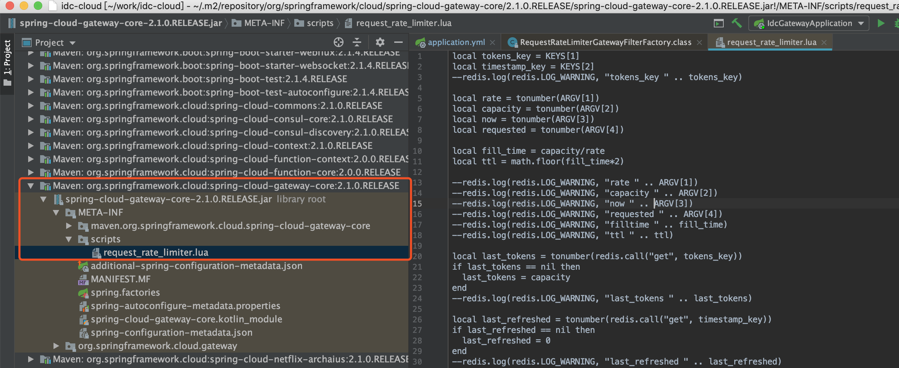
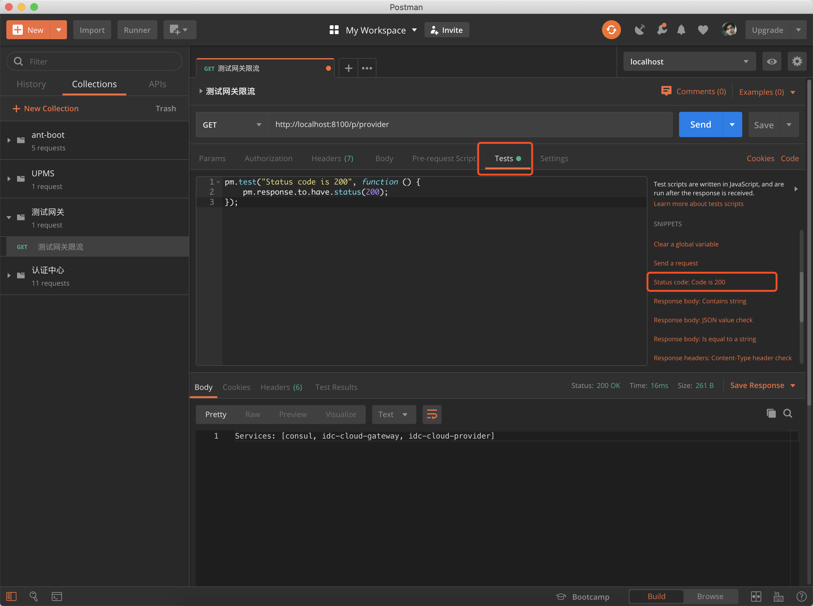
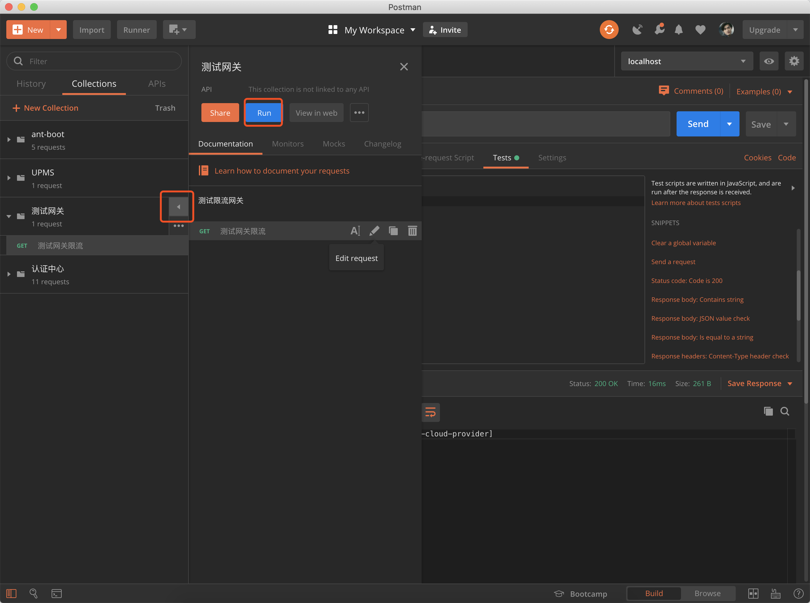
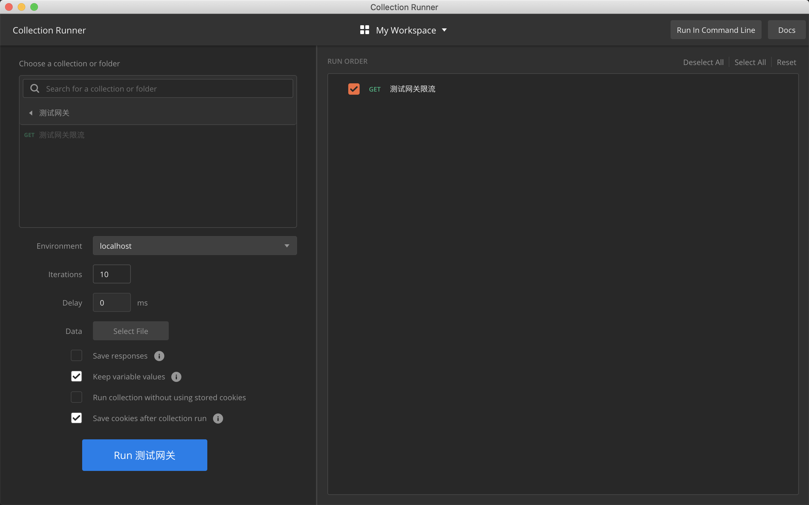
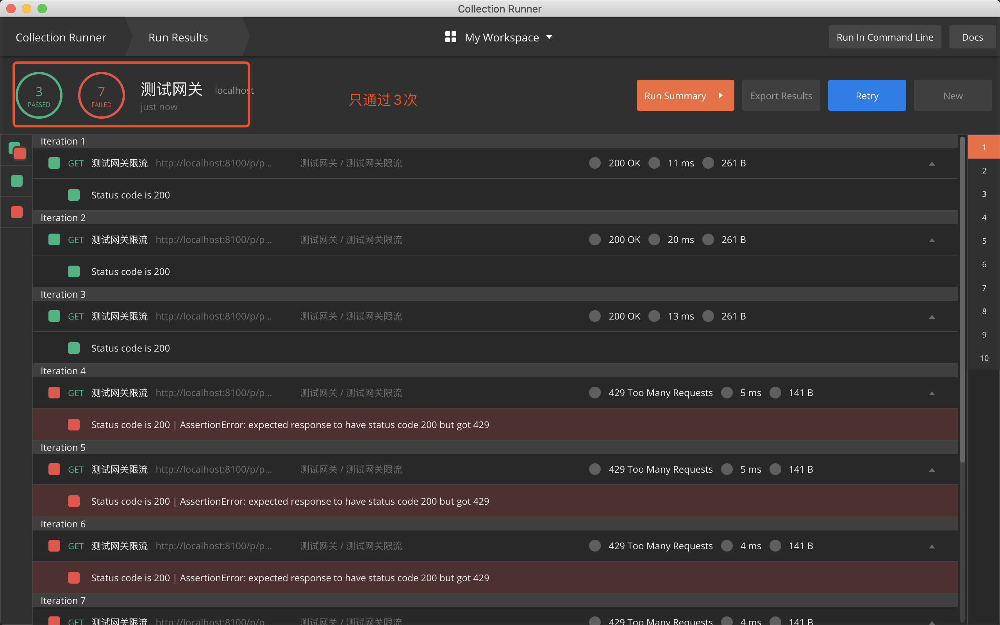

# SpringCloud-Gateway限流

## 1. 简介

限流：网关上有大量请求，对指定服务进行限流，可以很大程度上提高服务的可用性与稳定性，限流的目的是通过对并发访问/请求进行限速，或对一个时间窗口内的请求进行限速来保护系统。一旦达到限制速率则可以拒绝服务、排队或等待、降级。

在Spring Cloud Gateway中，有Filter过滤器，因此可以在“pre”类型的Filter中自行实现上述三种过滤器。但是限流作为网关最基本的功能，Spring Cloud Gateway官方就提供了RequestRateLimiterGatewayFilterFactory这个类，适用在Redis内的通过执行Lua脚本实现了令牌桶的方式。具体实现逻辑在RequestRateLimiterGatewayFilterFactory类中，lua脚本在如下图所示的文件夹中：




## 2. 测试环境

Pom.xml

```xml
				<dependency>
            <groupId>org.springframework.boot</groupId>
            <artifactId>spring-boot-starter-webflux</artifactId>
        </dependency>
        <dependency>
            <groupId>org.springframework.cloud</groupId>
            <artifactId>spring-cloud-starter-gateway</artifactId>
        </dependency>
        <!--consul客户端-->
        <dependency>
            <groupId>org.springframework.cloud</groupId>
            <artifactId>spring-cloud-starter-consul-discovery</artifactId>
        </dependency>
        <!--健康监控-->
        <dependency>
            <groupId>org.springframework.boot</groupId>
            <artifactId>spring-boot-starter-actuator</artifactId>
            <scope>compile</scope>
        </dependency>

        <!--<dependency>-->
            <!--<groupId>org.springframework.boot</groupId>-->
            <!--<artifactId>spring-boot-starter-data-redis</artifactId>-->
        <!--</dependency>-->
        <dependency>
            <groupId>org.springframework.boot</groupId>
            <artifactId>spring-boot-starter-data-redis-reactive</artifactId>
        </dependency>
        <dependency>
            <groupId>com.alibaba</groupId>
            <artifactId>fastjson</artifactId>
            <version>1.2.51</version>
        </dependency>
```

Application.yml

```yaml
server:
  port: 8100
spring:
  application:
    name: idc-cloud-gateway
  redis:
    host: localhost
    port: 6379
    timeout: 6000ms  # 连接超时时长（毫秒）
    jedis:
      pool:
        max-active: 1000  # 连接池最大连接数（使用负值表示没有限制）
        max-wait: -1ms      # 连接池最大阻塞等待时间（使用负值表示没有限制）
        max-idle: 10      # 连接池中的最大空闲连接
        min-idle: 5       # 连接池中的最小空闲连接
  cloud:
    consul:
      host: localhost
      port: 8500
    gateway:
      discovery:
        locator:
          enabled: true # gateway可以通过开启以下配置来打开根据服务的serviceId来匹配路由,默认是大写
      routes:
        - id: provider  # 路由 ID，保持唯一
          uri: lb://idc-cloud-provider # uri指目标服务地址，lb代表从注册中心获取服务
          predicates: # 路由条件。Predicate 接受一个输入参数，返回一个布尔值结果。该接口包含多种默认方法来将 Predicate 组合成其他复杂的逻辑（比如：与，或，非）
            - Path=/p/**
          filters:
            - StripPrefix=1 # 过滤器StripPrefix，作用是去掉请求路径的最前面n个部分截取掉。StripPrefix=1就代表截取路径的个数为1，比如前端过来请求/test/good/1/view，匹配成功后，路由到后端的请求路径就会变成http://localhost:8888/good/1/view
        - id: consumer
          uri: lb://idc-cloud-consumer
          predicates:
            - Path=/c/**
          filters:
            - StripPrefix=1
            - name: RequestRateLimiter
              args:
                key-resolver: '#{@ipKeyResolver}'
                redis-rate-limiter.replenishRate: 1
                redis-rate-limiter.burstCapacity: 3

# hystrix 信号量隔离，1.5秒后自动超时
hystrix:command.fallbackCmdA.execution.isolation.thread.timeoutInMilliseconds: 1500


```

在上面的配置文件，指定程序的端口为8100，配置了 redis的信息，并配置了RequestRateLimiter的限流过滤器，该过滤器需要配置三个参数：

- burstCapacity，令牌桶总容量。
- replenishRate，令牌桶每秒填充平均速率。
- key-resolver，用于限流的键的解析器的 Bean 对象的名字。它使用 SpEL 表达式根据#{@beanName}从 Spring 容器中获取 Bean 对象。

这里根据用户ID限流，请求路径中必须携带userId参数

```java
@Bean
KeyResolver userKeyResolver() {
  return exchange -> Mono.just(exchange.getRequest().getQueryParams().getFirst("user"));
}
```

KeyResolver需要实现resolve方法，比如根据userid进行限流，则需要用userid去判断。实现完KeyResolver之后，需要将这个类的Bean注册到Ioc容器中。

如果需要根据IP限流，定义的获取限流Key的bean为：

```java
@Primary
@Bean
KeyResolver ipKeyResolver() {
  return exchange -> Mono.just(exchange.getRequest().getRemoteAddress().getHostName());
}
```

通过exchange对象可以获取到请求信息，这边用了HostName，如果你想根据用户来做限流的话这边可以获取当前请求的用户ID或者用户名就可以了，比如：

如果需要根据接口的URI进行限流，则需要获取请求地址的uri作为限流key，定义的Bean对象为：

```java
@Bean
KeyResolver apiKeyResolver() {
  return exchange -> Mono.just(exchange.getRequest().getPath().value());
}
```

**使用Postman测试**













## 3. 基于系统负载的动态限流

在实际工作中，我们可能还需要根据网络连接数、网络流量、CPU 或内存负载等来进行动态限流。在这里我们以 CPU 为栗子。

我们需要借助 Spring Boot Actuator 提供的 Metrics 能力进行实现基于 CPU 的限流 —— 当 CPU 使用率高于某个阈值就开启限流，否则不开启限流。

我们在项目中引入 Actuator 的依赖坐标

```
<dependency>
    <groupId>org.springframework.boot</groupId>
    <artifactId>spring-boot-starter-actuator</artifactId>
</dependency>
```


然后基于过滤器和metrics指标判断是否需要限流。