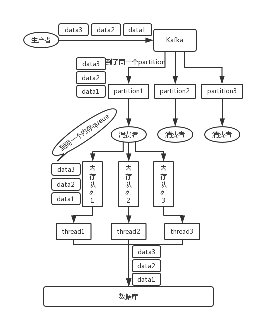
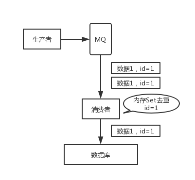

# Springboot集成kafka

## 测试案例

**pom依赖**

```
        <dependency>
            <groupId>org.springframework.kafka</groupId>
            <artifactId>spring-kafka</artifactId>
            <version>2.4.0.RELEASE</version>
        </dependency>
```

**KafkaTopicConfig**

```java
package com.idcmind.ants.config;

import com.idcmind.ants.constant.Constant;
import org.apache.kafka.clients.admin.AdminClientConfig;
import org.apache.kafka.clients.admin.NewTopic;
import org.springframework.context.annotation.Bean;
import org.springframework.context.annotation.Configuration;
import org.springframework.kafka.core.KafkaAdmin;

import java.util.HashMap;
import java.util.Map;

/**
 * @author ：当我遇上你
 * @email ：idea360@foxmail.com
 * @date ：2020-01-14 10:17
 * @modified ：
 * @version: ：
 * @description：
 */
@Configuration
public class KafkaTopicConfig {

    /**
     * 定义一个KafkaAdmin的bean，可以自动检测集群中是否存在topic，不存在则创建
     */
    @Bean
    public KafkaAdmin kafkaAdmin() {
        Map<String, Object> configs = new HashMap<>();
        // 指定多个kafka集群多个地址，例如：192.168.2.11,9092,192.168.2.12:9092,192.168.2.13:9092
        configs.put(AdminClientConfig.BOOTSTRAP_SERVERS_CONFIG,"192.168.124.5:9093,192.168.124.5:9094,192.168.124.5:9095");
        return new KafkaAdmin(configs);
    }

    /**
     * 创建 Topic
     */
    @Bean
    public NewTopic topicinfo() {
        // 创建topic，需要指定创建的topic的"名称"、"分区数"、"副本数量(副本数数目设置要小于Broker数量)"
        return new NewTopic(Constant.TOPIC, 3, (short) 2);
    }

}

```

**KafkaProducerConfig**

```java
package com.idcmind.ants.config;

import org.apache.kafka.clients.producer.ProducerConfig;
import org.apache.kafka.common.serialization.StringSerializer;
import org.springframework.context.annotation.Bean;
import org.springframework.context.annotation.Configuration;
import org.springframework.kafka.core.DefaultKafkaProducerFactory;
import org.springframework.kafka.core.KafkaTemplate;
import org.springframework.kafka.core.ProducerFactory;

import java.util.HashMap;
import java.util.Map;

/**
 * @author ：当我遇上你
 * @email ：idea360@foxmail.com
 * @date ：2020-01-14 10:10
 * @modified ：
 * @version: ：
 * @description：
 */
@Configuration
public class KafkaProducerConfig {

    /**
     * producer配置
     * @return
     */
    public Map<String, Object> producerConfigs() {
        Map<String, Object> props = new HashMap<>();
        // 指定多个kafka集群多个地址 127.0.0.1:9092,127.0.0.1:9093,127.0.0.1:9094
        props.put(ProducerConfig.BOOTSTRAP_SERVERS_CONFIG,"192.168.124.5:9093,192.168.124.5:9094,192.168.124.5:9095");
        // 重试次数，0为不启用重试机制
        props.put(ProducerConfig.RETRIES_CONFIG, Integer.MAX_VALUE);
        // acks=0 把消息发送到kafka就认为发送成功
        // acks=1 把消息发送到kafka leader分区，并且写入磁盘就认为发送成功
        // acks=all 把消息发送到kafka leader分区，并且leader分区的副本follower对消息进行了同步就任务发送成功
        props.put(ProducerConfig.ACKS_CONFIG,"all");
        // 生产者空间不足时，send()被阻塞的时间，默认60s
        props.put(ProducerConfig.MAX_BLOCK_MS_CONFIG, 6000);
        // 控制批处理大小，单位为字节
        props.put(ProducerConfig.BATCH_SIZE_CONFIG, 4096);
        // 批量发送，延迟为1毫秒，启用该功能能有效减少生产者发送消息次数，从而提高并发量
        props.put(ProducerConfig.LINGER_MS_CONFIG, 1);
        // 生产者可以使用的总内存字节来缓冲等待发送到服务器的记录
        props.put(ProducerConfig.BUFFER_MEMORY_CONFIG, 40960);
        // 消息的最大大小限制,也就是说send的消息大小不能超过这个限制, 默认1048576(1MB)
        props.put(ProducerConfig.MAX_REQUEST_SIZE_CONFIG,1048576);
        // 客户端id
        props.put(ProducerConfig.CLIENT_ID_CONFIG,"producer.client.id.topinfo");
        // 键的序列化方式
        props.put(ProducerConfig.KEY_SERIALIZER_CLASS_CONFIG, StringSerializer.class);
        // 值的序列化方式
        props.put(ProducerConfig.VALUE_SERIALIZER_CLASS_CONFIG, StringSerializer.class);
        // 压缩消息，支持四种类型，分别为：none、lz4、gzip、snappy，默认为none。
        // 消费者默认支持解压，所以压缩设置在生产者，消费者无需设置。
        props.put(ProducerConfig.COMPRESSION_TYPE_CONFIG,"none");
        return props;
    }

    /**
     * producer工厂配置
     * @return
     */
    public ProducerFactory<String, String> producerFactory() {
        return new DefaultKafkaProducerFactory<>(producerConfigs());
    }

    /**
     * Producer Template 配置
     */
    @Bean(name="kafkaTemplate")
    public KafkaTemplate<String, String> kafkaTemplate() {
        return new KafkaTemplate<>(producerFactory());
    }
}

```

**KafkaConsumerConfig**

```java
package com.idcmind.ants.config;

import org.apache.kafka.clients.consumer.ConsumerConfig;
import org.apache.kafka.common.serialization.StringDeserializer;
import org.springframework.context.annotation.Bean;
import org.springframework.context.annotation.Configuration;
import org.springframework.kafka.config.ConcurrentKafkaListenerContainerFactory;
import org.springframework.kafka.config.KafkaListenerContainerFactory;
import org.springframework.kafka.core.ConsumerFactory;
import org.springframework.kafka.core.DefaultKafkaConsumerFactory;
import org.springframework.kafka.listener.ConcurrentMessageListenerContainer;
import org.springframework.kafka.listener.ContainerProperties;

import java.util.HashMap;
import java.util.Map;

/**
 * @author ：当我遇上你
 * @email ：idea360@foxmail.com
 * @date ：2020-01-14 10:18
 * @modified ：
 * @version: ：
 * @description：
 */
@Configuration
public class KafkaConsumerConfig {


    private static final String GROUP0_ID = "group0";
    private static final String GROUP1_ID = "group1";

    /**
     * 1. setAckMode: 消费者手动提交ack
     *
     * RECORD： 每处理完一条记录后提交。
     * BATCH(默认)： 每次poll一批数据后提交一次，频率取决于每次poll的调用频率。
     * TIME： 每次间隔ackTime的时间提交。
     * COUNT： 处理完poll的一批数据后并且距离上次提交处理的记录数超过了设置的ackCount就提交。
     * COUNT_TIME： TIME和COUNT中任意一条满足即提交。
     * MANUAL： 手动调用Acknowledgment.acknowledge()后，并且处理完poll的这批数据后提交。
     * MANUAL_IMMEDIATE： 手动调用Acknowledgment.acknowledge()后立即提交。
     *
     * 2. factory.setConcurrency(3);
     * 此处设置的目的在于：假设 topic test 下有 0、1、2三个 partition，Spring Boot中只有一个 @KafkaListener() 消费者订阅此 topic，此处设置并发为3，
     * 启动后 会有三个不同的消费者分别订阅 p0、p1、p2，本地实际有三个消费者线程。
     * 而 factory.setConcurrency(1); 的话 本地只有一个消费者线程， p0、p1、p2被同一个消费者订阅。
     * 由于 一个partition只能被同一个消费者组下的一个消费者订阅，对于只有一个 partition的topic，即使设置 并发为3，也只会有一个消费者，多余的消费者没有 partition可以订阅。
     *
     * 3. factory.setBatchListener(true);
     * 设置批量消费 ，每个批次数量在Kafka配置参数ConsumerConfig.MAX_POLL_RECORDS_CONFIG中配置，
     * 限制的是 一次批量接收的最大条数，而不是 等到达到最大条数才接收，这点容易被误解。
     * 实际测试时，接收是实时的，当生产者大量写入时，一次批量接收的消息数量为 配置的最大条数。
     */
    @Bean
    KafkaListenerContainerFactory<ConcurrentMessageListenerContainer<Integer, String>> kafkaListenerContainerFactory() {
        ConcurrentKafkaListenerContainerFactory<Integer, String>
                factory = new ConcurrentKafkaListenerContainerFactory<>();
        // 设置消费者工厂
        factory.setConsumerFactory(consumerFactory());
        // 设置为批量消费，每个批次数量在Kafka配置参数中设置ConsumerConfig.MAX_POLL_RECORDS_CONFIG
        factory.setBatchListener(true);
        // 消费者组中线程数量,消费者数量<=partition数量，即使配置的消费者数量大于partition数量，多余消费者无法消费到数据。
        factory.setConcurrency(3);
        // 拉取超时时间
        factory.getContainerProperties().setPollTimeout(3000);
        // 手动提交
        factory.getContainerProperties().setAckMode(ContainerProperties.AckMode.MANUAL_IMMEDIATE);
        return factory;
    }

    @Bean
    public ConsumerFactory<Integer, String> consumerFactory() {
        Map<String, Object> map = consumerConfigs();
        map.put(ConsumerConfig.GROUP_ID_CONFIG, GROUP0_ID);
        return new DefaultKafkaConsumerFactory<>(consumerConfigs());
    }

//    @Bean
//    KafkaListenerContainerFactory<ConcurrentMessageListenerContainer<Integer, String>> kafkaListenerContainerFactory1() {
//        ConcurrentKafkaListenerContainerFactory<Integer, String>
//                factory = new ConcurrentKafkaListenerContainerFactory<>();
//        // 设置消费者工厂
//        factory.setConsumerFactory(consumerFactory1());
//        // 设置为批量消费，每个批次数量在Kafka配置参数中设置ConsumerConfig.MAX_POLL_RECORDS_CONFIG
//        factory.setBatchListener(true);
//        // 消费者组中线程数量,消费者数量<=partition数量，即使配置的消费者数量大于partition数量，多余消费者无法消费到数据。
//        factory.setConcurrency(3);
//        // 拉取超时时间
//        factory.getContainerProperties().setPollTimeout(3000);
//        // 手动提交
//        factory.getContainerProperties().setAckMode(ContainerProperties.AckMode.MANUAL_IMMEDIATE);
//        return factory;
//    }
//
//    public ConsumerFactory<Integer, String> consumerFactory1() {
//        Map<String, Object> map = consumerConfigs();
//        map.put(ConsumerConfig.GROUP_ID_CONFIG, GROUP1_ID);
//        return new DefaultKafkaConsumerFactory<>(consumerConfigs());
//    }

    @Bean
    public Map<String, Object> consumerConfigs() {
        Map<String, Object> props = new HashMap<>();
        // Kafka地址
        props.put(ConsumerConfig.BOOTSTRAP_SERVERS_CONFIG, "192.168.124.5:9093,192.168.124.5:9094,192.168.124.5:9095");
        // 是否自动提交offset偏移量(默认true)
        props.put(ConsumerConfig.ENABLE_AUTO_COMMIT_CONFIG, false);
        // 批量消费
        props.put(ConsumerConfig.MAX_POLL_RECORDS_CONFIG, "100");
        // 消费者组
        props.put(ConsumerConfig.GROUP_ID_CONFIG, "group-default");
        // 自动提交的频率(ms)
//        propsMap.put(ConsumerConfig.AUTO_COMMIT_INTERVAL_MS_CONFIG, "100");
        // Session超时设置
        props.put(ConsumerConfig.SESSION_TIMEOUT_MS_CONFIG, "15000");
        // 键的反序列化方式
        props.put(ConsumerConfig.KEY_DESERIALIZER_CLASS_CONFIG, StringDeserializer.class);
        // 值的反序列化方式
        props.put(ConsumerConfig.VALUE_DESERIALIZER_CLASS_CONFIG, StringDeserializer.class);
        // offset偏移量规则设置：
        // (1)、earliest：当各分区下有已提交的offset时，从提交的offset开始消费；无提交的offset时，从头开始消费
        // (2)、latest：当各分区下有已提交的offset时，从提交的offset开始消费；无提交的offset时，消费新产生的该分区下的数据
        // (3)、none：topic各分区都存在已提交的offset时，从offset后开始消费；只要有一个分区不存在已提交的offset，则抛出异常
        props.put(ConsumerConfig.AUTO_OFFSET_RESET_CONFIG, "latest");
        return props;
    }

}

```

**KafkaProducerService**

```java
package com.idcmind.ants.producer;

import org.apache.kafka.clients.producer.ProducerRecord;
import org.springframework.beans.factory.annotation.Autowired;
import org.springframework.kafka.core.KafkaTemplate;
import org.springframework.kafka.support.KafkaHeaders;
import org.springframework.kafka.support.SendResult;
import org.springframework.messaging.Message;
import org.springframework.messaging.support.MessageBuilder;
import org.springframework.stereotype.Service;
import org.springframework.util.concurrent.ListenableFuture;
import org.springframework.util.concurrent.ListenableFutureCallback;

import java.util.concurrent.ExecutionException;
import java.util.concurrent.TimeUnit;
import java.util.concurrent.TimeoutException;

/**
 * @author ：当我遇上你
 * @email ：idea360@foxmail.com
 * @date ：2020-01-14 10:27
 * @modified ：
 * @version: ：
 * @description：
 */
@Service
public class KafkaProducerService {

    @Autowired
    private KafkaTemplate kafkaTemplate;

    /**
     * producer 同步方式发送数据
     * @param topic    topic名称
     * @param key      一般用业务id，相同业务在同一partition保证消费顺序
     * @param message  producer发送的数据
     */
    public void sendMessageSync(String topic, String key, String message) throws InterruptedException, ExecutionException, TimeoutException {
        // 默认轮询partition
        kafkaTemplate.send(topic, message).get(10, TimeUnit.SECONDS);
        // 根据key进行hash运算，再将运算结果写入到不同partition
        kafkaTemplate.send(topic, key, message).get(10, TimeUnit.SECONDS);
        // 第二个参数为partition,当partition和key同时设置时partition优先。
        kafkaTemplate.send(topic, 0, key, message);
        // 组装消息
        Message msg = MessageBuilder.withPayload("Send Message(payload,headers) Test")
                .setHeader(KafkaHeaders.MESSAGE_KEY, key)
                .setHeader(KafkaHeaders.TOPIC, topic)
                .setHeader(KafkaHeaders.PREFIX,"kafka_")
                .build();
        kafkaTemplate.send(msg).get(10, TimeUnit.SECONDS);
        // 组装消息
        ProducerRecord<String, String> producerRecord = new ProducerRecord<>("test", "Send ProducerRecord(topic,value) Test");
        kafkaTemplate.send(producerRecord).get(10, TimeUnit.SECONDS);
    }

    /**
     * producer 异步方式发送数据
     * @param topic    topic名称
     * @param message  producer发送的数据
     */
    public void sendMessageAsync(String topic, String message) {
        ListenableFuture<SendResult<Integer, String>> future = kafkaTemplate.send(topic, message);

        // 设置异步发送消息获取发送结果后执行的动作
        ListenableFutureCallback listenableFutureCallback = new ListenableFutureCallback<SendResult<Integer, String>>() {
            @Override
            public void onSuccess(SendResult<Integer, String> result) {
                System.out.println("success");
            }

            @Override
            public void onFailure(Throwable ex) {
                System.out.println("failure");
            }
        };

        // 将listenableFutureCallback与异步发送消息对象绑定
        future.addCallback(listenableFutureCallback);
    }

    public void test(String topic, Integer partition, String key, String message) throws InterruptedException, ExecutionException, TimeoutException {
        kafkaTemplate.send(topic, partition, key, message).get(10, TimeUnit.SECONDS);
    }
}

```

**KafkaConsumerService**

```
package com.idcmind.ants.consumer;

import com.idcmind.ants.constant.Constant;
import lombok.extern.slf4j.Slf4j;
import org.apache.kafka.clients.consumer.ConsumerRecord;
import org.springframework.kafka.annotation.KafkaListener;
import org.springframework.kafka.annotation.TopicPartition;
import org.springframework.kafka.support.Acknowledgment;
import org.springframework.kafka.support.KafkaHeaders;
import org.springframework.messaging.handler.annotation.Header;
import org.springframework.messaging.handler.annotation.Payload;
import org.springframework.stereotype.Service;

import java.util.List;
import java.util.Optional;

/**
 * @author ：当我遇上你
 * @email ：idea360@foxmail.com
 * @date ：2020-01-14 10:32
 * @modified ：
 * @version: ：
 * @description：
 */
@Slf4j
@Service
public class KafkaConsumerService {


    /**
     * 单条消费
     * @param message
     */
    @KafkaListener(id = "id0", topics = {Constant.TOPIC}, containerFactory="kafkaListenerContainerFactory")
    public void kafkaListener0(String message){
        log.info("consumer:group0 --> message:{}", message);
    }

    @KafkaListener(id = "id1", topics = {Constant.TOPIC}, groupId = "group1")
    public void kafkaListener1(String message){
        log.info("consumer:group1 --> message:{}", message);
    }
    /**
     * 监听某个 Topic 的某个分区示例,也可以监听多个 Topic 的分区
     * 为什么找不到group2呢？
     * @param message
     */
    @KafkaListener(id = "id2", groupId = "group2", topicPartitions = { @TopicPartition(topic = Constant.TOPIC, partitions = { "0" }) })
    public void kafkaListener2(String message) {
        log.info("consumer:group2 --> message:{}", message);
    }

    /**
     * 获取监听的 topic 消息头中的元数据
     * @param message
     * @param topic
     * @param key
     */
    @KafkaListener(id = "id3", topics = Constant.TOPIC, groupId = "group3")
    public void kafkaListener(@Payload String message,
                              @Header(KafkaHeaders.RECEIVED_TOPIC) String topic,
                              @Header(KafkaHeaders.RECEIVED_PARTITION_ID) String partition,
                              @Header(KafkaHeaders.RECEIVED_MESSAGE_KEY) String key) {
        Long threadId = Thread.currentThread().getId();
        log.info("consumer:group3 --> message:{}, topic:{}, partition:{}, key:{}, threadId:{}", message, topic, partition, key, threadId);
    }

    /**
     * 监听 topic 进行批量消费
     * @param messages
     */
    @KafkaListener(id = "id4", topics = Constant.TOPIC, groupId = "group4")
    public void kafkaListener(List<String> messages) {
        for(String msg:messages){
            log.info("consumer:group4 --> message:{}", msg);
        }
    }

    /**
     * 监听topic并手动提交偏移量
     * @param messages
     * @param acknowledgment
     */
    @KafkaListener(id = "id5", topics = Constant.TOPIC,groupId = "group5")
    public void kafkaListener(List<String> messages, Acknowledgment acknowledgment) {
        for(String msg:messages){
            log.info("consumer:group5 --> message:{}", msg);
        }
        // 触发提交offset偏移量
        acknowledgment.acknowledge();
    }

    /**
     * 模糊匹配多个 Topic
     * @param message
     */
    @KafkaListener(id = "id6", topicPattern = "test.*",groupId = "group6")
    public void annoListener2(String message) {
        log.error("consumer:group6 --> message:{}", message);
    }

    /**
     * 完整consumer
     * @return
     */
    @KafkaListener(id = "id7", topics = {Constant.TOPIC}, groupId = "group7")
    public boolean consumer4(List<ConsumerRecord<?, ?>> data) {
        for (int i=0; i<data.size(); i++) {
            ConsumerRecord<?, ?> record = data.get(i);
            Optional<?> kafkaMessage = Optional.ofNullable(record.value());

            Long threadId = Thread.currentThread().getId();
            if (kafkaMessage.isPresent()) {
                Object message = kafkaMessage.get();
                log.info("consumer:group7 --> message:{}, topic:{}, partition:{}, key:{}, offset:{}, threadId:{}", message.toString(), record.topic(), record.partition(), record.key(), record.offset(), threadId);
            }
        }

        return true;
    }

}

```

**KafkaProducerController**

```
package com.idcmind.ants.controller;

import com.idcmind.ants.producer.KafkaProducerService;
import org.springframework.beans.factory.annotation.Autowired;
import org.springframework.web.bind.annotation.GetMapping;
import org.springframework.web.bind.annotation.RequestParam;
import org.springframework.web.bind.annotation.RestController;

import java.util.concurrent.ExecutionException;
import java.util.concurrent.TimeoutException;

/**
 * @author ：当我遇上你
 * @email ：idea360@foxmail.com
 * @date ：2020-01-14 10:31
 * @modified ：
 * @version: ：
 * @description：
 */
@RestController
public class KafkaProducerController {

    @Autowired
    private KafkaProducerService producerService;

    @GetMapping("/sync")
    public void sendMessageSync() throws InterruptedException, ExecutionException, TimeoutException {
        producerService.sendMessageSync("test", null, "同步发送消息测试");
    }

    @GetMapping("/async")
    public void sendMessageAsync(){
        producerService.sendMessageAsync("test","异步发送消息测试");
    }

    @GetMapping("/test")
    public void test(@RequestParam String topic, @RequestParam(required = false) Integer partition, @RequestParam(required = false) String key, @RequestParam String message) throws InterruptedException, ExecutionException, TimeoutException {
        producerService.test(topic, partition, key, message);
    }

}
```

## 集群问题

### 1. 消息丢失

- 消费者手动提交offset

- 给 topic 设置 `replication.factor` 参数：这个值必须大于 1，要求每个 partition 必须有至少 2 个副本。
- 在 Kafka 服务端设置 `min.insync.replicas` 参数：这个值必须大于 1，这个是要求一个 leader 至少感知到有至少一个 follower 还跟自己保持联系，没掉队，这样才能确保 leader 挂了还有一个 follower 吧。
- 在 producer 端设置 `acks=all`：这个是要求每条数据，必须是**写入所有 replica 之后，才能认为是写成功了**。
- 在 producer 端设置 `retries=MAX`（很大很大很大的一个值，无限次重试的意思）：这个是**要求一旦写入失败，就无限重试**，卡在这里了。

### 2. 消息顺序消费



### 3. 消息幂等

参考中华石杉

- 比如你拿个数据要写库，你先根据主键查一下，如果这数据都有了，你就别插入了，update 一下好吧。
- 比如你是写 Redis，那没问题了，反正每次都是 set，天然幂等性。
- 比如你不是上面两个场景，那做的稍微复杂一点，你需要让生产者发送每条数据的时候，里面加一个全局唯一的 id，类似订单 id 之类的东西，然后你这里消费到了之后，先根据这个 id 去比如 Redis 里查一下，之前消费过吗？如果没有消费过，你就处理，然后这个 id 写 Redis。如果消费过了，那你就别处理了，保证别重复处理相同的消息即可。
- 比如基于数据库的唯一键来保证重复数据不会重复插入多条。因为有唯一键约束了，重复数据插入只会报错，不会导致数据库中出现脏数据。




## 参考

- http://www.mydlq.club/article/34/