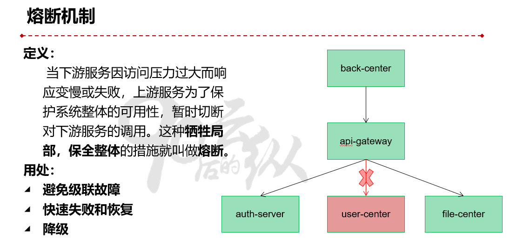
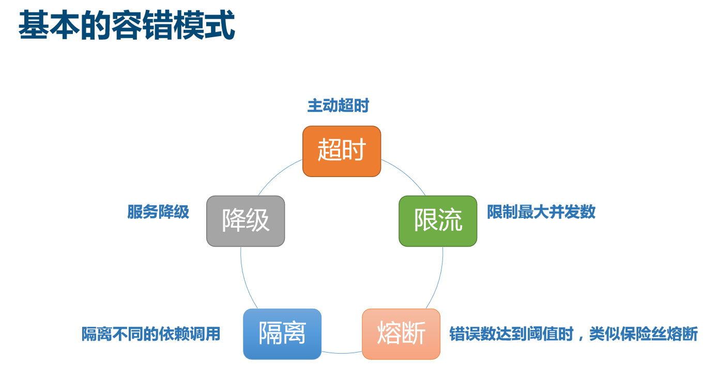
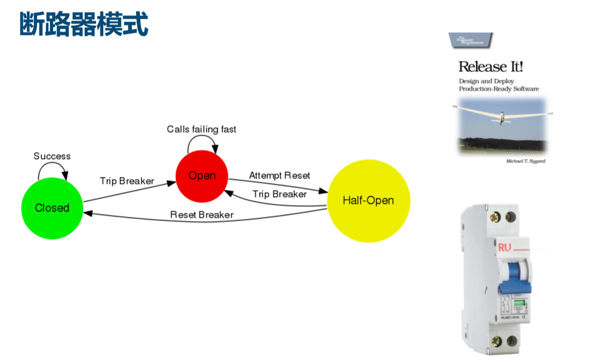
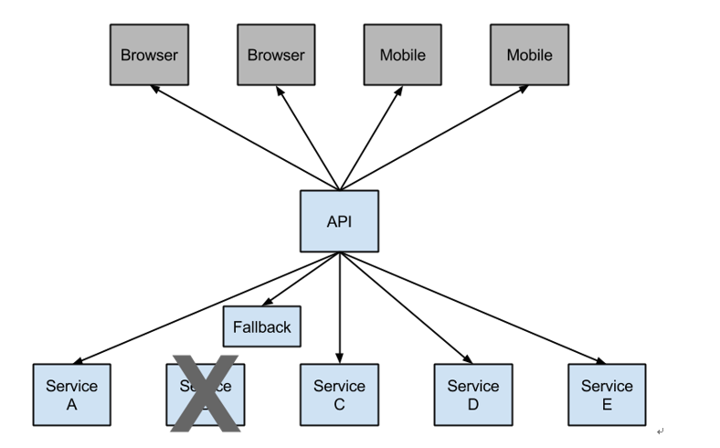
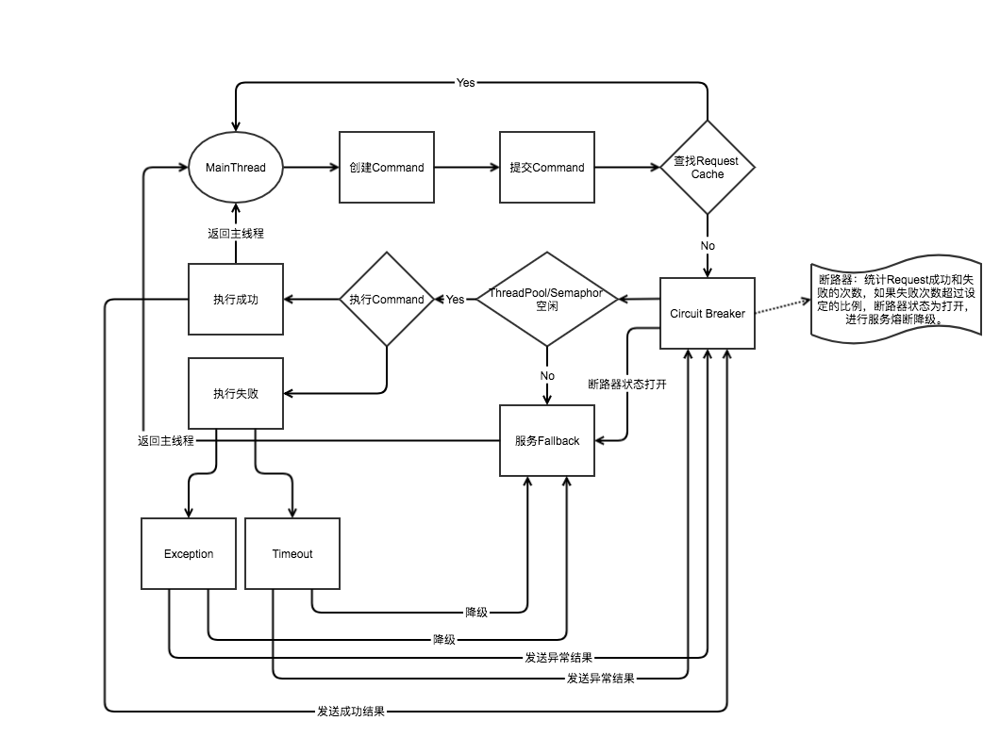
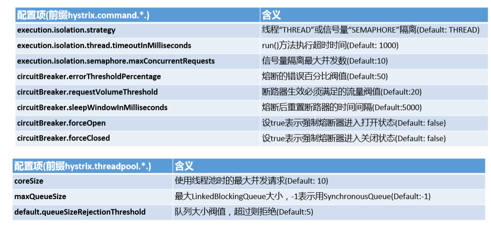

# Spring之Hystrix


## 简介

熔断降级：在分布式系统中，网关作为流量的入口，大量请求进入网关，向后端远程系统或服务发起调用，后端服务不可避免的会产生调用失败（超时或者异常），失败时不能让请求堆积在网关上，需要快速失败并返回回去，这就需要在网关上做熔断、降级操作。

为什么在网关上请求失败需要快速返回给客户端？

因为当一个客户端请求发生故障的时候，这个请求会一直堆积在网关上，当然只有一个这种请求，网关肯定没有问题（如果一个请求就能造成整个系统瘫痪，那这个系统可以下架了），但是网关上堆积多了就会给网关乃至整个服务都造成巨大的压力，甚至整个服务宕掉。因此要对一些服务和页面进行有策略的降级，以此缓解服务器资源的的压力，以保证核心业务的正常运行，同时也保持了客户和大部分客户的得到正确的相应，所以需要网关上请求失败需要快速返回给客户端。











## 断路器Hystrix

**断路器**的三个重要参数：

l 快照时间窗：断路器确定是否打开需要统计一些请求和错误数据，而统计的时间范围就是快照时间窗，默认为最近的10秒。

l 请求总数下限：在快照时间窗内，必须满足请求总数下限才有资格根据熔断。默认为20，意味着在10秒内，如果该hystrix命令的调用此时不足20次，即使所有的请求都超时或其他原因失败，断路器都不会打开。

l 错误百分比下限：当请求总数在快照时间窗内超过了下限，比如发生了30次调用，如果在这30次调用中，有16次发生了超时异常，也就是超过50%的错误百分比，在默认设定50%下限情况下，这时候就会将断路器打开。



那么当断路器打开之后会发生什么呢？

断路器未打开之前，每个请求都会在当hystrix超时之后返回Fallback，每个请求时间延迟就是近似hystrix的超时时间，如果设置为5秒，每个请求就都要延迟5秒才会返回。当熔断器在10秒内发现请求总数超过20，并且错误百分比超过50%，这个时候熔断器打开，打开之后，再有请求调用的时候，将不会调用主逻辑，而是直接调用降级逻辑，这个时候就不会再等待5秒之后才返回Fallback。通过断路器，实现了自动地发现错误并将降级逻辑切换为主逻辑，减少相应延迟的效果。

在断路器打开之后，处理逻辑并没有结束，降级逻辑已经被当成了主逻辑，那么原来的主逻辑要如何**恢复**呢？对于这一问题，hystrix也为我们实现了自动恢复功能。当断路器打开，对主逻辑进行熔断之后，hystrix会启动一个休眠时间窗，在这个时间窗内，降级逻辑是临时的成为主逻辑，当休眠时间窗到期，断路器将进入半开状态，释放一次请求到原来的主逻辑上，如果此次请求正常返回，那么断路器将继续闭合，主逻辑恢复，如果这次请求依然有问题，断路器继续进入打开状态，休眠时间窗重新记时。

通过上面的一系列机制，hystrix的断路器实现了对依赖资源故障的端口、对降级策略的自动切换以及对主逻辑的自动恢复机制。这使得我们的微服务在依赖外部服务或资源的时候得到了非常好的保护，同时对于一些具备降级逻辑的业务需求可以实现自动化的切换与恢复，相比于设置开关由监控和运维来进行切换的传统实现方式显得更为智能和高效。


## 断路器工作流程





## 触发fallback条件(降级)

Hystrix会在以下四种情况下触发fallback函数：

1.任务超过了"withExecutionTimeoutInMilliseconds"定义的超时时间；

2.任务抛出了非HystrixBadRequestException的异常；

3.线程池/信号量已满；

4.熔断器打开；


## Hystrix主要配置项




## 降级演示

依赖

```xml
        <dependency>
            <groupId>com.netflix.hystrix</groupId>
            <artifactId>hystrix-core</artifactId>
            <version>1.5.18</version>
        </dependency>
        <dependency>
            <groupId>com.netflix.hystrix</groupId>
            <artifactId>hystrix-metrics-event-stream</artifactId>
            <version>1.5.18</version>
        </dependency>
        <dependency>
            <groupId>com.netflix.hystrix</groupId>
            <artifactId>hystrix-javanica</artifactId>
            <version>1.5.18</version>
        </dependency>
```

配置

```java
@Configuration
public class HystrixConfig {

    /**
     * 用来拦截处理HystrixCommand注解
     * @return
     */
    @Bean
    public HystrixCommandAspect hystrixCommandAspect() {
        return new HystrixCommandAspect();
    }

    /**
     * 用来向监控中心Dashboard发送stream信息
     * @return
     */
    @Bean
    public ServletRegistrationBean hystrixMetricsStreamServlet() {
        ServletRegistrationBean registration = new ServletRegistrationBean(new HystrixMetricsStreamServlet());
        registration.addUrlMappings("/hystrix.stream");
        return registration;
    }
}
```


**超时降级**

```java
@Slf4j
@Service
public class OrderService1 {

    /**
     * 超时降级策略
     * @param order
     * @return
     */
    @HystrixCommand(commandKey = "/orders/create",
            commandProperties = {
                    @HystrixProperty(name="execution.timeout.enabled",value="true"),
                    @HystrixProperty(name="execution.isolation.thread.timeoutInMilliseconds",value="3000")
            },
            fallbackMethod = "createOrderFallbackMethodTimeout")
    public String createOrder(@RequestBody String order){

        try {
            Thread.sleep(5000);
        } catch (InterruptedException e) {
//            e.printStackTrace();
        }
        return "success";
    }

    /**
     * 超时降级策略 createOrder超时降级
     * @param order
     * @return
     */
    public String createOrderFallbackMethodTimeout(String order){
        log.info("--------超时降级策略执行--------");
        return "Hystrix time out";
    }
}

```

测试

```java
    @Test
    void timeoutDowngrade() throws InterruptedException {

        // 测试Hystrix超时降级策略
        CountDownLatch countDownLatch1 = new CountDownLatch(10);
        ExecutorService exec1 = Executors.newCachedThreadPool();

        for (int i=0; i<10; i++) {
            exec1.execute(() -> {
                try {
                    orderService1.createOrder("orderService1");
                } finally {
                    countDownLatch1.countDown();
                }
            });
        }
        countDownLatch1.await();
        exec1.shutdown();

    }
```

结果

```log
2020-02-13 23:48:09.440  INFO 48096 --- [ HystrixTimer-1] com.idcmind.ants.hystrix.OrderService1   : --------超时降级策略执行--------
2020-02-14 00:39:08.165  INFO 48542 --- [ HystrixTimer-4] com.idcmind.ants.hystrix.OrderService1   : --------超时降级策略执行--------
2020-02-14 00:39:08.165  INFO 48542 --- [ HystrixTimer-5] com.idcmind.ants.hystrix.OrderService1   : --------超时降级策略执行--------
2020-02-14 00:39:08.165  INFO 48542 --- [ HystrixTimer-3] com.idcmind.ants.hystrix.OrderService1   : --------超时降级策略执行--------
2020-02-14 00:39:08.165  INFO 48542 --- [ HystrixTimer-1] com.idcmind.ants.hystrix.OrderService1   : --------超时降级策略执行--------
2020-02-14 00:39:08.165  INFO 48542 --- [ HystrixTimer-6] com.idcmind.ants.hystrix.OrderService1   : --------超时降级策略执行--------
2020-02-14 00:39:08.165  INFO 48542 --- [ HystrixTimer-2] com.idcmind.ants.hystrix.OrderService1   : --------超时降级策略执行--------
2020-02-14 00:39:08.165  INFO 48542 --- [ HystrixTimer-8] com.idcmind.ants.hystrix.OrderService1   : --------超时降级策略执行--------
2020-02-14 00:39:08.165  INFO 48542 --- [ HystrixTimer-7] com.idcmind.ants.hystrix.OrderService1   : --------超时降级策略执行--------
2020-02-14 00:39:08.172  INFO 48542 --- [ HystrixTimer-4] com.idcmind.ants.hystrix.OrderService1   : --------超时降级策略执行--------
2020-02-14 00:39:08.172  INFO 48542 --- [ HystrixTimer-6] com.idcmind.ants.hystrix.OrderService1   : --------超时降级策略执行--------

```


## 4. 限流演示

配置

```java
@Configuration
public class HystrixConfig {

    /**
     * 用来拦截处理HystrixCommand注解
     * @return
     */
    @Bean
    public HystrixCommandAspect hystrixCommandAspect() {
        return new HystrixCommandAspect();
    }

    /**
     * 用来向监控中心Dashboard发送stream信息
     * @return
     */
    @Bean
    public ServletRegistrationBean hystrixMetricsStreamServlet() {
        ServletRegistrationBean registration = new ServletRegistrationBean(new HystrixMetricsStreamServlet());
        registration.addUrlMappings("/hystrix.stream");
        return registration;
    }
}
```


**信号量限流**

```java
@Slf4j
@Service
public class OrderService2 {

    /**
     * 限流策略：信号量方式
     * @param order
     * @return
     */
    @HystrixCommand(commandKey = "/orders/insert",
            commandProperties = {
                    @HystrixProperty(name="execution.isolation.strategy",value="SEMAPHORE"),
                    @HystrixProperty(name="execution.isolation.semaphore.maxConcurrentRequests",value="3"),
            },
            fallbackMethod = "insertOrderFallbackMethodSemaphore")
    public String insertOrder(@RequestBody String order){

        return "success";
    }

    /**
     * 限流策略：信号量方式 insertOrder限流降级
     * @param order
     * @return
     */
    public String insertOrderFallbackMethodSemaphore( String order){
        log.info("--------信号量限流降级策略执行--------");
        return "Hystrix semaphore";
    }
}
```

测试

```java
    @Test
    public void rateLimit1() throws InterruptedException {
        // 测试Hystrix信号量降级策略
        CountDownLatch countDownLatch = new CountDownLatch(5);
        ExecutorService exec = Executors.newCachedThreadPool();

        for (int i=0; i<5; i++) {
            exec.execute(() -> {
                try {
                    orderService2.insertOrder("orderService2");
                } finally {
                    countDownLatch.countDown();
                }
            });
        }
        countDownLatch.await();
        exec.shutdown();


    }
```

结果

```
2020-02-13 23:52:14.122  INFO 48135 --- [pool-3-thread-2] com.idcmind.ants.hystrix.OrderService2   : --------信号量限流降级策略执行--------
2020-02-13 23:52:14.122  INFO 48135 --- [pool-3-thread-1] com.idcmind.ants.hystrix.OrderService2   : --------信号量限流降级策略执行--------

```


**线程池限流(默认策略)**

```java
@Slf4j
@Service
public class OrderService3 {

    /**
     * 限流策略：线程池方式
     * @param order
     * queueSizeRejectionThreshold 排队线程数量阈值，默认为5，达到时拒绝
     * @return
     */
    @HystrixCommand(commandKey = "/orders/add",
            commandProperties = {
                    @HystrixProperty(name="execution.isolation.strategy",value="THREAD")
            },
            threadPoolKey = "addOrderThreadPool",
            threadPoolProperties = {
                    @HystrixProperty(name="coreSize",value="3"),
                    @HystrixProperty(name="maxQueueSize",value="5"),
                    @HystrixProperty(name="queueSizeRejectionThreshold",value="5")
            },
            fallbackMethod = "addOrderFallbackMethodThread")
    public String addOrder(@RequestBody String order){

        return "success";
    }

    /**
     *  限流策略：线程池方式 addOrder限流降级
     * @param order
     * @return
     */
    public String addOrderFallbackMethodThread(String order){
        log.info("--------线程池限流降级策略执行--------");
        return "Hystrix threadPool";
    }
}
```

测试

```java
    @Test
    public void rateLimit2() throws InterruptedException {
        // 测试Hystrix线程池降级策略
        CountDownLatch countDownLatch1 = new CountDownLatch(10);
        ExecutorService exec1 = Executors.newCachedThreadPool();

        for (int i=0; i<10; i++) {
            exec1.execute(() -> {
                try {
                    orderService3.addOrder("orderService3");
                } finally {
                    countDownLatch1.countDown();
                }
            });
        }
        countDownLatch1.await();
        exec1.shutdown();
    }

```

输出

```
2020-02-13 23:54:26.876  INFO 48146 --- [pool-3-thread-9] com.idcmind.ants.hystrix.OrderService3   : --------线程池限流降级策略执行--------
2020-02-13 23:54:26.878  INFO 48146 --- [ool-3-thread-10] com.idcmind.ants.hystrix.OrderService3   : --------线程池限流降级策略执行--------

```

