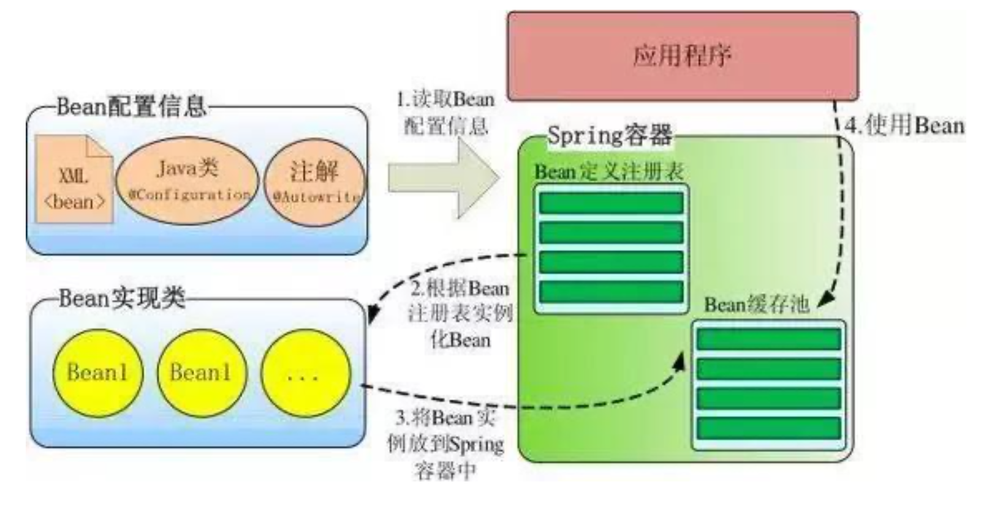

## 前言

起初动机完全是面试问到这个问题了，觉得需要了解下。
看别人对源码的解读，完全不知道如何去表达，直到看了手写IOC，再去看源码，觉得哦...


## Spring 容器高层视图

Spring 启动时读取应用程序提供的 Bean 配置信息，并在 Spring 容器中生成一份相应的 Bean 配 置注册表，然后根据这张注册表实例化 Bean，装配好 Bean 之间的依赖关系，为上层应用提供准 备就绪的运行环境。其中 Bean 缓存池为 HashMap 实现。



## IOC流程

1. 初始化IOC容器。定义一个BeanFactory,对象实例的工厂，这个工厂提供一个统一的方法，getBean
2. 扫描包路径，读取配置文件，或者扫描注解。将配置信息转换为IOC容器能够识别的数据结构(BeanDefinition)，并注册到工厂
3. 调用BeanFactory.getBean() 会触发Bean的实例化。(反射)


## 手写IOC

* 注解类

```java
/**
 * Bean注解
 */
@Documented
@Target({ ElementType.TYPE })
@Retention(RetentionPolicy.RUNTIME)
public @interface Component {
    String value() default "";
}
```

```java
/**
 * DI注解
 */
@Documented
@Target({ ElementType.FIELD })
@Retention(RetentionPolicy.RUNTIME)
public @interface Autowired {
}
```

* 普通组件

```java
public class User {

    private String username;
    private String password;

    public User(String username, String password) {
        this.username = username;
        this.password = password;
    }

    @Override
    public String toString() {
        return "User [username=" + username + ", password=" + password + "]";
    }
}
```

```java
@Component
public class UserService {

    public User getUser() {
        return new User("admin", "123456");
    }
}

```

```java
@Component
public class UserController {

    @Autowired
    private UserService userService;

    public void say() {
        User user = userService.getUser();
        System.out.println(user);
    }
}
```

* IOC和DI核心

```java
public class BeanDefinition {

    //bean实例
    private Object bean;
    //bean的Class对象
    private Class<?> beanClass;
    //bean的全限定名
    private String className;
    //是否懒加载
    private boolean lazyInit;
}
```

```java
public interface BeanFactory {

    Object getBean(String name);
}

```

```java
public class ApplicationContext implements BeanFactory {

    // 所有类的集合(全类名)
    private List<String> classNames = new ArrayList<>();
    //存储对象名称和已经实例化的对象映射
    private Map<String, Object> beanMap = new ConcurrentHashMap<>();


    public ApplicationContext(String basePackage) {

        doScan(basePackage);
        doIoc();
        doDI();
    }

    @Override
    public Object getBean(String name) {
        return doGetBean(name);
    }

    private Object doGetBean(String beanName) {
        return beanMap.get(beanName);
    }

    private void doScan(String basePackage) {
        URL resource = this.getClass().getClassLoader().getResource(basePackage.replaceAll("\\.", "/"));
        File basePackageFile=new File(resource.getFile());

        File[] files = basePackageFile.listFiles();
        for (File file: files) {
            if (file.isDirectory()) {
                doScan(basePackage + "." + file.getName());
            } else if (file.isFile()) {
                classNames.add(basePackage + "." + file.getName().split("\\.")[0]);
            }
        }
    }

    private void doIoc() {
        if (classNames.size() <= 0) {
            return;
        }
        for (String className: classNames) {
            try {
                Class<?> cls = Class.forName(className);

                if (cls.isAnnotationPresent(Component.class)) {
                    Component component = cls.getAnnotation(Component.class);
                    Object instance = cls.newInstance();
                    if (StringUtils.isBlank(component.value())) {
                        beanMap.put(camelCaseName(cls.getSimpleName()), instance);
                    } else {
                        beanMap.put(camelCaseName(cls.getSimpleName()), instance);
                        beanMap.put(component.value(), instance);
                    }
                }
            } catch (ClassNotFoundException e) {
                e.printStackTrace();
            } catch (IllegalAccessException e) {
                e.printStackTrace();
            } catch (InstantiationException e) {
                e.printStackTrace();
            }
        }
    }

    private void doDI() {

        for (Map.Entry<String, Object> entry: beanMap.entrySet()) {
            Field[] fields = entry.getValue().getClass().getDeclaredFields();
            for (Field field:fields) {
                if (field.isAnnotationPresent(Autowired.class)) {
                    Object obj = null;
                    if (beanMap.containsKey(field.getName())) {
                        obj = beanMap.get(field.getName());
                    } else {
                        obj = beanMap.get(camelCaseName(field.getType().getSimpleName()));
                    }
                    if (null == obj) {
                        return;
                    }

                    try {
                        // 暴力访问私有属性
                        field.setAccessible(true);
                        field.set(entry.getValue(), obj);
                    } catch (IllegalArgumentException e) {
                        e.printStackTrace();
                    } catch (IllegalAccessException e) {
                        e.printStackTrace();
                    }
                }
            }
        }
    }


    /**
     * 驼峰命名
     * @param s
     * @return
     */
    private static String camelCaseName(String s) {
        char[] chars = s.toCharArray();
        String firstChar = String.valueOf(chars[0]);
        chars[0] = firstChar.toLowerCase().charAt(0);// 转小写
        return String.valueOf(chars);
    }
}
```

```java
public class IocApplication {
    public static void main(String[] args) {

        ApplicationContext ctx = new ApplicationContext("com.idcmind.ioc");
        // test
        UserController componentB = (UserController) ctx.getBean("userController");
        componentB.say();
    }
}
```

---

实际过程中Bean是懒加载的，延时实例化。
当我们需要UserController的时候，会检索到需要先实例化UserService。
这就是依赖注入吧。当然，这样调用的时候需要全类名。

实现如下:
```java
public class ApplicationContext implements BeanFactroy {

    //存储对象名称和已经实例化的对象映射
    private Map<String, Object> beanMap = new ConcurrentHashMap<>();
    //存储对象名称和对应对象信息的映射
    private ConcurrentHashMap<String,BeanDefinition> beanDefinitionMap = new ConcurrentHashMap<>();

    private List<String> packageNames = new ArrayList<>();

    /**
     * 有参构造方法,参数类型为指定要扫描加载的包名
     * @param basePackage com.idcmind.ioc
     */
    public ApplicationContext(String basePackage) throws Exception {

        scanBasePackage(basePackage);

        registerBeanDefinition(packageNames);
    }

    /**
     * 注册bean定义
     * @param packageNames
     * @throws Exception
     */
    private void registerBeanDefinition(List<String> packageNames) throws Exception {
        if (packageNames.size() <= 0) {
            return;
        }

        for (String packageName : packageNames) {
            Class<?> c = Class.forName(packageName);
            if (c.isAnnotationPresent(Component.class)) {
                BeanDefinition beanDefinition = new BeanDefinition();
                beanDefinition.setClassName(c.getName());
                beanDefinition.setBeanClass(c);
                beanDefinition.setLazyInit(true);
                beanDefinition.setBean(c.newInstance());
                beanDefinitionMap.put(c.getName(), beanDefinition);
            }
        }
    }

    /**
     * 扫描包
     * @param basePackage
     */
    private void scanBasePackage(String basePackage) throws Exception{
        URL resource = this.getClass().getClassLoader().getResource(basePackage.replaceAll("\\.", "/"));
        File basePackageFile=new File(resource.getFile());

        File[] files = basePackageFile.listFiles();
        for (File file: files) {
            if (file.isDirectory()) {
                scanBasePackage(basePackage + "." + file.getName());
            } else if (file.isFile()) {
                packageNames.add(basePackage + "." + file.getName().split("\\.")[0]);
            }
        }

    }

    /**
     * 获取bean
     * @param name
     * @return
     * @throws Exception
     */
    public Object getBean(String name) throws Exception {
        return doGetBean(name);
    }

    /**
     * 获取bean
     * @param beanName
     * @return
     * @throws Exception
     */
    private Object doGetBean(String beanName) throws ClassNotFoundException, IllegalAccessException, InstantiationException {

        Objects.requireNonNull(beanName, "beanName不能为空");
        Object instance = beanMap.get(beanName);
        //如果bean已存在，则直接返回
        if(instance != null){
            return instance;
        }

        BeanDefinition beanDefinition = beanDefinitionMap.get(beanName);
        String className = beanDefinition.getClassName();
        Class<?> cls = Class.forName(className);
        instance = cls.newInstance();
        setField(instance);
        beanMap.put(beanName, instance);

        return instance;
    }

    /**
     * 设置参数
     * @param instance
     */
    private void setField(Object instance) {
        Field[] fields = instance.getClass().getDeclaredFields();
        for (Field field: fields) {
            if (field.isAnnotationPresent(Autowired.class)) {

                String filedName = field.getType().getName();

                try {
                    Object fieldBean = getBean(filedName);
                    field.setAccessible(true);
                    field.set(instance, fieldBean);
                } catch (IllegalArgumentException e) {
                    e.printStackTrace();
                } catch (Exception e) {
                    e.printStackTrace();
                }
            }
        }
    }
}
```


 
