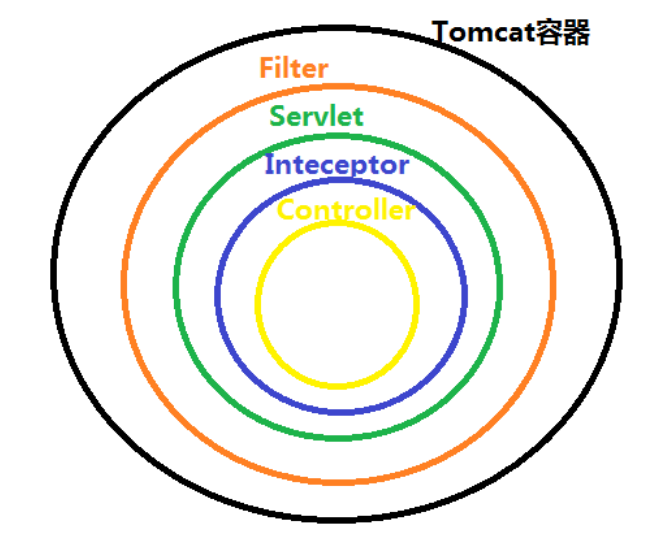

# Spring过滤器与拦截器的区别


## 1. Spring过滤器


### 什么是过滤器

过滤器Filter，是在Servlet规范中定义的，是Servlet容器支持的，该接口定义在 `javax.servlet`包下，主要是在客户端请求(HttpServletRequest)进行预处理，以及对服务器响应(HttpServletResponse)进行后处理。接口代码如下:

```java
package javax.servlet;

import java.io.IOException;

public interface Filter {
    void init(FilterConfig var1) throws ServletException;

    void doFilter(ServletRequest request, ServletResponse response, FilterChain chain) throws IOException, ServletException;

    void destroy();
}

```

对上面三个接口方法进行分析:

- **init(FilterConfig)**: 初始化接口，在用户自定义的Filter初始化时被调用，它与Servlet的 init方法的作用是一样的。
- **doFilter(ServletRequest,ServletResponse,FilterChain)**: 在每个用户的请求进来时这个方法都会被调用，并在Servlet的service方法之前调用(如果我们是开发Servlet项目)，而FilterChain就代表当前的整个请求链，通过调用 `FilterChain.doFilter`可以将请求继续传递下去，如果想拦截这个请求，可以不调用FilterChain.doFilter，那么这个请求就直接返回了，**所以Filter是一种责任链设计模式**，在`spring security`就大量使用了过滤器，有一条过滤器链。
- **destroy**: 当Filter对象被销毁时，这个方法被调用，注意，当Web容器调用这个方法之后，容器会再调用一次doFilter方法。


### 如何实现自己的过滤器

首先我们需要创建一个类，让它实现 Filter 接口，然后重写接口中的方法：

```java
package com.example.demojava.filter;

import org.springframework.core.annotation.Order;
import org.springframework.stereotype.Component;

import javax.servlet.*;
import javax.servlet.annotation.WebFilter;
import javax.servlet.http.HttpServletRequest;
import java.io.IOException;

@Component
@Order(1)   // 过滤顺序，值越小越先执行
@WebFilter(urlPatterns = "/demoFilter", filterName = "filterTest")
public class Filter1 implements Filter {

    @Override
    public void init(FilterConfig filterConfig) throws ServletException {
        System.out.println("filter初始化中...");
    }

    @Override
    public void doFilter(ServletRequest servletRequest, ServletResponse servletResponse, FilterChain filterChain) throws IOException, ServletException {

        System.out.println("doFilter()开始执行：发往 " + ((HttpServletRequest) servletRequest).getRequestURL().toString() + " 的请求已被拦截");

        System.out.println("检验接口是否被调用，尝试获取contentType如下： " + servletResponse.getContentType());

        // filter的链式调用；将请求转给下一条过滤链
        filterChain.doFilter(servletRequest, servletResponse);

        System.out.println("检验接口是否被调用，尝试获取contentType如下： " + servletResponse.getContentType());

        System.out.println("doFilter()执行结束。");

    }

    @Override
    public void destroy() {
        System.out.println("filter销毁中...");
    }
}

```


当我们配置了多个 filter，且一个请求能够被多次拦截时，该请求将沿着 `客户端 -> 过滤器1 -> 过滤器2 -> servlet -> 过滤器2 -> 过滤器1 -> 客户端` 链式流转


```java
@Component
@Order(2)   // 过滤顺序，值越小越先执行
@WebFilter(urlPatterns = "/demoFilter", filterName = "filterTest2")
public class Filter2 implements Filter {

    @Override
    public void init(FilterConfig filterConfig) throws ServletException {
        System.out.println("filter2初始化中...");
    }

    @Override
    public void doFilter(ServletRequest servletRequest, ServletResponse servletResponse, FilterChain filterChain) throws IOException, ServletException {

        System.out.println("doFilter2()开始执行：发往 " + ((HttpServletRequest) servletRequest).getRequestURL().toString() + " 的请求已被拦截");

        System.out.println("检验接口是否被调用，尝试获取contentType如下： " + servletResponse.getContentType());

        // filter的链式调用；将请求转给下一条过滤链
        filterChain.doFilter(servletRequest, servletResponse);

        System.out.println("检验接口是否被调用，尝试获取contentType如下： " + servletResponse.getContentType());

        System.out.println("doFilter2()执行结束。");

    }

    @Override
    public void destroy() {
        System.out.println("filter2销毁中...");
    }
}
```


然后创建一个 Controller，对外提供两条请求路径：

```java
@RestController
@RequestMapping("demoFilter")
public class FilterController {

    @GetMapping("hello")
    public String hello() {
        System.out.println("接口被调用：hello() ");
        return "hello filter";
    }

    @GetMapping("hi")
    public String hi() {
        System.out.println("接口被调用：hi()");
        return "hi filter";
    }
}
```

启动项目，可以看到我们的过滤器已经随着程序的启动被成功初始化了。

分别对这两个接口发送请求, 看到结果:

```
doFilter()开始执行：发往 http://localhost:8080/demoFilter/hi 的请求已被拦截
检验接口是否被调用，尝试获取contentType如下： null

doFilter2()开始执行：发往 http://localhost:8080/demoFilter/hi 的请求已被拦截
检验接口是否被调用，尝试获取contentType如下： null

接口被调用：hi()

检验接口是否被调用，尝试获取contentType如下： text/plain;charset=UTF-8
doFilter2()执行结束。

检验接口是否被调用，尝试获取contentType如下： text/plain;charset=UTF-8
doFilter()执行结束。
```


最后使项目停止运行，则过滤器随之销毁。


可以看出，当请求同时满足多个过滤器的过滤条件时，`filterChain.doFilter()` 会将其按一定顺序（可以通过 @Order 指定）依次传递到下一个 filter，直到进入 servlet 进行接口的实际调用。调用完成后，响应结果将沿着原路返回，并在再一次经过各个 filter 后，最终抵达客户端。


## 2. 拦截器

### 什么是拦截器

拦截器是 AOP 的一种实现策略，用于在某个方法或字段被访问前对它进行拦截，然后在其之前或之后加上某些操作。同 filter 一样，interceptor 也是链式调用。每个 interceptor 的调用会依据它的声明顺序依次执行。一般来说拦截器可以用于以下方面 ：

- 日志记录 ：几率请求信息的日志，以便进行信息监控、信息统计等等
- 权限检查 ：对用户的访问权限，认证，或授权等进行检查

- 性能监控 ：通过拦截器在进入处理器前后分别记录开始时间和结束时间，从而得到请求的处理时间

- 通用行为 ：读取 cookie 得到用户信息并将用户对象放入请求头中，从而方便后续流程使用


### 拦截器的接口方法

在SpringMVC中，DispatcherServlet捕获每个请求，在到达对应的Controller之前，请求可以被拦截器处理，在拦截器中进行前置处理后，请求最终才到达Controller。

拦截器的接口是 `org.springframework.web.servlet.HandlerInterceptor`接口，接口代码如下:

```java
public interface HandlerInterceptor {
    default boolean preHandle(HttpServletRequest request, HttpServletResponse response, Object handler) throws Exception {
        return true;
    }

    default void postHandle(HttpServletRequest request, HttpServletResponse response, Object handler, @Nullable ModelAndView modelAndView) throws Exception {
    }

    default void afterCompletion(HttpServletRequest request, HttpServletResponse response, Object handler, @Nullable Exception ex) throws Exception {
    }
}

```

接口方法解读:

- **preHandle方法**：对客户端发过来的请求进行前置处理，如果方法返回true,继续执行后续操作，如果返回false，执行中断请求处理，请求不会发送到Controller
- **postHandler方法**：在请求进行处理后执行，也就是在Controller方法调用之后处理，当然前提是之前的 `preHandle`方法返回 true。具体来说，`postHandler`方法会在DispatcherServlet进行视图返回渲染前被调用，也就是说我们可以在这个方法中对 Controller 处理之后的`ModelAndView`对象进行操作
- **afterCompletion方法**: 该方法在整个请求结束之后执行，当然前提依然是 `preHandle`方法的返回值为 true才行。该方法一般用于资源清理工作

### 如何实现一个自己的拦截器

同样，首先创建一个类，让它实现 HandlerInterceptor 接口，然后重写接口中的方法 ：

```java
package com.demo.demofilter.demofilter.interceptor;

import org.springframework.lang.Nullable;
import org.springframework.stereotype.Component;
import org.springframework.web.servlet.HandlerInterceptor;
import org.springframework.web.servlet.ModelAndView;

import javax.servlet.http.HttpServletRequest;
import javax.servlet.http.HttpServletResponse;

@Component
public class DemoInterceptor implements HandlerInterceptor {

    @Override
    public boolean preHandle(HttpServletRequest request, HttpServletResponse response, Object handler) throws Exception {
        System.out.println("preHandle");
        return true;
    }

    @Override
    public void postHandle(HttpServletRequest request, HttpServletResponse response, Object handler, @Nullable ModelAndView modelAndView) throws Exception {
        System.out.println("postHandle");
    }

    @Override
    public void afterCompletion(HttpServletRequest request, HttpServletResponse response, Object handler, @Nullable Exception ex) throws Exception {
        System.out.println("afterHandle");
    }
}
复制代码
```

紧接着需要对拦截器进行注册，指明使用哪个拦截器，及该拦截器对应拦截的 URL ：

```java
package com.demo.demofilter.demofilter.interceptor;

import org.springframework.context.annotation.Configuration;
import org.springframework.web.servlet.config.annotation.InterceptorRegistry;
import org.springframework.web.servlet.config.annotation.WebMvcConfigurer;

@Configuration
public class InterceptorConfig implements WebMvcConfigurer {

    @Override
    public void addInterceptors(InterceptorRegistry registry) {
        //&emsp;如果有多个拦截器，继续registry.add往下添加就可以啦
        registry.addInterceptor(new DemoInterceptor()).addPathPatterns("/demoInterceptor/**");
    }

}
复制代码
```

最后是 Controller

```java
package com.demo.demofilter.demofilter.interceptor;

import org.springframework.web.bind.annotation.GetMapping;
import org.springframework.web.bind.annotation.RequestMapping;
import org.springframework.web.bind.annotation.RestController;

@RestController
@RequestMapping("demoInterceptor")
public class InterceptorController {

    @GetMapping("hello")
    public String hello() {
        System.out.println("接口被调用：hello() ");
        return "hello interceptor";
    }

    @GetMapping("hi")
    public String hi() {
        System.out.println("接口被调用：hi()");
        return "hi interceptor";
    }
}
复制代码
```

运行结果如下 ：

```
preHandler
接口被调用: hello()
postHandler
afterHandler
```


### 其他注意事项

在 Http 的请求执行过程中，要经过以下几个步骤 ：

1. 由 DispatcherServlet 捕获请求
2. DispatcherServlet 将接收到的 URL 和对应的 Controller 进行映射
3. 在请求到达相应的 Controller 之前，由拦截器对请求进行处理
4. 处理完成之后，进行视图的解析
5. 返回视图

所以，只有经过 DispatcherServlet 的请求才会被拦截器捕获，而我们自定义的 Servlet 请求则不会被拦截的。


## 3. 过滤器与拦截器两者对比总结

1. 过滤器是基于函数的回调，而拦截器是基于 Java 反射机制的
2. 过滤器Filter依赖于Servlet容器。拦截器Interceptor依赖于框架容器，可以调用 IOC 容器中的各种依赖
3. 拦截器可以 `preHandle`方法内返回 false 进行中断。过滤器就比较复杂，需要处理请求和响应对象来引发中断，需要额外的动作，比如将用户重定向到错误页面
4. 过滤器只能在请求的前后使用，而拦截器可以详细到每个方法


tomcat容器中执行顺序: Filter -> Servlet -> Interceptor -> Controller



