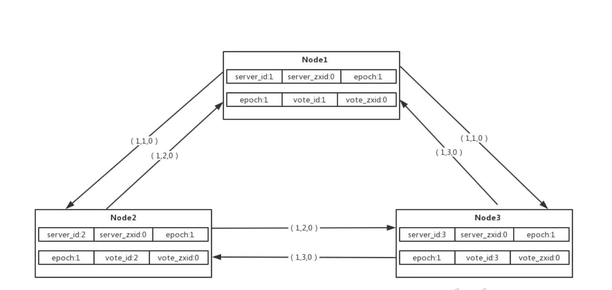
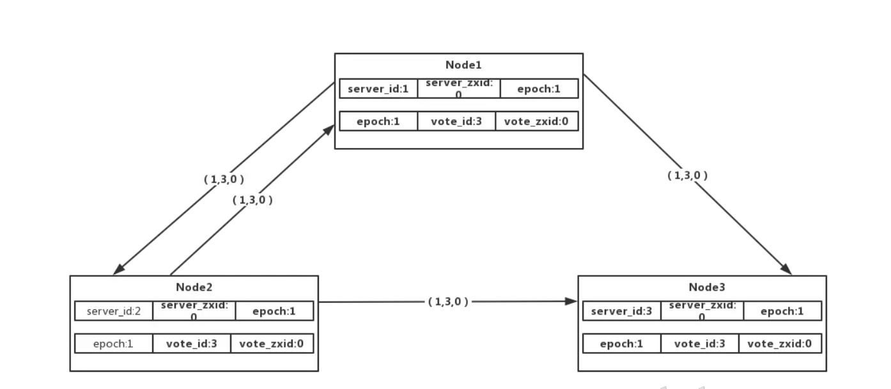
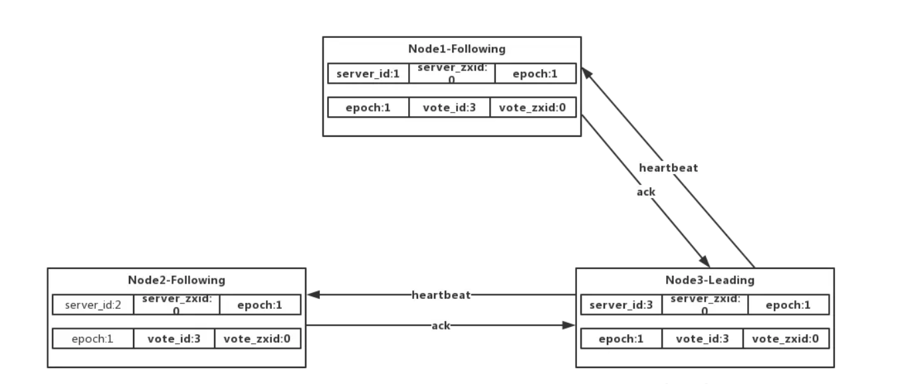
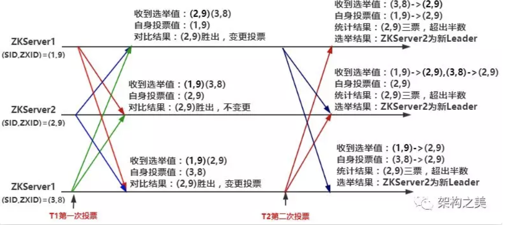

# 分布式选举算法

## ZAB算法-优先级的民主投票

ZAB(ZooKeeper Atomic Broadcast)算法是ZooKeeper为实现分布式协调而设计的，它是对Raft选主算法的一种改进，在拥有投票选举的维度下增加节点ID以及数据ID（数据的最新值）为参考。

ZAB选主算法，节点同样也有3种角色：

Leader: 主节点

Follower: 跟随者

Observe: 观察者，无投票权

ZAB算法在选主过程在投票给具体节点时，通过（vote_id,vote_zxId）表示投票给哪个节点，vote_id即为被投票的节点id，vote_zxid为被秃瓢节点的zxid；其ZAB选主算法的唯一原则是，server_zxId值最大则成为Leader，如果相同，则看server_id最大者。

**ZAB选主流程**

1.系统初始化时，即为第一轮投票选主，即epoch=1，所有的节点zxID=0，此时所有节点都会推选自己，且将选票信息（epoch,vote_id,vote_zxid）广播出去，如下图

2.此时epoch和zxId都是相同，根据ZAB算法判断原则，则会依据server_id最大者为推选对象，所以节点会更新vote_id=3进行重新广播

3.现在所有的节点都推线了Node3节点，则node3成为Leader，为Leading状态，其他节点为Following状态，Leader与Follower将会建立心跳机制。

**ZooKeeper**

ZK的节点在投票时是通过比较两个“ID”来决定把票投给谁的：

1、ZXID：ZooKeeper事务Id，越大表示数据越新；

2、SID：集群中每个节点的唯一编号；

投票时的比较算法为：谁的ZXID大谁胜出，ZXID相同情况谁的SID大谁胜出（简单理解：谁的数据新胜出，数据一样谁的编号大谁胜出）。

选举算法如下：

1、集群失去Leader后，所有节点进入Looking状态，向集群中广播（第一轮投票）自身选举值(SID,ZXID)，投自己一票；

2、每个节点都会将自身选举值与收到的所有其它节点的选举值作比较，选出“最大”的，如果最大的不是自己，则改投最"大“节点，广播变更(第二轮投票)；

3、集群中节点收到第二轮结果后，统计超过半数的选举值，其对应的节点将成为集群新的Leader；选举过程入下图所示：

