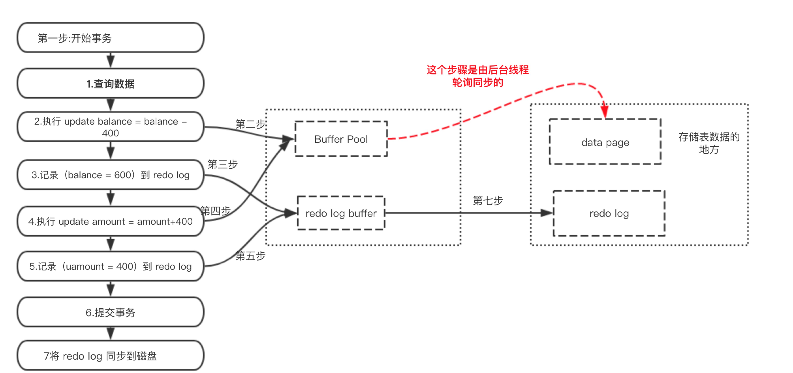
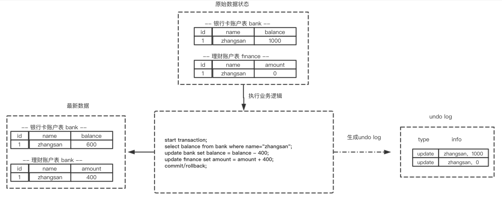
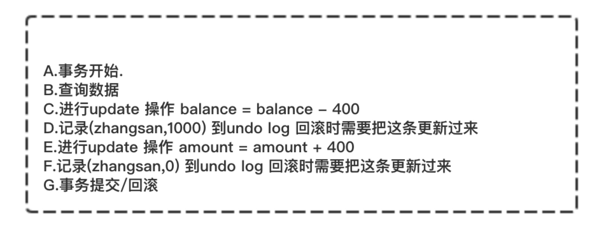

# 事务隔离级别

| 隔离级别 | 脏读 | 不可重复读 | 幻读 |
| :------: | :------: | :------: | :----: |
|READ UNCOMMITED|YES|YES|YES|
|READ COMMITED|NO|YES|YES|
|REPEATABLE READ|NO|NO|YES|
|RSERIALIZABLE|NO|NO|NO|

> mysql默认事务隔离级别是Repeatable Read级别

**脏读**: 读取到了其他事务未提交的数据

**不可重复读**: A事务读取到了B事务已经提交的数据，造成2次读取的结果不一致

**幻读**: A事务读取到了B事务新插入的数据

# 事务实现原理

实现事务功能的三个技术，分别是日志文件(redo log 和 undo log)，锁技术以及MVCC

## redo log

**redo log**叫做**重做日志**，是用来实现事务的持久性。
该日志文件由两部分组成：重做日志缓冲（redo log buffer）以及重做日志文件（redo log）,
前者是在内存中，后者在磁盘中。当事务提交之后会把所有修改信息都会存到该日志中。

如下场景：假设银行转账场景
```mysql
start transaction;
select balance from bank where name="zhangsan";
-- 生成 重做日志 balance=600
update bank set balance = balance - 400; 
-- 生成 重做日志 amount=400
update finance set amount = amount + 400;
commit;
```


InnoDB作为MySQL的存储引擎，数据是存放在磁盘中的，但如果每次读写数据都需要磁盘IO，效率会很低。
为此，InnoDB提供了缓存(Buffer Pool)，Buffer Pool中包含了磁盘中部分数据页的映射，
作为访问数据库的缓冲：当从数据库读取数据时，会首先从Buffer Pool中读取，如果Buffer Pool中没有，则从磁盘读取后放入Buffer Pool；
当向数据库写入数据时，会首先写入Buffer Pool，Buffer Pool中修改的数据会定期刷新到磁盘中（这一过程称为刷脏）。

Buffer Pool的使用大大提高了读写数据的效率，但是也带了新的问题：如果MySQL宕机，而此时Buffer Pool中修改的数据还没有刷新到磁盘，就会导致数据的丢失，事务的持久性无法保证。

于是，redo log被引入来解决这个问题：当数据修改时，除了修改Buffer Pool中的数据，还会在redo log记录这次操作；
当事务提交时，会调用fsync接口对redo log进行刷盘。如果MySQL宕机，重启时可以读取redo log中的数据，对数据库进行恢复。
redo log采用的是WAL（Write-ahead logging，预写式日志），所有修改先写入日志，再更新到Buffer Pool，保证了数据不会因MySQL宕机而丢失，从而满足了持久性要求。

既然redo log也需要在事务提交时将日志写入磁盘，为什么它不直接将Buffer Pool中修改的数据写入磁盘(即刷脏)要快呢？主要有以下两方面的原因：

1、刷脏是随机IO，因为每次修改的数据位置随机，但写redo log是追加操作，属于顺序IO。

2、刷脏是以数据页（Page）为单位的，MySQL默认页大小是16KB，一个Page上一个小修改都要整页写入；而redo log中只包含真正需要写入的部分，无效IO大大减少。

## undo log

**undo log**叫做**回滚日志**，用于记录数据被修改前的信息。
他正好跟前面所说的重做日志所记录的相反，重做日志记录数据被修改后的信息。
undo log主要记录的是数据的逻辑变化，为了在发生错误时回滚之前的操作，需要将之前的操作都记录下来，然后在发生错误时才可以回滚。




从上图可以了解到数据的变更都伴随着回滚日志的产生：

- (1) 产生了被修改前数据(zhangsan,1000) 的回滚日志
- (2) 产生了被修改前数据(zhangsan,0) 的回滚日志

根据上面流程可以得出如下结论：

1. 每条数据变更(insert/update/delete)操作都伴随一条undo log的生成,并且回滚日志必须先于数据持久化到磁盘上
2. 所谓的回滚就是根据回滚日志做逆向操作，比如delete的逆向操作为insert，insert的逆向操作为delete，update的逆向为update等。

回滚操作就是要还原到原来的状态，undo log记录了数据被修改前的信息以及新增和被删除的数据信息，根据undo log生成回滚语句，比如：

- (1) 如果在回滚日志里有新增数据记录，则生成删除该条的语句
- (2) 如果在回滚日志里有删除数据记录，则生成生成该条的语句
- (3) 如果在回滚日志里有修改数据记录，则生成修改到原先数据的语句

## 当前读与快照读

1. **当前读**：即加锁读，读取记录的最新版本，会加锁保证其他并发事务不能修改当前记录，直至获取锁的事务释放锁；

使用当前读的操作主要包括：显式加锁的读操作与插入/更新/删除等写操作，如下所示：

```mysql
select * from table where ? lock in share mode;
select * from table where ? for update;
insert into table values (…);
update table set ? where ?;
delete from table where ?;
```
注：当Update SQL被发给MySQL后，MySQL Server会根据where条件，读取第一条满足条件的记录，然后InnoDB引擎会将第一条记录返回，并加锁，待MySQL Server收到这条加锁的记录之后，会再发起一个Update请求，更新这条记录。一条记录操作完成，再读取下一条记录，直至没有满足条件的记录为止。因此，Update操作内部，就包含了当前读。同理，Delete操作也一样。Insert操作会稍微有些不同，简单来说，就是Insert操作可能会触发Unique Key的冲突检查，也会进行一个当前读。

2. **快照读**：即不加锁读，读取记录的快照版本而非最新版本，通过MVCC实现；

InnoDB默认的RR事务隔离级别下，不显式加『lock in share mode』与『for update』的『select』操作都属于快照读，保证事务执行过程中只有第一次读之前提交的修改和自己的修改可见，其他的均不可见；

## MVCC

数据库底层是怎么实现隔离性的呢？都采用了哪些技术呢？ 主要有两个技术：MVCC(多版本并发控制)和锁。

> MVCC『多版本并发控制』，与之对应的是『基于锁的并发控制』；

MVCC的最大好处：读不加任何锁，读写不冲突，对于读操作多于写操作的应用，极大的增加了系统的并发性能；

InnoDB默认的RR事务隔离级别下，不显式加『lock in share mode』与『for update』的『select』操作都属于快照读，使用MVCC，保证事务执行过程中只有第一次读之前提交的修改和自己的修改可见，其他的均不可见；


## 事务原理分析

```text
事务的原子性是通过 undo log 来实现的
事务的持久性性是通过 redo log 来实现的
事务的隔离性是通过 (读写锁+MVCC)来实现的
而事务的终极大 boss 一致性是通过原子性，持久性，隔离性来实现的！！！
```

RR解决脏读、不可重复读、幻读等问题，使用的是MVCC：MVCC全称Multi-Version Concurrency Control，即多版本的并发控制协议。

MVCC最大的优点是读不加锁，因此读写不冲突，并发性能好。InnoDB实现MVCC，多个版本的数据可以共存，主要是依靠数据的隐藏列(也可以称之为标记位)和undo log。
其中数据的隐藏列包括了该行数据的版本号、删除时间、指向undo log的指针等等；
当读取数据时，MySQL可以通过隐藏列判断是否需要回滚并找到回滚需要的undo log，从而实现MVCC。

**如何避免脏读？**

当事务A执行查询时，如发现数据已被其他事务修改，且状态为未提交。
此时事务A读取最新数据后，根据数据的undo log执行回滚操作，得到事务B修改前的数据，从而避免了脏读。

**如何避免不可重复读？**

当事务A第一次读取数据时，会记录该数据的版本号（数据的版本号是以row为单位记录的），假设版本号为1；
当事务B提交时，该行记录的版本号增加，假设版本号为2；
当事务A再一次读取数据时，发现数据的版本号（2）大于第一次读取时记录的版本号（1），因此会根据undo log执行回滚操作，得到版本号为1时的数据，从而实现了可重复读。

**如何避免幻读？**

InnoDB实现的RR通过next-key lock机制避免了幻读现象。

next-key lock是行锁的一种，实现相当于record lock(记录锁) + gap lock(间隙锁)；
其特点是不仅会锁住记录本身(record lock的功能)，还会锁定一个范围(gap lock的功能)。

例如：

当事务A在第一次读取0<id<5数据时，标记的不只是id=1的数据，而是将范围(0,5)进行了标记，
这样当T5时刻再次读取0<id<5数据时，便可以发现id=4的数据比之前标记的版本号更高，
此时再结合undo log执行回滚操作，避免了幻读。


