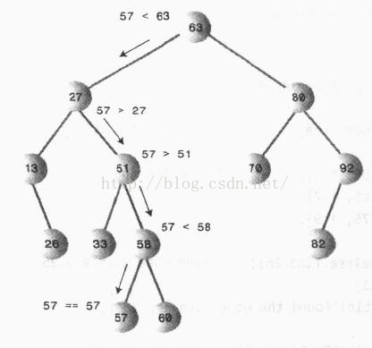
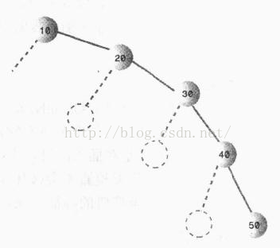
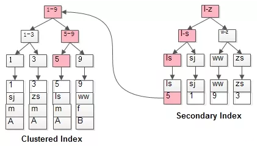

# 摘要

**从索引角度谈MySQL优化。** 

---

# InnoDB

## 索引的本质

MySQL官方对索引的定义为：索引（Index）是帮助MySQL高效获取数据的数据结构。提取句子主干，就可以得到索引的本质：索引是数据结构。

我们知道，数据库查询是数据库的最主要功能之一。我们都希望查询数据的速度能尽可能的快，因此数据库系统的设计者会从查询算法的角度进行优化。
最基本的查询算法当然是顺序查找（linear search），这种复杂度为O(n)的算法在数据量很大时显然是糟糕的，好在计算机科学的发展提供了很多更优秀的查找算法，
例如二分查找（binary search）、二叉树查找（binary tree search）等。如果稍微分析一下会发现，每种查找算法都只能应用于特定的数据结构之上，例如二分查找要求被检索数据有序，而二叉树查找只能应用于二叉查找树上,
但是数据本身的组织结构不可能完全满足各种数据结构（例如，理论上不可能同时将两列都按顺序进行组织），
所以，在数据之外，数据库系统还维护着满足特定查找算法的数据结构，这些数据结构以某种方式引用（指向）数据，这样就可以在这些数据结构上实现高级查找算法。这种数据结构，就是索引。

看一个例子：


<center>图一</center>
图1展示了一种可能的索引方式。左边是数据表，一共有两列七条记录，最左边的是数据记录的物理地址（注意逻辑上相邻的记录在磁盘上也并不是一定物理相邻的）。
为了加快Col2的查找，可以维护一个右边所示的二叉查找树，每个节点分别包含索引键值和一个指向对应数据记录物理地址的指针，这样就可以运用二叉查找在O(log2n)的复杂度内获取到相应数据。

虽然这是一个货真价实的索引，但是实际的数据库系统几乎没有使用二叉查找树或其进化品种红黑树（red-black tree）实现的，原因会在下文介绍。

数据结构基础我们可以参考[数据结构与算法（java版）](https://www.jianshu.com/nb/41117784)

## 普通查找

假设我们不用索引查找，那么会怎么样呢？很惨，我们必须全文顺序检索，直到查到我们需要的数据，时间复杂度为O(n)

## 二分查找

二分查找的前提是数据是有序数组,有序数组可以利用二分查找法快速的查找特定的值,时间复杂度为O(log2n)。
但是插入数据时很慢，插入的时候需要迭代检索数组直到找到排序位置，并且插入后右侧元素需要依次右移1位，时间复杂度为O(N)。
所以我们需要寻找更优质的数据结构和算法来均衡读写复杂度，于是引出了下边的二叉树。

## 二叉查找树

二叉树具有以下性质：左子树的键值小于根的键值，右子树的键值大于根的键值。 
如下图所示就是一棵二叉查找树:



但是我们想一个问题，假设我们数据的插入顺序是由小到大呢，那么数据就会都在我们的右子树，数据结构转为单链表查询，插入、删除的效率将会严重地降低，时间复杂度变为O(n)



因此若想二叉树的查询效率尽可能高，需要这棵二叉树是平衡的，从而引出新的定义——平衡二叉树

## 红黑树

红黑树就是一种二叉平衡树。这里我们插一点磁盘的知识帮助理解:

**我们数据库查询的瓶颈从来都不是索引本身,也不是CPU,而是IO操作。相对于内存存取，I/O存取的消耗要高几个数量级**假设我们的内存可以存放足够大的数据，那么我们是不需要维护索引的，我们可以在内存中直接通过查找算法去快速检索数据。
索引在数据库中是以文件的形式存在的，文件本身是没有计算功能的，它必须加载到内存，通过CPU的计算才会生成树结构进行查询。
但是系统从磁盘读取数据到内存时是以磁盘块（block）为基本单位的，位于同一个磁盘块中的数据会被一次性读取出来，而不是需要什么取什么。
这样就决定了我们的数据无法一次取出所有，只能分块取出，当然我们的内存也不能够一次加载大量数据。

InnoDB存储引擎中有页（Page）的概念，页是其磁盘管理的最小单位。InnoDB存储引擎中默认每个页的大小为16KB，可通过参数innodb_page_size将页的大小设置为4K、8K、16K。
而系统一个磁盘块的存储空间往往没有这么大，因此InnoDB每次申请磁盘空间时都会是若干地址连续磁盘块来达到页的大小16KB。InnoDB在把磁盘数据读入到磁盘时会以页为基本单位，在查询数据时如果一个页中的每条数据都能有助于定位数据记录的位置，这将会减少磁盘I/O次数，提高查询效率。

当需要查询的数据足够大时，红黑树的树深度会变得很大，由于磁盘读取机制，决定了我们每次读取的数据有限，这样就需要频繁的操作磁盘IO，性能便会下降

## B-Tree

由于B-Tree的特性，在B-Tree中按key检索数据的算法非常直观：首先从根节点进行二分查找，如果找到则返回对应节点的data，否则对相应区间的指针指向的节点递归进行查找，直到找到节点或找到null指针，前者查找成功，后者查找失败。
另外，由于插入删除新的数据记录会破坏B-Tree的性质，因此在插入删除时，需要对树进行一个分裂、合并、转移等操作以保持B-Tree性质,这里我们暂时不做讨论。

B-Tree结构的数据可以让系统高效的找到数据所在的磁盘块。为了描述B-Tree，首先定义一条记录为一个二元组[key, data] ，key为记录的键值，对应表中的主键值，data为一行记录中除主键外的数据。对于不同的记录，key值互不相同。

B-Tree中的每个节点根据实际情况可以包含大量的关键字信息和分支，如下图所示为一个3阶的B-Tree：


每个节点占用一个盘块的磁盘空间，一个节点上有两个升序排序的关键字和三个指向子树根节点的指针，指针存储的是子节点所在磁盘块的地址。两个关键词划分成的三个范围域对应三个指针指向的子树的数据的范围域。以根节点为例，关键字为17和35，P1指针指向的子树的数据范围为小于17，P2指针指向的子树的数据范围为17~35，P3指针指向的子树的数据范围为大于35。

模拟查找关键字29的过程：

1. 根据根节点找到磁盘块1，读入内存。【磁盘I/O操作第1次】
2. 比较关键字29在区间（17,35），找到磁盘块1的指针P2。
3. 根据P2指针找到磁盘块3，读入内存。【磁盘I/O操作第2次】
4. 比较关键字29在区间（26,30），找到磁盘块3的指针P2。
5. 根据P2指针找到磁盘块8，读入内存。【磁盘I/O操作第3次】
6. 在磁盘块8中的关键字列表中找到关键字29。

分析上面过程，发现需要3次磁盘I/O操作，和3次内存查找操作。由于内存中的关键字是一个有序表结构，可以利用二分法查找提高效率。而3次磁盘I/O操作是影响整个B-Tree查找效率的决定因素。B-Tree相对于AVLTree缩减了节点个数，使每次磁盘I/O取到内存的数据都发挥了作用，从而提高了查询效率。

## B+Tree

B+Tree是在B-Tree基础上的一种优化，使其更适合实现外存储索引结构，InnoDB存储引擎就是用B+Tree实现其索引结构。

从上一节中的B-Tree结构图中可以看到每个节点中不仅包含数据的key值，还有data值。而每一个页的存储空间是有限的，如果data数据较大时将会导致每个节点（即一个页）能存储的key的数量很小，当存储的数据量很大时同样会导致B-Tree的深度较大，增大查询时的磁盘I/O次数，进而影响查询效率。在B+Tree中，所有数据记录节点都是按照键值大小顺序存放在同一层的叶子节点上，而非叶子节点上只存储key值信息，这样可以大大加大每个节点存储的key值数量，降低B+Tree的高度。

B+Tree相对于B-Tree有几点不同：

1. 非叶子节点只存储键值信息。
2. 所有叶子节点之间都有一个链指针。
3. 数据记录都存放在叶子节点中。

将上一节中的B-Tree优化，由于B+Tree的非叶子节点只存储键值信息，假设每个磁盘块能存储4个键值及指针信息，则变成B+Tree后其结构如下图所示：


通常在B+Tree上有两个头指针，一个指向根节点，另一个指向关键字最小的叶子节点，而且所有叶子节点（即数据节点）之间是一种链式环结构。因此可以对B+Tree进行两种查找运算：一种是对于主键的范围查找和分页查找，另一种是从根节点开始，进行随机查找。

可能上面例子中只有22条数据记录，看不出B+Tree的优点，下面做一个推算：

**InnoDB**存储引擎中页的大小为16KB，一般表的主键类型为INT（占用4个字节）或BIGINT（占用8个字节），指针类型也一般为4或8个字节，也就是说一个页（B+Tree中的一个节点）中大概存储16KB/(8B+8B)=1K个键值（因为是估值，为方便计算，这里的K取值为〖10〗^3）。也就是说一个深度为3的B+Tree索引可以维护10^3 * 10^3 * 10^3 = 10亿 条记录。

实际情况中每个节点可能不能填充满，因此在数据库中，B+Tree的高度一般都在2-4层。mysql的InnoDB存储引擎在设计时是将根节点常驻内存的，也就是说查找某一键值的行记录时最多只需要1~3次磁盘I/O操作。

数据库中的B+Tree索引可以分为聚集索引（clustered index）和辅助索引（secondary index）。
上面的B+Tree示例图在数据库中的实现即为聚集索引，聚集索引的B+Tree中的叶子节点存放的是整张表的行记录数据。
辅助索引与聚集索引的区别在于辅助索引的叶子节点并不包含行记录的全部数据，而是存储相应行数据的聚集索引键，即主键。
当通过辅助索引来查询数据时，InnoDB存储引擎会遍历辅助索引找到主键，然后再通过主键在聚集索引中找到完整的行记录数据。
所以这里也反映了主键不能太长的原因，同时应该尽量选取自增字段符合B+Tree的数据结构(数据存放在叶子节点)


# MyISAM

MyISAM引擎也使用B+树作为索引结果，不同的是叶节点的data域存放的是数据记录的地址，如图所示：


MyISAM的索引与行记录是分开存储的，叫做**非聚集索引**。

其主键索引与普通索引没有本质差异：

- 有连续聚集的区域单独存储行记录
- 主键索引的叶子节点，存储主键与对应行记录的指针
- 普通索引的叶子结点，存储索引列，与对应行记录的指针

画外音：MyISAM的表可以没有主键。


此外还有Hash索引，但是由于hash的散列性质，单个查找相当快，当我们需要范围查询的时候由于无法排序，会造成全表扫描。


# 聚集索引与非聚集索引

> 简单理解就是聚集索引物理顺序存储，非聚集索引随机存储
> 这里的存储是索引到的数据行，而非索引段本身


InnoDB的主键索引与行记录是存储在一起的，故叫做**聚集索引**，必须要有主键，通过主键索引效率很高，InnoDB一定有且只有一个聚集索引。

但是**辅助索引**需要两次查询，先查询到主键，然后再通过主键查询到数据。因此，主键不应该过大，因为主键太大，其他索引也都会很大。

InnoDB的聚集索引存储数据行本身，普通索引存储主键


以MySQL的InnoDB存储引擎为例，可以有如下解释：

每个索引上包含的字段会有不同，聚集索引包含所有字段，非聚集索引只包含索引字段+主键字段，所以如果在使用非聚集索引后还需要使用其他字段的（包括在where条件中或者select子句中），则需要通过主键索引回表到聚集索引获取其他字段。如果是非聚集索引可以满足SQL语句的所有字段的，则被称为全覆盖索引，没有回表开销。

回表是一个通过主键字段重新查询聚集索引的过程，所以如果在大量记录需要回表的情况下，查询成本会比直接在聚集索引上范围扫描的成本还大。所以对于一些情况，不使用非聚集索引效率反而更高。


MyISAM的索引与行记录是分开存储的，叫做**非聚集索引**。主键索引和辅助索引是独立的。

其主键索引与普通索引没有本质差异：

- 有连续聚集的区域单独存储行记录
- 主键索引的叶子节点，存储主键，与对应行记录的指针
- 普通索引的叶子结点，存储索引列，与对应行记录的指针

画外音：MyISAM的表可以没有主键。


# SQL调优

## 执行计划中type调优

首先我们创建一张测试表来测试：

```mysql
DROP TABLE IF EXISTS `test_explain_type`;
CREATE TABLE `test_explain_type` (
  `id` int(11) NOT NULL AUTO_INCREMENT,
  `a` int(11) NOT NULL,
  `b` int(11) NOT NULL,
  `c` int(11) NOT NULL,
  PRIMARY KEY (`id`),
  KEY `index_type` (`a`, `b`) USING BTREE
) ENGINE=InnoDB DEFAULT CHARSET=utf8;

insert into test_explain_type(id,a,b,c) values (3,4,2,4);
insert into test_explain_type(id,a,b,c) values (2,7,6,5);
insert into test_explain_type(id,a,b,c) values (4,4,1,6);
insert into test_explain_type(id,a,b,c) values (1,4,4,9);
insert into test_explain_type(id,a,b,c) values (5,2,7,2);
insert into test_explain_type(id,a,b,c) values (7,4,0,0);
```
> 下边的过程是依据我本地的mysql版本来的

```mysql
mysql> select version();
+-----------+
| version() |
+-----------+
| 5.7.17    |
+-----------+
1 row in set (0.00 sec)
```

查看表结构

```
mysql> desc test_explain_type;
+-------+---------+------+-----+---------+----------------+
| Field | Type    | Null | Key | Default | Extra          |
+-------+---------+------+-----+---------+----------------+
| id    | int(11) | NO   | PRI | NULL    | auto_increment |
| a     | int(11) | NO   | MUL | NULL    |                |
| b     | int(11) | NO   |     | NULL    |                |
| c     | int(11) | NO   |     | NULL    |                |
+-------+---------+------+-----+---------+----------------+
4 rows in set (0.00 sec)
```

执行查询计划

```mysql
mysql> explain select * from test_explain_type;
+----+-------------+-------------------+------------+------+---------------+------+---------+------+------+----------+-------+
| id | select_type | table             | partitions | type | possible_keys | key  | key_len | ref  | rows | filtered | Extra |
+----+-------------+-------------------+------------+------+---------------+------+---------+------+------+----------+-------+
|  1 | SIMPLE      | test_explain_type | NULL       | ALL  | NULL          | NULL | NULL    | NULL |    6 |   100.00 | NULL  |
+----+-------------+-------------------+------------+------+---------------+------+---------+------+------+----------+-------+
1 row in set, 1 warning (0.00 sec)
```
上边的执行结果，我们首先要关心的是type参数，type=all,看得出这里走了全表扫描。

**首先对结果参数进行说明**

```text
各列的含义如下:

    id: SELECT 查询的标识符. 每个 SELECT 都会自动分配一个唯一的标识符.
    
    select_type: SELECT 查询的类型.
    
    table: 查询的是哪个表
    
    partitions: 匹配的分区
    
    type: join 类型
    
    possible_keys: 此次查询中可能选用的索引
    
    key: 此次查询中确切使用到的索引.
    
    ref: 哪个字段或常数与 key 一起被使用
    
    rows: 显示此查询一共扫描了多少行. 这个是一个估计值.
    
    filtered: 表示此查询条件所过滤的数据的百分比
    
    extra: 额外的信息
```

**这里重点说明下type：**

```text
type：
    连接类型(下面的从好到坏依次解释)
    
    system          触发条件：表只有一行，这是一个const type 的特殊情况。
    const           触发条件：使用了主键或唯一索引索引的查询，最多只有一行匹配。
    eq_ref          触发条件：使用唯一索引扫描，常见于多表连接中使用主键和唯一索引作为关联条件
    ref             触发条件：使用非唯一索引扫描，还可见于唯一索引最左原则匹配扫描
    range           范围扫描通常出现在in(), between ,> ,<, >= 等操作中。使用一个索引来检索给定范围的行。
    index           表示全索引扫描(full index scan), 和 ALL 类型类似, 只不过 ALL 类型是全表扫描, 而 index 类型则仅仅扫描所有的索引, 而不扫描数据.
                    以下两种情况会触发：
                    1、如果索引是查询的覆盖索引，就是说索引查询的数据可以满足查询中所需的所有数据，则只扫描索引树，不需要回表查询。 在这种情况下，explain 的 Extra 列的结果是 Using index。仅索引扫描通常比ALL快，因为索引的大小通常小于表数据。
                    2、全表扫描会按索引的顺序来查找数据行。使用索引不会出现在Extra列中。
    all             全表扫描

```

下边我们分别对几种索引连接类型进行说明：

- 1、index类型

```mysql
mysql> explain select id from test_explain_type;
+----+-------------+-------------------+------------+-------+---------------+------------+---------+------+------+----------+-------------+
| id | select_type | table             | partitions | type  | possible_keys | key        | key_len | ref  | rows | filtered | Extra       |
+----+-------------+-------------------+------------+-------+---------------+------------+---------+------+------+----------+-------------+
|  1 | SIMPLE      | test_explain_type | NULL       | index | NULL          | index_type | 8       | NULL |    6 |   100.00 | Using index |
+----+-------------+-------------------+------------+-------+---------------+------------+---------+------+------+----------+-------------+
1 row in set, 1 warning (0.00 sec)
```
这里全表扫描主键索引id，性能比all略好

- 2、range类型

```mysql
mysql> explain select * from test_explain_type where id>1;
+----+-------------+-------------------+------------+-------+---------------+---------+---------+------+------+----------+-------------+
| id | select_type | table             | partitions | type  | possible_keys | key     | key_len | ref  | rows | filtered | Extra       |
+----+-------------+-------------------+------------+-------+---------------+---------+---------+------+------+----------+-------------+
|  1 | SIMPLE      | test_explain_type | NULL       | range | PRIMARY       | PRIMARY | 4       | NULL |    5 |   100.00 | Using where |
+----+-------------+-------------------+------------+-------+---------------+---------+---------+------+------+----------+-------------+
1 row in set, 1 warning (0.00 sec)
```

这里检索条件是索引字段上的范围值，走range。但是这里需要注意的是，当查询条件为非主键索引字段时，如果范围查询的条件全表满足，就会变成全表扫描，如下：
```mysql
mysql> explain select * from test_explain_type where a>2;
+----+-------------+-------------------+------------+------+---------------+------+---------+------+------+----------+-------------+
| id | select_type | table             | partitions | type | possible_keys | key  | key_len | ref  | rows | filtered | Extra       |
+----+-------------+-------------------+------------+------+---------------+------+---------+------+------+----------+-------------+
|  1 | SIMPLE      | test_explain_type | NULL       | ALL  | index_type    | NULL | NULL    | NULL |    6 |    83.33 | Using where |
+----+-------------+-------------------+------------+------+---------------+------+---------+------+------+----------+-------------+
1 row in set, 1 warning (0.00 sec)
```

- 3、ref类型

使用了非主键或者非唯一索引的普通索引(即索引可以重复情况下的)

```mysql
mysql> explain select * from test_explain_type where a=10;
+----+-------------+-------------------+------------+------+---------------+------------+---------+-------+------+----------+-------+
| id | select_type | table             | partitions | type | possible_keys | key        | key_len | ref   | rows | filtered | Extra |
+----+-------------+-------------------+------------+------+---------------+------------+---------+-------+------+----------+-------+
|  1 | SIMPLE      | test_explain_type | NULL       | ref  | index_type    | index_type | 4       | const |    1 |   100.00 | NULL  |
+----+-------------+-------------------+------------+------+---------------+------------+---------+-------+------+----------+-------+
1 row in set, 1 warning (0.00 sec)
```

- 4、const类型

使用了主键索引的查询

```mysql
mysql> explain select * from test_explain_type where id=1;
+----+-------------+-------------------+------------+-------+---------------+---------+---------+-------+------+----------+-------+
| id | select_type | table             | partitions | type  | possible_keys | key     | key_len | ref   | rows | filtered | Extra |
+----+-------------+-------------------+------------+-------+---------------+---------+---------+-------+------+----------+-------+
|  1 | SIMPLE      | test_explain_type | NULL       | const | PRIMARY       | PRIMARY | 4       | const |    1 |   100.00 | NULL  |
+----+-------------+-------------------+------------+-------+---------------+---------+---------+-------+------+----------+-------+
1 row in set, 1 warning (0.01 sec)
```

## 优化分页查询

1. 经常使用LIMIT M,N+ORDER BY来实现分页查询
在没有任何索引条件支持的情况下，需要做大量的文件排序操作（file sort），性能很差
即便有对应的索引，也只是在刚开始时效率比较理想，越往后，性能越差
使用LIMIT M,N时，偏移量M越大，数据库检索的数据也会越多
例如LIMIT 10000,10，数据库需要检索10010条记录，但最后只返回10条记录
2. 优化方案：子查询 + 覆盖索引


```mysql
-- 使用了索引，扫描了100010行

mysql> explain select * from prop_action_reward order by create_time limit 100000,10;
+----+-------------+--------------------+-------+---------------+-----------------+---------+------+--------+-------+
| id | select_type | table              | type  | possible_keys | key             | key_len | ref  | rows   | Extra |
+----+-------------+--------------------+-------+---------------+-----------------+---------+------+--------+-------+
|  1 | SIMPLE      | prop_action_reward | index | NULL          | idx_create_time | 5       | NULL | 100010 | NULL  |
+----+-------------+--------------------+-------+---------------+-----------------+---------+------+--------+-------+

-- 耗费了0.19S，性能不太理想
mysql> select * from prop_action_reward order by create_time limit 100000,10;
....
10 rows in set (0.19 sec)

-- 查询获取到的100010条记录都返回给客户端了，耗时主要集中在Sending data阶段
mysql> show profile for query 21;
+----------------------+----------+
| Status               | Duration |
+----------------------+----------+
| starting             | 0.000037 |
| checking permissions | 0.000007 |
| Opening tables       | 0.000016 |
| init                 | 0.000028 |
| System lock          | 0.000008 |
| optimizing           | 0.000006 |
| statistics           | 0.000010 |
| preparing            | 0.000011 |
| Sorting result       | 0.000005 |
| executing            | 0.000004 |
| Sending data         | 0.192705 |
| end                  | 0.000018 |
| query end            | 0.000008 |
| closing tables       | 0.000010 |
| freeing items        | 0.000029 |
| cleaning up          | 0.000085 |
+----------------------+----------+
```

```mysql
-- 子查询用到了覆盖索引（Using index），无需回表
mysql> explain select * from prop_action_reward where id > (select id from prop_action_reward order by create_time limit 100000,1) limit 10;
+----+-------------+--------------------+-------+---------------+-----------------+---------+------+----------+-------------+
| id | select_type | table              | type  | possible_keys | key             | key_len | ref  | rows     | Extra       |
+----+-------------+--------------------+-------+---------------+-----------------+---------+------+----------+-------------+
|  1 | PRIMARY     | prop_action_reward | range | PRIMARY       | PRIMARY         | 8       | NULL | 47244120 | Using where |
|  2 | SUBQUERY    | prop_action_reward | index | NULL          | idx_create_time | 5       | NULL | 94488240 | Using index |
+----+-------------+--------------------+-------+---------------+-----------------+---------+------+----------+-------------+

-- 耗费了0.03S，提升很大
mysql> select * from prop_action_reward where id > (select id from prop_action_reward order by create_time limit 100000,1) limit 10;
...
10 rows in set (0.03 sec)

-- 只会返回10条记录给客户端，所以快很多
mysql> show profile for query 24;
+----------------------+----------+
| Status               | Duration |
+----------------------+----------+
| starting             | 0.000064 |
| checking permissions | 0.000007 |
| checking permissions | 0.000007 |
| Opening tables       | 0.000019 |
| init                 | 0.000030 |
| System lock          | 0.000009 |
| optimizing           | 0.000008 |
| statistics           | 0.000022 |
| optimizing           | 0.000007 |
| statistics           | 0.000011 |
| preparing            | 0.000015 |
| Sorting result       | 0.000005 |
| executing            | 0.000004 |
| Sending data         | 0.028916 |
| preparing            | 0.000013 |
| executing            | 0.000005 |
| Sending data         | 0.000055 |
| end                  | 0.000006 |
| query end            | 0.000007 |
| closing tables       | 0.000009 |
| freeing items        | 0.000022 |
| cleaning up          | 0.000013 |
+----------------------+----------+
```


### 回表

> 下边解释下回表查询

普通索引因为无法直接定位行记录，其查询过程在通常情况下是需要扫描两遍索引树的。

```mysql
select * from t where name = 'lisi';
```

粉红色的路径需要扫描两遍索引树，

第一遍先通过普通索引定位到主键值id=5，

第二遍再通过聚集索引定位到具体行记录。

这就是所谓的回表查询，即先定位主键值，再根据主键值定位行记录，性能相对于只扫描一遍聚集索引树的性能要低一些。




### 联合索引

联合索引需要最左匹配。详见[联合索引](https://mp.weixin.qq.com/s?__biz=MzI4Njc5NjM1NQ==&mid=2247490706&idx=1&sn=d98cd10845923c2bf5d933a8fd963cb5&chksm=ebd623bedca1aaa87256f9729192d024897ba70bc38a0abc314cd59b1a1349c52ec33f1074a1&scene=21#wechat_redirect)


# 参考

- http://blog.codinglabs.org/articles/theory-of-mysql-index.html
- https://www.cnblogs.com/vianzhang/p/7922426.html
- http://zhongmingmao.me/2019/09/24/java-performance-high-performance-sql/
- https://tech.meituan.com/2014/06/30/mysql-index.html
- https://mp.weixin.qq.com/s/ny8rE5-w57rsZiRxI6_Aqg
- https://www.cnblogs.com/duanxz/p/3799045.html
- https://www.cnblogs.com/duanxz/p/3799045.html


