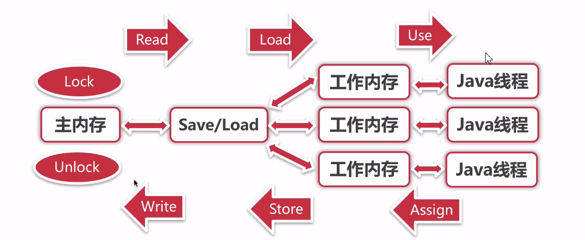

# 多线程-Volatile关键字的作用


当两个线程竞争同一资源时，如果对资源的访问顺序敏感，就称存在竞态条件。导致竞态条件发生的代码区称作临界区。


## 1. 保持内存可见性

### 失效数据

以下是一个简单的可变整数类：

```
public class MutableInteger {
    private int value;
    	
    public int get(){
        return value;
    }
    	
    public void set(int value){
        this.value = value;
    }
}
```

`MutableInteger`不是线程安全的，因为`get`和`set`方法都是在没有同步的情况下进行的。如果线程1调用了set方法，那么正在调用的get的线程2可能会看到更新后的value值，也**可能看不到**。

解决方法很简单，将`value`声明为`volatile`变量：

```
private volatile int value;
```

### 神奇的volatile关键字

神奇的volatile关键字解决了神奇的失效数据问题。


### Java变量的读写

Java通过几种原子操作完成`工作内存`和`主内存`的交互：

1. lock：作用于主内存，把变量标识为线程独占状态。
2. unlock：作用于主内存，解除独占状态。
3. read：作用主内存，把一个变量的值从主内存传输到线程的工作内存。
4. load：作用于工作内存，把read操作传过来的变量值放入工作内存的变量副本中。
5. use：作用工作内存，把工作内存当中的一个变量值传给执行引擎。
6. assign：作用工作内存，把一个从执行引擎接收到的值赋值给工作内存的变量。
7. store：作用于工作内存的变量，把工作内存的一个变量的值传送到主内存中。
8. write：作用于主内存的变量，把store操作传来的变量的值放入主内存的变量中。





### volatile如何保持内存可见性

volatile的特殊规则就是：

- read、load、use动作必须**连续出现**。
- assign、store、write动作必须**连续出现**。

所以，使用volatile变量能够保证:

- 每次`读取前`必须先从主内存刷新最新的值。
- 每次`写入后`必须立即同步回主内存当中。

也就是说，**volatile关键字修饰的变量看到的随时是自己的最新值**。线程1中对变量v的最新修改，对线程2是可见的。


## 2. 防止指令重排

在基于`偏序关系`的`Happens-Before内存模型`中，指令重排技术大大提高了程序执行效率，但同时也引入了一些问题。

### 一个指令重排的问题——被部分初始化的对象

### 懒加载单例模式和竞态条件

一个`懒加载`的`单例模式`实现如下：

```
class Singleton {
    private static Singleton instance;
    	
    private Singleton(){}
    	
    public static Singleton getInstance() {
        if (instance == null) { // 这里存在竞态条件
            instance = new Singleton();
        }
        return instance;
    }
}
```

`竞态条件`会导致`instance`引用被多次赋值，使用户得到两个不同的单例。

### DCL和被部分初始化的对象

为了解决这个问题，可以使用`synchronized`关键字将`getInstance`方法改为同步方法；但*这样串行化的单例是不能忍的*。所以我猿族前辈设计了`DCL`（Double Check Lock，双重检查锁）机制，使得大部分请求都不会进入阻塞代码块：

```
class Singleton {
    private static Singleton instance;
    
    public int f1 = 1;   // 触发部分初始化问题
    public int f2 = 2;
    	
    private Singleton(){}
	
    public static Singleton getInstance() {
        if (instance == null) { // 当instance不为null时，可能指向一个“被部分初始化的对象”
            synchronized (Singleton.class) {
                if ( instance == null ) {
                    instance = new Singleton();
                }
            }
        }
        return instance;
    }
}
```

“看起来”非常完美：既减少了阻塞，又避免了竞态条件。不错，但实际上仍然存在一个问题——**当instance不为null时，仍可能指向一个`"被部分初始化的对象"`**。

> 如果Singleton没有字段，自然也不会有部分初始化之说。因此，这里添加了两个字段，已触发部分初始化问题。

问题出在这行简单的赋值语句：

```
instance = new Singleton();
```

它并不是一个原子操作。事实上，它可以”抽象“为下面几条JVM指令：

```
memory = allocate();	//1：分配对象的内存空间
initInstance(memory);	//2：初始化对象（对f1、f2初始化）
instance = memory;		//3：设置instance指向刚分配的内存地址
```

上面*操作2依赖于操作1，但是操作3并不依赖于操作2*，所以JVM可以以“优化”为目的对它们进行`重排序`，经过重排序后如下：

```
memory = allocate();	//1：分配对象的内存空间
instance = memory;		//3：设置instance指向刚分配的内存地址（此时对象还未初始化）
ctorInstance(memory);	//2：初始化对象
```

可以看到指令重排之后，操作 3 排在了操作 2 之前，即**引用instance指向内存memory时，这段崭新的内存还没有初始化**——即，引用instance指向了一个”被部分初始化的对象”。此时，如果另一个线程调用getInstance方法，*由于instance已经指向了一块内存空间，从而if条件判为false，方法返回instance引用*，用户得到了没有完成初始化的“半个”单例。
解决这个该问题，只需要将instance声明为volatile变量：

```
private static volatile Singleton instance;
```

> 也就是说，**在只有DCL没有volatile的懒加载单例模式中，仍然存在着并发陷阱**。我确实不会拿到`两个不同的单例`了，但我会拿到`“半个”单例`（未完成初始化）。
> 然而，许多面试书籍中，涉及懒加载的单例模式最多深入到DCL，却只字不提volatile。这“看似聪明”的机制，曾经被我广大初入Java世界的猿胞大加吹捧——我在大四实习面试跟谁学的时候，也得意洋洋的从饱汉、饿汉讲到Double Check，现在看来真是傻逼。对于考查并发的面试官而言，单例模式的实现就是一个很好的切入点，看似考查设计模式，其实期望你从设计模式答到并发和内存模型。


### volatile如何防止指令重排

volatile关键字通过`“内存屏障”`来防止指令被重排序。

不同CPU架构对内存屏障的实现不同，则JVM对volatile的实现也不同。一种最简单的实现方式是：

- 在每个volatile写操作的后面插入一个Full Barriers。
- 在每个volatile读操作的前面插入一个Full Barriers。

------

> 勘误：不同CPU架构对内存屏障的实现不同，但是这里的实现怎么看都不对。特改为一种正确实现，建议阅读本文开头指向的新文章；以下是原文。
>
> ------
>
> 为了实现volatile的内存语义，编译器在生成字节码时，会在指令序列中插入内存屏障来禁止特定类型的处理器重排序。然而，对于编译器来说，发现一个最优布置来最小化插入屏障的总数几乎不可能，为此，Java内存模型采取保守策略。
>
> 下面是基于保守策略的JMM内存屏障插入策略：
>
> - 在每个volatile写操作的前面插入一个StoreStore屏障。
> - 在每个volatile写操作的后面插入一个StoreLoad屏障。
> - 在每个volatile读操作的后面插入一个LoadLoad屏障。
> - 在每个volatile读操作的后面插入一个LoadStore屏障。


### Happens-Before内存模型和程序顺序规则

> 程序顺序规则：如果程序中操作A在操作B之前，那么线程中操作A将在操作B之前执行。

前面说过，**只有在Happens-Before内存模型中才会出现这样的指令重排序问题**。Happens-Before内存模型维护了几种Happens-Before规则，`程序顺序规则`最基本的规则。程序顺序规则的目标对象是一段程序代码中的两个操作A、B，其**保证此处的指令重排不会破坏操作A、B在代码中的先后顺序，但与不同代码甚至不同线程中的顺序无关**。

因此，在synchronized代码块内部，`instance = new Singleton()`仍然会指令重排序，但重排序之后的所有指令，仍然能够保证在`instance.toString()`之前执行。进一步的，单线程中，`if ( instance == null )`能保证在synchronized代码块之前执行；但多线程中，线程1中的`if ( instance == null )`却与线程2中的synchronized代码块之间没有偏序关系，因此线程2中synchronized代码块内部的指令重排对于线程1是不期望的，导致了此处的并发陷阱。

> 类似的Happens-Before规则还有`volatile变量规则`、`监视器锁规则`等。程序猿可以`借助`（Piggyback）现有的Happens-Before规则来保持内存可见性和防止指令重排。