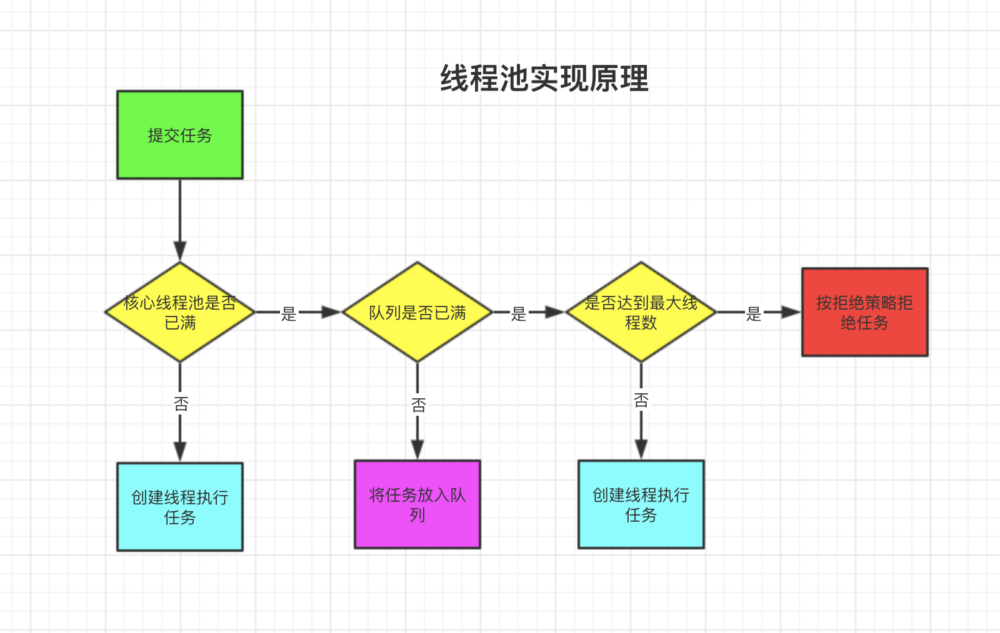

# 多线程-线程池的使用


## 1. 线程池实现原理

### 构造方法



```java
/**
 * @param corePoolSize  核心线程数
 * @param maximumPoolSize 最大线程数
 * @param keepAliveTime 线程所允许的空闲时间
 * @param unit 线程所允许的空闲时间的单位
 * @param workQueue  线程池所使用的缓冲队列
 * @param handler 线程池对拒绝任务的处理策略
 */
ThreadPoolExecutor(int corePoolSize,
                              int maximumPoolSize,
                              long keepAliveTime,
                              TimeUnit unit,
                              BlockingQueue<Runnable> workQueue,
                              RejectedExecutionHandler handler)
```

当一个任务通过`execute(Runnable)`方法欲添加到线程池时：

- 如果此时线程池中的数量小于`corePoolSize`，即使线程池中的线程都处于空闲状态，也要创建新的线程来处理被添加的任务。
- 如果此时线程池中的数量等于 `corePoolSize`，但是缓冲队列 `workQueue`未满，那么任务被放入缓冲队列。
- 如果此时线程池中的数量大于`corePoolSize`，缓冲队列`workQueue`满，并且线程池中的数量小于`maximumPoolSize`，建新的线程来处理被添加的任务。
- 那么通过 `handler`所指定的策略来处理此任务。也就是：处理任务的优先级为：核心线程`corePoolSize`、任务队列`workQueue`、最大线程`maximumPoolSize`，如果三者都满了，使用`handler`处理被拒绝的任务。
- 当线程池中的线程数量大于 `corePoolSize`时，如果某线程空闲时间超过`keepAliveTime`，线程将被终止。这样，线程池可以动态的调整池中的线程数。


### 线程池拒绝策略

**RejectedExecutionHandler（饱和策略）**：当队列和线程池都满了，说明线程池处于饱和状态，那么必须采取一种策略处理提交的新任务。这个策略默认情况下是**AbortPolicy**，表示无法处理新任务时抛出异常。。以下是JDK1.5提供的四种策略。

- AbortPolicy：直接抛出异常
- CallerRunsPolicy：只用调用者所在线程来运行任务。
- DiscardOldestPolicy：丢弃队列里最近的一个任务，并执行当前任务。
- DiscardPolicy：不处理，丢弃掉。
- 当然也可以根据应用场景需要来实现RejectedExecutionHandler接口自定义策略。如记录日志或持久化不能处理的任务。


## 2. 线程池的使用

### 创建线程池

```java
ThreadPoolExecutor threadPoolExecutor = new ThreadPoolExecutor(10, 20, 5, TimeUnit.SECONDS, new LinkedBlockingDeque<>(60));

```


### 向线程池提交任务

我们可以使用execute提交的任务，但是execute方法没有返回值，所以无法判断任务知否被线程池执行成功。通过以下代码可知execute方法输入的任务是一个Runnable类的实例。

```java
        ThreadPoolExecutor threadPoolExecutor = new ThreadPoolExecutor(10, 20, 5, TimeUnit.SECONDS, new LinkedBlockingDeque<>(60));

        threadPoolExecutor.execute(new Runnable() {
            @Override
            public void run() {
                System.out.println("线程池无返回结果");
            }
        });
```

我们也可以使用submit 方法来提交任务，它会返回一个future,那么我们可以通过这个future来判断任务是否执行成功，通过future的get方法来获取返回值，get方法会阻塞住直到任务完成，而使用get(long timeout, TimeUnit unit)方法则会阻塞一段时间后立即返回，这时有可能任务没有执行完。

```java
        ThreadPoolExecutor threadPoolExecutor = new ThreadPoolExecutor(10, 20, 5, TimeUnit.SECONDS, new LinkedBlockingDeque<>(60));

        Future<String> future = threadPoolExecutor.submit(new Callable<String>() {
            @Override
            public String call() throws Exception {
                return "ok";
            }
        });
        System.out.println("线程池返回结果:" + future.get());
```


### 线程池的关闭

**shutdown关闭线程池**

方法定义：public void shutdown()

（1）线程池的状态变成SHUTDOWN状态，此时不能再往线程池中添加新的任务，否则会抛出RejectedExecutionException异常。

（2）线程池不会立刻退出，直到添加到线程池中的任务都已经处理完成，才会退出。 

注意这个函数不会等待提交的任务执行完成，要想等待全部任务完成，可以调用：

public boolean awaitTermination(longtimeout, TimeUnit unit)


**shutdownNow关闭线程池并中断任务**

方法定义：public List<Runnable> shutdownNow()

（1）线程池的状态立刻变成STOP状态，此时不能再往线程池中添加新的任务。

（2）终止等待执行的线程，并返回它们的列表；

（3）试图停止所有正在执行的线程，试图终止的方法是调用Thread.interrupt()，但是大家知道，如果线程中没有sleep 、wait、Condition、定时锁等应用, interrupt()方法是无法中断当前的线程的。所以，ShutdownNow()并不代表线程池就一定立即就能退出，它可能必须要等待所有正在执行的任务都执行完成了才能退出。


### 合理配置线程池

**CPU密集型任务**

该任务需要大量的运算，并且没有阻塞，CPU一直全速运行，CPU密集任务只有在真正的多核CPU上才可能通过多线程加速 CPU密集型任务配置尽可能少的线程数量：CPU核数+1个线程的线程池。

例如: CPU 16核，内存32G。线程数=16


**IO密集型任务**

IO密集型任务线程并不是一直在执行任务，则应配置尽可能多的线程，如CPU核数*2

某大厂设置策略：IO密集型时，大部分线程都阻塞，故需要多配置线程数： 公式：CPU核数/1-阻塞系数 阻塞系数：0.9 比如16核CPU： 16/(1-0.9) = 160 个线程数。此时非阻塞线程=16