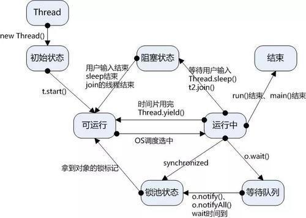

# 多线程-线程通信案例


## 1. 线程状态




1. wait()、notify()和notifyAll()方法是本地方法，并且为final方法，无法被重写。
2.  当前线程必须拥有此对象的monitor（即锁），才能调用某个对象的wait()方法能让当前线程阻塞。（这种阻塞是通过提前释放synchronized锁，重新去请求锁导致的阻塞，这种请求必须有**其他线程**通过notify()或者notifyAll()唤醒重新竞争获得锁）

3. 调用某个对象的notify()方法能够唤醒一个正在等待这个对象的monitor的线程，如果有多个线程都在等待这个对象的monitor，则只能唤醒其中一个线程； （notify()或者notifyAll()方法并不是真正释放锁，必须等到synchronized方法或者语法块执行完才真正释放锁）
4. 调用notifyAll()方法能够唤醒所有正在等待这个对象的monitor的线程，唤醒的线程获得锁的概率是随机的，取决于cpu调度


**验证**

```java
/**
 * 执行结果:
 *
 * Thread-A wait before...
 * Thread-B i=0
 * Thread-B i=1
 * Thread-B i=2
 * Thread-B notify...
 * Thread-B i=3
 * Thread-B i=4
 * Thread-B i=5
 * Thread-A wait after...
 *
 * 由结果可以看出，线程B执行notify之后线程A并没有立即获得锁，
 * 而是等待B释放锁后。
 */

public class WaitDemo {

    private int index = 0;
    Object lock = new Object();

    public void method1() {
        try {
            synchronized (lock) {
                if (index != 3) {
                    System.out.println(Thread.currentThread().getName() + " wait before...");
                    lock.wait();
                    System.out.println(Thread.currentThread().getName() + " wait after...");
                }
            }
        } catch (InterruptedException e) {
            e.printStackTrace();
        }
    }

    public void method2() {
        try {
            synchronized (lock) {
                for (int i = 0; i < 6; i++) {
                    index ++;
                    if (i == 3) {
                        lock.notify();
                        System.out.println(Thread.currentThread().getName() + " notify...");
                    }
                    System.out.println(Thread.currentThread().getName() +  " i=" + i);
                    Thread.sleep(1000);
                }
            }
        } catch (InterruptedException e) {
            e.printStackTrace();
        }
    }

    public static void main(String[] args) {
        WaitDemo waitDemo = new WaitDemo();
        Thread threadA = new Thread(new Runnable() {
            @Override
            public void run() {
                waitDemo.method1();
            }
        }, "Thread-A");
        threadA.start();

        // 注意，这里为了模拟让A线程先执行，此处sleep 1s。(如果B先执行则A wait后无法唤醒)
        try {
            Thread.sleep(1000);
        } catch (InterruptedException e) {
            e.printStackTrace();
        }

        Thread threadB = new Thread(new Runnable() {
            @Override
            public void run() {
                waitDemo.method2();
            }
        }, "Thread-B");
        threadB.start();

    }
}

```


## 2. 多线程顺序打印ABC

### 方案1：通过ReentrantLock和Condition实现

```java
/**
 * 多线程顺序打印ABC
 * lock()方法：    如果被其它线程占用锁，会阻塞在此等待锁释放
 * await()方法：   会阻塞线程，并让该Condition关联的锁释放(阻塞在lock方法处的线程重新获取锁)
 * signal()方法:   唤醒该Condition关联的线程
 *
 * 打印结果: ABC
 */
public class ABC1 {
    private int status =1;
    private ReentrantLock lock = new ReentrantLock();
    private Condition conditionA = lock.newCondition();
    private Condition conditionB = lock.newCondition();
    private Condition conditionC = lock.newCondition();

    public void printA(){
        lock.lock();
        try{
            if(status!=1){
                conditionA.await();
            }
            System.out.print("A");
            status=2;
            conditionB.signal();
        }catch(InterruptedException e){
            e.printStackTrace();
        }finally{
            lock.unlock();
        }
    }
    public void printB(){
        lock.lock();
        try{
            if(status!=2){
                conditionB.await();
            }
            System.out.print("B");
            status=3;
            conditionC.signal();
        }catch(InterruptedException e){
            e.printStackTrace();
        }finally{
            lock.unlock();
        }
    }
    public void printC(){
        lock.lock();
        try{
            if(status!=3){
                conditionC.await();
            }
            System.out.println("C");
            status=1;
            conditionA.signal();
        }catch(InterruptedException e){
            e.printStackTrace();
        }finally{
            lock.unlock();
        }
    }

    public static void main(String[] args) {

        ABC1 print = new ABC1();
        Thread threadA = new Thread(new Runnable() {
            @Override
            public void run() {
                print.printA();
            }
        });
        Thread threadB = new Thread(new Runnable() {
            @Override
            public void run() {
                print.printB();
            }
        });
        Thread threadC = new Thread(new Runnable() {
            @Override
            public void run() {
                print.printC();
            }
        });
        threadA.start();
        threadB.start();
        threadC.start();
    }
}
```


### 方案二: 通过semaphore信号量实现

```java
public class ABC2 {

    // A初始信号量数量为1
    private Semaphore A = new Semaphore(1);
    // B、C初始信号数量为0
    private Semaphore B = new Semaphore(0);
    private Semaphore C = new Semaphore(0);

    public void printA() {
        try {
            // A获取信号执行,A信号量减1,当A为0时将无法继续获得该信号量
            A.acquire();
            System.out.println("A");
            //B释放之后信号量加1(初始为0),查看源码可知
            B.release();
        } catch (InterruptedException e) {
            e.printStackTrace();
        }
    }

    public void printB() {
        try {
            B.acquire();
            System.out.println("B");
            C.release();

        } catch (InterruptedException e) {
            e.printStackTrace();
        }
    }

    public void printC() {
        try {
            C.acquire();
            System.out.println("C");

        } catch (InterruptedException e) {
            e.printStackTrace();
        }
    }

    public static void main(String[] args) {

        ABC2 abc2 = new ABC2();
        Thread threadA = new Thread(() -> {
            abc2.printA();
        });
        Thread threadB = new Thread(() -> {
            abc2.printB();
        });
        Thread threadC = new Thread(() -> {
            abc2.printC();
        });

        threadA.start();
        threadB.start();
        threadC.start();
    }

}
```

### 方案三：通过wait()和notify()实现

```java
public class ABC3 {

    final Object lock = new Object();
    String id = "A";

    public void printA() {
        synchronized (lock) {
            while (!"A".equals(id)) {
                try {
                    lock.wait();
                } catch (InterruptedException e) {
                    e.printStackTrace();
                }
            }

            System.out.println("A");
            id = "B";
            lock.notifyAll();
        }
    }

    public void printB() {
        synchronized (lock) {
            while (!"B".equals(id)) {
                try {
                    lock.wait();
                } catch (InterruptedException e) {
                    e.printStackTrace();
                }
            }

            System.out.println("B");
            id = "C";
            lock.notifyAll();
        }
    }

    public void printC() {
        synchronized (lock) {
            while (!"C".equals(id)) {
                try {
                    lock.wait();
                } catch (InterruptedException e) {
                    e.printStackTrace();
                }
            }

            System.out.println("C");
            lock.notifyAll();
        }
    }

    public static void main(String[] args) {
        ABC3 abc3 = new ABC3();
        new Thread(new Runnable() {
            @Override
            public void run() {
                abc3.printA();
            }
        }).start();

        new Thread(new Runnable() {
            @Override
            public void run() {
                abc3.printB();
            }
        }).start();

        new Thread(new Runnable() {
            @Override
            public void run() {
                abc3.printC();
            }
        }).start();
    }
}

```


## 3. 线程交叉打印数据

题目: 

A线程生产A数据，然后打印B；B线程生产B数据，打印A数据。


### 方案一

```java
/**
 * ThreadA--生产A--打印B--start
 * ThreadB--生产B--打印A--start
 *
 * 执行结果
 * thread-B:A
 * thread-A:B
 */
public class ThreadLockDemo {

    private String A = null;
    private String B = null;

    private ReentrantLock lock = new ReentrantLock();
    private Condition conditionA = lock.newCondition();
    private Condition conditionB = lock.newCondition();

    public void doA() {
        lock.lock();
        try {
            // 生产A
            A = "A";
            if (B == null) {
                conditionA.await();
            }
            // 打印B
            System.out.println(Thread.currentThread().getName() + ":" + B);

            // 唤醒B线程
            conditionB.signal();
        } catch (Exception e) {
            e.printStackTrace();
        } finally {
            lock.unlock();
        }
    }

    public void doB() {
        lock.lock();
        try {
            // 生产B
            B = "B";
            if (A == null) {
                conditionB.await();
            }
            // 打印A
            System.out.println(Thread.currentThread().getName() + ":" + A);

            // 唤醒A线程
            conditionA.signal();
        } catch (Exception e) {
            e.printStackTrace();
        } finally {
            lock.unlock();
        }
    }


    public static void main(String[] args) {
        ThreadLockDemo threadLockDemo = new ThreadLockDemo();
        new Thread(new Runnable() {
            @Override
            public void run() {
                threadLockDemo.doA();
            }
        }, "thread-A").start();

        new Thread(new Runnable() {
            @Override
            public void run() {
                threadLockDemo.doB();
            }
        }, "thread-B").start();
    }
}
```


### 方案二

```java
/**
 * ThreadA--生产A--打印B--start
 * ThreadB--生产B--打印A--start
 *
 * 执行结果
 * thread-B:A
 * thread-A:B
 */
public class ThreadLockDemo2 {

    private String A = null;
    private String B = null;

    private Object lock = new Object();

    public void doA() {
        // 生产A
        A = "A";
        synchronized (lock) {
            while (B == null) {
                try {
                    lock.wait();
                } catch (InterruptedException e) {
                    e.printStackTrace();
                }
            }
            System.out.println(Thread.currentThread().getName() + ":" + B);
            lock.notify();
        }
    }

    public void doB() {
        // 生产B
        B = "B";
        synchronized (lock) {
            if (A == null) {
                try {
                    lock.wait();
                } catch (InterruptedException e) {
                    e.printStackTrace();
                }
            }
            System.out.println(Thread.currentThread().getName() + ":" + A);
            lock.notify();
        }
    }


    public static void main(String[] args) {

        ThreadLockDemo2 threadLockDemo = new ThreadLockDemo2();
        new Thread(new Runnable() {
            @Override
            public void run() {
                threadLockDemo.doA();
            }
        }, "thread-A").start();

        new Thread(new Runnable() {
            @Override
            public void run() {
                threadLockDemo.doB();
            }
        }, "thread-B").start();
    }
}
```


## 4. join的用法

```java
/**
 * join()作用: 当前线程等待join线程(调用join方法的线程)终止
 *
 * 执行结果:
 *
 * 主线程执行结束
 * ThreadB开始执行
 * ThreadA开始执行
 * ThreadA执行结束
 * ThreadB执行结束
 */
public class JoinDemo {

    class ThreadA extends Thread {
        @Override
        public void run() {
            System.out.println("ThreadA开始执行");
            try {
                Thread.sleep(2000);
            } catch (InterruptedException e) {
                e.printStackTrace();
            }
            System.out.println("ThreadA执行结束");
        }
    }

    class ThreadB extends Thread {
        @Override
        public void run() {
            System.out.println("ThreadB开始执行");
            ThreadA threadA = new ThreadA();
            threadA.start();
            try {
                // A线程先执行完后当前线程B恢复执行
                threadA.join();
            } catch (InterruptedException e) {
                e.printStackTrace();
            }
            System.out.println("ThreadB执行结束");
        }
    }


    public static void main(String[] args) {

        ThreadB threadB = new JoinDemo().new ThreadB();
        threadB.start();
        System.out.println("主线程执行结束");
    }
}

```


## 5. 死锁

### **死锁的产生**

**互斥条件**：即某个资源在一段时间内只能由一个进程占有，不能同时被两个或两个以上的进程占有

**不可剥夺**：进程所获得的资源在未使用完毕之前，资源申请者不能强行的从资源占有者手中夺取资源，而只能由该资源的占有者进程自行释放

**请求保持**：进程至少已经占有了一个资源，但又申请了一个新的被其他进程所占有的资源，此时处于等待状态

**环路等待**：若干个进程形成环形链，每个都占用对方申请的下一个资源


```java
public class DeadLockDemo {
    private static Object resource1 = new Object();//资源 1
    private static Object resource2 = new Object();//资源 2

    public static void main(String[] args) {
        new Thread(() -> {
            synchronized (resource1) {
                System.out.println(Thread.currentThread() + "get resource1");
                try {
                    Thread.sleep(1000);
                } catch (InterruptedException e) {
                    e.printStackTrace();
                }
                System.out.println(Thread.currentThread() + "waiting get resource2");
                synchronized (resource2) {
                    System.out.println(Thread.currentThread() + "get resource2");
                }
            }
        }, "线程 1").start();

        new Thread(() -> {
            synchronized (resource2) {
                System.out.println(Thread.currentThread() + "get resource2");
                try {
                    Thread.sleep(1000);
                } catch (InterruptedException e) {
                    e.printStackTrace();
                }
                System.out.println(Thread.currentThread() + "waiting get resource1");
                synchronized (resource1) {
                    System.out.println(Thread.currentThread() + "get resource1");
                }
            }
        }, "线程 2").start();
    }
}
```

那么，通常可以用如下方式避免死锁的情况：

- 避免一个线程同时获得多个锁；
- 避免一个线程在锁内部占有多个资源，尽量保证每个锁只占用一个资源；
- 尝试使用定时锁，使用lock.tryLock(timeOut)，当超时等待时当前线程不会阻塞；
- 对于数据库锁，加锁和解锁必须在一个数据库连接里，否则会出现解锁失败的情况

https://juejin.im/post/5ae6c3ef6fb9a07ab508ac85

