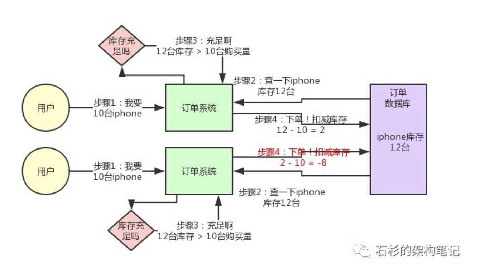
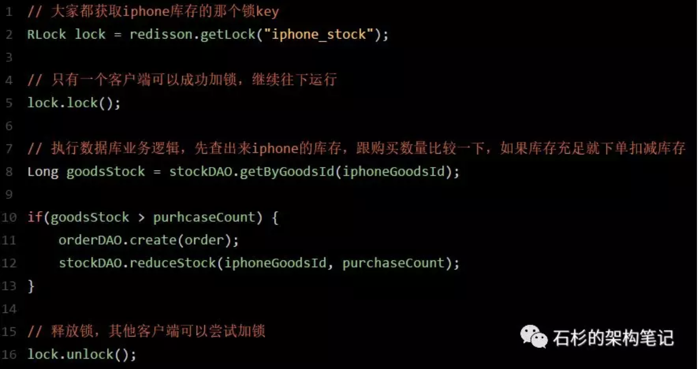
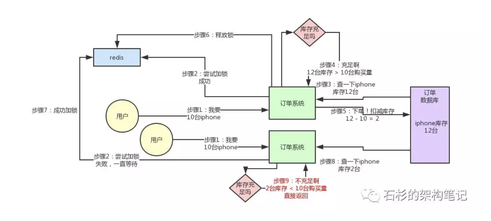
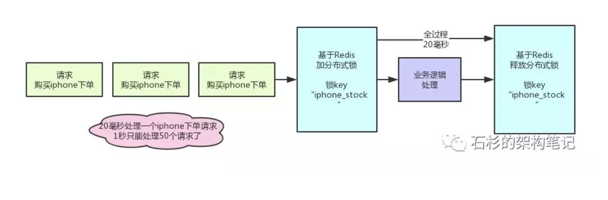
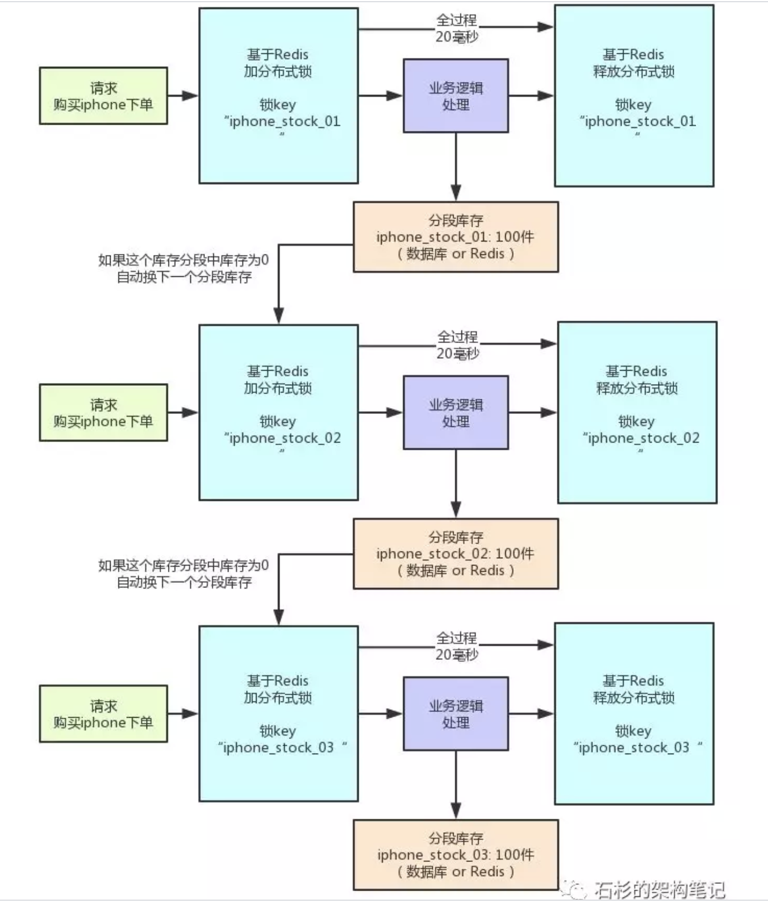

## 每秒上千订单场景下的分布式锁高并发优化实践

转载自【石杉的架构笔记】

**今天就给大家聊一个有意思的话题：每秒上千订单场景下，如何对分布式锁的并发能力进行优化？**

## 背景引入

**首先，我们一起来看看这个问题的背景？**

前段时间有个朋友在外面面试，然后有一天找我聊说：有一个国内不错的电商公司，面试官给他出了一个场景题：

假如下单时，用分布式锁来防止库存超卖，但是是每秒上千订单的高并发场景，如何对分布式锁进行高并发优化来应对这个场景？

他说他当时没答上来，因为没做过没什么思路。其实我当时听到这个面试题心里也觉得有点意思，因为如果是我来面试候选人的话，应该会给的范围更大一些。

比如，让面试的同学聊一聊电商高并发秒杀场景下的库存超卖解决方案，各种方案的优缺点以及实践，进而聊到分布式锁这个话题。

因为库存超卖问题是有很多种技术解决方案的，比如悲观锁，分布式锁，乐观锁，队列串行化，Redis原子操作，等等吧。

但是既然那个面试官兄弟限定死了用分布式锁来解决库存超卖，我估计就是想问一个点：在高并发场景下如何优化分布式锁的并发性能。

我觉得，面试官提问的角度还是可以接受的，因为在实际落地生产的时候，分布式锁这个东西保证了数据的准确性，但是他天然并发能力有点弱。

刚好我之前在自己项目的其他场景下，确实是做过高并发场景下的分布式锁优化方案，因此正好是借着这个朋友的面试题，把分布式锁的高并发优化思路，给大家来聊一聊。

## **库存超卖现象是怎么产生的？**

先来看看如果不用分布式锁，所谓的电商库存超卖是啥意思？大家看看下面的图：

这个图，其实很清晰了，假设订单系统部署两台机器上，不同的用户都要同时买10台iphone，分别发了一个请求给订单系统。

接着每个订单系统实例都去数据库里查了一下，当前iphone库存是12台。

俩大兄弟一看，乐了，12台库存大于了要买的10台数量啊！

于是乎，每个订单系统实例都发送SQL到数据库里下单，然后扣减了10个库存，其中一个将库存从12台扣减为2台，另外一个将库存从2台扣减为-8台。

现在完了，库存出现了负数！泪奔啊，没有20台iphone发给两个用户啊！这可如何是好。

## **用分布式锁如何解决库存超卖问题？**

我们用分布式锁如何解决库存超卖问题呢？其实很简单，回忆一下上次我们说的那个分布式锁的实现原理：

同一个锁key，同一时间只能有一个客户端拿到锁，其他客户端会陷入无限的等待来尝试获取那个锁，只有获取到锁的客户端才能执行下面的业务逻辑。

代码大概就是上面那个样子，现在我们来分析一下，为啥这样做可以避免库存超卖？

大家可以顺着上面的那个步骤序号看一遍，马上就明白了。

从上图可以看到，只有一个订单系统实例可以成功加分布式锁，然后只有他一个实例可以查库存、判断库存是否充足、下单扣减库存，接着释放锁。

释放锁之后，另外一个订单系统实例才能加锁，接着查库存，一下发现库存只有2台了，库存不足，无法购买，下单失败。不会将库存扣减为-8的。

## 有没有其他方案可以解决库存超卖问题？

当然有啊！比如悲观锁，分布式锁，乐观锁，队列串行化，异步队列分散，Redis原子操作，等等，很多方案，我们对库存超卖有自己的一整套优化机制。

但是前面说过了，这篇文章就聊一个分布式锁的并发优化，不是聊库存超卖的解决方案，所以**库存超卖只是一个业务场景而已**。

**以后有机会笔者会写一篇文章，讲讲\**电商库存超卖问题的解决方案\**，这篇文章先focus在一个分布式锁并发优化上，希望大家明白这个用意和背景，避免有的兄弟没看清楚又吐槽。**

**
**

**而且建议大家即使对文章里的内容有异议，公众号后台给我留言跟我讨论一下，技术，就是要多交流，打开思路，碰撞思维。**

## 分布式锁的方案在高并发场景下

好，现在我们来看看，分布式锁的方案在高并发场景下有什么问题？

问题很大啊！兄弟，不知道你看出来了没有。分布式锁一旦加了之后，对同一个商品的下单请求，会导致所有客户端都必须对同一个商品的库存锁key进行加锁。

比如，对iphone这个商品的下单，都必对“iphone_stock”这个锁key来加锁。这样会导致对同一个商品的下单请求，就必须串行化，一个接一个的处理。

**大家再回去对照上面的图反复看一下**，应该能想明白这个问题。

假设加锁之后，释放锁之前，查库存 -> 创建订单 -> 扣减库存，这个过程性能很高吧，算他全过程20毫秒，这应该不错了。

那么1秒是1000毫秒，只能容纳50个对这个商品的请求依次串行完成处理。

比如一秒钟来50个请求，都是对iphone下单的，那么每个请求处理20毫秒，一个一个来，最后1000毫秒正好处理完50个请求。

大家看一眼下面的图，加深一下感觉。

所以看到这里，大家起码也明白了，简单的使用分布式锁来处理库存超卖问题，存在什么缺陷。

缺陷就是同一个商品多用户同时下单的时候，会基于分布式锁串行化处理，导致没法同时处理同一个商品的大量下单的请求。

这种方案，要是应对那种低并发、无秒杀场景的普通小电商系统，可能还可以接受。

因为如果并发量很低，每秒就不到10个请求，没有瞬时高并发秒杀单个商品的场景的话，其实也很少会对同一个商品在一秒内瞬间下1000个订单，因为小电商系统没那场景。

## 如何对分布式锁进行高并发优化？

好了，终于引入正题了，那么现在怎么办呢？

面试官说，我现在就卡死，库存超卖就是用分布式锁来解决，而且一秒对一个iphone下上千订单，怎么优化？

现在按照刚才的计算，你一秒钟只能处理针对iphone的50个订单。

其实说出来也很简单，相信很多人看过java里的**ConcurrentHashMap**的源码和底层原理，应该知道里面的核心思路，就是**分段加锁**！

把数据分成很多个段，每个段是一个单独的锁，所以多个线程过来并发修改数据的时候，可以并发的修改不同段的数据。不至于说，同一时间只能有一个线程独占修改ConcurrentHashMap中的数据。

另外，Java 8中新增了一个LongAdder类，也是针对Java 7以前的AtomicLong进行的优化，解决的是CAS类操作在高并发场景下，使用乐观锁思路，会导致大量线程长时间重复循环。

LongAdder中也是采用了类似的分段CAS操作，失败则自动迁移到下一个分段进行CAS的思路。

其实分布式锁的优化思路也是类似的，之前我们是在另外一个业务场景下落地了这个方案到生产中，不是在库存超卖问题里用的。

但是库存超卖这个业务场景不错，很容易理解，所以我们就用这个场景来说一下。大家看看下面的图：

其实这就是分段加锁。你想，假如你现在iphone有1000个库存，那么你完全可以给拆成20个库存段，要是你愿意，可以在数据库的表里建20个库存字段，比如stock_01，stock_02，类似这样的，也可以在redis之类的地方放20个库存key。

总之，就是把你的1000件库存给他拆开，每个库存段是50件库存，比如stock_01对应50件库存，stock_02对应50件库存。

接着，每秒1000个请求过来了，好！此时其实可以是自己写一个简单的随机算法，每个请求都是随机在20个分段库存里，选择一个进行加锁。

bingo！这样就好了，同时可以有最多20个下单请求一起执行，每个下单请求锁了一个库存分段，然后在业务逻辑里面，就对数据库或者是Redis中的那个分段库存进行操作即可，包括查库存 -> 判断库存是否充足 -> 扣减库存。

这相当于什么呢？相当于一个20毫秒，可以并发处理掉20个下单请求，那么1秒，也就可以依次处理掉20 * 50  = 1000个对iphone的下单请求了。

一旦对某个数据做了分段处理之后，**有一个坑大家一定要注意：****就是如果某个下单请求，咔嚓加锁，然后发现这个分段库存里的库存不足了，此时咋办？**

**
**

**这时你得自动释放锁，然后立马换下一个分段库存，再次尝试加锁后尝试处理。这个过程一定要实现。**

## 分布式锁并发优化方案有没有什么不足？

不足肯定是有的，最大的不足，大家发现没有，很不方便啊！实现太复杂了。

- 首先，你得对一个数据分段存储，一个库存字段本来好好的，现在要分为20个分段库存字段；
- 其次，你在每次处理库存的时候，还得自己写随机算法，随机挑选一个分段来处理；
- 最后，如果某个分段中的数据不足了，你还得自动切换到下一个分段数据去处理。

这个过程都是要手动写代码实现的，还是有点工作量，挺麻烦的。

不过我们确实在一些业务场景里，因为用到了分布式锁，然后又必须要进行锁并发的优化，又进一步用到了分段加锁的技术方案，效果当然是很好的了，一下子并发性能可以增长几十倍。

## 该优化方案的后续改进

以我们本文所说的库存超卖场景为例，你要是这么玩，会把自己搞的很痛苦！

**再次强调，我们****这里的库存超卖场景，仅仅只是作为演示场景而已****，以后有机会，再单独聊聊高并发秒杀系统架构下的库存超卖的其他解决方案。**

## 上篇文章的补充说明

本文最后做个说明，笔者收到一些朋友留言，说有朋友在技术群里看到上篇文章之后，吐槽了一通上一篇文章（[《拜托，面试请不要再问我Redis分布式锁的实现原理》](http://mp.weixin.qq.com/s?__biz=MzU0OTk3ODQ3Ng==&mid=2247483893&idx=1&sn=32e7051116ab60e41f72e6c6e29876d9&chksm=fba6e9f6ccd160e0c9fa2ce4ea1051891482a95b1483a63d89d71b15b33afcdc1f2bec17c03c&scene=21#wechat_redirect)），说是那个Redis分布式锁的实现原理把人给带歪了。

在这儿得郑重说明一下，上篇文章，明确说明了是Redisson那个开源框架对Redis锁的实现原理，并不是我个人YY出来的那一套原理。

实际上Redisson作为一款优秀的开源框架，我觉得他整体对分布式锁的实现是OK的，虽然有一些缺陷，但是生产环境可用。

另外，有的兄弟可能觉得那个跟Redis官网作者给出的分布式锁实现思路不同，所以就吐槽，说要遵循Redis官网中的作者的分布式锁实现思路。

其实我必须指出，Redis官网中给出的仅仅是Redis分布式锁的实现思路而已，记住，那是思路！思路跟落地生产环境的技术方案之间是有差距的。

比如说Redis官网给出的分布式锁实现思路，并没有给出到分布式锁的自动续期机制、锁的互斥自等待机制、锁的可重入加锁与释放锁的机制。但是Redisson框架对分布式锁的实现是实现了一整套机制的。

所以重复一遍，那仅仅是思路，如果你愿意，你完全可以基于Redis官网的思路自己实现一套生产级的分布式锁出来。

另外Redis官网给出的RedLock算法，一直是我个人并不推崇在生产使用的。

因为那套算法中可能存在一些逻辑问题，在国外是引发了争议的，连Redis作者自己都在官网中给出了因为他的RedLock算法而引发争议的文章，当然他自己是不太同意的。

但是这个事儿，就搞成公说公有理，婆说婆有理了。具体请参加官网原文：

**Martin Kleppmann analyzed Redlock here. I disagree with the analysis and posted my reply to his analysis here。**

**因此下回有机会，我会通过大量手绘图的形式，给大家写一下Redis官方作者自己提出的RedLock分布式锁的算法，以及该算法基于Redisson框架如何落地生产环境使用，到时大家可以再讨论。**