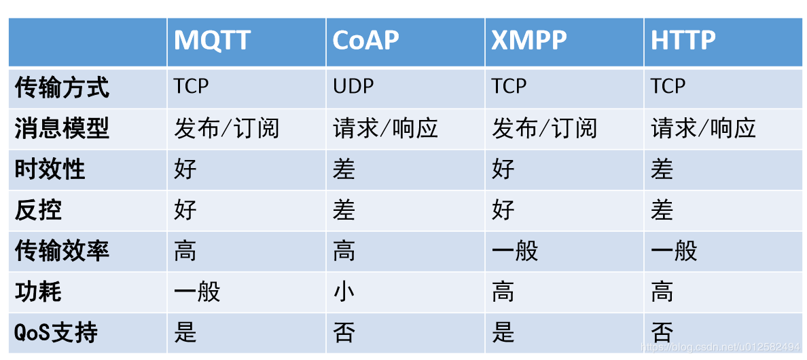

# 物联网服务端架构

**物接入：**物接入是全托管的云服务，可以在智能设备与云端之间建立安全的双向连接，并通过主流的物联网协议（如MQTT）通讯，实现从设备端到云端以及从云端到设备端的安全稳定的消息传输。

**物接入（设备型）：**主要用于对接入云端的设备进行管理和操作。物管理需要与云的物接入服务配合使用，对接入云端的设备进行一站式设备管理，可应用于设备的层级管理、监测、遥控、固件升级和维护保养等各个场景。

**物解析：**在云端为用户提供工业协议解析服务。当云端收到设备端返回的原始数据后，结合用户提供的设备通讯地址表，物解析服务可将数据解析成直接可用于存储和分析的数据。

**规则引擎：**作为物联网平台的重要组件，用于将信息根据预先设置好的规则转发至云其它服务。用户可通过规则引擎设定消息处理规则，对规则匹配的消息采取相应的转发操作，如推送给手机APP等；也可以将设备消息无缝转发到时序数据库、Kafka和对象存储中进行存储。

**时序数据库：**用于管理时间序列数据的专业化数据库。区别于传统的关系型数据库，时序数据库针对时间序列数据的存储、查询和展现进行了专门的优化，从而获得极高的数据压缩能力、极优的查询性能，特别适用于物联网应用场景。

**大数据平台：**提供了完备的大数据托管服务、智能API、众多业务场景模板以及人脸识别、文字识别、语音识别等服务，帮助用户实现智能业务。

## MQTT开源

单机版本

• Mosquitto

• Moquette

• Apollo

• RabbitMQ

分布式

• EMQTT

## MQTT architecture

## 高可用

## MQTT层堆栈

## 跨机器Router模型

## Router性能优化(字典树)

.png)

## Router性能优化(Cache)

.png)

## 数据一致性

• 支持同一client发布消息顺序性
• 保证每个订阅者收到来自同一个broker上发送到同一 个topic消息的有序性
• 不同Broker发送消息顺序取决于他们发送到这个 broker的时间决定的
• 不支持各个client之间消息全局有序 这样就需要选择一个master来分配每个消息的ID
• 对于MQTT大部分场景来说，没必要全局有序

## 数据一致范例

• C1 发送消息到 M1, M2, M3 主题 T2
• C2 发送消息到 M4, M5, M6 主题 T2
• M1必须在M2，M3之前到达T2
• M2必须在M3之前到达T2
• M4必须在M5，M6之前到达T2
• M5必须在M6之前到达T2
• T2收到的消息可能是C1和C2发送消息交织的结果

## 大数据并发处理架构

## 开发中可能出现的问题

1.采用REST API方式做authentication & Authorization
• 由于是短链接导致大量TIME_WAIT状态的TCP连接，消耗太多端口资源
• 采用RPC连接池极大降低短链接导致端口资源消耗，采用cache机制

2. 跨机器消息传递瓶颈问题
建议大规模数据订阅采用从kafka消费数据
• Broker直接将消息写入到Kafka，从kafka订阅数据
 

3.避免使用Zookeeper管理大量metadata以及watch
• 会导致zookeeper系统达到资源极限，比如最大watch的节点数太多会 导致session重建出现失败