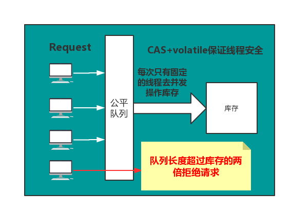

# 秒杀方案

（1）**尽量将请求拦截在系统上游**（越上游越好）；

（2）**读多写少的常用多使用缓存**（缓存抗读压力）；

**第一层，客户端怎么优化（浏览器层，APP层）**

问大家一个问题，大家都玩过微信的摇一摇抢红包对吧，每次摇一摇，就会往后端发送请求么？回顾我们下单抢票的场景，点击了“查询”按钮之后，系统那个卡呀，进度条涨的慢呀，作为用户，我会不自觉的再去点击“查询”，对么？继续点，继续点，点点点。。。有用么？平白无故的增加了系统负载，一个用户点5次，80%的请求是这么多出来的，怎么整？

（a）**产品层面**，用户点击“查询”或者“购票”后，按钮置灰，禁止用户重复提交请求；

（b）**JS层面**，限制用户在x秒之内只能提交一次请求；

APP层面，可以做类似的事情，虽然你疯狂的在摇微信，其实x秒才向后端发起一次请求。这就是所谓的“将请求尽量拦截在系统上游”，越上游越好，浏览器层，APP层就给拦住，这样就能挡住80%+的请求，这种办法只能拦住普通用户（但99%的用户是普通用户）对于群内的高端程序员是拦不住的。firebug一抓包，http长啥样都知道，js是万万拦不住程序员写for循环，调用http接口的，这部分请求怎么处理？

**第二层，站点层面的请求拦截**

怎么拦截？怎么防止程序员写for循环调用，有去重依据么？ip？cookie-id？…想复杂了，这类业务都需要登录，用uid即可。在站点层面，对uid进行请求计数和去重，甚至不需要统一存储计数，直接站点层内存存储（这样计数会不准，但最简单）。一个uid，5秒只准透过1个请求，这样又能拦住99%的for循环请求。

5s只透过一个请求，其余的请求怎么办？缓存，页面缓存，同一个uid，限制访问频度，做页面缓存，x秒内到达站点层的请求，均返回同一页面。同一个item的查询，例如车次，做页面缓存，x秒内到达站点层的请求，均返回同一页面。如此限流，既能保证用户有良好的用户体验（没有返回404）又能保证系统的健壮性（利用页面缓存，把请求拦截在站点层了）。

页面缓存不一定要保证所有站点返回一致的页面，直接放在每个站点的内存也是可以的。优点是简单，坏处是http请求落到不同的站点，返回的车票数据可能不一样，这是站点层的请求拦截与缓存优化。

好，这个方式拦住了写for循环发http请求的程序员，有些高端程序员（黑客）控制了10w个肉鸡，手里有10w个uid，同时发请求（先不考虑实名制的问题，小米抢手机不需要实名制），这下怎么办，站点层按照uid限流拦不住了。


**第三层 服务层来拦截（反正就是不要让请求落到数据库上去）**

服务层怎么拦截？大哥，我是服务层，我清楚的知道小米只有1万部手机，我清楚的知道一列火车只有2000张车票，我透10w个请求去数据库有什么意义呢？没错，**请求队列！**

对于写请求，做请求队列，每次只透有限的写请求去数据层（下订单，支付这样的写业务）

1w部手机，只透1w个下单请求去db

3k张火车票，只透3k个下单请求去db

如果均成功再放下一批，如果库存不够则队列里的写请求全部返回“已售完”。


对于读请求，怎么优化？cache抗，不管是memcached还是redis，单机抗个每秒10w应该都是没什么问题的。如此限流，只有非常少的写请求，和非常少的读缓存mis的请求会透到数据层去，又有99.9%的请求被拦住了。


当然，还有业务规则上的一些优化。回想12306所做的，分时分段售票，原来统一10点卖票，现在8点，8点半，9点，...每隔半个小时放出一批：将流量摊匀。

其次，数据粒度的优化：你去购票，对于余票查询这个业务，票剩了58张，还是26张，你真的关注么，其实我们只关心有票和无票？流量大的时候，做一个粗粒度的“有票”“无票”缓存即可。

第三，一些业务逻辑的异步：例如下单业务与 支付业务的分离。这些优化都是结合 业务 来的，我之前分享过一个观点“**一切脱离业务的架构设计都是耍流氓**”架构的优化也要针对业务。


**第四层 最后是数据库层**

浏览器拦截了80%，站点层拦截了99.9%并做了页面缓存，服务层又做了写请求队列与数据缓存，每次透到数据库层的请求都是可控的。db基本就没什么压力了，闲庭信步，单机也能扛得住，还是那句话，库存是有限的，小米的产能有限，透这么多请求来数据库没有意义。

全部透到数据库，100w个下单，0个成功，请求有效率0%。透3k个到数据，全部成功，请求有效率100%。


## 方案一

Redis预减库存+RabbitMQ异步下单。

具体流程:

1. 系统初始化，加载库存到redis
2. 收到请求，预减库存
3. 判断库存，若剩余，则入队列，否则秒杀失败
4. 出队下单

分析：

一、通过将库存加载到redis中，使得每次判断、减少库存直接从内存中读取，无需访问数据库

二、收到请求预见库存，然后判断

**注意这一顺序非常重要，保证了线程安全**

分析：因为redis封装的decr()等函数是线程安全的，无需外加同步，所以你通过decr()减少库存后获取到的库存永远都是你刚刚减少后得到的库存，本身就是个原子操作，不会存在线程安全问题，然后根据这个库存来入队，不符合条件的秒杀请求直接返回失败，极大地减少了服务器的压力，而且整个后台逻辑中，需要保证原子性的也仅仅是decr()这一个操作，并且由于redis经过了乐观锁优化，所以整个系统的并发性相对于自己首先同步代码而言，并发性得到了极大的提高。

三、完成了上述的操作，再去实现接下来的逻辑就很简单了，唯一需要注意的是，从队列中出来的请求执行秒杀过程是一个事务，需完整执行，否则回滚。 同时，订单的详情页面做一个静态化优化，前端轮询秒杀结果，得到结果后进行渲染即可。

```
    /**
     * GET POST
     * 1、GET幂等,服务端获取数据，无论调用多少次结果都一样
     * 2、POST，向服务端提交数据，不是幂等
     * <p>
     * 将同步下单改为异步下单
     *
     * @param model
     * @param user
     * @param goodsId
     * @return
     */
    @RequestMapping(value = "/do_seckill", method = RequestMethod.POST)
    @ResponseBody
    public Result<Integer> list(Model model, User user, @RequestParam("goodsId") long goodsId) {

        if (!rateLimiter.tryAcquire(1000, TimeUnit.MILLISECONDS)) {
            return  Result.error(CodeMsg.ACCESS_LIMIT_REACHED);
        }

        if (user == null) {
            return Result.error(CodeMsg.SESSION_ERROR);
        }
        model.addAttribute("user", user);
        //内存标记，减少redis访问
        boolean over = localOverMap.get(goodsId);
        if (over) {
            return Result.error(CodeMsg.SECKILL_OVER);
        }
        //预减库存
        long stock = redisService.decr(GoodsKey.getGoodsStock, "" + goodsId);//10
        if (stock < 0) {
            afterPropertiesSet();
            long stock2 = redisService.decr(GoodsKey.getGoodsStock, "" + goodsId);//10
            if(stock2 < 0){
                localOverMap.put(goodsId, true);
                return Result.error(CodeMsg.SECKILL_OVER);
            }
        }
        //判断重复秒杀
        SeckillOrder order = orderService.getOrderByUserIdGoodsId(user.getId(), goodsId);
        if (order != null) {
            return Result.error(CodeMsg.REPEATE_SECKILL);
        }
        //入队
        SeckillMessage message = new SeckillMessage();
        message.setUser(user);
        message.setGoodsId(goodsId);
        sender.sendSeckillMessage(message);
        return Result.success(0);//排队中
    }
    
        /**
     * 系统初始化,将商品信息加载到redis和本地内存
     */
    @Override
    public void afterPropertiesSet() {
        List<GoodsVo> goodsVoList = goodsService.listGoodsVo();
        if (goodsVoList == null) {
            return;
        }
        for (GoodsVo goods : goodsVoList) {
            redisService.set(GoodsKey.getGoodsStock, "" + goods.getId(), goods.getStockCount());
            //初始化商品都是没有处理过的
            localOverMap.put(goods.getId(), false);
        }
    }
```


## 方案二

### 思路



- **对每个秒杀请求入队操作**
- **当库存为N时，队列的长度超过N时，可以考虑拒绝后续请求，直接响应客户端秒杀结束**
- **为了减轻库存处理的压力，验证并发量，这里通过信号量来控制线程安全。**

### 编码

- **通过Semaphore来控制并发量**
- **通过CAS来控制更新库存，保证线程安全**

```
/***
 * 模拟秒杀
 */
public class Knock {

    /**
     * CAS操作的类
      */
    private static final Unsafe unsafe;
    /**
     * total的偏移量
     */
    private static final long totalOffset;

    /**
     * 单实例
     */
    private static volatile Knock knock;

    /**
     * 总数量
     */
    private volatile int total;

    /**
     * 信号量
     */
    private Semaphore semaphore;

    /**
     * 初始化UnSafe
     * 只能通过反射实例化
     * 在catch出只能抛出Error，unsafe只能初始化一次
     */
    static {
        try {
            Field field = Unsafe.class.getDeclaredField("theUnsafe");
            field.setAccessible(true);
            unsafe = (Unsafe) field.get(null);
            totalOffset = unsafe.objectFieldOffset(Knock.class.getDeclaredField("total"));
        } catch (Exception e) {
            e.printStackTrace();
            throw new Error(e);
        }

    }

    /**
     * 初始化公平的信号量
     *
     * @param total          总数
     * @param threadsPerTime 线程所需要的信号,控制并发量
     */
    private Knock(int total, int threadsPerTime) {
        this.total = total;
        semaphore = new Semaphore(threadsPerTime, true);
    }

    /**
     * 单例 lazy
     *
     * @param total
     * @param threadsPerTime
     * @return
     */
    public static Knock getInstance(int total, int threadsPerTime) {
        //one check
        if (null != knock) {
            return knock;
        }
        //double check
        synchronized (Knock.class) {
            if (null == knock) {
                //knock需要加上volatile关键字，1.禁止重排序 2.线程间可见
                knock = new Knock(total, threadsPerTime);
            }
        }
        return knock;
    }

    public int getTotal() {
        return total;
    }

    /**
     * CAS 减法
     * 死循环退出的条件
     * 1. 总数大于0的情况下，去做一次CAS操作，操作成功，则返回，失败则循环
     * 2. 如果total==0的情况下，直接返回false，终止抢购
     * @return
     */
    public boolean casTotal(int except) {
        for (; ; ) {
            if (total > 0) {
                int update = total - 1;
                if (unsafe.compareAndSwapInt(this, totalOffset, except, update)) {
                    return true;
                }
            } else {
                return false;
            }

        }
    }

    /**
     * 抢购
     *
     * @param need
     */
    public void doKnock(int need) {
        //当队列的长度时商品总量的两倍就返回，抢购失败
        //当total==0的时候，抢购失败
        if (semaphore.getQueueLength() > (total << 1) || total == 0) {
            System.out.println(Thread.currentThread().getId() + "：已售罄！");
            return;
        }
        //抢购
        try {
            //获取资源
            semaphore.acquire(need);
            //这里要check total的值，不符合就直接返回
            if (total == 0) {
                System.out.println(Thread.currentThread().getId() + "已售罄！");
                return;
            }
            //这里必须通过局部变量接收，因为信号量模式，同一时间有多个线程在同时执行，是线程不安全的
            int expect = total;
            //CAS修改当前库存
            if (casTotal(expect)) {
                //current是当前线程消费过后的库存
                int current = expect - 1;
                System.out.println(Thread.currentThread().getId() + "当前剩余:" + current);
            }
        } catch (Exception e) {
            e.printStackTrace();
        } finally {
            //释放资源
            semaphore.release(need);
        }
    }
}

```

### 测试，通过CPU核心数，去控制并发的线程，提高QPS

```
public class KTest {

    static class T extends Thread {
        private Knock knock;
        private int need;

        public T(Knock knock, int need) {
            this.knock = knock;
            this.need = need;
        }

        @Override
        public void run() {
            knock.doKnock(need);
        }
    }

    public static void main(String[] args) {
        //获取可用CPU核心数
        int availableProcessors = Runtime.getRuntime().availableProcessors();
        long s = System.currentTimeMillis();
        Knock knock = Knock.getInstance(1100, availableProcessors*2);
        for (int i = 0; i < 2000; i++) {
            T t = new T(knock, 1);
            try {
                t.start();
                t.join();
            } catch (InterruptedException e) {
                e.printStackTrace();
            }
        }
        long e = System.currentTimeMillis();
        System.out.println(knock.getTotal() + "======================"+(e-s));
    }
}

```


- https://juejin.im/post/5dbeb66f51882524a33b9135
- https://mp.weixin.qq.com/s/RLeujAj5rwZGNYMD0uLbrg

