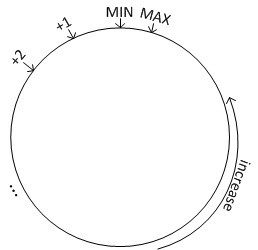
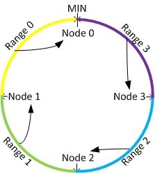
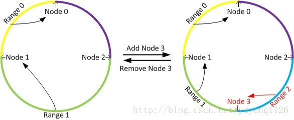

# 一致性hash算法实现

## 一致性hash算法介绍

一致性哈希是一种特殊的哈希方式。传统的哈希方式在当节点数目发生变化时，会引起大量的数据迁移，而使用一致性哈希则不会产生这种问题。一致性哈希最早是一个分布式缓存（Distributed Caching）系统的放置算法（现在很热门的Memcached就用的是一致性哈希）。但是现在它已经被广泛应用到了其它各个领域。对于任何一个哈希函数，其输出值都有一个取值范围，我们可以将这个取值区间画成一个环，如下图所示：

通过哈希函数，每个节点都会被分配到环上的一个位置，每个键值也会被映射到环上的一个位置。这个键值最终被放置在距离该它的位置最近的，且位置编号大于等于该值的节点上面，即放置到顺时针的下一个节点上面。下图形象的表示了这种放置方案，其中Node 0上面放置Range 0上面的数据，以此类推。

由于采用的哈希函数通常是与输入无关的均匀函数，因此当键值和节点都非常的多的时候，一致性哈希可以达到很好的分布式均匀性。并且由于特殊的放置规则，一致性哈希在节点数据发生变动时可以将影响控制在局部区间内，从而保证非常少的数据迁移（接近理论上的最小值）。当增加一个节点时，只有这个节点所在的区间内的数据需要被重新划分，如下图中，只需要将range 2上面的数据会从node 1中迁移到node 3上面。当删除一个节点时，只需要将这个节点上面的数据迁移到下一个节点上面，比如删除node 3，只把range 2上面的数据迁移到node 1上面就可以并，而其它的数据是不需要迁移变动的。

- https://github.com/crossoverJie/JCSprout/blob/master/docs/algorithm/consistent-hash-implement.md