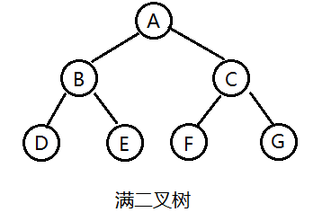
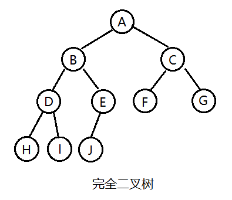

# 二叉树算法

二叉树类型




二叉树案例:


```java
public class Tree {

    class Node {
        public Object val;
        public Node left;
        public Node right;

        public Node(Object val) {
            this.val = val;
            this.left = null;
            this.right = null;
        }
    }

    /**
     * 构建二叉树
     * @return
     */
    public Node buildTree() {
        Node root = new Node("A");
        Node nodeB = new Node("B");
        Node nodeC = new Node("C");
        Node nodeD = new Node("D");
        Node nodeE = new Node("E");
        Node nodeF = new Node("F");
        Node nodeG = new Node("G");

        root.left = nodeB;
        root.right = nodeC;
        nodeB.left = nodeD;
        nodeB.right = nodeE;
        nodeC.left = nodeF;
        nodeC.right = nodeG;

        return root;
    }

    /**
     * 先序遍历:根、左子树、右子树
     * @param head
     */
    public void preOrderRecur(Node head) {
        if (head == null) {
            return;
        }
        System.out.println(head.val);
        preOrderRecur(head.left);
        preOrderRecur(head.right);
    }

    /**
     * 中序遍历：左子树、根、右子树
     * @param head
     */
    public void inOrderRecur(Node head) {
        if (head == null) {
            return;
        }
        inOrderRecur(head.left);
        System.out.println(head.val);
        inOrderRecur(head.right);
    }

    /**
     * 后序遍历：左子树、右子树、根
     * @param head
     */
    public void posOrderRecur(Node head) {
        if (head == null) {
            return;
        }
        posOrderRecur(head.left);
        posOrderRecur(head.right);
        System.out.println(head.val);
    }

    /**
     * 二叉树高度
     * @param root
     * @return
     */
    public int findDeep(Node root)
    {
        int deep = 0;
        if(root != null)
        {
            int lchilddeep = findDeep(root.left);
            int rchilddeep = findDeep(root.right);
            deep = lchilddeep > rchilddeep ? lchilddeep + 1 : rchilddeep + 1;
        }
        return deep;
    }

    /**
     * 递归求节点总数
     * @param root
     * @return
     */
    public int treeNodes(Node root){
        if(root==null){
            return 0;
        }
        else{
            int leftTreeNodes=treeNodes(root.left);
            int rightTreeNodes=treeNodes(root.right);
            return leftTreeNodes+rightTreeNodes+1;
        }
    }

    /**
     * 二叉树叶子节点
     * @param root
     * @return
     */
    public int treeLeaf(Node root){
        if(root == null){
            return 0;
        }
        if(root.left==null&&root.right==null){
            return 1;
        }
        return treeLeaf(root.left)+treeLeaf(root.right);

    }

    /**
     * 二叉树中第k层节点的个数
     * @param
     */
    public int numsOfkLevelTreeNode(Node root,int k){
        if(root == null||k<1){
            return 0;
        }
        if(k==1){
            return 1;
        }
        int numsLeft = numsOfkLevelTreeNode(root.left,k-1);
        int numsRight = numsOfkLevelTreeNode(root.right,k-1);
        return numsLeft + numsRight;
    }

    /**
     * 判断二叉树是否是平衡二叉树
     * @param node
     * @return
     */
    public boolean isBalanced(Node node){
        return maxDeath2(node)!=-1;
    }
    public int maxDeath2(Node node){
        if(node == null){
            return 0;
        }
        int left = maxDeath2(node.left);
        int right = maxDeath2(node.right);
        if(left==-1||right==-1||Math.abs(left-right)>1){
            return -1;
        }
        // 返回树高度
        return Math.max(left, right) + 1;
    }


    private static String lastVisit = "A";

    /**
     * 判断是否是二叉搜索树
     * @param root
     * @return
     */
    public static boolean isBST(Node root) {
        if(root == null) return true;

        boolean judgeLeft = isBST(root.left); // 先判断左子树

        if(String.valueOf(root.val).compareTo(lastVisit) >=0 && judgeLeft) { // 当前节点比上次访问的数值要大
            lastVisit = String.valueOf(root.val);
        } else {
            return false;
        }

        boolean judgeRight = isBST(root.right); // 后判断右子树

        return judgeRight;
    }


    public static void main(String[] args) {
        Tree tree = new Tree();
        // 构建二叉树
        Node root = tree.buildTree();
        // 中序遍历
        System.out.println("中序遍历:");
        tree.inOrderRecur(root);
        // 树深度
        int deep = tree.findDeep(root);
        System.out.println("树深度:" + deep);
        // 节点总数
        int treeNodes = tree.treeNodes(root);
        System.out.println("节点总数:" + treeNodes);
        // 二叉树叶子节点
        int treeLeaf = tree.treeLeaf(root);
        System.out.println("叶子节点:" + treeLeaf);
        // K层节点个数
        int numsOfkLevelTreeNode = tree.numsOfkLevelTreeNode(root, 2);
        System.out.println("K层节点个数" + numsOfkLevelTreeNode);
        // 判断二叉树是否是平衡二叉树
        boolean balanced = tree.isBalanced(root);
        System.out.println("平衡树:" + balanced);
        // 判断是否二叉搜索树
        boolean bst = isBST(root);
        System.out.println("二叉搜索树:" + bst);
    }
}
```

参考

- https://juejin.im/entry/587f01e11b69e6005852f605