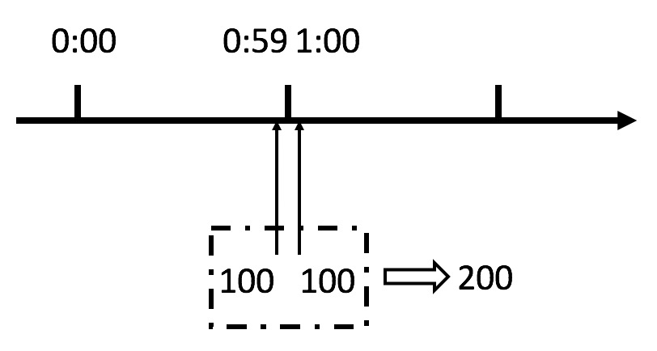

# 限流算法

一般开发高并发系统常见的限流有：限制总并发数（比如数据库连接池、线程池）、限制瞬时并发数（如 nginx 的 limit_conn 模块，用来限制瞬时并发连接数）、限制时间窗口内的平均速率（如 Guava 的 RateLimiter、nginx 的 limit_req 模块，限制每秒的平均速率）；其他还有如限制远程接口调用速率、限制 MQ 的消费速率。另外还可以根据网络连接数、网络流量、CPU 或内存负载等来限流


## 1. 计数器算法

自定义实现

```
public class CountRateLimiter {
    /**计算器*/
    private AtomicLong counter   = new AtomicLong(0);
    /**初始时间*/
    private static       long       timestamp = System.currentTimeMillis();
    /**时间窗口内最大请求个数*/
    private long limit;

    public CountRateLimiter(long limit) {
        this.limit = limit;
    }

    public boolean tryAcquire() {
        long now = System.currentTimeMillis();
        //1s之内的请求
        if (now - timestamp < 1000) {
            if (counter.get() < limit) {
                counter.incrementAndGet();
                System.out.println("pass_request");
                return true;
            } else {
                System.out.println("refuse_request");
                return false;
            }
        } else {
            counter = new AtomicLong(0);
            timestamp = now;
            System.out.println("time_end,refuse_request");
            return false;
        }
    }

    public static void main(String[] args) {
        CountRateLimiter rateLimiter = new CountRateLimiter(10);
        ExecutorService executor = Executors.newCachedThreadPool();
        for(int i=0;i<1000;i++) {
            executor.submit(() -> {
                double random = (new Random()).nextDouble();
                long a = (long)(random * 1000);
                try {
                    //睡眠一下
                    Thread.sleep(a);
                } catch (InterruptedException e) {
                    e.printStackTrace();
                }
                rateLimiter.tryAcquire();
            });
        }
        executor.shutdown();
    }
}
```

这个算法虽然简单，但是有一个十分致命的问题，那就是临界问题，我们看下图：



基于Google的Guava来实现

```
public class GuavaCountRateLimiter {

    /**缓存*/
    private LoadingCache<Long, AtomicLong> counter =
            CacheBuilder.newBuilder()
                    .expireAfterWrite(2, TimeUnit.SECONDS)
                    .build(new CacheLoader<Long, AtomicLong>() {
                        @Override
                        public AtomicLong load(Long seconds) throws Exception {
                            return new AtomicLong(0);
                        }
                    });

    /**限制每秒10*/
    private long limit = 10;

    /**
     * 使用Guava的Cache来存储计数器，过期时间设置为2秒（保证1秒内的计数器是有的），然后我们获取当前时间戳然后取秒数来作为KEY进行计数统计和限流
     */
    public boolean tryAcquire() throws ExecutionException {
        //得到当前秒
        long currentSeconds = System.currentTimeMillis() / 1000;
        if (counter.get(currentSeconds).incrementAndGet() > limit) {
            System.out.println("refuse_request:count="+ counter.get(currentSeconds));
            return true;
        } else {
            System.out.println("pass_request:count=" + counter.get(currentSeconds));
            return false;
        }
    }
    public static void main(String[] args) {
        GuavaCountRateLimiter guavaCountRateLimiter = new GuavaCountRateLimiter();
        ExecutorService executor = Executors.newCachedThreadPool();
        for(int i=0;i<1000;i++) {
            executor.submit(() -> {
                double random = (new Random()).nextDouble();
                long a = (long)(random * 1000);
                try {
                    //睡眠一下
                    Thread.sleep(a);
                } catch (InterruptedException e) {
                    e.printStackTrace();
                }
                try {
                    guavaCountRateLimiter.tryAcquire();
                } catch (ExecutionException e) {
                    e.printStackTrace();
                }
            });
        }
        executor.shutdown();
    }
}
```


## 2. 漏桶算法

基于Guava实现

```
public class LeakRateLimit {
    //定义桶的大小
    private final ConcurrentLinkedQueue<Integer> container = new ConcurrentLinkedQueue<>();

    private final static int BUCKET_LIMIT = 1000;

    //消费者 不论多少个线程，每秒最大的处理能力是1秒中执行10次
    private final RateLimiter consumerRate = RateLimiter.create(10d);

    //往桶里面放数据时，确认没有超过桶的最大的容量
    private Monitor offerMonitor = new Monitor();

    //从桶里消费数据时，桶里必须存在数据
    private Monitor consumerMonitor = new Monitor();

    /**
     * 往桶里面写数据
     * @param data
     */
    public void submit(Integer data) {
        if (offerMonitor.enterIf(offerMonitor.newGuard(() -> container.size() < BUCKET_LIMIT))) {
            try {
                container.offer(data);
                System.out.println(currentThread() + " submit.." + data + " container size is :[" + container.size() + "]");
            } finally {
                offerMonitor.leave();
            }
        } else {
            //这里时候采用降级策略了。消费速度跟不上产生速度时，而且桶满了，抛出异常
            //或者存入MQ DB等后续处理
            System.out.println("The bucket is ful..Pls latter can try...");
            throw new IllegalStateException(currentThread().getName() + "The bucket is ful..Pls latter can try...");
        }
    }

    /**
     * 从桶里面消费数据
     * @param consumer
     */
    public void takeThenConsumer(Consumer<Integer> consumer) {
        if (consumerMonitor.enterIf(consumerMonitor.newGuard(() -> !container.isEmpty()))) {
            try {
                //不打印时 写 consumerRate.acquire();
                System.out.println(currentThread() + "  waiting" + consumerRate.acquire());
                Integer data = container.poll();
                //container.peek() 只是去取出来不会删掉
                consumer.accept(data);
            } finally {
                consumerMonitor.leave();
            }
        } else {
            //当木桶的消费完后，可以消费那些降级存入MQ或者DB里面的数据
            System.out.println("will consumer Data from MQ...");
            try {
                TimeUnit.SECONDS.sleep(10);
            } catch (InterruptedException e) {
                e.printStackTrace();
            }
        }
    }

    public static void main(String[] args) {
        final LeakRateLimit bucket = new LeakRateLimit();
        final AtomicInteger DATA_CREATOR = new AtomicInteger(0);

        //生产线程 10个线程 每秒提交 50个数据  1/0.2s*10=50个
        IntStream.range(0, 10).forEach(i -> {
            new Thread(() -> {
                for (; ; ) {
                    int data = DATA_CREATOR.incrementAndGet();
                    try {
                        bucket.submit(data);
                        TimeUnit.MILLISECONDS.sleep(200);
                    } catch (Exception e) {
                        //对submit时，如果桶满了可能会抛出异常
                        if (e instanceof IllegalStateException) {
                            System.out.println(e.getMessage());
                            //当满了后，生产线程就休眠1分钟
                            try {
                                TimeUnit.SECONDS.sleep(60);
                            } catch (InterruptedException e1) {
                                e1.printStackTrace();
                            }
                        }
                    }
                }
            }).start();
        });

        //消费线程  采用RateLimiter每秒处理10个  综合的比率是5:1
        IntStream.range(0, 10).forEach(i -> {
            new Thread(
                    () -> {
                        for (; ; ) {
                            bucket.takeThenConsumer(x -> {
                                System.out.println(currentThread() + "C.." + x);
                            });
                        }
                    }
            ).start();
        });

    }
}
```


## 3. 令牌桶算法

手动实现

```
public class TokenLimiter {

    /**默认桶大小个数 即最大瞬间流量是64M*/
    private static final int DEFAULT_BUCKET_SIZE = 1024 * 1024 * 64;

    /**一个桶的单位是1字节*/
    private int everyTokenSize = 1;

    /**令牌最大数目*/
    private int bucketSize;

    /**平均流量*/
    private int avgFlowRate;

    /**队列来缓存桶数量*/
    private ArrayBlockingQueue<Byte> tokenQueue = new ArrayBlockingQueue<Byte>(
            DEFAULT_BUCKET_SIZE);

    private ScheduledExecutorService scheduledExecutorService = Executors
            .newSingleThreadScheduledExecutor();

    private volatile boolean isStart = false;

    private ReentrantLock lock = new ReentrantLock(true);

    private static final byte A_CHAR = 'a';

    public TokenLimiter() {
    }

    public TokenLimiter(int bucketSize, int avgFlowRate) {
        this.bucketSize = bucketSize;
        this.avgFlowRate = avgFlowRate;
    }

    public TokenLimiter(int everyTokenSize, int bucketSize, int avgFlowRate) {
        this.everyTokenSize = everyTokenSize;
        this.bucketSize = bucketSize;
        this.avgFlowRate = avgFlowRate;
    }

    public void addTokens(Integer tokenNum) {

        // 若是桶已经满了，就不再家如新的令牌
        for (int i = 0; i < tokenNum; i++) {
            tokenQueue.offer(Byte.valueOf(A_CHAR));
        }
    }

    public TokenLimiter build() {

        start();
        return this;
    }

    /**
     * 获取足够的令牌个数
     *
     * @return
     */
    public boolean getTokens(byte[] dataSize) {
        //传输内容大小对应的桶个数
        int needTokenNum = dataSize.length / everyTokenSize + 1;

        final ReentrantLock lock = this.lock;
        lock.lock();
        try {
            //是否存在足够的桶数量
            boolean result = needTokenNum <= tokenQueue.size();
            if (!result) {
                return false;
            }

            int tokenCount = 0;
            for (int i = 0; i < needTokenNum; i++) {
                Byte poll = tokenQueue.poll();
                if (poll != null) {
                    tokenCount++;
                }
            }

            return tokenCount == needTokenNum;
        } finally {
            lock.unlock();
        }
    }

    public void start() {

        // 初始化桶队列大小
        if (bucketSize > 0) {
            tokenQueue = new ArrayBlockingQueue<Byte>(bucketSize);
        }

        // 初始化令牌生产者
        TokenProducer tokenProducer = new TokenProducer(avgFlowRate, this);
        //定时1s生产令牌
        scheduledExecutorService.scheduleAtFixedRate(tokenProducer, 0, 1,
                TimeUnit.SECONDS);
        isStart = true;

    }

    public void stop() {
        isStart = false;
        scheduledExecutorService.shutdown();
    }

    public boolean isStarted() {
        return isStart;
    }

    class TokenProducer implements Runnable {

        private int          avgFlowRate;
        private TokenLimiter tokenLimiter;

        public TokenProducer(int avgFlowRate, TokenLimiter tokenLimiter) {
            this.avgFlowRate = avgFlowRate;
            this.tokenLimiter = tokenLimiter;
        }

        @Override
        public void run() {
            tokenLimiter.addTokens(avgFlowRate);
        }
    }

    public static TokenLimiter newBuilder() {
        return new TokenLimiter();
    }

    public TokenLimiter everyTokenSize(int everyTokenSize) {
        this.everyTokenSize = everyTokenSize;
        return this;
    }

    public TokenLimiter bucketSize(int bucketSize) {
        this.bucketSize = bucketSize;
        return this;
    }

    public TokenLimiter avgFlowRate(int avgFlowRate) {
        this.avgFlowRate = avgFlowRate;
        return this;
    }

    private String stringCopy(String data, int copyNum) {

        StringBuilder sbuilder = new StringBuilder(data.length() * copyNum);

        for (int i = 0; i < copyNum; i++) {
            sbuilder.append(data);
        }

        return sbuilder.toString();

    }

    public static void main(String[] args) throws IOException,
            InterruptedException {
        TokenLimiter tokenLimiter = TokenLimiter.newBuilder().avgFlowRate(512)
                .bucketSize(1024).build();

        BufferedWriter bufferedWriter = new BufferedWriter(
                new OutputStreamWriter(new FileOutputStream("D:/ds_test")));
        String data = "xxxx";// 四个字节

        ExecutorService executor = Executors.newCachedThreadPool();
        //初始化
        IntStream.range(0, 1000).forEach(i -> {
            executor.submit(() -> {
                //每个线程需要一个令牌
                boolean token = tokenLimiter.getTokens("x".getBytes());
                if (token) {
                    System.out.println("token pass");
                } else {
                    System.out.println("token refuse");
                }
            });
        });
    }

}
```

基于Guava实现

```
public class RateLimiterTest {

public static void main(String[] args) {
    //每秒生产两个令牌
    final RateLimiter rateLimiter = RateLimiter.create(20.0);

    ExecutorService executorService = Executors.newCachedThreadPool();
    IntStream.range(0, 10).forEach(i -> {
        executorService.submit(() -> {
            //随机休眠
            Random random = new Random();
            int r = random.nextInt(1000);
            try {
                TimeUnit.MICROSECONDS.sleep(r);
            } catch (InterruptedException e) {
                e.printStackTrace();
            }
            //每个线程需要一个令牌
            boolean token = rateLimiter.tryAcquire();
            if (token) {
                System.out.println("token pass");
            } else {
                System.out.println("token refuse");
            }
        });
    });

}
}
```


