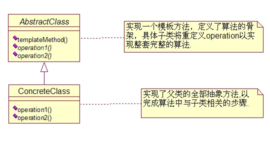
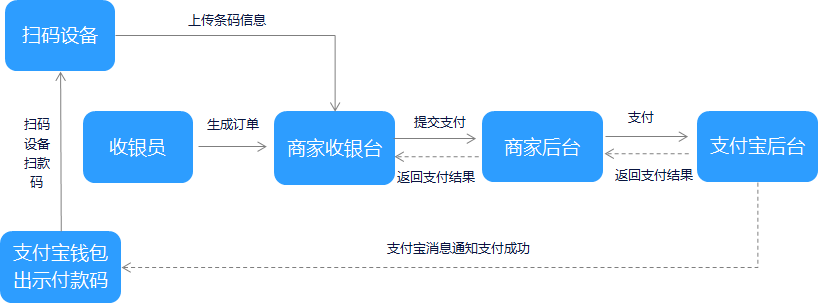

# 设计模式-模板方法模式


定义一个操作的算法骨架, 并将一些步骤延迟到子类中。模板方法使得子类可以不改变一个算法的结构即可重定义该算法的某些特定步骤。简单的说就是很多相同的步骤，只是在某一些地方有差别，那么就可以使用这种模式。

通知模板、Excel导出(表头抽象)、ArrayList、IM中消息类型的处理、通用异常处理、BaseActivity(Android)


## 1. 结构图



## 2. 通用实现

定义一个抽象模板类

```java
/**抽象模板类**/
public abstract class AbstractClass {
	/**
	 * 定义一系列步骤的方法
	 */
	public void templateMethod(){
		commonOperation();
		operation1();
		operation2();
	}
	private void commonOperation(){
		System.out.println("共同的方法");
	}
	/**要求子类去实现的方法1**/
	protected abstract void operation1();
	/**要求子类去实现的方法2**/
	protected abstract void operation2();
}
```

定义第一个具体ConcreteClassA子类

```java
public class ConcreteClassA extends AbstractClass {
	@Override
	protected void operation1() {
		System.out.println("子类A实现的operation1方法");
	}
	@Override
	protected void operation2() {
		System.out.println("子类A实现的operation2方法");
	}
}
```

定义第二个具体ConcreteClassB子类

```java
public class ConcreteClassB extends AbstractClass {
	@Override
	protected void operation1() {
		System.out.println("子类B实现的operation1方法");
	}
	@Override
	protected void operation2() {
		System.out.println("子类B实现的operation2方法");
	}
}
```

测试类TemplateTest

```java
/**
 * 测试类
 * @author pylxy
 *
 */
public class TemplateTest {
	public static void main(String[] args) {
		AbstractClass ac = new ConcreteClassA();
		ac.templateMethod();
		ac = new ConcreteClassB();
		ac.templateMethod();
	}
 
}
```


## 3. 应用场景-支付

对接过第三方支付的小伙伴都知道，在接入第三方支付时，一般支付结果都会通过异步回调的形式，通知商户服务器。而我们得到这些数据时一般都是同一流程的处理方式：验签 — 更新订单状态 — 给第三方支付服务器响应。 下面以支付宝和微信为例：支付宝和微信的验签方式和响应结果方式都是不一样的， 而更新订单状态都是商户这边处理所以业务逻辑是一样的。



抽象模板类

```java
public abstract class AbstractPayNotifyTemplate {

    /**
     * 支付异步回调处理
     *
     * @param params 回调参数
     */
    public void onNotify(Map<String, String> params) {
        //验证签名
        final boolean sign = verifySign(params);
        if (sign) {
            // 给第三方支付服务器回复支付失败状态
            setResponse(PayStatus.ERROR);
            return;
        }
        //从参数获取订单编号并更新订单支付状态，为支付成功
        final String orderSn = params.get("out_trade_no");
        updateOrderPayStatusSuccess(orderSn);
        // 给第三方支付服务器回复支付成功状态
        setResponse(PayStatus.SUCCESS);
    }

    /**
     * 验签
     *
     * @param params 回调参数
     * @return 验签结果
     */
    protected abstract boolean verifySign(Map<String, String> params);

    /**
     * 更新订单支付状态为支付成功
     *
     * @param orderSn 订单编号
     */
    private void updateOrderPayStatusSuccess(String orderSn) {
        // 根据订单编号更新订单支付状态为支付成功
    }

    /**
     * 给第三方支付返回
     *
     * @param status 支付状态
     */
    protected abstract void setResponse(PayStatus status);
}

```


具体模板类

```java
// 支付宝支付回调类
public class AliPayNotifyTemplate extends AbstractPayNotifyTemplate {

    @Override
    protected boolean verifySign(Map<String, String> params) {
        // 调用支付宝验签接口， 并返回验签结果
        return true;
    }

    @Override
    protected void setResponse(PayStatus status) {
        String res = Objects.equals(PayStatus.SUCCESS, status) ? "success" : "error";

        // 调用 ResponseUtils 直接返回 res 字符串
    }
}

// 微信支付回调类
public class WxPayNotifyTemplate extends AbstractPayNotifyTemplate {

    @Override
    protected boolean verifySign(Map<String, String> params) {
        // 调用微信支付验签接口， 并返回验签结果
        return true;
    }

    @Override
    protected void setResponse(PayStatus status) {
        String returnCode = "FAIL";
        String returnMsg = "";
        if (Objects.equals(PayStatus.SUCCESS, status)) {
            returnCode = "SUCCESS";
            returnMsg = "OK";
        }
        String res = String.format("<xml><return_code><![CDATA[%s]]></return_code><return_msg><![CDATA[%s]]></return_msg></xml>", returnCode, returnMsg);

        // 调用 ResponseUtils 返回 res xml格式内容
    }
}

```


