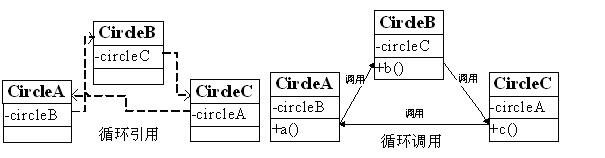

# 面试题-Spring


## 1. Spring中的Bean是线程安全的吗？

Spring框架里的Bean，默认为单例模式。

对于单例Bean,所有线程都共享一个单例实例Bean,因此是存在资源的竞争。

如果单例Bean,是一个无状态Bean，也就是线程中的操作不会对Bean的成员执行查询以外的操作，那么这个单例Bean是线程安全的。比如Spring mvc 的 Controller、Service、Dao等，这些Bean大多是无状态的，只关注于方法本身。

对于有状态的bean，最浅显的解决办法就是将多态bean的作用域由“singleton”变更为“prototype”。Spring官方提供的bean，一般提供了通过ThreadLocal去解决线程安全的方法，比如RequestContextHolder、TransactionSynchronizationManager、LocaleContextHolder等。


## 2. Spring-bean的循环依赖

### 何为循环依赖



就是这样：A、B、C 之间相互依赖。


### 造成的问题

来一串代码说明问题

```java
public class A {
    private B b;
}

public class B {
    private A a;
}
/**********************/
<bean id="beanA" class="xyz.coolblog.BeanA">
    <property name="beanB" ref="beanB"/>
</bean>
<bean id="beanB" class="xyz.coolblog.BeanB">
    <property name="beanA" ref="beanA"/>
</bean>
```

IOC 按照上面所示的 <bean> 配置，实例化 A 的时候发现 A 依赖于 B 于是去实例化 B（此时 A 创建未结束，处于创建中的状态），而发现 B 又依赖于 A ，于是就这样循环下去，最终导致 OOM。


### 循环依赖发生的时机

Bean 实例化主要分为三步，如图：


问题出现在：第一步和第二步的过程中，也就是填充属性 / 方法的过程中。


### Spring 如何解决的

- Spring 为了解决单例的循环依赖问题，使用了 **三级缓存** ，递归调用时发现 Bean 还在创建中即为循环依赖
- 单例模式的 Bean 保存在如下的数据结构中：

```java
/** 一级缓存：用于存放完全初始化好的 bean **/
private final Map<String, Object> singletonObjects = new ConcurrentHashMap<String, Object>(256);

/** 二级缓存：存放原始的 bean 对象（尚未填充属性），用于解决循环依赖 */
private final Map<String, Object> earlySingletonObjects = new HashMap<String, Object>(16);

/** 三级级缓存：存放 bean 工厂对象，用于解决循环依赖 */
private final Map<String, ObjectFactory<?>> singletonFactories = new HashMap<String, ObjectFactory<?>>(16);

/**
bean 的获取过程：先从一级获取，失败再从二级、三级里面获取

创建中状态：是指对象已经 new 出来了但是所有的属性均为 null 等待被 init
*/
```

检测循环依赖的过程如下：

- A 创建过程中需要 B，于是 **A 将自己放到三级缓里面** ，去实例化 B

- B 实例化的时候发现需要 A，于是 B 先查一级缓存，没有，再查二级缓存，还是没有，再查三级缓存，找到了！

- - **然后把三级缓存里面的这个 A 放到二级缓存里面，并删除三级缓存里面的 A**
  - B 顺利初始化完毕，**将自己放到一级缓存里面**（此时B里面的A依然是创建中状态）

- 然后回来接着创建 A，此时 B 已经创建结束，直接从一级缓存里面拿到 B ，然后完成创建，**并将自己放到一级缓存里面**

- 如此一来便解决了循环依赖的问题

```java
// 以上叙述的源代码
protected Object getSingleton(String beanName, boolean allowEarlyReference) {
    Object singletonObject = this.singletonObjects.get(beanName);
    if (singletonObject == null && isSingletonCurrentlyInCreation(beanName)) {
        synchronized (this.singletonObjects) {
            singletonObject = this.earlySingletonObjects.get(beanName);
            if (singletonObject == null && allowEarlyReference) {
                ObjectFactory<?> singletonFactory = this.singletonFactories.get(beanName);
                if (singletonFactory != null) {
                    singletonObject = singletonFactory.getObject();
                    this.earlySingletonObjects.put(beanName, singletonObject);
                    this.singletonFactories.remove(beanName);
                }
            }
        }
    }
    return (singletonObject != NULL_OBJECT ? singletonObject : null);
}
```

参考 [bean循环依赖](http://www.justdojava.com/2019/06/22/spring-analysis-note-5/)


## 3. Spring-aop失效问题

在spring 中使用 @Transactional 、 @Cacheable 或 自定义 AOP 注解时，会发现个问题：

```
在对象内部的方法中调用该对象的其他使用aop机制的方法，被调用方法的aop注解失效。
```

事务失效

```java
public class TicketService{
    //买火车票
    @Transactional
    public void buyTrainTicket(Ticket ticket){
        System.out.println("买到了火车票");
        try {
    //在同一个类中的方法，调用 aop注解（@Transactional 注解也是aop 注解） 的方法，会使aop 注解失效.
        //此时如果 sendMessage()的发送消息动作失败抛出异常，“消息存入数据库“动作不会回滚。
            sendMessage();
        } catch (Exception  e) {
            logger.warn("发送消息异常");
        }
    }

    //买到车票后发送消息
    @Transactional
    public void sendMessage(){
        System.out.println("消息存入数据库");
        System.out.println("执行发送消息动作");
    }
}
```


当我门调用buyTrainTicket(Ticket ticket)方法时，spring 的动态代理已经帮我们动态生成了一个代理的对象，暂且我就叫他 $TicketService1。

所以调用buyTrainTicket(Ticket ticket) 方法实际上是代理对象$TicketService1调用的。$TicketService1.buyTrainTicket(Ticket ticket)

但是在buyTrainTicket 方法内调用同一个类的另外一个注解方法sendMessage()时，实际上是this.sendMessage() 这个this 指的是TicketService 对象，并不是$TicketService1 代理对象，没有走代理。所以 注解失效。

**解决方法**

```
//通过AopContext.currentProxy()获取当前代理对象。
AopContext.currentProxy();
```

上边案例修改

```java
public class TicketService{
    //买火车票
    @Transactional
    public void buyTrainTicket(Ticket ticket){
        System.out.println("买到了火车票");
        try {

//通过代理对象去调用sendMessage()方法          
(TicketService)AopContext.currentProxy().sendMessage();
        } catch (Exception  e) {
            logger.warn("发送消息异常");
        }
    }

    @Transactional
    public void sendMessage(){
        System.out.println("消息存入数据库");
        System.out.println("执行发送消息动作");
    }
}
```


springboot通过实现ApplicationContext获取代理对象

```java
public class UserService{ //买火车票 
    @Transactional 
    public void hello(){
        System.out.println("开始hello"); 
        try {
             //通过代理对象去调用saveUser()方法
            SpringUtil.getBean(this.getClass()).saveUser()
        } catch(Exception e) {
            logger.error("发送消息异常");
        }
    }
 
    @Transactional
    public void saveUser(){
        User user = new User();
        user.setName("zhangsan");
        System.out.println("将用户存入数据库");
    }
}
```


## 4. spring bean的生命周期

首先看下生命周期图：


1. 实例化一个Bean，也就是我们通常说的new
2.  按照Spring上下文对实例化的Bean进行配置，也就是IOC注入
3. 如果这个Bean实现了**BeanNameAware**接口，会调用它实现的setBeanName(String beanId)方法，此处传递的是Spring配置文件中Bean的ID
4. 如果这个Bean实现了**BeanFactoryAware**接口，会调用它实现的setBeanFactory()，传递的是Spring工厂本身（可以用这个方法获取到其他Bean）
5. 如果这个Bean实现了**ApplicationContextAware**接口，会调用setApplicationContext(ApplicationContext)方法，传入Spring上下文，该方式同样可以实现步骤4，但比4更好，以为ApplicationContext是BeanFactory的子接口，有更多的实现方法
6. 如果这个Bean关联了**BeanPostProcessor**接口，将会调用postProcessBeforeInitialization(Object obj, String s)方法，BeanPostProcessor经常被用作是Bean内容的更改，并且由于这个是在Bean初始化结束时调用After方法，也可用于内存或缓存技术
7. 如果这个Bean在Spring配置文件中配置了init-method属性会自动调用其配置的初始化方法
8. 如果这个Bean关联了BeanPostProcessor接口，将会调用postAfterInitialization(Object obj, String s)方法
9. 当Bean不再需要时，会经过清理阶段，如果Bean实现了DisposableBean接口，会调用其实现的destroy方法
10. 最后，如果这个Bean的Spring配置中配置了destroy-method属性，会自动调用其配置的销毁方法

以上10步骤可以作为面试或者笔试的模板，另外我们这里描述的是应用Spring上下文Bean的生命周期，如果应用Spring的工厂也就是BeanFactory的话去掉第5步就Ok了


## 5. springMVC原理


第一步：发起请求到前端控制器(DispatcherServlet)

第二步：前端控制器请求HandlerMapping查找 Handler（ 可以根据xml配置、注解进行查找）

第三步：处理器映射器HandlerMapping向前端控制器返回Handler

第四步：前端控制器调用处理器适配器去执行Handler

第五步：处理器适配器去执行Handler

第六步：Handler执行完成给适配器返回ModelAndView

第七步：处理器适配器向前端控制器返回ModelAndView（ModelAndView是springmvc框架的一个底层对象，包括Model和view）

第八步：前端控制器请求视图解析器去进行视图解析（根据逻辑视图名解析成真正的视图(jsp)）

第九步：视图解析器向前端控制器返回View

第十步：前端控制器进行视图渲染（ 视图渲染将模型数据(在ModelAndView对象中)填充到request域）

第十一步：前端控制器向用户响应结果


## 6. Spring 事务中哪几种事务传播行为?

**支持当前事务的情况：**

- **TransactionDefinition.PROPAGATION_REQUIRED：** 如果当前存在事务，则加入该事务；如果当前没有事务，则创建一个新的事务。
- **TransactionDefinition.PROPAGATION_SUPPORTS：** 如果当前存在事务，则加入该事务；如果当前没有事务，则以非事务的方式继续运行。
- **TransactionDefinition.PROPAGATION_MANDATORY：** 如果当前存在事务，则加入该事务；如果当前没有事务，则抛出异常。（mandatory：强制性）

**不支持当前事务的情况：**

- **TransactionDefinition.PROPAGATION_REQUIRES_NEW：** 创建一个新的事务，如果当前存在事务，则把当前事务挂起。
- **TransactionDefinition.PROPAGATION_NOT_SUPPORTED：** 以非事务方式运行，如果当前存在事务，则把当前事务挂起。
- **TransactionDefinition.PROPAGATION_NEVER：** 以非事务方式运行，如果当前存在事务，则抛出异常。

**其他情况：**

- **TransactionDefinition.PROPAGATION_NESTED：** 如果当前存在事务，则创建一个事务作为当前事务的嵌套事务来运行；如果当前没有事务，则该取值等价于TransactionDefinition.PROPAGATION_REQUIRED。


参考: [举例讲解spring事务传播行为](https://zhuanlan.zhihu.com/p/88921438)


## 7. @Autowired和@Resource的区别

**共同点**

@Autowired与@Resource都可以用来装配bean. 都可以写在字段上,或写在setter方法上。


**不同点**

1. @Autowired默认**按类型装配**（这个注解是属业spring的），默认情况下必须要求依赖对象必须存在，如果要允许null值，可以设置它的required属性为false。如果我们想使用名称装配可以结合@Qualifier注解进行使用，如下：

   ```java
   @Autowired() 
   @Qualifier("baseDao")    
   private BaseDao baseDao;
   ```

   

2. @Resource **是JDK1.6支持的注解**，**默认按照名称进行装配**，名称可以通过name属性进行指定，如果没有指定name属性，当注解写在字段上时，默认取字段名，按照名称查找，如果注解写在setter方法上默认取属性名进行装配。当找不到与名称匹配的bean时才按照类型进行装配。但是需要注意的是，如果name属性一旦指定，就只会按照名称进行装配。如果既不指定name也不指定type属性，这时将通过反射机制使用byName自动注入策略。

   

   @Resource装配顺序：

   ①如果同时指定了name和type，则从Spring上下文中找到唯一匹配的bean进行装配，找不到则抛出异常。

   ②如果指定了name，则从上下文中查找名称（id）匹配的bean进行装配，找不到则抛出异常。

   ③如果指定了type，则从上下文中找到类似匹配的唯一bean进行装配，找不到或是找到多个，都会抛出异常。

   ④如果既没有指定name，又没有指定type，则自动按照byName方式进行装配；如果没有匹配，则回退为一个原始类型进行匹配，如果匹配则自动装配。

   @Resource的作用相当于@Autowired，只不过@Autowired按照byType自动注入。

## 8. mybatis中#{}与${}的差别

{}是经过预编译的，是安全的；${}是未经过预编译的，仅仅是取变量的值，是非安全的，存在SQL注入。

但涉及到动态表名和列名时，只能使用${xxx}这样的参数格式。所以，这样的参数需要我们在代码中手工进行处理来防止注入。