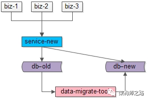
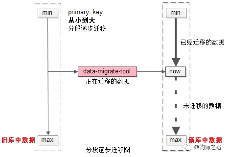
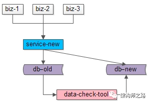
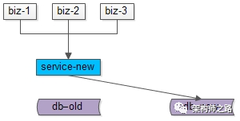

# 面试题-生产环境

## 1. 线上修改配置文件

1. springcloud config+RabbitMQ；

2. Java 提供了 WatchService 接口，这个接口是利用操作系统本身的文件监控器对目录和文件进行监控，当被监控对象发生变化时，会有信号通知，从而可以高效的发现变化。

   这种方式大致的原理：先根据操作系统 new 一个监控器（ WatchService ），然后选择要监控的配置文件所在目录或文件，然后订阅要监控的事件，例如创建、删除、编辑，最后向被监控位置注册这个监控器。一旦触发对应我们所订阅的事件时，执行相应的逻辑即可；

3. 使用 DB , 然后每个服务定时刷新一次

4. 使用 Redis, 进行消息发布订阅

5. 在需要刷新的Bean上添加@RefreshScope注解。

6. 负载切换

7. arthas热更新代码

8. zk注册watch

   

 

## 2. 线上修改bug

1. **arthas** 监控jar运行程序
2. **arthas** jad反编译bug类
3. vim修改并javac编译出新的class文件
4. **arthas** redefine重新加载编译后的class文件

## 3. mysql修改表结构

可能出现的问题: 锁表

解决方案：

1. 新创建table；
2. 数据迁移
3. 切换表

## 4. mysql数据平滑迁移-双写法

参考: [架构师之路](https://www.w3cschool.cn/architectroad/architectroad-data-smooth-migration.html)

**步骤一**：服务进行升级，对“对旧库上的数据修改”（这里的修改，为数据的insert, delete, update），在新库上进行相同的修改操作，这就是所谓的“双写”，主要修改操作包括：

（1）旧库与新库的同时insert

（2）旧库与新库的同时delete

（3）旧库与新库的同时update

由于新库中此时是没有数据的，所以双写旧库与新库中的affect rows可能不一样，不过这完全不影响业务功能，只要不切库，依然是旧库提供业务服务。

这个服务升级风险较小：

（1）写接口是少数接口，改动点较少

（2）新库的写操作执行成功与否，对业务功能没有任何影响

**步骤二**：研发一个数据迁移工具，进行数据迁移。这个数据迁移工具在本文中已经出现第三次了，把旧库中的数据转移到新库中来。

这个小工具的风险较小：

（1）整个过程依然是旧库对线上提供服务

（2）小工具的复杂度较低

（3）任何时间发现问题，都可以把新库中的数据干掉重来

（4）可以限速慢慢迁移，技术同学没有时间压力

**数据迁移完成之后，就能够切到新库提供服务了么？**

答案是肯定的，因为前置步骤进行了双写，所以理论上数据迁移完之后，新库与旧库的数据应该完全一致。

由于迁移数据的过程中，旧库新库双写操作在同时进行，**怎么证明数据迁移完成之后数据就完全一致了呢？**

如上图所示：

（1）左侧是旧库中的数据，右侧是新库中的数据

（2）按照primary key从min到max的顺序，分段，限速进行数据的迁移，假设已经迁移到now这个数据段

数据迁移过程中的修改操作分别讨论：

（1）假设迁移过程中进行了一个**双insert操作**，旧库新库都插入了数据，数据一致性没有被破坏

（2）假设迁移过程中进行了一个**双delete操作**，这又分为两种情况

​     （2.1）假设这delete的数据属于[min,now]范围，即已经完成迁移，则旧库新库都删除了数据，数据一致性没有被破坏

​     （2.2）假设这delete的数据属于[now,max]范围，即未完成迁移，则旧库中删除操作的affect rows为1，新库中删除操作的affect rows为0，但是数据迁移工具在后续数据迁移中，并不会将这条旧库中被删除的数据迁移到新库中，所以数据一致性仍没有被破坏

（3）假设迁移过程中进行了一个**双update操作**，可以认为update操作是一个delete加一个insert操作的复合操作，所以数据仍然是一致的

除非除非除非，在一种非常非常非常极限的情况下：

（1）date-migrate-tool**刚好**从旧库中将某一条数据X取出

（2）在X插入到新库中之前，旧库与新库中**刚好**对X进行了双delete操作

（3）date-migrate-tool再将X插入到新库中

这样，会出现新库比旧库多出一条数据X。

但无论如何，为了保证数据的一致性，切库之前，还是需要进行数据校验的。

**步骤三**：在数据迁移完成之后，需要使用数据校验的小工具，将旧库和新库中的数据进行比对，完全一致则符合预期，如果出现步骤二中的极限不一致情况，则以旧库中的数据为准。

这个小工具的风险依旧很小：

（1）整个过程依然是旧库对线上提供服务

（2）小工具的复杂度较低

（3）任何时间发现问题，大不了从步骤二开始重来

（4）可以限速慢慢比对数据，技术同学没有时间压力

**步骤四**：数据完全一致之后，将流量切到新库，完成平滑数据迁移。

至此，升级完毕，整个过程能够持续对线上提供服务，不影响服务的可用性