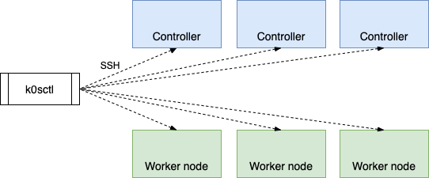

# K0s 初次上手

## 安装 k0s 

从GitHub 项目发布页 下载 k0sctl 和 k0s 

k0s-install.sh 
```shell
#!/bin/sh

set -e

if [ -n "${DEBUG}" ]; then
  set -x
fi
# v1.24.4+k0s.0
_k0s_latest() {
  curl -sSLf "https://docs.k0sproject.io/stable.txt"
}

_detect_binary() {
  os="$(uname)"
  case "$os" in
    Linux) echo "k0s" ;;
    *) echo "Unsupported operating system: $os" 1>&2; return 1 ;;
  esac
  unset os
}

_detect_arch() {
  arch="$(uname -m)"
  case "$arch" in
    amd64|x86_64) echo "amd64" ;;
    arm64|aarch64) echo "arm64" ;;
    armv7l|armv8l|arm) echo "arm" ;;
    *) echo "Unsupported processor architecture: $arch" 1>&2; return 1 ;;
  esac
  unset arch
}

_download_url() {
#  echo "https://github.com/k0sproject/k0s/releases/download/$K0S_VERSION/$k0sBinary-$K0S_VERSION-$k0sArch"
  echo "https://download.fastgit.org/k0sproject/k0s/releases/download/$K0S_VERSION/$k0sBinary-$K0S_VERSION-$k0sArch"
}

main() {
  if [ -z "${K0S_VERSION}" ]; then
    K0S_VERSION=$(_k0s_latest)
  fi

  k0sInstallPath=/usr/local/bin
  k0sBinary="$(_detect_binary)"
  k0sArch="$(_detect_arch)"
  k0sDownloadUrl="$(_download_url)"

  mkdir -p -- "$k0sInstallPath"

  echo "Downloading k0s from URL: $k0sDownloadUrl"

  curl -sSLf "$k0sDownloadUrl" >"$k0sInstallPath/$k0sBinary"
  chmod 755 -- "$k0sInstallPath/$k0sBinary"

  echo "k0s is now executable in $k0sInstallPath"
}

main

```

```shell
#k0s-airgap-bundle-v1.24.4+k0s.0-amd64
wget https://download.fastgit.org/k0sproject/k0sctl/releases/download/v0.13.2/k0sctl-linux-x64
#
wget https://download.fastgit.org/k0sproject/k0s/releases/download/v1.24.4%2Bk0s.0/k0s-v1.24.4+k0s.0-amd64
wget https://download.fastgit.org/k0sproject/k0s/releases/download/v1.24.4%2Bk0s.0/k0s-airgap-bundle-v1.24.4+k0s.0-amd64
chmod 755 k0s-v1.24.4+k0s.0-amd64
chmod 755 k0sctl-linux-x64
cp k0s-v1.24.4+k0s.0-amd64 /usr/local/bin/k0s
cp k0sctl-linux-x64 /usr/local/bin/k0sctl
k0s version
k0sctl version 
```

修改containerd 配置 /etc/containerd/config.toml

```toml
# 启用cri 插件
#disabled_plugins = ["cri"]
disabled_plugins = []


#[plugins.cri.registry.mirrors]
#[plugins.cri.registry.mirrors."docker.io"]
#endpoint = ["https://30l6yhjq.mirror.aliyuncs.com", "https://docker.mirrors.ustc.edu.cn"]

# 添加以下内容，使用国内镜像网站下载镜像
[plugins.cri.registry]
  [plugins.cri.registry.mirrors]
    # reference from https://www.ilanni.com/?p=14534
    [plugins.cri.registry.mirrors."docker.io"]
      endpoint = [
        "https://nui7xy7i.mirror.aliyuncs.com",
        "https://docker.mirrors.ustc.edu.cn",
        "http://hub-mirror.c.163.com"
      ]
    [plugins.cri.registry.mirrors."gcr.io"]
      endpoint = [
        "https://gcr.mirrors.ustc.edu.cn"
      ]
    [plugins.cri.registry.mirrors."k8s.gcr.io"]
      endpoint = [
        "https://gcr.mirrors.ustc.edu.cn/google-containers/"
      ]
    [plugins.cri.registry.mirrors."quay.io"]
      endpoint = [
        "https://quay.mirrors.ustc.edu.cn"
      ]
```
完成后重启服务
```shell
systemctl daemon-reload
systemctl restart containerd
systemctl status containerd
systemctl restart containerd && systemctl enable containerd
```



## 初始化集群 

### 单节点
```shell
sudo k0s install controller --single
```
### 安装  k0s 控制器并激活工作端.

```shell
 k0s install controller --enable-worker
 systemctl start k0scontroller
 systemctl status k0scontroller
 sudo systemctl enable k0scontroller
 
```


### 启动k0s 

```shell
# 启动
k0s start 
# k0s 停止
k0s stop 
#删除
k0s reset 

```

常用命令 

```shell
# list node
sudo k0s kubectl get node
# cordon node
sudo k0s kubectl cordon rpi4
# uncordon node
sudo k0s kubectl uncordon rpi4

k0s kubectl get pods --all-namespaces
k0s kubectl get nodes -o wide

# drain pod in node firstly before delete node
sudo k0s kubectl drain rpi4 --delete-local-data --force --ignore-daemonsets
# delete node
sudo k0s kubectl delete node rpi4

```
### 初始化集群配置文件

创建令牌

```shell
k0s token create --role=worker
k0s worker <login-token> &

sudo k0s worker "H4sIAAAAAAAC/2xVUY+bPBZ9n1+RPzCtDcmoRNqHktghZHBqY5vgN8B0IDbEBSZhstr/vpq0lXal7+36nqNzrKure54K18p6GNtLv15c4VNl38epHsb10/PiT71+WiwWi7EervWwXjTT5Mb1168w8L7Al29fIABfPBisX5ZL/0Gs6mFqf7ZVMdXPxfvUXIZ2+njWxVSsF68pmF5TuGFCx7wNt0zGIhUqpgAL9sDAtDE....6n31Hxu/4dFX9z48H6bLyPj9d7Wdt6ei4vl2mchsL9v9r7MNT99PxX6dE0ba/Xi82l/9m+Pbmh/lkPdV/V43rx7/88fao+zP+I/IP8w/jxheli6n69COr6rfW/jFr/fHmf9bJrpzME8Om/AQAA//8V8FiGBwcAAA==" &

```

添加控制端节点到K0s 集群 

```shell
sudo su -
k0s token create --role=controller
k0s controller "<token>"
k0s controller "H4sIAAAAAAAC/3RVwXKjOhbd5yv8A+kngZ2OXTWLxpaMcZBbQhJGO0AkYAlQA7GJp+bfp5J+XTWzeLure06do7p1656H3DWyGsam7zaLK3wo7fs4VcO4eXhc/F1vHhaLxWKshms1bBb1NLlx89dfcO19g0/P3yAA3zy43qyXS/+LWFbD1Lw2ZT5Vj/n7VPdDM3086nzKN4uXBEwvCdwyoSPeBDsmI5EIFVGABfvCwLQWFgNScNsRHLgThSyVZaBsFPDo5/32bMDX2jQCYS2X0iSCCR+LrLL7T/18Ni0eVttVkYMD6UfTdV8/Q7Kn7Xv6PiT258sT4b7+Pn65Mz9NZWw2PR99M4Dbn7f8H3Yai66fGP2FfTNJ3eLLZ999q8Pbiheq2GqiurcbP4938ePoW//H+L/IPDl/3XR6beVN1mMS+fvz9X396+L4en9++v93v9alfv7w//DQAA//8NPyCvDQcAAA=="
```


```shell
k0sctl init > k0sctl.yaml

```

```yaml
apiVersion: k0sctl.k0sproject.io/v1beta1
kind: Cluster
metadata:
  name: k0s-cluster
spec:
  hosts:
  - ssh:
      address: 192.168.202.142
      user: root
      port: 22
      keyPath: /root/.ssh/id_rsa
    role: controller
  - ssh:
      address: 10.0.0.2
      user: root
      port: 22
      keyPath: /root/.ssh/id_rsa
    role: worker
  k0s:
    version: 1.24.3+k0s.0
    dynamicConfig: false

```

部署集群

. Deploy the cluster#

运行 k0sctl apply 命令处理集群环境
```shell
# Run k0sctl apply to perform the cluster deployment:
k0sctl apply --config k0sctl.yaml
```

## 远程管理 k0s 集群

可以使用 kubectl 远程管理集群. K0s 存储 k8s 配置文件 KUBECONFIG 在 /var/lib/k0s/pki/admin.conf.

```shell
sudo cp /var/lib/k0s/pki/admin.conf ~/k0s.conf
scp clouduser@192.168.100.219:~/k0s.conf .
export KUBECONFIG=k0s.conf

```
### 测试一下

#### Deploying NGINX on a Kubernetes Cluster

```shell
k0s kubectl get nodes
# 创建部署
k0s kubectl create deployment nginx --image=nginx

k0s kubectl get deployments

k0s kubectl describe deployment nginx


```

```shell
kubectl apply -f - <<EOF
apiVersion: apps/v1
kind: Deployment
metadata:
  name: nginx-deployment
spec:
  selector:
    matchLabels:
      app: nginx
  replicas: 2 
  template:
    metadata:
      labels:
        app: nginx
    spec:
      containers:
      - name: nginx
        image: nginx:latest
        ports:
        - containerPort: 80
EOF
```

####  Exposing Your Nginx Service to Public Network

```shell
kubectl expose deployment nginx-deployment --type=NodePort --port=80

###
k0s kubectl create service nodeport nginx --tcp=80:80
k0s kubectl get svc

curl master-node:30386
```

```shell
sudo cp /var/lib/k0s/pki/admin.conf ~/admin.conf
export KUBECONFIG=~/admin.conf
```


```shell
k0s token create --role=worker

sudo k0s install worker --token-file /path/to/token/file
sudo k0s start
```

-------

### k0s 备份

```shell
#k0s backup --save-path=<directory>
k0s backup --save-path=.  
k0s backup --save-path=/root/backup   

```

```shell
#!/bin/bash

echo -e "\n[info] Ensuring backup save path [${K0S_BACKUP_SAVE_PATH}] exists...";
mkdir -p ${K0S_BACKUP_SAVE_PATH};

echo -e "\n[info] Running k0s backup..."
/usr/bin/k0s backup --save-path=${K0S_BACKUP_SAVE_PATH}

echo -e "\n[info] Retrieving most recent backup..."
MOST_RECENT_BACKUP=$(ls -Art ${K0S_BACKUP_SAVE_PATH} | tail -n1 | tr -d '\n')

if [ -z $MOST_RECENT_BACKUP ] ; then
    echo -e "\n[error] Failed to find a most recent backup in [${K0S_BACKUP_SAVE_PATH}]";
    exit 1;
fi

echo -e "\n[info] Most recent backup is [${MOST_RECENT_BACKUP}]"

echo "[info] Sending data to Backblaze account with ID [${B2_ACCOUNT_ID}]..."
rclone copy \
       --b2-account $B2_ACCOUNT_ID \
       --b2-key $B2_KEY \
       ${K0S_BACKUP_SAVE_PATH}/${MOST_RECENT_BACKUP} \
       :b2:k8s-${CLUSTER_NAME}-backups/cluster/`date +%F`
```

从备份文件恢复

```shell

k0s restore ./k0s_backup_2022-08-26T16_58_54_000Z.tar.gz

```


## k0s config 创建命令创建的文件格式及内容实例:

```yaml
apiVersion: k0s.k0sproject.io/v1beta1
kind: ClusterConfig
metadata:
  name: k0s
spec:
  api:
    address: 192.168.68.104
    port: 6443
    k0sApiPort: 9443
    externalAddress: my-lb-address.example.com
    sans:
      - 192.168.68.104
  storage:
    type: etcd
    etcd:
      peerAddress: 192.168.68.104
  network:
    podCIDR: 10.244.0.0/16
    serviceCIDR: 10.96.0.0/12
    provider: kuberouter
    calico: null
    kuberouter:
      mtu: 0
      peerRouterIPs: ""
      peerRouterASNs: ""
      autoMTU: true
  podSecurityPolicy:
    defaultPolicy: 00-k0s-privileged
  telemetry:
    enabled: true
  installConfig:
    users:
      etcdUser: etcd
      kineUser: kube-apiserver
      konnectivityUser: konnectivity-server
      kubeAPIserverUser: kube-apiserver
      kubeSchedulerUser: kube-scheduler
  images:
    konnectivity:
      image: k8s.gcr.io/kas-network-proxy/proxy-agent
      version: v0.0.25
    metricsserver:
      image: k8s.gcr.io/metrics-server/metrics-server
      version: v0.5.0
    kubeproxy:
      image: k8s.gcr.io/kube-proxy
      version: v1.23.6
    coredns:
      image: k8s.gcr.io/coredns/coredns
      version: v1.7.0
    calico:
      cni:
        image: docker.io/calico/cni
        version: v3.18.1
      node:
        image: docker.io/calico/node
        version: v3.18.1
      kubecontrollers:
        image: docker.io/calico/kube-controllers
        version: v3.18.1
    kuberouter:
      cni:
        image: docker.io/cloudnativelabs/kube-router
        version: v1.2.1
      cniInstaller:
        image: quay.io/k0sproject/cni-node
        version: 0.1.0
    default_pull_policy: IfNotPresent
  konnectivity:
    agentPort: 8132
    adminPort: 8133
```

```yaml
apiVersion: k0s.k0sproject.io/v1beta1
kind: ClusterConfig
metadata:
  creationTimestamp: null
  name: k0s
spec:
  api:
    address: 192.168.202.142
    k0sApiPort: 9443
    port: 6443
    sans:
    - 192.168.202.142
    - 172.17.0.1
    - 10.244.0.1
    tunneledNetworkingMode: false
  controllerManager: {}
  extensions:
    helm:
      charts: null
      repositories: null
    storage:
      create_default_storage_class: false
      type: external_storage
  images:
    calico:
      cni:
        image: docker.io/calico/cni
        version: v3.23.3
      kubecontrollers:
        image: docker.io/calico/kube-controllers
        version: v3.23.3
      node:
        image: docker.io/calico/node
        version: v3.23.3
    coredns:
      image: k8s.gcr.io/coredns/coredns
      version: v1.7.0
    default_pull_policy: IfNotPresent
    konnectivity:
      image: quay.io/k0sproject/apiserver-network-proxy-agent
      version: 0.0.32-k0s1
    kubeproxy:
      image: k8s.gcr.io/kube-proxy
      version: v1.24.3
    kuberouter:
      cni:
        image: docker.io/cloudnativelabs/kube-router
        version: v1.4.0
      cniInstaller:
        image: quay.io/k0sproject/cni-node
        version: 1.1.1-k0s.0
    metricsserver:
      image: k8s.gcr.io/metrics-server/metrics-server
      version: v0.5.2
    pushgateway:
      image: quay.io/k0sproject/pushgateway-ttl
      version: edge@sha256:7031f6bf6c957e2fdb496161fe3bea0a5bde3de800deeba7b2155187196ecbd9
  installConfig:
    users:
      etcdUser: etcd
      kineUser: kube-apiserver
      konnectivityUser: konnectivity-server
      kubeAPIserverUser: kube-apiserver
      kubeSchedulerUser: kube-scheduler
  konnectivity:
    adminPort: 8133
    agentPort: 8132
  network:
    calico: null
    clusterDomain: cluster.local
    dualStack: {}
    kubeProxy:
      mode: iptables
    kuberouter:
      autoMTU: true
      mtu: 0
      peerRouterASNs: ""
      peerRouterIPs: ""
    podCIDR: 10.244.0.0/16
    provider: kuberouter
    serviceCIDR: 10.96.0.0/12
  podSecurityPolicy:
    defaultPolicy: 00-k0s-privileged
  scheduler: {}
  storage:
    etcd:
      externalCluster: null
      peerAddress: 192.168.202.142
    type: etcd
  telemetry:
    enabled: true
status: {}

```
参考资料
[k0sproject.io](https://www.k0sproject.io)

[how-to-set-up-k0s-kubernetes-a-quick-and-dirty-guide](https://www.mirantis.com/blog/how-to-set-up-k0s-kubernetes-a-quick-and-dirty-guide/)

[k0s-introduction](https://www.sobyte.net/post/2021-08/k0s-introduction/)

[k0sproject blog](https://medium.com/k0sproject)

[kubernetes部署Nginx](https://zhuanlan.zhihu.com/p/265997618)

[deploy-kubernetes-cluster-on-linux-with-k0s](https://computingforgeeks.com/deploy-kubernetes-cluster-on-linux-with-k0s/)

[how-to-backup-and-restore-k0s-kubernetes-cluster](https://techviewleo.com/how-to-backup-and-restore-k0s-kubernetes-cluster/)
