# 从零开始VUE3（基础篇）

## 一、使用vue-cli4.5+安装VUE3.0

### 1. 首先需要按照原始搭建模式下载vue脚手架

```shell
npm install -g @vue/cli

vue create vue3.0-practice-room
```

### 2.选择安装3.0版本vue（vue-cli，4.5版本已有此选项，往前版本未测试）

在Choose a version of Vue.js that you want to start the project with时候选择3.x

等一路飘完了，开始写代码

## 二、创建我的第一个vue3.0文件

在项目创建完成后，脚手架已经帮我们生成了基础目录和几个示例代码，目录结构和2.0非常相似
我们在views目录下创建第一个页面 MyPage.vue，看起来和vue2.0非常像

```vue
<template>
  <div class="myPage">
　　   <h1>这是我的第一个vue3.0项目</h1>
  </div>
</template>

<script>
 export default {
 }
</script>

<style lang="less" scoped>
.myPage {
  color: blue;
}
</style>
```

然后我们去路由里面添加它，这里就有点不一样了

```javascript
import {
    createRouter,
    createWebHistory
} from 'vue-router'
import Home from '../views/Home.vue'

const routes = [{
        path: '/',
        name: 'Home',
        component: Home
    },
    {
        path: '/MyPage',
        name: 'MyPage',
        // route level code-splitting
        // this generates a separate chunk (about.[hash].js) for this route
        // which is lazy-loaded when the route is visited.
        component: () => import( /* webpackChunkName: "about" */ '../views/MyPage.vue')
    }
]

const router = createRouter({
    history: createWebHistory(),
    routes
})

export default router
```

我们清理掉About相关代码，不去理会

大家可以看到，这里的路由不再是Vue.use这种模式，而是变成了 createRouter createWebHistory 这两个函数

函数内部作用我们后期拆解，这里不做过多介绍，我们可以看到他们一个是创建了基础路由，一个创建了路由所需的配置，createWebHistory接收一个参数为项目路由的baseUrl, 我们这里不传

不要忘记修改App.vue根文件里面添加上我们刚才写的路由，一样的把About清理掉

```App.vue
<template>
  <div id="app">
    <div id="nav">
      <router-link to="/">Home</router-link> |
      <router-link to="/MyPage">MyPage</router-link>
    </div>
    <router-view/>
  </div>
</template>

<style lang="less">
#app {
  font-family: Avenir, Helvetica, Arial, sans-serif;
  -webkit-font-smoothing: antialiased;
  -moz-osx-font-smoothing: grayscale;
  text-align: center;
  color: #2c3e50;
}

#nav {
  padding: 30px;

  a {
    font-weight: bold;
    color: #2c3e50;

    &.router-link-exact-active {
      color: #42b983;
    }
  }
}
</style>
```

至此，我们可以运行 ***npm run serve*** 看看效果了

## 三、新的函数介绍（hook？）

### 1. 入口方法setup

setup 可以算是一个生命周期，它也替代了之前的 created beforeCreate 等 如果非要研究它的时机，官方给出的是，它在beforeCreate之前调用

并且它提代之前的包裹模式，我们在这里面去声明我们之前在data中写的那些参数，每个setup需要return一个object供其他地方使用。然后还可以使用computed等之前用的方法

我小列一下 下面给出示例:

- ref 需要return的简单响应式数据
- reactive 需要return的深层响应式数据
- readonly 需要return的深层只读相应数据
- watchEffect 类似于react hooks 这个方法内部的任何依赖发生变化，它都会执行一次
- watch vue2的watch
- onMounted  挂载完成后的生命周期
- onUpdated  组件更新的生命周期
- onUnmounted 组件被卸载的生命周期

这里简单说一下 ref和reactive

新手可以理解为 ref为简单数据类型声明 reactive用来做复杂数据类型声明

从监听层即说的话  ref这里声明的数据 监听层级为浅层  reactive 监听层级为深层

再从代码的风格来说的话 ref为扁平化的 reactive为类似于object这样的

我们上个代码 看看效果

```vue
<template>
  <div class="myPage">
    <h1>这是我的第一个vue3.0项目</h1>
    <h2>{{count}}</h2>
    <h3>{{person.name}}</h3>
    <h3>{{person.sex}}</h3>
    <h3>{{person.age}}</h3>

  </div>
</template>

<script>
import { ref, reactive } from "vue";
export default {
  setup() {
    const count = ref(0);

    console.log(count)   // 建议打印看看内部内容 （template会直接取它的value 在另一个reactive包裹的对象中）这两种情况 不需要自己去count.value  其他地方 一般都要带.value

    const add = () => {count.value++}  //这里是声明方法 一样要return出去

    const person = reactive({ name: "qm", sex: true, age: 18 });

    console.log(person)  // 建议打印看看内部内容
    // return 的属性会暴露给模板，模板中可以直接使用,这里没有 return 的， 无法在模板中使用  (官网说的)

    onMounted(()=>{
      console.log(123)
    })
    onUpdated(()=>{
      console.log(456)
    })
    onUnmounted(()=>{
      console.log(789)
    })
     watchEffect(()=>{
      console.log(count.value)   // 对内部所设计到的变化的内容进行监听 当这个方法内部的内容设计的变化的时候 会触发当前函数 这里 如果count的value变化了 就会执行打印
    })
    watch(() => count.value, val => {
      console.log( `当前的count值${val}` )
    })   // watch 单条监听
    watch(() => [count.value,person.age], (val, age) => {
      console.log( `当前的count值${val},当前的age值${age}` )
    })   // watch 多条监听
    return {
      count,
      person,
      add
    };
  }
};
</script>

<style lang="less" scoped>
.myPage {
  color: blue;
}
</style>
```

## 四、this去哪了？

vue3里面不会使用 this去寻找实例了，这里它提供了getCurrentInstance方法来获取实例，上代码

```javascript
    const {
        ctx
    } = getCurrentInstance()
    console.log(getCurrentInstance()) //分析一下内部的东西有什么
    console.log(ctx.$router) // 找一下方法 找一下$route  (currentRoute)   $router 和 $route 就和以前一样用法了
```


## 五 VUEX 4.0

在 vue3里面怎么使用vuex呢？其实我想说这是最简单的 因为用法基本没变
我们先来看看怎么去创造一个vuex

```vuex
import { createStore } from 'vuex'
import { user } from "@/store/user"
export default createStore({
    modules: {
        user
    }
})
```

然后我们看看user这个modules里面是什么样子的

```javascript

export const user = {
    namespaced: true,
    state: {
        username: "qimiao"
    },
    mutations: {
        changeUsername(state, username) {
            state.username = username
        }
    },
    actions: {
        actionUsername({ commit }) {
            console.log(123)
        }
    },
    getters: {
        getUsername(state) {
            return state.username
        }
    }
}
```

是不是和我们之前的vuex使用一模一样
我们来看看在vue里面怎么使用的

```vue
<template>
  <div class="myPage">
    <h1>这是我的第一个vue3.0项目</h1>
    <h4>{{username}}</h4>
  </div>
</template>

<script>
import {getCurrentInstance,computed } from "vue";
import { useStore } from 'vuex';
export default {
  setup() {
    const { ctx } = getCurrentInstance()
    console.log(getCurrentInstance())   //分析一下内部的东西有什么
    console.log(ctx.$store,useStore()) // 这里是获取到vuex  两种方案都可以 剩下的操作就一样了 暂时不知道怎么用辅助函数 mapGetters ... 等等
    const username = computed(()=>ctx.$store.getters["user/getUsername"])
    console.log(ctx.$store.getters)  // dispatch commit 等都一样
    return {
      username,
    };
  }
};
</script>

<style lang="less" scoped>
.myPage {
  color: blue;
}
</style>
```

## 六、参数传递 组件属性 原生方法等补充

我们直接拿HelloWrold这个组件删一删来研究

```vue

<template>
  <div class="hello">
    <h1>{{ msg }}</h1>
  </div>
</template>

<script>
  import { getCurrentInstance } from "vue";
export default {
  name: 'HelloWorld',
  props: {
    msg: String
  },
  setup(){
    const {ctx} = getCurrentInstance()
    console.log(ctx.msg) // 类似 $emit $parent $refs 等之前那些带$的 都在 ctx上
    console.log(getCurrentInstance().rander()) // 类似 render，JSX，createElement等这些都在getCurrentInstance上
  }
}
</script>

<!-- Add "scoped" attribute to limit CSS to this component only -->
<style scoped lang="less">
h3 {
  margin: 40px 0 0;
}
ul {
  list-style-type: none;
  padding: 0;
}
li {
  display: inline-block;
  margin: 0 10px;
}
a {
  color: #42b983;
}
</style>
```

## 补充讲解、provide 和 inject  (可能 你并不需要 vuex)

先解释一下

- provide() 和 inject() 可以实现嵌套组件之间的数据传递。
- 这两个函数只能在 setup() 函数中使用。
- 父级组件中使用 provide() 函数向下传递数据。
- 子级组件中使用 inject() 获取上层传递过来的数据。

如果父组件provide了 那么 他的所有的子、孙等等等等 都可以通过inject获取参数

这两个属性让我们可以做到让单个vue系统中的组件可以直接访问指定组件并且做对应操作

我们就地取材 在Home.vue 和 HelloWorld中体验一下

hello.vue

```hello.vue

// hello.vue

<template>
  <div class="hello">
    <h1>{{ msg }}</h1>
  </div>
</template>

<script>
import { getCurrentInstance, inject,reactive } from "vue";

export default {
  name: 'HelloWorld',
  props: {
    msg: String
  },
  setup(){
    const {ctx} = getCurrentInstance()
    console.log(ctx.msg) // 类似 $emit $parent $refs 等之前那些带$的 都在 ctx上
    const that = getCurrentInstance()
    console.log(that)
    // 类似 render，JSX，createElement等这些都在getCurrentInstance上
    console.log(inject("qm"))
  },
}
</script>

<!-- Add "scoped" attribute to limit CSS to this component only -->
<style scoped lang="less">
h3 {
  margin: 40px 0 0;
}
ul {
  list-style-type: none;
  padding: 0;
}
li {
  display: inline-block;
  margin: 0 10px;
}
a {
  color: #42b983;
}
</style>
```

Home.vue

```Home.vue

// Home.vue

<template>
  <div class="home">
    
    <HelloWorld msg="Welcome to Your Vue.js App" />
  </div>
</template>

<script>
// @ is an alias to /src
import HelloWorld from '@/components/HelloWorld.vue'
import {setup,provide} from 'vue'
export default {
  name: 'Home',
  components: {
    HelloWorld
  },
  setup(){
    provide("qm", "我是奇淼挂在provide的属性")  //这里挂载上
  }
}
</script>
```
可以挂载任意属性，因此我们完全可以使用provide实现一套我们自己的vuex 因此 也就应了网上一直在说的那句话

可能 你并不需要 vuex

EmEditor 激活密钥
终身授权激活密钥：DMAZM-WHY52-AX222-ZQJXN-79JXH


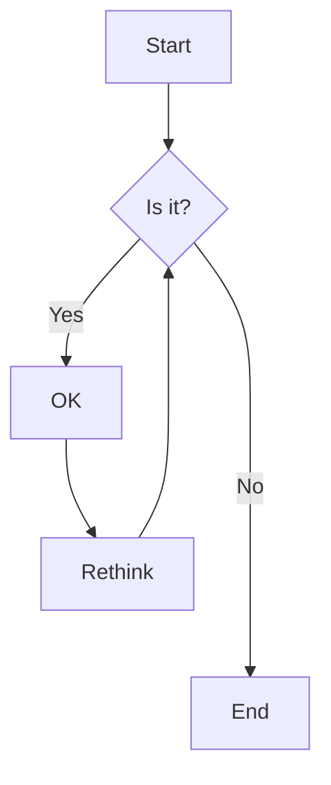
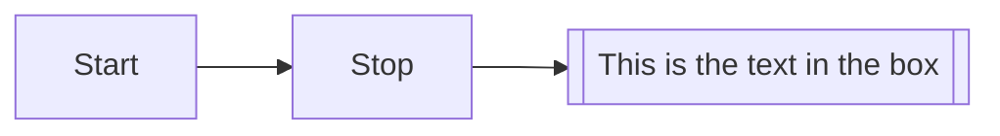
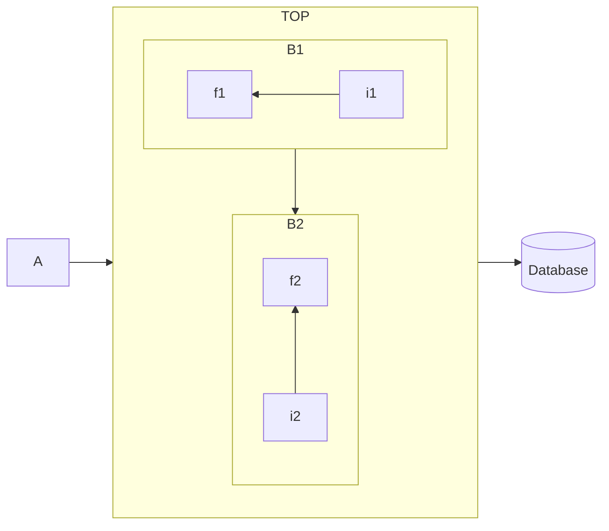

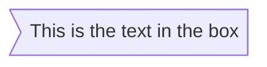
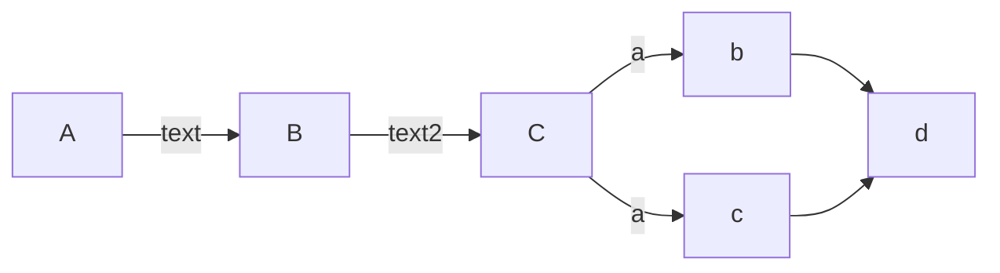
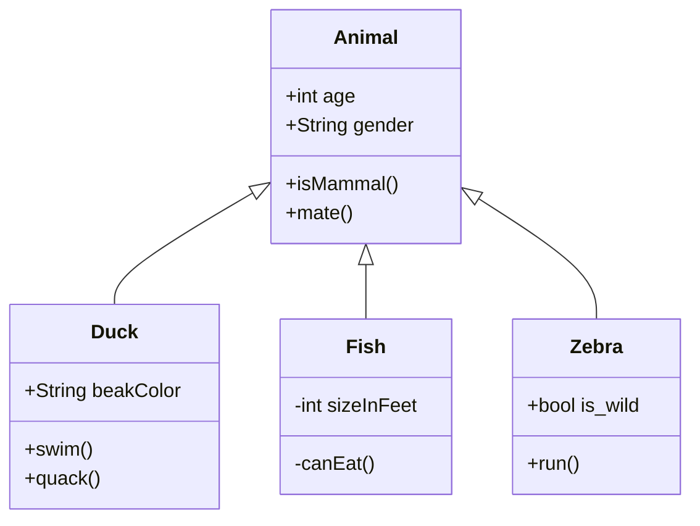
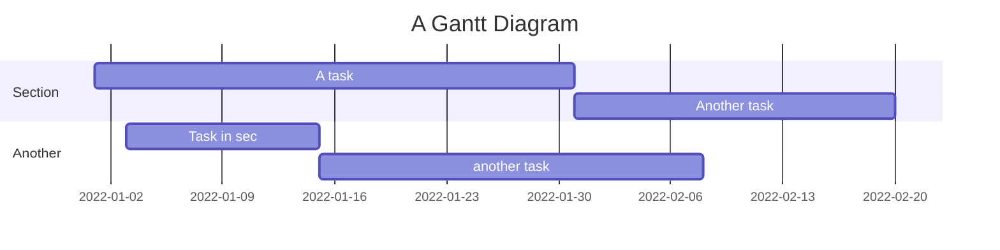
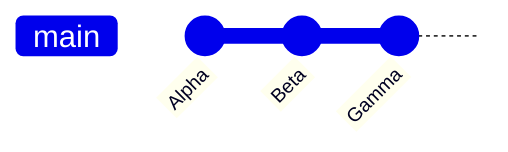

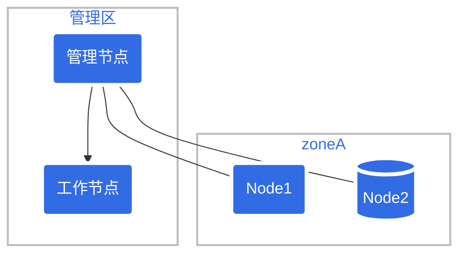

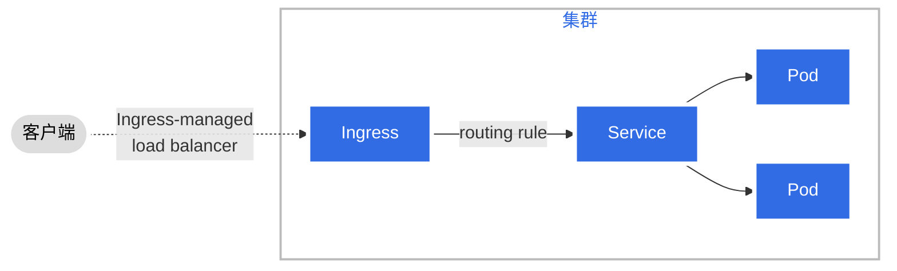

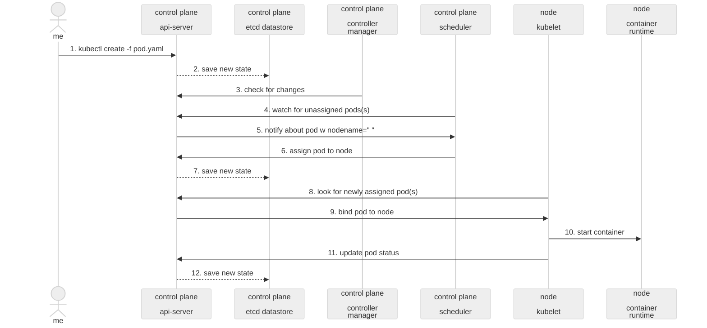

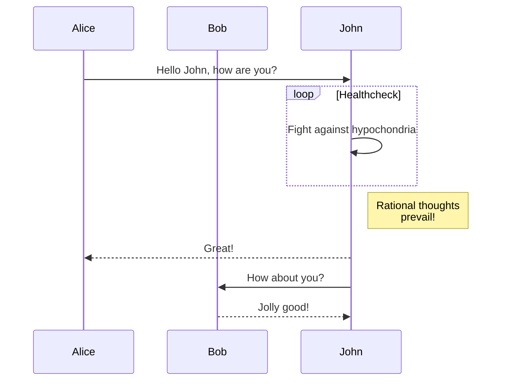

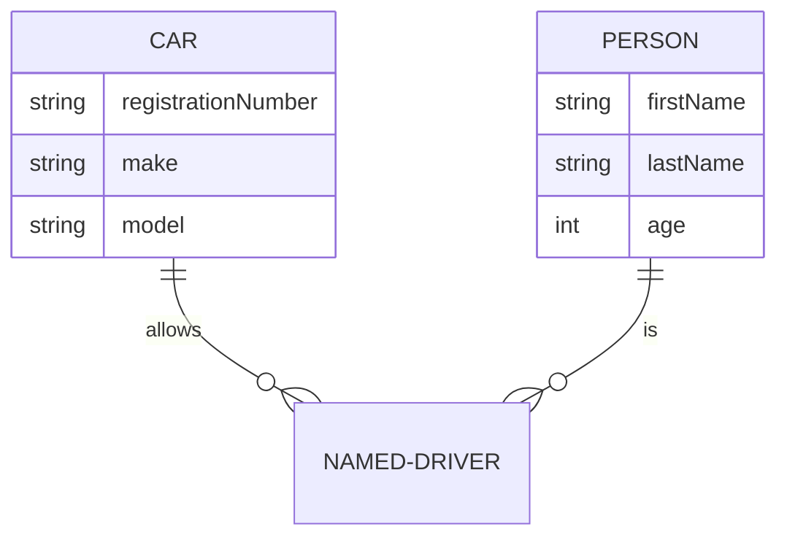