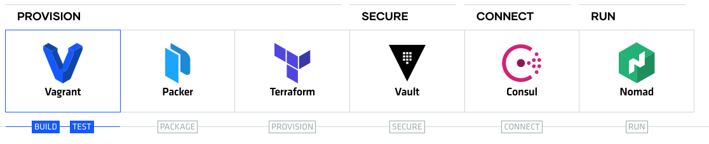
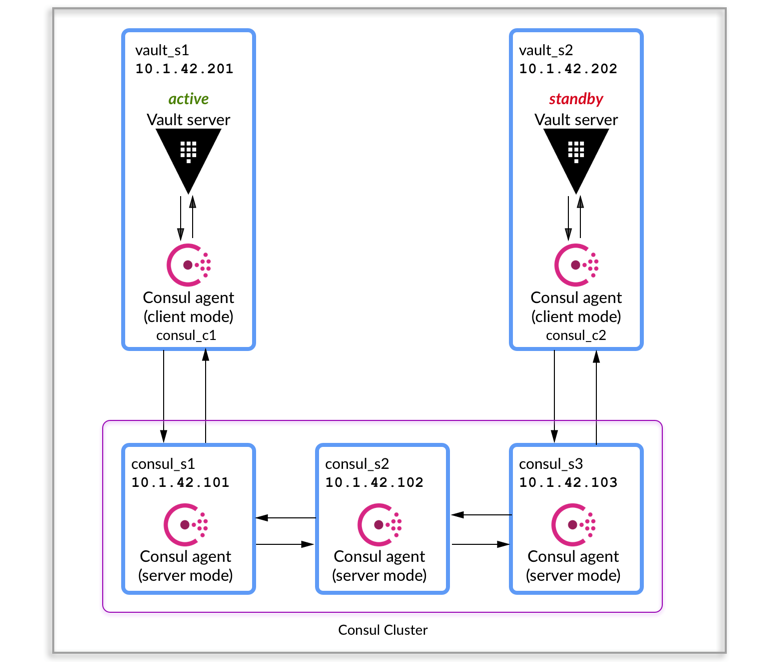
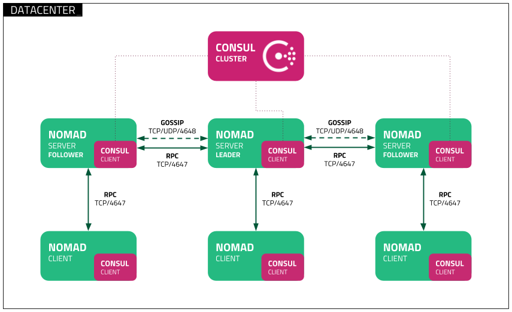

[](http://hits.dwyl.com/angudadevops/hashi-stack)

<h1>Complete HashiStack</h1> 

<h2> Instroduction </h2>

This repository helps you to setup your development environemt and also setup production environment with 3 master nodes and 2 clients. 

- [Build and Test Environment](#Build-and-Test-Environment) 
- [Enterprise Environment](#Enterprise-Setup) 

## Motivation

 



## Build and Test Environment

Build and test Environment helps you to explore the tools and test your changes on vagrant. You can modify the number of servers on vagrant file to test the changes. 

The Final Test Environment inclides:

- Vagrant 
  - Consul 1.7.3
  - Nomad 0.11.1
  - Vault 1.4.1

### Prerequsites

- MacOS (Linux testing in progress)
- [Homebrew](https://brew.sh/)
- `brew install packer terraform nomad`
- `brew cask install virtualbox`


### Usage

Update your number of servers depends on your system memory and CPU and run below command to explore hashi tools

```
$ cd vagrant
$ vagrant up
```
## Deployment

Connect nomad cluster and run below command to install job on nomad, please make sure you have enough resources to run the jobs

```
$ vagrant ssh server-1
$ nomad run -address http://172.20.20.11:4646 /tmp/jobs/nginx.nomad
$ nomad run -address http://172.20.20.11:4646 /tmp/jobs/simple.nomad
```

### Access

Use the private IP address to access the applications, in this 

```
Access Nomad Cluster http://172.20.20.11:4646

Access Consul Cluster http://172.20.20.11:8500

Access Vault Cluster http://172.20.20.101:8200

Access Hashi UI http://172.20.20.11:3000
```

## Enterprise Setup

This enterprise setup helps you to setup High Availability cluster with 3 masters and 2 clients on AWS.

The Final Environments Includes:

- Packer
- Terraform
  - Nomad
  - Consul
  - Vault

### Prerequsites

- Install Packer and Terraform
- AWS access credentials
- AWS private key

### Usage

Uset setup.sh scripts helps you to setup cluster environment on AWS. Update your AWS credentials in variables.tf and run the script

```
sudo bash setup.sh
```

### Access

With AWS environment we don't have an option to access UI as it's setup with Private IP, but with help of Hashi UI we can access Nomad and Consul

Use the Output of AWS public IP and access hashi UI 

```
Access Hashi UI with http://awspublicip:3000
```

### Troubleshooting

Please raise a github issue, if you had any issue with setup. 
