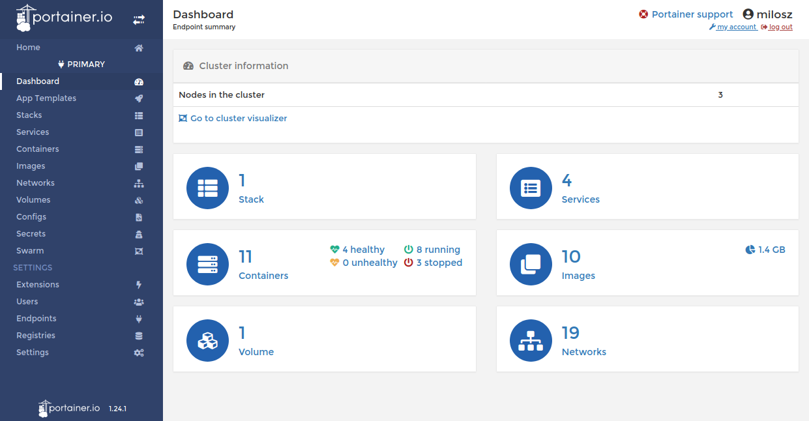
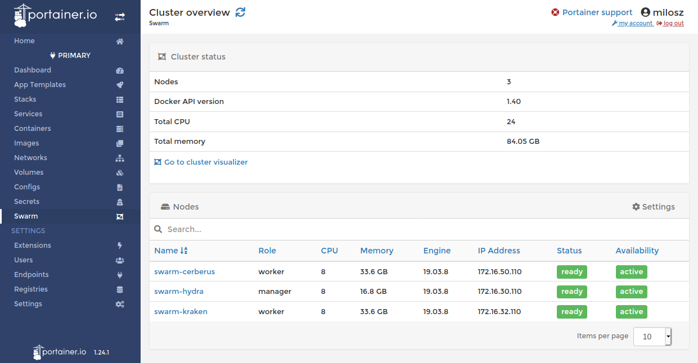
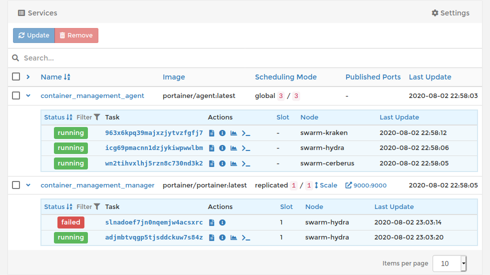

# How to deploy Portainer stack inside Docker Swarm cluster

Post author By milosz
Post date October 21, 2020

## Deploy Portainer stack inside the Docker Swarm cluster.


### Initial information

Docker version.
```shell

$ docker version
Client:
Version:           19.03.8
API version:       1.40
Go version:        go1.13.8
Git commit:        afacb8b7f0
Built:             Tue Jun 23 22:26:12 2020
OS/Arch:           linux/amd64
Experimental:      false
Server:
Engine:
Version:          19.03.8
API version:      1.40 (minimum version 1.12)
Go version:       go1.13.8
Git commit:       afacb8b7f0
Built:            Thu Jun 18 08:26:54 2020
OS/Arch:          linux/amd64
Experimental:     false
containerd:
Version:          1.3.3-0ubuntu2
GitCommit:
runc:
Version:          spec: 1.0.1-dev
GitCommit:
docker-init:
Version:          0.18.0
GitCommit:

```

Cluster details.

```shell

$ docker node ls
ID                            HOSTNAME            STATUS              AVAILABILITY        MANAGER STATUS      ENGINE VERSION
wholwgyqszoxv644ryv5xxuyf     swarm-cerberus      Ready               Active                                  19.03.8
medtf6p57iirdou5evwt6rmwr *   swarm-hydra         Ready               Active              Leader              19.03.8
td230ieplzm6z1uhszbrom8vr     swarm-kraken        Ready               Active                                  19.03.8

```

### Portainer stack configuration

Define environment variables using portainer-stack.env configuration file.

```shell
$ cat portainer-stack.env
AGENT_TOKEN=$(openssl rand -base64 16)
```

Define stack using portainer-stack.yml YAML file.

```shell
$ cat portainer-stack.yml

```
```yaml
version: '3.4'
services:
  agent:
    image: portainer/agent
    env_file: portainer-stack.env
    volumes:
      - /var/run/docker.sock:/var/run/docker.sock
      - /var/lib/docker/volumes:/var/lib/docker/volumes
    networks:
      - portainer_agent
    deploy:
      mode: global
      placement:
        constraints:
          - "node.platform.os == linux"
  manager:
    image: portainer/portainer
    command: -H tcp://tasks.agent:9001 --tlsskipverify
    env_file: portainer-stack.env
    volumes:
      - /var/run/docker.sock:/var/run/docker.sock
      - portainer_data:/data
    ports:
      - target: 9000          # for user interface
        published: 9000
        protocol: tcp
        mode: host
        # - target: 8000      # for EDGE agent
        #   published: 8000
        #   protocol: tcp
        #   mode: host
    networks:
      - portainer_agent
    deploy:
      placement:
        constraints:
          - "node.platform.os == linux"
          - "node.role == manager"
          - "node.hostname == swarm-hydra"
volumes:
  portainer_data:
networks:
  portainer_agent:
    driver: overlay
    attachable: true
```

Change swarm-hydra manager node name to reflect your configuration.

### Play with the stack

Deploy Portainer stack.

```shell
$ docker stack deploy --compose-file=portainer-stack.yml container_management
Creating network container_management_portainer_agent
Creating service container_management_agent
Creating service container_management_manager
```

List stacks.

```shell
$ docker stack ls
NAME                   SERVICES            ORCHESTRATOR
container_management   2                   Swarm
```

Display stack services.

```shell
$ docker stack services container_management
ID                  NAME                           MODE                REPLICAS            IMAGE                        PORTS
5rw7smlcgo9j        container_management_manager   replicated          1/1                 portainer/portainer:latest
q7g6w3x2cujb        container_management_agent     global              3/3                 portainer/agent:latest
```

Display stack tasks.

```shell
$ docker stack ps container_management
ID                  NAME                                                   IMAGE                        NODE                DESIRED STATE       CURRENT STATE           ERROR               PORTS
wn2tihvxlhj5        container_management_agent.wholwgyqszoxv644ryv5xxuyf   portainer/agent:latest       swarm-cerberus      Running             Running 3 minutes ago
963x6kpq39ma        container_management_agent.td230ieplzm6z1uhszbrom8vr   portainer/agent:latest       swarm-kraken        Running             Running 3 minutes ago
icg69pmacnn1        container_management_agent.medtf6p57iirdou5evwt6rmwr   portainer/agent:latest       swarm-hydra         Running             Running 3 minutes ago
slnadoef7jn0        container_management_manager.1                         portainer/portainer:latest   swarm-hydra         Running             Running 3 minutes ago                       *:9000->9000/tcp

```

Remove stack.

```shell
$ docker stack rm container_management
Removing service container_management_agent
Removing service container_management_manager
Removing network container_management_portainer_agent

```

Remove volume used by this stack.

```shell
$ docker volume rm container_management_portainer_data
container_management_portainer_data
```

## Reverse proxy

### Basic HAProxy configuration.

```
[...]
frontend web-frontend
bind 1.2.3.4:443 ssl crt /etc/haproxy/ssl/cloudflare.pem
mode http
acl is-swarm-manager  hdr(host) -i portainer.example.org
default_backend no-match
[...]
backend backend-local-portainer
server swarm-manager 172.16.0.10:9000 check
[...]
backend no-match
http-request deny deny_status 400

```


Read How can I configure [ngnix](https://documentation.portainer.io/v2.0/ad/nginx/rp-nginx/)/[traefik](https://documentation.portainer.io/v2.0/ad/traefik/rp-traefik/) reverse proxy to serve Portainer? for more information.

## Issues

I have experienced two issues. The first one was described in Consoles don’t work over nginx reverse proxy and produce 401 [#3538](https://github.com/portainer/portainer/issues/3538) bug report as access to container console does not work over a reverse proxy. The second one is related to authentication, as the internal authentication mechanism does not work with the basic auth requirement added by HAProxy or Nginx.

Portainer screenshots
Do not just look at these screenshots, but play with Docker swarm to experience these things by yourself.

Portainer dashboard



Swarm cluster



Docker stack



------

[来源](https://blog.sleeplessbeastie.eu/2020/10/21/how-to-deploy-portainer-stack-inside-docker-swarm-cluster/)


------

## Portainer with Nginx

I am using Portainer on a sub-domain on local ( OSX ) and production ( Ubuntu ) because this way I can add other options ( IP, Basic access authentication ) in future. I know it works with sub-folders as well, but I always find it a little bit more difficult. In case somebody is curious, here is my config.

1. Docker on port 9000

portainer/portainer .... 0.0.0.0:9000->9000/tcp

2. /etc/nginx/nginx.conf

```nginx.config

http {

    // your config here

    include /etc/nginx/sites-enabled/*.conf;
}
```

3. /etc/nginx/sites-enabled/portainer.yourdomain.com.conf

```nginx.config

upstream portainer_yourdomain_com {
server 127.0.0.1:9000;
}

server {

    listen 80;
    server_name portainer.yourdomain.com;
    
    location / {

        proxy_http_version 1.1;
        proxy_set_header Upgrade $http_upgrade;
        proxy_set_header Connection 'upgrade';
        proxy_set_header Host $host;
        proxy_set_header X-Real-IP $remote_addr;
        proxy_set_header X-Forwarded-For $proxy_add_x_forwarded_for;
        proxy_set_header X-Forwarded-Proto $scheme;
        proxy_cache_bypass $http_upgrade;
        proxy_cache_valid 200 302 1m;
        proxy_pass $scheme://portainer_yourdomain_com;
    }
}
```

After nginx -s reload you should see Portainer.

Note: For the upstream I am using server 192.168.99.100:9000; on OSX and server 127.0.0.1:9000; on Ubuntu.

```
location ~* ^/portainer(/.*)$ {
            proxy_http_version 1.1;
            proxy_set_header Connection "";
            proxy_pass http://127.0.0.1:9000$1;
}

location ~* ^/portainer/(api/websocket/.*)$ {
            proxy_set_header Upgrade $http_upgrade;
            
            proxy_set_header Connection "upgrade";
            proxy_http_version 1.1;
            proxy_pass http://127.0.0.1:9000$1;
}
```

------

## Deploy Portainer behind NGINX Reverse Proxy

### Deploying in a Docker Standalone scenario

To deploy Portainer behind NGINX Proxy in a Docker standalone scenario we will use a Docker Compose file. In the following docker-compose.yml you will find the configuration of the Portainer Server and NGINX Proxy.

```yml

version: "3"

services:
  nginx-proxy:
    image: jwilder/nginx-proxy
    restart: always
    networks:
      - proxy
    ports:
      - "80:80"
    volumes:
      - "/var/run/docker.sock:/tmp/docker.sock:ro"
      - "./vhost.d:/etc/nginx/vhost.d:ro"

  portainer:
    image: portainer/portainer-ce:2.0.0
    command: -H unix:///var/run/docker.sock
    restart: always
    networks:
      - proxy
    environment:
      - VIRTUAL_HOST=portainer.yourdomain.com
      - VIRTUAL_PORT=9000
    ports:
      - 8000:8000
    volumes:
      - /var/run/docker.sock:/var/run/docker.sock
      - portainer_data:/data

networks:
  proxy:

volumes:
  portainer_data:

```

To setup and start working with this recipe, you need to change the VIRTUAL_HOST value. You can then run the following:

```shell
docker-compose up -d

```

Once complete, you will able to run docker ps and you will see an output similar to this:

```shell
CONTAINER ID        IMAGE                          COMMAND                  CREATED             STATUS              PORTS                              NAMES
088da047e931        portainer/portainer-ce:2.0.0   "/portainer -H unix:…"   32 minutes ago       Up 22 minutes        0.0.0.0:8000->8000/tcp, 9000/tcp   nginx-port_portainer_1
1ec0594f8a01        jwilder/nginx-proxy            "/app/docker-entrypo…"   32 minutes ago      Up 22 minutes       0.0.0.0:80->80/tcp                 nginx-port_nginx-proxy_1

```

Once the deployment is complete you can browse portainer.yourdomain.com.

### Deploying in a Docker Swarm scenario

Deploying Portainer in Docker Swarm behind NGINX has similar steps to the Docker Standalone scenario.

First, you need to create a few networks. One for the agent and the communication with Portainer Server and other to "expose" the Portainer container to the same network that the Reverse Proxy.

Before deploying, you need to create 2 elements: Networks and volumes.

First, create 2 networks for the agent to communicate with Portainer Server and other to "expose" the Portainer container to the same network that as the Reverse Proxy

```shell
docker network create -d overlay proxy

docker network create -d agent_network
```

Then create the volume:

```shell
docker volume create portainer_data
```

Save the below recipe as portainer.yml

```yml

version: '3.2'

services:
  nginx-proxy:
    image: jwilder/nginx-proxy
    networks:
      - proxy
    ports:
      - "80:80"
    volumes:
      - "/var/run/docker.sock:/tmp/docker.sock:ro"
  #      - "./vhost.d:/etc/nginx/vhost.d:ro"

  agent:
    image: portainer/agent
    environment:
      # REQUIRED: Should be equal to the service name prefixed by "tasks." when
      # deployed inside an overlay network
      AGENT_CLUSTER_ADDR: tasks.agent
      # AGENT_PORT: 9001
      # LOG_LEVEL: debug
    volumes:
      - /var/run/docker.sock:/var/run/docker.sock
      - /var/lib/docker/volumes:/var/lib/docker/volumes
    networks:
      - agent_network
    deploy:
      mode: global
      placement:
        constraints: [node.platform.os == linux]

  portainer:
    image: portainer/portainer-ce:2.0.0
    command: -H tcp://tasks.agent:9001 --tlsskipverify
    volumes:
      - data:/data
    environment:
      - VIRTUAL_HOST=portainer.yourdomain.com
      - VIRTUAL_PORT=9000
    ports:
      - 8000:8000
    networks:
      - proxy
      - agent_network
    deploy:
      mode: replicated
      replicas: 1
      placement:
        constraints: [node.role == manager]


networks:
  proxy:
    external: true
  agent_network:
    external: true

volumes:
  data:

```

To setup and start working with this recipe, you need to change the VIRTUAL_HOST value.

You're now ready to deploy Portainer by executing the following:

```shell
docker stack deploy portainer -c portainer.yml
```

To check the deployment you can run docker service ls and you will see an output similar to the following:

```shell
ID                  NAME                    MODE                REPLICAS            IMAGE                          PORTS
gy2bjxid0g4p        portainer_agent         global              1/1                 portainer/agent:latest
jwvjp5bux4sz        portainer_nginx-proxy   replicated          1/1                 jwilder/nginx-proxy:latest     *:80->80/tcp
5nflcvoxl3c7        portainer_portainer     replicated          1/1                 portainer/portainer-ce:2.0.0   *:8000->8000/tcp
```

Once the services are running, you can browse the url specified (e.g. portainer.yourdomain.com) to access Portainer.

[来源](https://documentation.portainer.io/v2.0/ad/nginx/rp-nginx/)