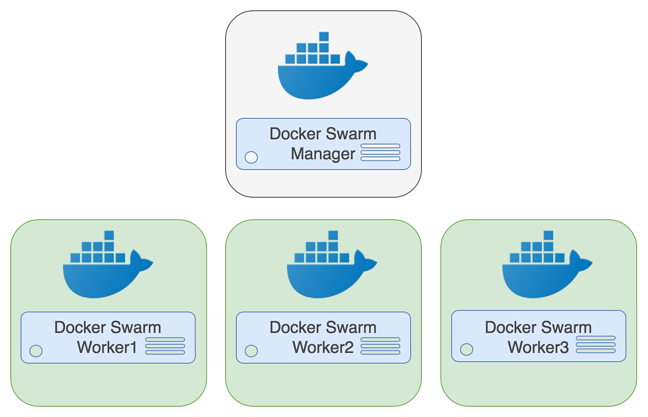
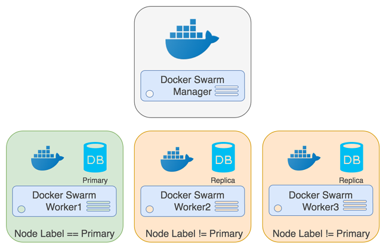

# An Easy Recipe for Creating a PostgreSQL Cluster with Docker Swarm

March 27, 2018 JASON O'DONNELL PostgreSQL Containers PostgreSQL Docker Containers

One of the biggest benefits of running PostgreSQL is running your cluster in primary-replica setup for the purposes of high-availability or load balancing your read-only queries.  It is not necessarily simple to deploy a primary-replica setup out of the box, but by using modern containerization technology, we can greatly simplify the process.

In this article, I will demonstrate how to easily setup and deploy a PostgreSQL primary-replica cluster using Docker and Docker Swarm.

## BackGround

Streaming replication, or pushing changes from a primary PostgreSQL instance to its replicas in "real-time," was introduced into PostgreSQL in version 9.0 and has continued to receive numerous enhancements in all subsequent releases, including:

- Asynchronous replication
- Synchronous replication
- Quorum commit
- Cascading replication
- Logical Replication

The PostgreSQL documentation also provides an overview and comparison of the different replication methods.

The primary-replica methodology of deploying a PostgreSQL replica is an essential tool in creating high-availability environments for your database cluster: a proper deployment should ensure that your data is stored on different disks in different data centers.

Replication is not a "setup and forget" operation: in a production system, you will want to ensure you have appropriate monitoring in place, for instance, to know that all of your replicas are online or to know how much data a replica may need to be in sync with the primary.

While the primary-replica configuration with PostgreSQL is great, it can take a little bit of work to setup.  Fortunately, there is a way to deploy this setup more easily with Docker.

## ENVIRONMENT SETUP

In order to deploy this recipe, you will need at least Docker 1.12, which was released in July 2016, installed in order to successfully deploy this recipe.

To begin, provision a Docker cluster. For this example a development cluster, you can load Docker on each of the machines you will use in your Swarm. This recipe is using the following architecture:



Each host should have Docker enabled and started.

## SWARM SETUP

Since version 1.12, Docker has included the Swarm clustering technology directly within the Docker Engine.

Creating a Docker Swarm cluster is out of scope for this tutorial, however, documentation on setting up a Swarm cluster can be found here.

### CONTAINER PLACEMENT

Two or more hosts are required for a [high-availability PostgreSQL cluster configuration](https://www.crunchydata.com/products/crunchy-postgresql-high-availability-suite/).
The primary and replica(s) should run on different worker nodes to maximize availability.

In order to deploy the [Crunchy PostgreSQL containers](https://github.com/CrunchyData/crunchy-containers/) to multiple hosts, you will need to use node labels.
Labeling hosts has a few advantages when it comes to PostgreSQL containers:

- Spreading services out on many worker nodes improves availability
- Hosts can be optimized (such as using high-performance disks) for reads (replicas) or writes (primary)

> **Remember**: as of PostgreSQL 10, a primary database can support both reads and writes, but a replica only allows read queries.

To allow for container placement on specific worker nodes, add a metadata label to the Swarm nodes:
```shell
node1_id=$(docker node list | grep worker1 | awk '{print $1}')
docker node update --label-add type=primary ${node1_id?}

```

In the above example, a label called primary has been added to the worker1. 
Using this label we can apply constraints to the Docker Swarm deployment of the PostgreSQL stack.

Note: We did not apply a constraint for replicas as we can just use the inverse constraint:

```shell
node.labels.type != primary
```

## POSTGRESQL STACK DEFINITION

With the Swarm deployed and the worker node properly labeled, we can deploy the PostgreSQL stack.

The PostgreSQL stack is comprised of a primary and replica services. The following is the service definition:

docker-compose.yml

```yml
version: "3.3"

services:
  primary:
    hostname: 'primary'
    image: crunchydata/crunchy-postgres:centos7-10.3-1.8.2
    environment:
    - PGHOST=/tmp
    - MAX_CONNECTIONS=10
    - MAX_WAL_SENDERS=5
    - PG_MODE=primary
    - PG_PRIMARY_USER=primaryuser
    - PG_PRIMARY_PASSWORD=password
    - PG_DATABASE=testdb
    - PG_USER=testuser
    - PG_PASSWORD=password
    - PG_ROOT_PASSWORD=password
    - PG_PRIMARY_PORT=5432
    volumes:
    - pg-primary-vol:/pgdata
    ports:
    - "5432"
    networks:
    - crunchynet
    deploy:
      placement:
        constraints:
        - node.labels.type == primary
        - node.role == worker
  replica:
    image: crunchydata/crunchy-postgres:centos7-10.3-1.8.2
    environment:
    - PGHOST=/tmp
    - MAX_CONNECTIONS=10
    - MAX_WAL_SENDERS=5
    - PG_MODE=replica
    - PG_PRIMARY_HOST=primary
    - PG_PRIMARY_PORT=5432
    - PG_PRIMARY_USER=primaryuser
    - PG_PRIMARY_PASSWORD=password
    - PG_DATABASE=testdb
    - PG_USER=testuser
    - PG_PASSWORD=password
    - PG_ROOT_PASSWORD=password
    volumes:
    - pg-replica-vol:/pgdata
    ports:
    - "5432"
    networks:
    - crunchynet
    deploy:
      placement:
        constraints:
        - node.labels.type != primary
        - node.role == worker
networks:
  crunchynet:

volumes:
  pg-primary-vol:
  pg-replica-vol:
```

**Notice** that the primary service defines a hostname but the replica service does not.  Replicas require a hostname to start replication. By providing a static hostname to the primary the replicas can connect without having to discover the primary container.

The replicas, however, do not have a hostname. This allows the replica service to be scaled beyond a single replica (as shown later).

The only real difference between the primary and replica services is the PG_MODE environment variable. This configures the containers to either be a primary or replica.

## DEPLOYING THE STACK
After saving this file to docker-compose.yml, we can deploy the stack with Docker:

```shell
docker stack deploy --compose-file=./docker-compose.yml pg-stack
```

This stack deployment will create a PostgreSQL cluster similar to this diagram:



PostgreSQL Docker Swarm Primary Replica Cluster

## TESTING THE CLUSTER

To check if services are running, run the following commands:

```shell
docker service ls
docker service ps pg-stack_primary
docker service ps pg-stack_replica
```

To increase the number of replicas, run the following:

```shell
docker service scale pg-stack_replica=2
docker service ps pg-stack_replica
```

To verify the replicas are streaming, query the PostgreSQL primary on the worker1 host using the following command:

```shell
docker exec -it $(docker ps -q) psql -U postgres -x -c 'table pg_stat_replication' postgres
```
You should see a row for each replica along with its replication status.

## EXAMPLE CODE
The example described above is provided in the Crunchy Containers Suite GitHub in the following location:

[https://github.com/CrunchyData/crunchy-containers/tree/master/examples/docker/swarm-service](https://github.com/CrunchyData/crunchy-containers/tree/master/examples/docker/swarm-service)

## CONCLUSION

Docker and Docker Swarm provide tools to take container deployments to the next level. We hope that this demonstration proves how easy it is to get up and running with Crunchy PostgreSQL containers.
